# V-HR 人员管理 · UML 需求分析图集（Mermaid）

---

## 0. 图种覆盖清单（UML 2.x 全部 14 种图）

| # | UML 图 | 英文 | 类别 | 本文对应章节 | Mermaid 实现方式 |
|---|---|---|---|---|---|
| 1 | 用例图 | Use Case Diagram | 行为 | §2 | `flowchart`（角色/用例/包含/扩展） |
| 2 | 类图 | Class Diagram | 结构 | §3 | `classDiagram` |
| 3 | 对象图 | Object Diagram | 结构 | §4 | `classDiagram`（对象实例写法） |
| 4 | 包图 | Package Diagram | 结构 | §5 | `flowchart` + `subgraph` |
| 5 | 组件图 | Component Diagram | 结构 | §6 | `flowchart`（组件/接口/依赖） |
| 6 | 部署图 | Deployment Diagram | 结构 | §7 | `flowchart`（节点/工件/通信路径） |
| 7 | 组合结构图 | Composite Structure Diagram | 结构 | §8 | `flowchart`（部件/端口/连接器） |
| 8 | 剖面图 | Profile Diagram | 结构 | §9 | `classDiagram`（`stereotype` 扩展元类） |
| 9 | 活动图 | Activity Diagram | 行为 | §10 | `flowchart`（含泳道、分支、并发） |
| 10 | 状态机图 | State Machine Diagram | 行为 | §11 | `stateDiagram-v2`（9 个核心对象） |
| 11 | 序列图 | Sequence Diagram | 行为 | §12 | `sequenceDiagram`（6 个关键场景） |
| 12 | 通信图 | Communication Diagram | 行为 | §13 | `flowchart`（对象 + 序号消息） |
| 13 | 交互概览图 | Interaction Overview Diagram | 行为 | §14 | `flowchart`（交互引用 + 控制流） |
| 14 | 时序图 | Timing Diagram | 行为 | §15 | `gantt`（时间轴状态带，Mermaid 无原生 timing 图，此为等价近似） |

**附录（非 UML 标准图，用于需求落地）**

| # | 图 | 章节 | 说明 |
|---|---|---|---|
| A | ER 数据模型图 | §16 | `erDiagram`，核心实体与基数，供建表参考 |
| B | 需求追溯图 | §17 | `requirementDiagram`，需求项 → 服务/模块的满足关系 |

---

## 1. 需求全景（模块与角色）

需求文档共 **6 个一级模块、21 个二级功能域**：

| 一级模块 | 二级功能域 |
|---|---|
| **员工管理** | 员工维护、履历查看、减员管理、异动管理（8 类）、信息审核、员工祝福 |
| **极速入职** | Offer 管理（待发/已发/已拒绝/已接受）、入职管理（全部待入职/今日待入职/已取消入职/已入职） |
| **信息采集** | 采集模板管理、信息采集管理（采集管理/采集结果管理） |
| **合同管理** | 合同办理（生效中/到期/即将到期/未签/已失效）、合同模版、专项协议 |
| **档案管理** | 档案库、档案借/查阅、档案接收（行内互转/外行转出） |
| **配置中心** | 模板设置、业务设置、取消入职、待办事项 |

**关键角色**：总部人事专员、分支机构人事专员（管理端主责，按机构树权限隔离）、员工本人（员工自助 PC/移动端）、审批人（工作流）、应聘者（Offer 与入职前采集）。

**核心业务主线**：
- **进**：Offer 创建审批 → 发送 → 应聘者接受 → 同步待入职 → 入职前信息采集 → 入职待办 → 入职申请审批 → 入职成功（人员逻辑删除标志=否）
- **管**：员工维护/履历/减员 → 异动（转正、调动、借调、离职、退休、内退、二次入职、派遣工转正）→ 信息审核
- **合同**：未签 → 签订 → 生效中（续签/变更/中止/终止）→ 到期/即将到期 → 已失效（恢复）
- **档案**：转入 → 在库 → 借阅/查阅 → 归还 → 转出 → 档案接收
- **出**：离职/退休/内退 → 逻辑删除标志=是 → 减员管理

**贯穿全局的通用机制**：信息集与信息项均来自系统配置、时间拉链（单拉链/多拉链，截止日期 9999-12-31）、机构编制数强/弱管控、逻辑删除标志、状态机与审批流。

---

## 2. 用例图 Use Case Diagram

### 2.1 员工管理

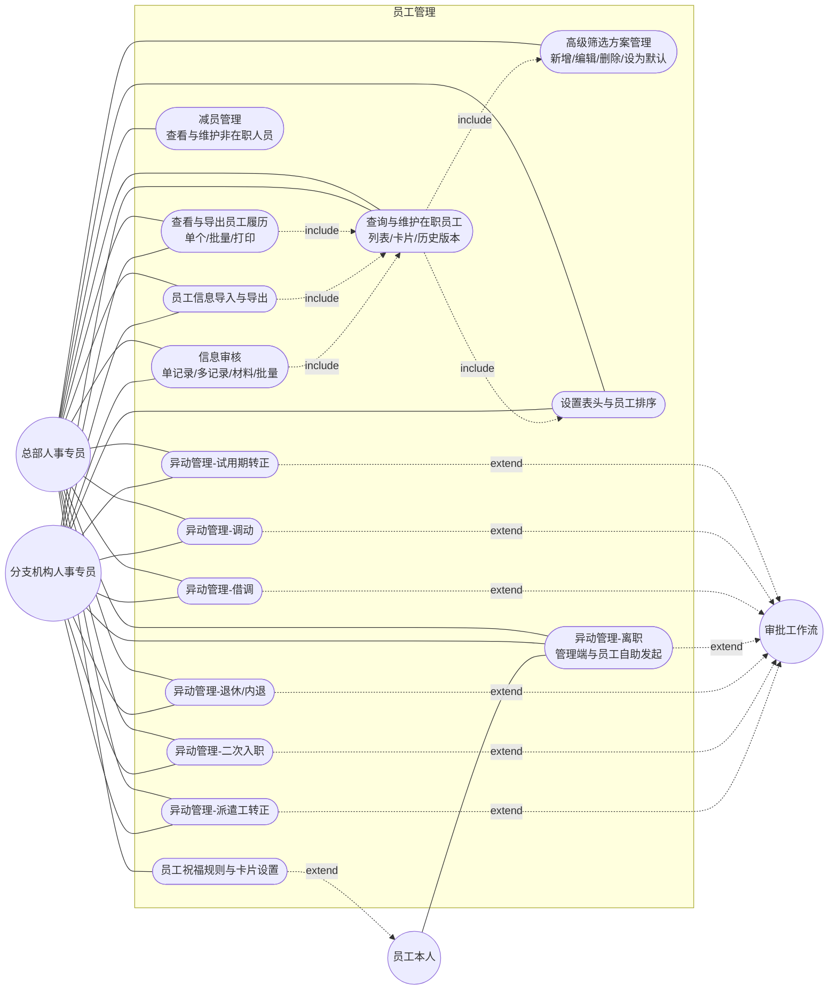
```mermaid
flowchart LR
    HQ((总部人事专员))
    BR((分支机构人事专员))
    EMP((员工本人))
    WF((审批工作流))

    subgraph P1["员工管理"]
        direction TB
        U11(["查询与维护在职员工<br/>列表/卡片/历史版本"])
        U12(["高级筛选方案管理<br/>新增/编辑/删除/设为默认"])
        U13(["设置表头与员工排序"])
        U14(["查看与导出员工履历<br/>单个/批量/打印"])
        U15(["员工信息导入与导出"])
        U16(["减员管理<br/>查看与维护非在职人员"])
        U17(["异动管理-试用期转正"])
        U18(["异动管理-调动"])
        U19(["异动管理-借调"])
        U110(["异动管理-离职<br/>管理端与员工自助发起"])
        U111(["异动管理-退休/内退"])
        U112(["异动管理-二次入职"])
        U113(["异动管理-派遣工转正"])
        U114(["信息审核<br/>单记录/多记录/材料/批量"])
        U115(["员工祝福规则与卡片设置"])
    end

    HQ --- U11
    HQ --- U12
    HQ --- U13
    HQ --- U14
    HQ --- U15
    HQ --- U16
    HQ --- U17
    HQ --- U18
    HQ --- U19
    HQ --- U110
    HQ --- U111
    HQ --- U112
    HQ --- U113
    HQ --- U114
    HQ --- U115
    BR --- U11
    BR --- U13
    BR --- U14
    BR --- U15
    BR --- U17
    BR --- U18
    BR --- U19
    BR --- U110
    BR --- U111
    BR --- U112
    BR --- U113
    BR --- U114
    EMP --- U110

    U11 -.->|include| U12
    U11 -.->|include| U13
    U14 -.->|include| U11
    U15 -.->|include| U11
    U17 -.->|extend| WF
    U18 -.->|extend| WF
    U19 -.->|extend| WF
    U110 -.->|extend| WF
    U111 -.->|extend| WF
    U112 -.->|extend| WF
    U113 -.->|extend| WF
    U114 -.->|include| U11
    U115 -.->|extend| EMP
```

### 2.2 极速入职与信息采集

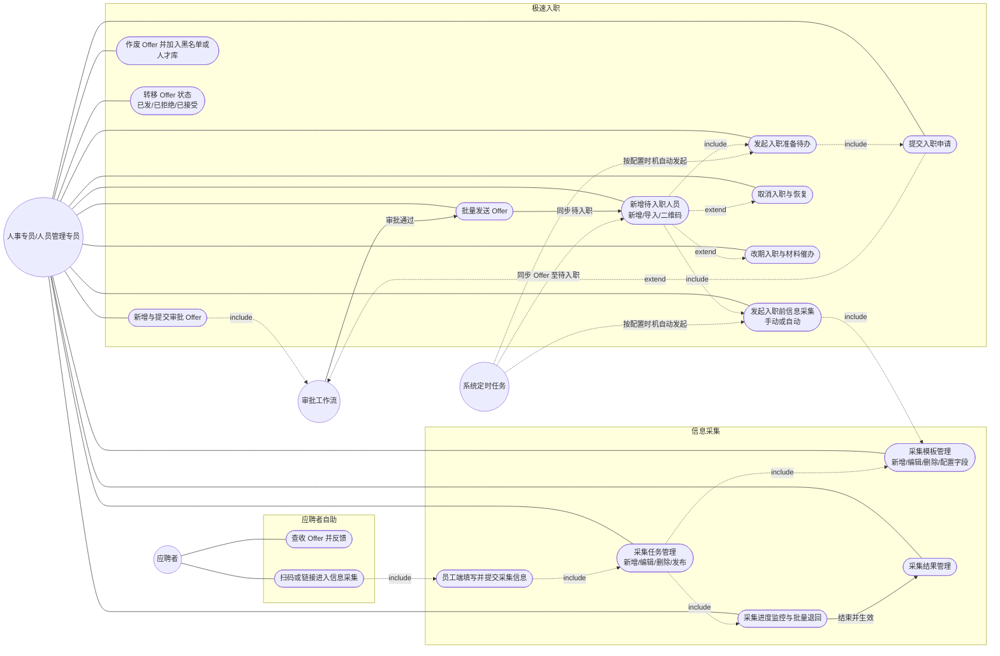
```mermaid
flowchart LR
    HR((人事专员/人员管理专员))
    CAN((应聘者))
    WF((审批工作流))
    SYS((系统定时任务))

    subgraph P2["极速入职"]
        direction TB
        U21(["新增与提交审批 Offer"])
        U22(["批量发送 Offer"])
        U23(["作废 Offer 并加入黑名单或人才库"])
        U24(["转移 Offer 状态<br/>已发/已拒绝/已接受"])
        U25(["新增待入职人员<br/>新增/导入/二维码"])
        U26(["发起入职前信息采集<br/>手动或自动"])
        U27(["发起入职准备待办"])
        U28(["提交入职申请"])
        U29(["取消入职与恢复"])
        U210(["改期入职与材料催办"])
    end
    subgraph P3["信息采集"]
        direction TB
        U31(["采集模板管理<br/>新增/编辑/删除/配置字段"])
        U32(["采集任务管理<br/>新增/编辑/删除/发布"])
        U33(["采集进度监控与批量退回"])
        U34(["采集结果管理"])
        U35(["员工端填写并提交采集信息"])
    end
    subgraph P4["应聘者自助"]
        direction TB
        U41(["查收 Offer 并反馈"])
        U42(["扫码或链接进入信息采集"])
    end

    HR --- U21
    HR --- U22
    HR --- U23
    HR --- U24
    HR --- U25
    HR --- U26
    HR --- U27
    HR --- U28
    HR --- U29
    HR --- U210
    HR --- U31
    HR --- U32
    HR --- U33
    HR --- U34
    CAN --- U41
    CAN --- U42

    U21 -.->|include| WF
    WF -->|审批通过| U22
    U22 -->|同步待入职| U25
    U25 -.->|include| U26
    U26 -.->|include| U31
    U25 -.->|include| U27
    U27 -.->|include| U28
    U28 -.->|extend| WF
    U25 -.->|extend| U29
    U25 -.->|extend| U210
    U32 -.->|include| U31
    U32 -.->|include| U33
    U33 -->|结束并生效| U34
    U35 -.->|include| U32
    U42 -.->|include| U35
    SYS -.->|按配置时机自动发起| U26
    SYS -.->|按配置时机自动发起| U27
    SYS -.->|同步 Offer 至待入职| U25
```

### 2.3 合同管理与档案管理

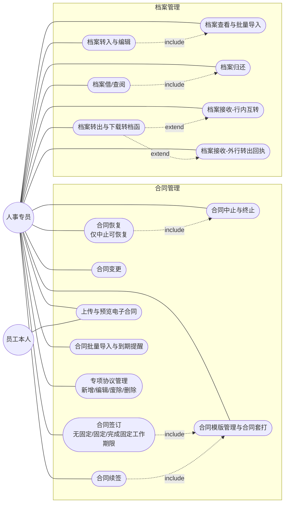
```mermaid
flowchart LR
    HR((人事专员))
    EMP((员工本人))

    subgraph P5["合同管理"]
        direction TB
        U51(["合同签订<br/>无固定/固定/完成固定工作期限"])
        U52(["合同续签"])
        U53(["合同变更"])
        U54(["合同中止与终止"])
        U55(["合同恢复<br/>仅中止可恢复"])
        U56(["上传与预览电子合同"])
        U57(["合同批量导入与到期提醒"])
        U58(["合同模版管理与合同套打"])
        U59(["专项协议管理<br/>新增/编辑/废除/删除"])
    end
    subgraph P6["档案管理"]
        direction TB
        U61(["档案转入与编辑"])
        U62(["档案转出与下载转档函"])
        U63(["档案查看与批量导入"])
        U64(["档案借/查阅"])
        U65(["档案归还"])
        U66(["档案接收-行内互转"])
        U67(["档案接收-外行转出回执"])
    end

    HR --- U51
    HR --- U52
    HR --- U53
    HR --- U54
    HR --- U55
    HR --- U56
    HR --- U57
    HR --- U58
    HR --- U59
    HR --- U61
    HR --- U62
    HR --- U63
    HR --- U64
    HR --- U65
    HR --- U66
    HR --- U67
    EMP --- U56

    U51 -.->|include| U58
    U52 -.->|include| U58
    U62 -.->|extend| U66
    U62 -.->|extend| U67
    U61 -.->|include| U63
    U64 -.->|include| U65
    U55 -.->|include| U54
```

### 2.4 配置中心

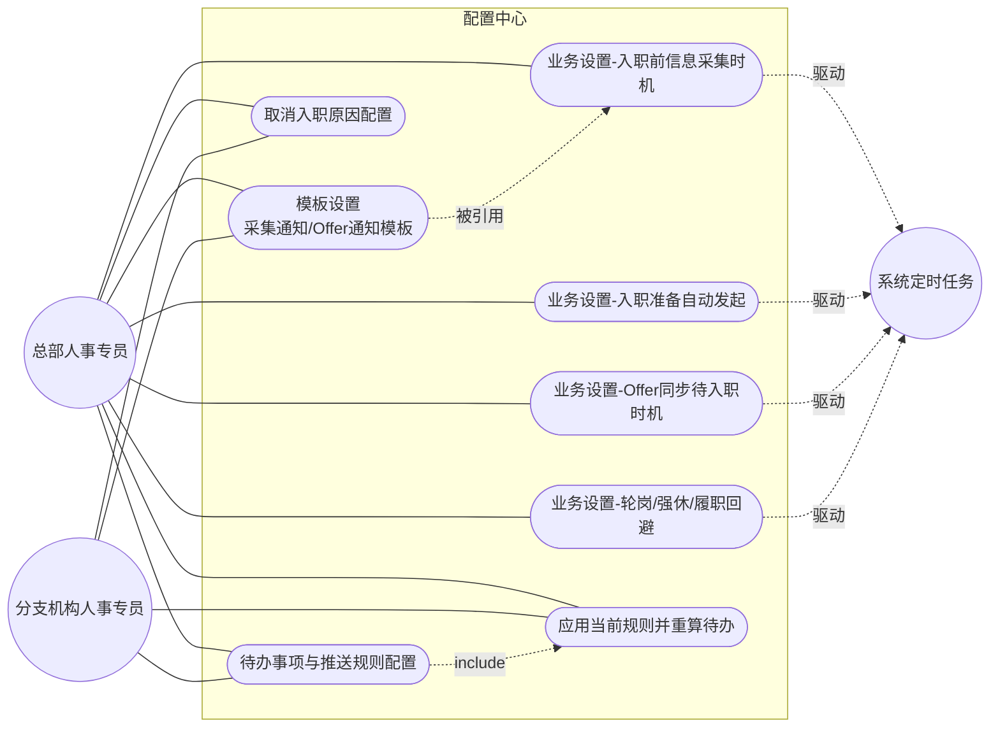
```mermaid
flowchart LR
    HQ((总部人事专员))
    BR((分支机构人事专员))
    SYS((系统定时任务))

    subgraph P7["配置中心"]
        direction TB
        U71(["模板设置<br/>采集通知/Offer通知模板"])
        U72(["业务设置-入职前信息采集时机"])
        U73(["业务设置-入职准备自动发起"])
        U74(["业务设置-Offer同步待入职时机"])
        U75(["业务设置-轮岗/强休/履职回避"])
        U76(["取消入职原因配置"])
        U77(["待办事项与推送规则配置"])
        U78(["应用当前规则并重算待办"])
    end

    HQ --- U71
    HQ --- U72
    HQ --- U73
    HQ --- U74
    HQ --- U75
    HQ --- U76
    HQ --- U77
    HQ --- U78
    BR --- U71
    BR --- U76
    BR --- U77
    BR --- U78

    U72 -.->|驱动| SYS
    U73 -.->|驱动| SYS
    U74 -.->|驱动| SYS
    U75 -.->|驱动| SYS
    U77 -.->|include| U78
    U71 -.->|被引用| U72
```

---

## 3. 类图 Class Diagram（领域模型）

### 3.1 员工与信息集域

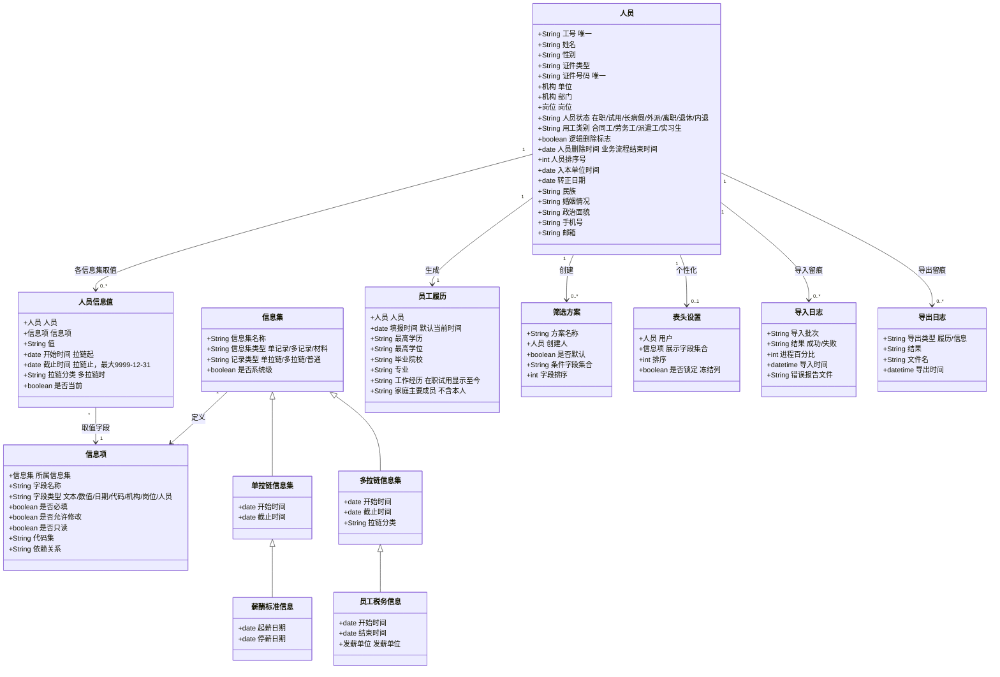
```mermaid
classDiagram
    class 人员 {
        +String 工号 唯一
        +String 姓名
        +String 性别
        +String 证件类型
        +String 证件号码 唯一
        +机构 单位
        +机构 部门
        +岗位 岗位
        +String 人员状态 在职/试用/长病假/外派/离职/退休/内退
        +String 用工类别 合同工/劳务工/派遣工/实习生
        +boolean 逻辑删除标志
        +date 人员删除时间 业务流程结束时间
        +int 人员排序号
        +date 入本单位时间
        +date 转正日期
        +String 民族
        +String 婚姻情况
        +String 政治面貌
        +String 手机号
        +String 邮箱
    }
    class 信息集 {
        +String 信息集名称
        +String 信息集类型 单记录/多记录/材料
        +String 记录类型 单拉链/多拉链/普通
        +boolean 是否系统级
    }
    class 信息项 {
        +信息集 所属信息集
        +String 字段名称
        +String 字段类型 文本/数值/日期/代码/机构/岗位/人员
        +boolean 是否必填
        +boolean 是否允许修改
        +boolean 是否只读
        +String 代码集
        +String 依赖关系
    }
    class 人员信息值 {
        +人员 人员
        +信息项 信息项
        +String 值
        +date 开始时间 拉链起
        +date 截止时间 拉链止，最大9999-12-31
        +String 拉链分类 多拉链时
        +boolean 是否当前
    }
    class 单拉链信息集 {
        +date 开始时间
        +date 截止时间
    }
    class 多拉链信息集 {
        +date 开始时间
        +date 截止时间
        +String 拉链分类
    }
    class 薪酬标准信息 {
        +date 起薪日期
        +date 停薪日期
    }
    class 员工税务信息 {
        +date 开始时间
        +date 结束时间
        +发薪单位 发薪单位
    }
    class 员工履历 {
        +人员 人员
        +date 填报时间 默认当前时间
        +String 最高学历
        +String 最高学位
        +String 毕业院校
        +String 专业
        +String 工作经历 在职试用显示至今
        +String 家庭主要成员 不含本人
    }
    class 筛选方案 {
        +String 方案名称
        +人员 创建人
        +boolean 是否默认
        +String 条件字段集合
        +int 字段排序
    }
    class 表头设置 {
        +人员 用户
        +信息项 展示字段集合
        +int 排序
        +boolean 是否锁定 冻结列
    }
    class 导入日志 {
        +String 导入批次
        +String 结果 成功/失败
        +int 进程百分比
        +datetime 导入时间
        +String 错误报告文件
    }
    class 导出日志 {
        +String 导出类型 履历/信息
        +String 结果
        +String 文件名
        +datetime 导出时间
    }

    人员 "1" --> "0..*" 人员信息值 : 各信息集取值
    信息集 "1" --> "1..*" 信息项 : 定义
    人员信息值 "*" --> "1" 信息项 : 取值字段
    信息集 <|-- 单拉链信息集
    信息集 <|-- 多拉链信息集
    单拉链信息集 <|-- 薪酬标准信息
    多拉链信息集 <|-- 员工税务信息
    人员 "1" --> "1" 员工履历 : 生成
    人员 "1" --> "0..*" 筛选方案 : 创建
    人员 "1" --> "0..1" 表头设置 : 个性化
    人员 "1" --> "0..*" 导入日志 : 导入留痕
    人员 "1" --> "0..*" 导出日志 : 导出留痕
```

### 3.2 异动管理域（8 类异动单据）

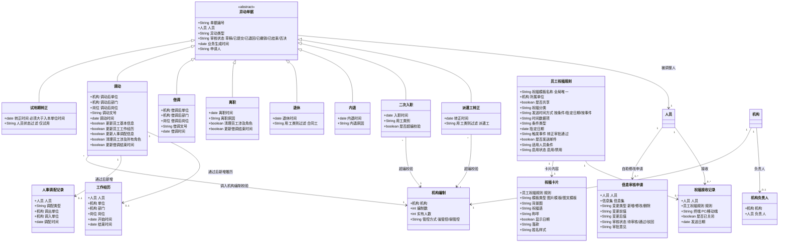
```mermaid
classDiagram
    class 异动单据 {
        <<abstract>>
        +String 单据编号
        +人员 人员
        +String 异动类型
        +String 审核状态 草稿/已提交/已退回/已撤销/已结束/否决
        +date 业务生成时间
        +String 申请人
    }
    class 试用期转正 {
        +date 转正时间 必须大于入本单位时间
        +String 人员状态过滤 仅试用
    }
    class 调动 {
        +机构 调动后单位
        +机构 调动后部门
        +岗位 调动后岗位
        +String 调动文号
        +date 调动时间
        +boolean 更新员工基本信息
        +boolean 更新员工工作经历
        +boolean 更新人事调配信息
        +boolean 清理员工涉及所有角色
        +boolean 更新借调结束时间
    }
    class 借调 {
        +机构 借调后单位
        +机构 借调后部门
        +岗位 借调后岗位
        +String 借调文号
        +date 借调时间
    }
    class 离职 {
        +date 离职时间
        +String 离职原因
        +boolean 清理员工涉及角色
        +boolean 更新借调结束时间
    }
    class 退休 {
        +date 退休时间
        +String 用工类别过滤 合同工
    }
    class 内退 {
        +date 内退时间
        +String 内退原因
    }
    class 二次入职 {
        +date 入职时间
        +String 用工类别
        +boolean 是否超编校验
    }
    class 派遣工转正 {
        +date 转正时间
        +String 用工类别过滤 派遣工
    }
    class 机构编制 {
        +机构 机构
        +int 编制数
        +int 实有人数
        +String 管控方式 强管控/弱管控
    }
    class 机构负责人 {
        +机构 机构
        +人员 负责人
    }
    class 人事调配记录 {
        +人员 人员
        +String 调配类型
        +机构 调出单位
        +机构 调入单位
        +date 调配时间
    }
    class 工作经历 {
        +人员 人员
        +机构 单位
        +机构 部门
        +岗位 岗位
        +date 开始时间
        +date 结束时间
    }
    class 信息审核申请 {
        +人员 人员
        +信息集 信息集
        +String 变更类型 新增/修改/删除
        +String 变更前值
        +String 变更后值
        +String 审核状态 待审核/通过/驳回
        +String 审批意见
    }
    class 员工祝福规则 {
        +String 祝福模板名称 全局唯一
        +机构 所属单位
        +boolean 是否共享
        +String 祝福分类
        +String 发送时间方式 按条件/指定日期/按事件
        +String 时间数据项
        +String 条件类型
        +date 指定日期
        +String 触发事件 转正审批通过
        +boolean 是否发送邮件
        +String 适用人员条件
        +String 启用状态 启用/禁用
    }
    class 祝福卡片 {
        +员工祝福规则 规则
        +String 模板类型 图片模板/图文模板
        +String 背景图
        +String 祝福语
        +String 称呼
        +boolean 显示日期
        +String 落款
        +String 姓名样式
    }
    class 祝福接收记录 {
        +人员 人员
        +员工祝福规则 规则
        +String 终端 PC/移动端
        +boolean 是否已关闭
        +date 发送日期
    }

    异动单据 <|-- 试用期转正
    异动单据 <|-- 调动
    异动单据 <|-- 借调
    异动单据 <|-- 离职
    异动单据 <|-- 退休
    异动单据 <|-- 内退
    异动单据 <|-- 二次入职
    异动单据 <|-- 派遣工转正
    异动单据 "*" --> "1" 人员 : 被调整人
    调动 "*" --> "1" 机构编制 : 调入机构编制校验
    二次入职 "*" --> "1" 机构编制 : 超编校验
    派遣工转正 "*" --> "1" 机构编制 : 超编校验
    机构 "1" --> "1" 机构编制 : 编制控制
    机构 "1" --> "0..1" 机构负责人 : 负责人
    调动 "1" --> "0..1" 人事调配记录 : 通过后新增
    调动 "1" --> "0..1" 工作经历 : 通过后新增履历
    人员 "1" --> "0..*" 信息审核申请 : 自助修改申请
    员工祝福规则 "1" --> "1" 祝福卡片 : 卡片内容
    员工祝福规则 "1" --> "0..*" 祝福接收记录 : 推送记录
    人员 "1" --> "0..*" 祝福接收记录 : 接收
```

### 3.3 极速入职 · 信息采集 · 合同 · 档案 · 配置域

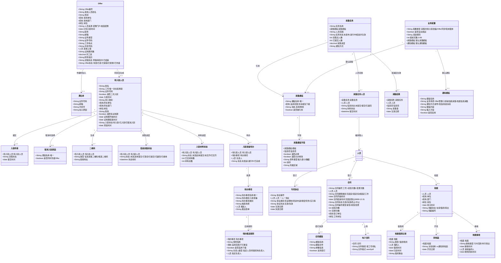
```mermaid
classDiagram
    class Offer {
        +String Offer编号
        +String 录用人员姓名
        +String 性别
        +机构 录用单位
        +机构 录用部门
        +岗位 岗位
        +String 人员来源 招聘门户/校园招聘
        +date 计划入职时间
        +String 职务
        +String 邮箱
        +String 证件类型
        +String 证件号码
        +String 工作地点
        +String 手机号码
        +人员 直接上级
        +String 试用期月数
        +decimal 月工资
        +String 附件简历
        +String 流程状态 草稿/审批中/已结束
        +String Offer状态 待发/已发/已接受/已拒绝/已作废
    }
    class 黑名单 {
        +String 证件号码
        +String 邮箱
        +String 手机号
        +String 加入原因
    }
    class 待入职人员 {
        +String 姓名
        +String 工号 唯一含在职离职
        +String 证件号码
        +boolean 是否二次入职
        +date 入职时间
        +String 用工类别
        +机构 所在单位
        +机构 所在部门
        +岗位 岗位
        +String 职务
        +boolean 是否有试用期
        +date 试用期开始时间
        +date 试用期结束时间
        +String 入职状态 待入职/已入职/已取消入职
        +date 添加时间
    }
    class 入职申请 {
        +待入职人员 待入职人员
        +String 流程状态
        +date 提交时间
    }
    class 取消入职原因 {
        +String 原因名称 唯一
        +boolean 是否同时作废Offer
    }
    class 二维码 {
        +待入职人员 待入职人员
        +String 类型 信息采集二维码/报道二维码
        +String 链接地址
    }
    class 信息采集状态 {
        +待入职人员 待入职人员
        +String 状态 未发送/未提交/已暂存/已提交/已退回/已接收
        +datetime 状态时间
    }
    class 入职材料状态 {
        +待入职人员 待入职人员
        +String 状态 未发起/未提交/未交齐/已交齐
        +int 已交材料数
        +int 材料总数
    }
    class 入职准备待办 {
        +待入职人员 待入职人员
        +待办事项 待办事项
        +人员 负责人
        +String 状态 未发起/进行中/已完成
    }
    class 采集模板 {
        +String 模板名称 唯一
        +机构 适用范围 含本级及下级
        +String 状态 启用/停用
        +boolean 是否被引用
    }
    class 采集模板字段 {
        +采集模板 模板
        +信息项 信息项
        +boolean 是否必填
        +boolean 是否允许修改
        +String 控件类型 输入框/计数器
        +int 排序
        +String 所属区域
    }
    class 采集任务 {
        +String 任务名称
        +采集模板 采集模板
        +String 人员范围
        +String 任务状态 未发布/进行中/结束并生效
        +int 采集总人数
        +int 已提交人数
        +decimal 采集进度
        +String 通知方式
    }
    class 采集任务人员 {
        +采集任务 采集任务
        +人员 人员
        +String 信息状态 未提交/提交/已退回
        +String 材料状态
        +datetime 提交时间
    }
    class 采集结果 {
        +采集任务 采集任务
        +人员 人员
        +信息项 信息项
        +String 采集值
        +date 生效日期
    }
    class 合同 {
        +String 合同编号 工号+续签次数+变更次数
        +人员 人员
        +String 合同期限类别 无固定/固定/完成固定工作
        +date 合同开始时间
        +date 合同结束时间 无固定默认9999-12-31
        +String 合同状态 生效/失效/终止/中止
        +String 合同操作类型 新签/续签/变更
        +int 续签次数
        +int 变更次数
        +机构 签订单位
        +岗位 工作岗位
    }
    class 合同模版 {
        +String 模版名称
        +String 模版文件
        +String 参数信息
        +boolean 支持套打
    }
    class 电子合同 {
        +合同 合同
        +String 文件路径 按工号命名
        +String 文件格式 word/pdf
    }
    class 专项协议 {
        +String 协议编号
        +人员 人员 一人一协议
        +String 协议类别 竞业限制/培训/内退/脱密/劳务/实习等
        +String 协议状态 生效/失效
        +date 生效日期
        +date 失效日期
    }
    class 档案 {
        +人员 人员
        +机构 单位
        +机构 部门
        +岗位 岗位
        +date 转入时间
        +String 档案状态 在库/借阅/转出
        +String 档案编号
    }
    class 档案借阅记录 {
        +档案 档案
        +String 类型 借阅/查阅
        +人员 借阅人
        +date 借阅时间
        +date 归还时间
        +String 借阅事由
    }
    class 转档函 {
        +档案 档案
        +String 文档名称 xx通知转档函
        +date 开具日期
    }
    class 档案接收 {
        +档案 档案
        +String 接收类型 行内互转/外行转出
        +date 接收时间
        +人员 接收操作人
        +date 收到回执时间
    }
    class 通知模板 {
        +String 模板名称
        +String 业务场景 Offer管理/入职前信息采集/档案信息采集
        +String 通知方式 邮件/短信/系统消息
        +String 模板内容
        +String 插入字段
        +boolean 是否启用
    }
    class 业务配置 {
        +String 配置类型 采集时机/入职准备/Offer同步/轮岗强休
        +boolean 是否自动发起
        +String 发送规则
        +int 提前天数 0-99
        +采集模板 默认采集模板
        +通知模板 默认通知模板
    }
    class 待办事项 {
        +String 待办事项名称 唯一
        +String 待办类别 入职准备
        +String 待办事项类别
        +String 触发场景
        +人员 推送人
        +String 推送表单
    }
    class 待办推送规则 {
        +待办事项 待办事项
        +String 规则名称
        +机构 适用范围 不可重复
        +boolean 是否适用下级
        +String 负责人类型 指定人员/所属机构负责人
        +人员 指定负责人
    }

    Offer "*" --> "0..1" 待入职人员 : 同步后生成
    Offer "*" --> "0..1" 黑名单 : 作废时加入
    待入职人员 "1" --> "0..1" 入职申请 : 提交
    待入职人员 "1" --> "0..1" 取消入职原因 : 取消时选择
    待入职人员 "1" --> "0..*" 二维码 : 生成
    待入职人员 "1" --> "1" 信息采集状态 : 采集进度
    待入职人员 "1" --> "1" 入职材料状态 : 材料进度
    待入职人员 "1" --> "0..*" 入职准备待办 : 待办
    采集模板 "1" --> "1..*" 采集模板字段 : 字段
    采集任务 "*" --> "1" 采集模板 : 引用
    采集任务 "1" --> "1..*" 采集任务人员 : 人员范围
    采集任务 "1" --> "0..*" 采集结果 : 结束后生效
    采集任务人员 "*" --> "1" 人员 : 被采集人
    人员 "1" --> "0..*" 合同 : 签订
    合同 "*" --> "0..1" 合同模版 : 套打来源
    合同 "1" --> "0..1" 电子合同 : 上传
    人员 "1" --> "0..*" 专项协议 : 签订
    人员 "1" --> "0..1" 档案 : 档案
    档案 "1" --> "0..*" 档案借阅记录 : 借查阅
    档案 "1" --> "0..*" 转档函 : 开具
    档案 "1" --> "0..1" 档案接收 : 接收
    业务配置 "*" --> "0..1" 通知模板 : 默认通知
    业务配置 "*" --> "0..1" 采集模板 : 默认采集
    待办事项 "1" --> "1..*" 待办推送规则 : 应用规则
    入职准备待办 "*" --> "1" 待办事项 : 来源
```

---

## 4. 对象图 Object Diagram（运行时刻实例快照）

场景：**2024 年 3 月**，应聘者「李四」从 Offer 接受 → 待入职 → 信息采集中，同时在职员工「张三」发起调动审批的某时刻快照。

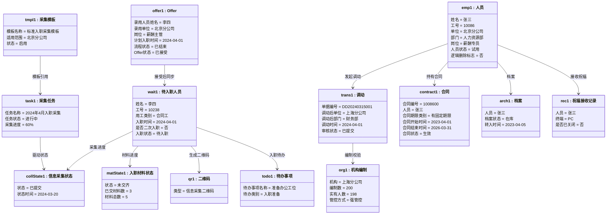
```mermaid
classDiagram
    class offer1["offer1 : Offer"] {
        录用人员姓名 = 李四
        录用单位 = 北京分公司
        岗位 = 薪酬主管
        计划入职时间 = 2024-04-01
        流程状态 = 已结束
        Offer状态 = 已接受
    }
    class wait1["wait1 : 待入职人员"] {
        姓名 = 李四
        工号 = 10238
        用工类别 = 合同工
        入职时间 = 2024-04-01
        是否二次入职 = 否
        入职状态 = 待入职
    }
    class collState1["collState1 : 信息采集状态"] {
        状态 = 已提交
        状态时间 = 2024-03-20
    }
    class matState1["matState1 : 入职材料状态"] {
        状态 = 未交齐
        已交材料数 = 3
        材料总数 = 5
    }
    class qr1["qr1 : 二维码"] {
        类型 = 信息采集二维码
    }
    class tmpl1["tmpl1 : 采集模板"] {
        模板名称 = 标准入职采集模板
        适用范围 = 北京分公司
        状态 = 启用
    }
    class task1["task1 : 采集任务"] {
        任务名称 = 2024年4月入职采集
        任务状态 = 进行中
        采集进度 = 60%
    }
    class emp1["emp1 : 人员"] {
        姓名 = 张三
        工号 = 10086
        单位 = 北京分公司
        部门 = 人力资源部
        岗位 = 薪酬专员
        人员状态 = 试用
        逻辑删除标志 = 否
    }
    class trans1["trans1 : 调动"] {
        单据编号 = DD20240315001
        调动后单位 = 上海分公司
        调动后部门 = 财务部
        调动时间 = 2024-04-01
        审核状态 = 已提交
    }
    class org1["org1 : 机构编制"] {
        机构 = 上海分公司
        编制数 = 200
        实有人数 = 198
        管控方式 = 强管控
    }
    class contract1["contract1 : 合同"] {
        合同编号 = 1008600
        人员 = 张三
        合同期限类别 = 有固定期限
        合同开始时间 = 2023-04-01
        合同结束时间 = 2026-03-31
        合同状态 = 生效
    }
    class arch1["arch1 : 档案"] {
        人员 = 张三
        档案状态 = 在库
        转入时间 = 2023-04-05
    }
    class todo1["todo1 : 待办事项"] {
        待办事项名称 = 准备办公工位
        待办类别 = 入职准备
    }
    class rec1["rec1 : 祝福接收记录"] {
        人员 = 张三
        终端 = PC
        是否已关闭 = 否
    }

    offer1 --> wait1 : 接受后同步
    wait1 --> collState1 : 采集进度
    wait1 --> matState1 : 材料进度
    wait1 --> qr1 : 生成二维码
    wait1 --> todo1 : 入职待办
    tmpl1 --> task1 : 模板引用
    task1 --> collState1 : 驱动状态
    emp1 --> trans1 : 发起调动
    trans1 --> org1 : 编制校验
    emp1 --> contract1 : 持有合同
    emp1 --> arch1 : 档案
    emp1 --> rec1 : 接收祝福
```

---

## 5. 包图 Package Diagram（模块划分与依赖）

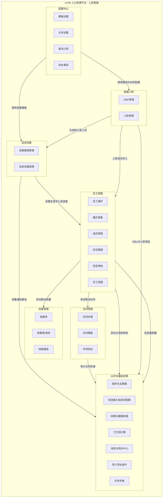
```mermaid
flowchart TB
    subgraph VHR["V-HR 人力资源平台 · 人员管理"]
        direction TB
        subgraph PKG_EMP["员工管理"]
            direction LR
            P11[员工维护]
            P12[履历查看]
            P13[减员管理]
            P14[异动管理]
            P15[信息审核]
            P16[员工祝福]
        end
        subgraph PKG_ENTRY["极速入职"]
            direction LR
            P21[Offer管理]
            P22[入职管理]
        end
        subgraph PKG_COLL["信息采集"]
            direction LR
            P31[采集模板管理]
            P32[信息采集管理]
        end
        subgraph PKG_CTR["合同管理"]
            direction LR
            P41[合同办理]
            P42[合同模版]
            P43[专项协议]
        end
        subgraph PKG_ARCH["档案管理"]
            direction LR
            P51[档案库]
            P52[档案借/查阅]
            P53[档案接收]
        end
        subgraph PKG_CFG["配置中心"]
            direction LR
            P61[模板设置]
            P62[业务设置]
            P63[取消入职]
            P64[待办事项]
        end
        subgraph PKG_COMMON["公共与基础支撑"]
            direction LR
            P71[组织与主数据]
            P72[信息集与信息项配置]
            P73[权限与数据权限]
            P74[工作流引擎]
            P75[消息与待办中心]
            P76[导入导出组件]
            P77[文件存储]
        end
    end

    PKG_ENTRY -->|生成待入职人员| PKG_COLL
    PKG_ENTRY -->|入职成功写入| PKG_EMP
    PKG_COLL -->|采集生效写入信息集| PKG_EMP
    PKG_EMP -->|异动联动合同| PKG_CTR
    PKG_EMP -->|异动联动档案| PKG_ARCH
    PKG_CFG -->|提供模板与时机配置| PKG_ENTRY
    PKG_CFG -->|提供采集模板| PKG_COLL
    PKG_EMP -->|信息集配置| PKG_COMMON
    PKG_ENTRY -->|Offer与入职审批| PKG_COMMON
    PKG_EMP -->|异动与审核审批| PKG_COMMON
    PKG_CTR -->|电子合同存储| PKG_COMMON
    PKG_COLL -->|采集通知推送| PKG_COMMON
```

---

## 6. 组件图 Component Diagram（逻辑组件与接口）

```mermaid
flowchart TB
    subgraph CLIENT["展现层"]
        C1[[人事管理端 Web]]
        C2[[员工自助 PC]]
        C3[[移动端 H5]]
        C4[[应聘者端 H5]]
    end

    subgraph SERVICE["应用服务层"]
        S1[[员工与信息集服务]]
        S2[[履历与导入导出服务]]
        S3[[异动管理服务]]
        S4[[信息审核服务]]
        S5[[员工祝福服务]]
        S6[[Offer服务]]
        S7[[入职管理服务]]
        S8[[采集模板服务]]
        S9[[采集任务服务]]
        S10[[合同办理服务]]
        S11[[合同模版与套打服务]]
        S12[[专项协议服务]]
        S13[[档案管理服务]]
        S14[[配置中心服务]]
    end

    subgraph ENGINE["领域引擎层"]
        E1[[时间拉链校验器]]
        E2[[机构编制管控器]]
        E3[[信息集动态渲染引擎]]
        E4[[二维码生成引擎]]
        E5[[合同编号生成器]]
        E6[[文档套打引擎]]
        E7[[祝福规则触发引擎]]
    end

    subgraph INFRA["基础设施层"]
        I1[[工作流引擎]]
        I2[[消息与待办中心]]
        I3[[邮件与短信网关]]
        I4[[导入导出组件]]
        I5[[文件存储]]
        I6[[VHR 数据库]]
        I7[[定时任务调度器]]
    end

    C1 --> S1
    C1 --> S3
    C1 --> S6
    C1 --> S7
    C1 --> S10
    C1 --> S13
    C1 --> S14
    C2 --> S1
    C2 --> S4
    C2 --> S5
    C3 --> S5
    C4 --> S6
    C4 --> S9

    S1 --> S2
    S3 --> S1
    S3 --> S10
    S3 --> S13
    S6 --> S7
    S7 --> S9
    S9 --> S8
    S10 --> S11
    S10 --> S12
    S14 --> S8
    S14 --> S7

    S1 --> E3
    S2 --> E1
    S3 --> E2
    S7 --> E4
    S10 --> E5
    S11 --> E6
    S5 --> E7

    S3 --> I1
    S6 --> I1
    S7 --> I1
    S4 --> I1
    S9 --> I2
    S7 --> I3
    S2 --> I4
    S9 --> I4
    S13 --> I4
    S10 --> I5
    S11 --> I5
    S13 --> I5
    E1 --> I6
    E2 --> I6
    S14 --> I7
    I7 --> S7
    I7 --> S9
```

---

## 7. 部署图 Deployment Diagram（物理节点与工件）

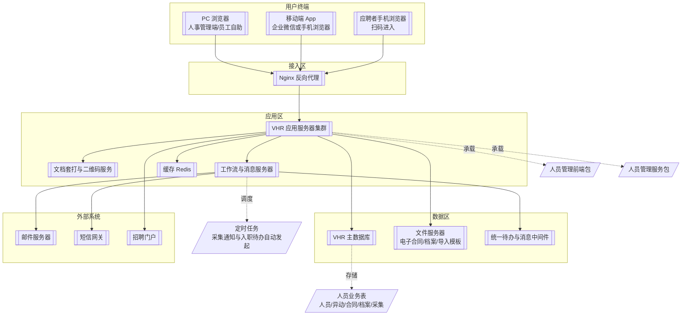
```mermaid
flowchart TB
    subgraph ZONE_USER["用户终端"]
        N1[["PC 浏览器<br/>人事管理端/员工自助"]]
        N2[["移动端 App<br/>企业微信或手机浏览器"]]
        N3[["应聘者手机浏览器<br/>扫码进入"]]
    end
    subgraph ZONE_DMZ["接入区"]
        N4[["Nginx 反向代理"]]
    end
    subgraph ZONE_APP["应用区"]
        N5[["VHR 应用服务器集群"]]
        N6[["文档套打与二维码服务"]]
        N7[["工作流与消息服务器"]]
        N8[["缓存 Redis"]]
    end
    subgraph ZONE_DATA["数据区"]
        N9[["VHR 主数据库"]]
        N10[["文件服务器<br/>电子合同/档案/导入模板"]]
        N11[["统一待办与消息中间件"]]
    end
    subgraph ZONE_EXT["外部系统"]
        N12[["邮件服务器"]]
        N13[["短信网关"]]
        N14[["招聘门户"]]
    end

    ART1[/"人员管理前端包"/]
    ART2[/"人员管理服务包"/]
    ART3[/"人员业务表<br/>人员/异动/合同/档案/采集"/]
    ART4[/"定时任务<br/>采集通知与入职待办自动发起"/]

    N1 --> N4
    N2 --> N4
    N3 --> N4
    N4 --> N5
    N5 --> N6
    N5 --> N7
    N5 --> N8
    N5 --> N9
    N5 --> N10
    N7 --> N11
    N5 -.承载.-> ART1
    N5 -.承载.-> ART2
    N9 -.存储.-> ART3
    N7 -.调度.-> ART4
    N7 --> N12
    N7 --> N13
    N5 --> N14
```

---

## 8. 组合结构图 Composite Structure Diagram（采集模板内部结构）

以「信息采集模板」为例，展示其内部部件、端口与连接器。

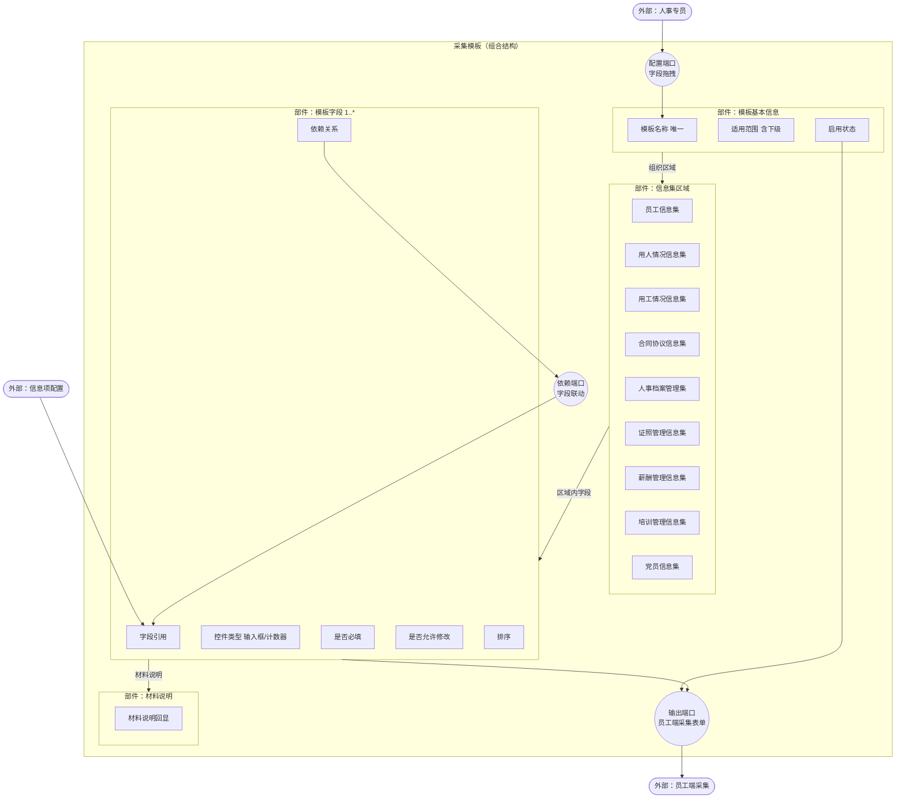
```mermaid
flowchart TB
    subgraph CTX["采集模板（组合结构）"]
        direction TB
        PORT_CFG((配置端口<br/>字段拖拽))
        PORT_OUT((输出端口<br/>员工端采集表单))
        PORT_DEP((依赖端口<br/>字段联动))

        subgraph PART_BASE["部件：模板基本信息"]
            M1[模板名称 唯一]
            M2[适用范围 含下级]
            M3[启用状态]
        end
        subgraph PART_AREA["部件：信息集区域"]
            A1[员工信息集]
            A2[用人情况信息集]
            A3[用工情况信息集]
            A4[合同协议信息集]
            A5[人事档案管理集]
            A6[证照管理信息集]
            A7[薪酬管理信息集]
            A8[培训管理信息集]
            A9[党员信息集]
        end
        subgraph PART_FIELD["部件：模板字段 1..*"]
            F1[字段引用]
            F2[控件类型 输入框/计数器]
            F3[是否必填]
            F4[是否允许修改]
            F5[依赖关系]
            F6[排序]
        end
        subgraph PART_MAT["部件：材料说明"]
            T1[材料说明回显]
        end
    end

    ADMIN([外部：人事专员])
    EMP([外部：员工端采集])
    FIELD([外部：信息项配置])

    ADMIN --> PORT_CFG
    PORT_CFG --> M1
    PART_BASE -->|组织区域| PART_AREA
    PART_AREA -->|区域内字段| PART_FIELD
    FIELD --> F1
    F5 --> PORT_DEP
    PORT_DEP --> F1
    PART_FIELD -->|材料说明| PART_MAT
    PART_FIELD --> PORT_OUT
    PORT_OUT --> EMP
    M3 --> PORT_OUT
```

---

## 9. 剖面图 Profile Diagram（构造型与扩展）

定义本模块的建模构造型（stereotype），约束领域对象的建模语义。

```mermaid
classDiagram
    class Class <<metaclass>>
    class Enumeration <<metaclass>>
    class Component <<metaclass>>
    class 聚合根 <<stereotype>> {
        +boolean 独立生命周期
        +boolean 全局唯一编号
    }
    class 单据实体 <<stereotype>> {
        +boolean 审批流驱动
        +boolean 状态机
        +boolean 草稿可编辑
    }
    class 配置实体 <<stereotype>> {
        +boolean 单位隔离
        +boolean 被引用即锁定
    }
    class 元数据 <<stereotype>> {
        +boolean 系统配置驱动
        +boolean 动态渲染
    }
    class 值对象 <<stereotype>> {
        +boolean 无标识
        +boolean 依附聚合根
    }
    class 枚举构造型 <<stereotype>> {
        +String 代码选项
    }
    class 领域服务 <<stereotype>> {
        +boolean 无状态
    }

    聚合根 --|> Class : extend
    单据实体 --|> Class : extend
    配置实体 --|> Class : extend
    元数据 --|> Class : extend
    值对象 --|> Class : extend
    枚举构造型 --|> Enumeration : extend
    领域服务 --|> Component : extend

    class 人员
    class Offer
    class 待入职人员
    class 采集任务
    class 合同
    class 档案
    class 异动单据
    class 调动
    class 离职
    class 采集模板
    class 合同模版
    class 待办事项
    class 通知模板
    class 信息集
    class 信息项
    class 采集模板字段
    class 表头设置
    class 档案借阅记录
    class 人员信息值
    class 采集结果
    class 人员状态
    class 合同状态
    class 档案状态
    class 采集任务状态
    class 时间拉链校验器
    class 机构编制管控器
    class 信息集渲染引擎
    class 文档套打引擎

    人员 ..> 聚合根 : apply
    Offer ..> 单据实体 : apply
    待入职人员 ..> 聚合根 : apply
    采集任务 ..> 单据实体 : apply
    合同 ..> 聚合根 : apply
    档案 ..> 聚合根 : apply
    异动单据 ..> 单据实体 : apply
    调动 ..> 单据实体 : apply
    离职 ..> 单据实体 : apply
    采集模板 ..> 配置实体 : apply
    合同模版 ..> 配置实体 : apply
    待办事项 ..> 配置实体 : apply
    通知模板 ..> 配置实体 : apply
    信息集 ..> 元数据 : apply
    信息项 ..> 元数据 : apply
    采集模板字段 ..> 值对象 : apply
    表头设置 ..> 值对象 : apply
    档案借阅记录 ..> 值对象 : apply
    人员信息值 ..> 值对象 : apply
    采集结果 ..> 值对象 : apply
    人员状态 ..> 枚举构造型 : apply
    合同状态 ..> 枚举构造型 : apply
    档案状态 ..> 枚举构造型 : apply
    采集任务状态 ..> 枚举构造型 : apply
    时间拉链校验器 ..> 领域服务 : apply
    机构编制管控器 ..> 领域服务 : apply
    信息集渲染引擎 ..> 领域服务 : apply
    文档套打引擎 ..> 领域服务 : apply
```

---

## 10. 活动图 Activity Diagram

### 10.1 从 Offer 到入职的全流程（带泳道）

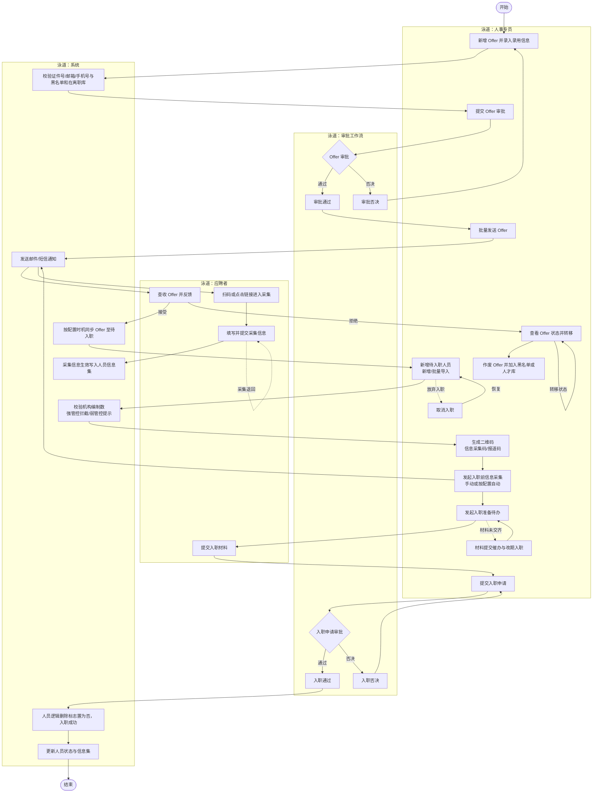
```mermaid
flowchart TB
    START([开始])

    subgraph LANE_HR["泳道：人事专员"]
        A1[新增 Offer 并录入录用信息]
        A2[提交 Offer 审批]
        A3[批量发送 Offer]
        A4[查看 Offer 状态并转移]
        A5[作废 Offer 并加入黑名单或人才库]
        A6[新增待入职人员<br/>新增/批量导入]
        A7[生成二维码<br/>信息采集码/报道码]
        A8[发起入职前信息采集<br/>手动或按配置自动]
        A9[发起入职准备待办]
        A10[提交入职申请]
        A11[材料提交催办与改期入职]
        A12[取消入职]
    end

    subgraph LANE_CAN["泳道：应聘者"]
        B1[查收 Offer 并反馈]
        B2[扫码或点击链接进入采集]
        B3[填写并提交采集信息]
        B4[提交入职材料]
    end

    subgraph LANE_WF["泳道：审批工作流"]
        W1{Offer 审批}
        W2[审批通过]
        W3[审批否决]
        W4{入职申请审批}
        W5[入职通过]
        W6[入职否决]
    end

    subgraph LANE_SYS["泳道：系统"]
        S1[按配置时机同步 Offer 至待入职]
        S2[校验证件号/邮箱/手机号与黑名单和在离职库]
        S3[校验机构编制数<br/>强管控拦截/弱管控提示]
        S4[采集信息生效写入人员信息集]
        S5[人员逻辑删除标志置为否，入职成功]
        S6[更新人员状态与信息集]
        S7[发送邮件/短信通知]
    end

    END([结束])

    START --> A1 --> S2 --> A2 --> W1
    W1 -->|通过| W2 --> A3
    W1 -->|否决| W3 --> A1
    A3 --> S7 --> B1
    B1 -->|接受| S1 --> A6
    B1 -->|拒绝| A4 --> A5
    A4 -->|转移状态| A4
    A6 --> S3 --> A7 --> A8 --> S7 --> B2 --> B3 --> S4
    A8 --> A9 --> B4 --> A10 --> W4
    W4 -->|通过| W5 --> S5 --> S6 --> END
    W4 -->|否决| W6 --> A10
    B3 -.->|采集退回| B3
    A9 -.->|材料未交齐| A11 --> A9
    A6 -.->|放弃入职| A12
    A12 -->|恢复| A6
```

### 10.2 异动管理通用活动（以调动为例）

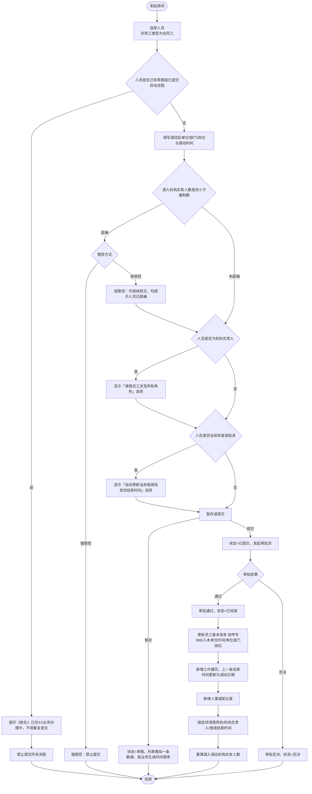
```mermaid
flowchart TB
    C0([发起调动])
    C1[选择人员<br/>仅用工类型为合同工]
    C2{人员是否已有草稿或已提交异动流程}
    C3[提示《姓名》已在XX业务办理中，不得重复提交]
    C4[禁止提交所有流程]
    C5[填写调动后单位/部门/岗位与调动时间]
    C6{调入机构实有人数是否小于编制数}
    C7{管控方式}
    C8[强管控：禁止提交]
    C9[弱管控：可继续提交，均提示人员已超编]
    C10{人员是否为机构负责人}
    C11[显示「清理员工涉及所有角色」选项]
    C12{人员是否当前有借调信息}
    C13[显示「自动更新当前借调信息的结束时间」选项]
    C14[暂存或提交]
    C15[状态=草稿，列表增加一条数据，按业务生成时间倒序]
    C16[状态=已提交，发起审批流]
    C17{审批结果}
    C18[审批通过，状态=已结束]
    C19[更新员工基本信息 排序号999/入本单位时间/单位部门岗位]
    C20[新增工作履历，上一条结束时间更新为调动日期]
    C21[新增人事调配记录]
    C22[按选项清理角色/机构负责人/借调结束时间]
    C23[重算调入调出机构实有人数]
    C24[审批否决，状态=否决]
    C25([结束])

    C0 --> C1 --> C2
    C2 -->|是| C3 --> C4 --> C25
    C2 -->|否| C5 --> C6
    C6 -->|超编| C7
    C7 -->|强管控| C8 --> C25
    C7 -->|弱管控| C9 --> C10
    C6 -->|未超编| C10
    C10 -->|是| C11 --> C12
    C10 -->|否| C12
    C12 -->|是| C13 --> C14
    C12 -->|否| C14
    C14 -->|暂存| C15 --> C25
    C14 -->|提交| C16 --> C17
    C17 -->|通过| C18 --> C19 --> C20 --> C21 --> C22 --> C23 --> C25
    C17 -->|否决| C24 --> C25
```

### 10.3 合同生命周期活动

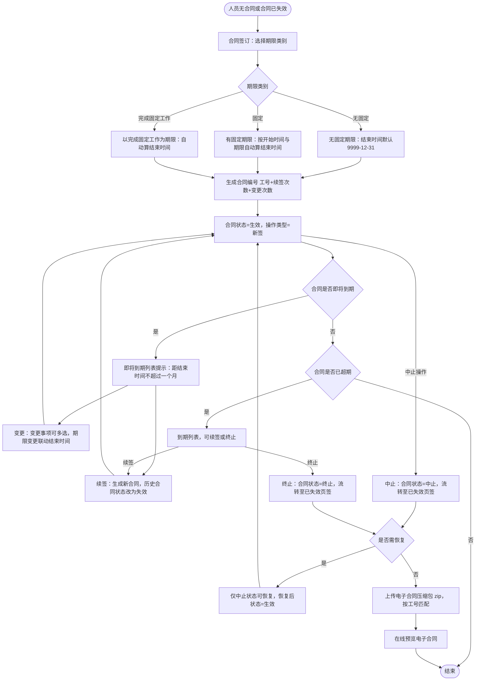
```mermaid
flowchart TB
    D0([人员无合同或合同已失效])
    D1[合同签订：选择期限类别]
    D2{期限类别}
    D3[无固定期限：结束时间默认9999-12-31]
    D4[有固定期限：按开始时间与期限自动算结束时间]
    D5[以完成固定工作为期限：自动算结束时间]
    D6[生成合同编号 工号+续签次数+变更次数]
    D7[合同状态=生效，操作类型=新签]
    D8{合同是否即将到期}
    D9[即将到期列表提示：距结束时间不超过一个月]
    D10[续签：生成新合同，历史合同状态改为失效]
    D11[变更：变更事项可多选，期限变更联动结束时间]
    D12{合同是否已超期}
    D13[到期列表，可续签或终止]
    D14[中止：合同状态=中止，流转至已失效页签]
    D15[终止：合同状态=终止，流转至已失效页签]
    D16{是否需恢复}
    D17[仅中止状态可恢复，恢复后状态=生效]
    D18[上传电子合同压缩包 zip，按工号匹配]
    D19[在线预览电子合同]
    D20([结束])

    D0 --> D1 --> D2
    D2 -->|无固定| D3 --> D6
    D2 -->|固定| D4 --> D6
    D2 -->|完成固定工作| D5 --> D6
    D6 --> D7 --> D8
    D8 -->|是| D9 --> D10 --> D7
    D8 -->|否| D12
    D9 --> D11 --> D7
    D12 -->|是| D13
    D13 -->|续签| D10
    D13 -->|终止| D15
    D12 -->|否| D20
    D7 -->|中止操作| D14
    D14 --> D16
    D15 --> D16
    D16 -->|是| D17 --> D7
    D16 -->|否| D18 --> D19 --> D20
```

---

## 11. 状态机图 State Machine Diagram

### 11.1 异动单据（8 类通用）

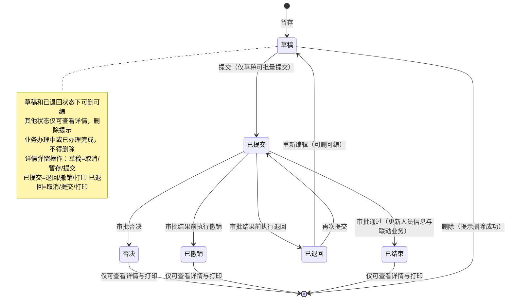
```mermaid
stateDiagram-v2
    [*] --> 草稿 : 暂存
    草稿 --> 已提交 : 提交（仅草稿可批量提交）
    已提交 --> 已结束 : 审批通过（更新人员信息与联动业务）
    已提交 --> 否决 : 审批否决
    已提交 --> 已退回 : 审批结果前执行退回
    已提交 --> 已撤销 : 审批结果前执行撤销
    已退回 --> 草稿 : 重新编辑（可删可编）
    已退回 --> 已提交 : 再次提交
    否决 --> [*] : 仅可查看详情与打印
    已撤销 --> [*] : 仅可查看详情与打印
    已结束 --> [*] : 仅可查看详情与打印
    草稿 --> [*] : 删除（提示删除成功）
    note right of 草稿
        草稿和已退回状态下可删可编
        其他状态仅可查看详情，删除提示
        业务办理中或已办理完成，不得删除
        详情弹窗操作：草稿=取消/暂存/提交
        已提交=退回/撤销/打印 已退回=取消/提交/打印
    end note
```

### 11.2 人员（逻辑删除与在职状态）

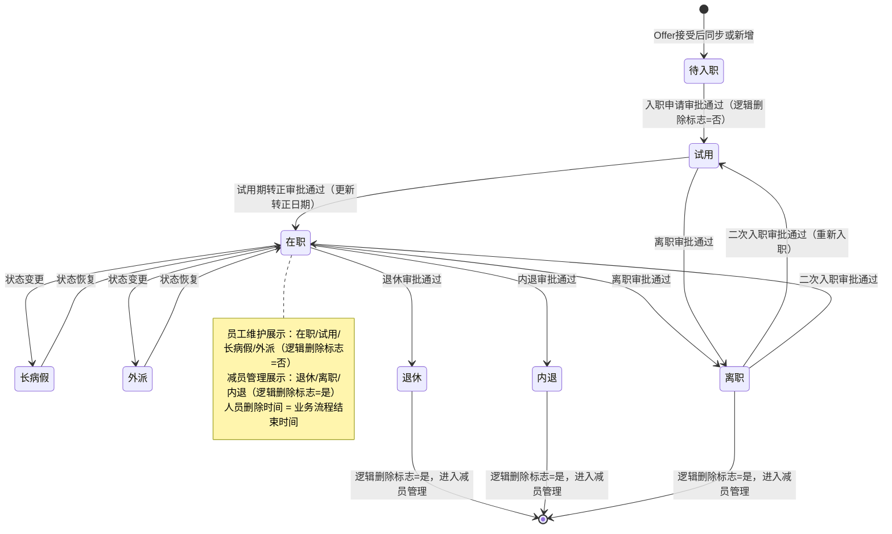
```mermaid
stateDiagram-v2
    [*] --> 待入职 : Offer接受后同步或新增
    待入职 --> 试用 : 入职申请审批通过（逻辑删除标志=否）
    试用 --> 在职 : 试用期转正审批通过（更新转正日期）
    在职 --> 长病假 : 状态变更
    在职 --> 外派 : 状态变更
    长病假 --> 在职 : 状态恢复
    外派 --> 在职 : 状态恢复
    在职 --> 离职 : 离职审批通过
    在职 --> 退休 : 退休审批通过
    在职 --> 内退 : 内退审批通过
    试用 --> 离职 : 离职审批通过
    离职 --> 试用 : 二次入职审批通过（重新入职）
    离职 --> 在职 : 二次入职审批通过
    退休 --> [*] : 逻辑删除标志=是，进入减员管理
    内退 --> [*] : 逻辑删除标志=是，进入减员管理
    离职 --> [*] : 逻辑删除标志=是，进入减员管理
    note right of 在职
        员工维护展示：在职/试用/长病假/外派（逻辑删除标志=否）
        减员管理展示：退休/离职/内退（逻辑删除标志=是）
        人员删除时间 = 业务流程结束时间
    end note
```

### 11.3 Offer

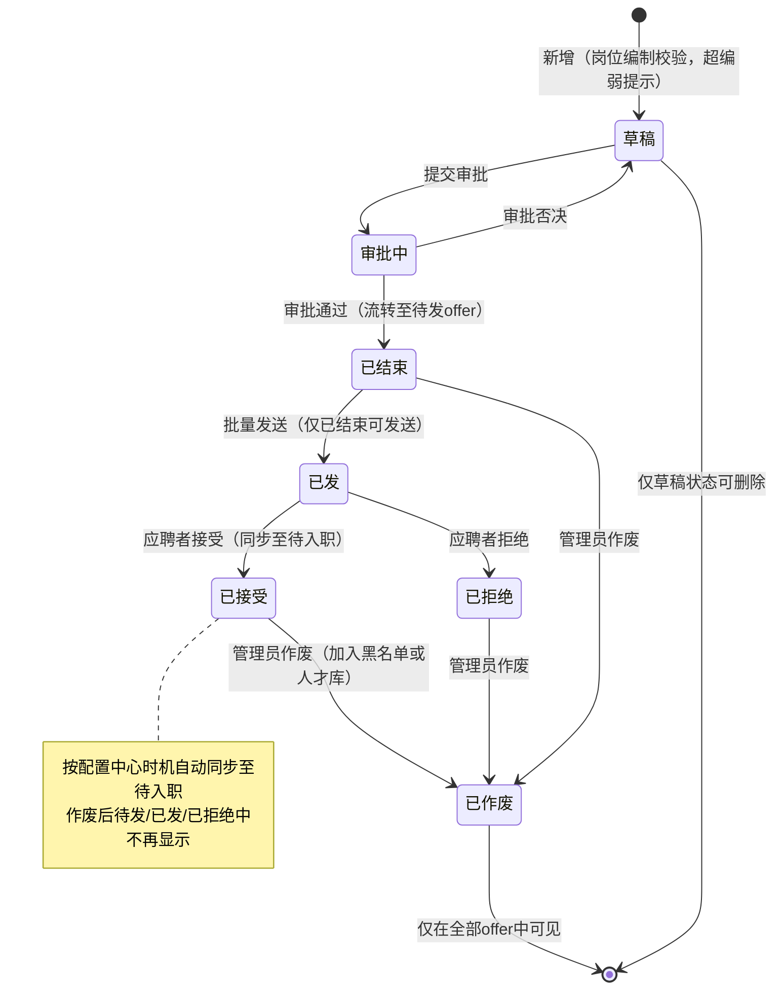
```mermaid
stateDiagram-v2
    [*] --> 草稿 : 新增（岗位编制校验，超编弱提示）
    草稿 --> 审批中 : 提交审批
    审批中 --> 已结束 : 审批通过（流转至待发offer）
    审批中 --> 草稿 : 审批否决
    已结束 --> 已发 : 批量发送（仅已结束可发送）
    已发 --> 已接受 : 应聘者接受（同步至待入职）
    已发 --> 已拒绝 : 应聘者拒绝
    已接受 --> 已作废 : 管理员作废（加入黑名单或人才库）
    已拒绝 --> 已作废 : 管理员作废
    已结束 --> 已作废 : 管理员作废
    已作废 --> [*] : 仅在全部offer中可见
    草稿 --> [*] : 仅草稿状态可删除
    note right of 已接受
        按配置中心时机自动同步至待入职
        作废后待发/已发/已拒绝中不再显示
    end note
```

### 11.4 待入职人员与入职申请

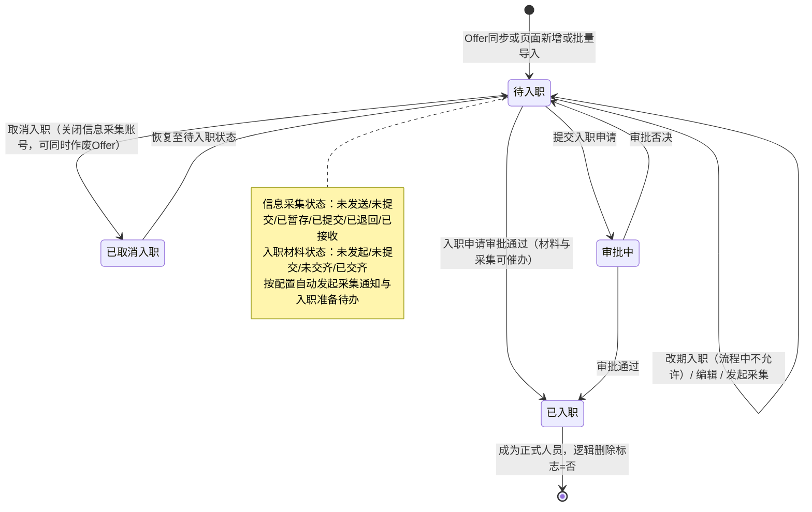
```mermaid
stateDiagram-v2
    [*] --> 待入职 : Offer同步或页面新增或批量导入
    待入职 --> 待入职 : 改期入职（流程中不允许）/ 编辑 / 发起采集
    待入职 --> 已取消入职 : 取消入职（关闭信息采集账号，可同时作废Offer）
    已取消入职 --> 待入职 : 恢复至待入职状态
    待入职 --> 已入职 : 入职申请审批通过（材料与采集可催办）
    待入职 --> 审批中 : 提交入职申请
    审批中 --> 待入职 : 审批否决
    审批中 --> 已入职 : 审批通过
    已入职 --> [*] : 成为正式人员，逻辑删除标志=否
    note right of 待入职
        信息采集状态：未发送/未提交/已暂存/已提交/已退回/已接收
        入职材料状态：未发起/未提交/未交齐/已交齐
        按配置自动发起采集通知与入职准备待办
    end note
```

### 11.5 采集任务与采集信息

```mermaid
stateDiagram-v2
    [*] --> 未发布 : 新建采集任务
    未发布 --> 进行中 : 发布任务（推送至员工端）
    未发布 --> [*] : 仅未发布可编辑与删除
    进行中 --> 进行中 : 进度监控/催办/批量退回
    进行中 --> 结束并生效 : 结束并生效（数据流转至采集结果管理）
    结束并生效 --> [*] : 仅可查看，不可编辑
    note right of 进行中
        采集进度 = 已提交人数 / 采集总人数
        批量退回事后信息状态改为已退回并重发通知
        信息以最新日期的生效数据为准
    end note
```

### 11.6 合同

```mermaid
stateDiagram-v2
    [*] --> 生效 : 新签/续签/变更（编号=工号+续签次数+变更次数）
    生效 --> 失效 : 续签或变更后历史合同置失效
    生效 --> 中止 : 合同中止（操作类型不变）
    生效 --> 终止 : 合同终止（操作类型不变）
    中止 --> 生效 : 恢复（仅中止状态可恢复）
    终止 --> [*] : 流转至已失效页签
    失效 --> [*] : 流转至已失效页签
    note right of 生效
        到期：状态生效且结束时间小于当前时间
        即将到期：状态生效且结束时间距当前不超过一个月
        未签：无合同或状态为失效/终止且终止时间不超过一个月
    end note
```

### 11.7 档案

```mermaid
stateDiagram-v2
    [*] --> 在库 : 档案转入或批量导入（默认在库）
    在库 --> 借阅 : 借阅（仅库存可借查阅）
    在库 --> 在库 : 查阅（查阅不改变状态）
    借阅 --> 借阅 : 再次借阅覆盖上次数据
    借阅 --> 在库 : 归还（仅借阅状态可归还）
    在库 --> 转出 : 转出（可下载转档函）
    转出 --> [*] : 行内互转进入档案接收-行内互转
    转出 --> [*] : 行外转出进入档案接收-外行转出回执
    note right of 在库
        在库的档案才能编辑与转出
        转出与借阅状态仅可查看详情
        当前人员有在库或借阅状态档案不能转入
        有转出状态档案可转入并覆盖原有数据
    end note
```

### 11.8 员工祝福规则

```mermaid
stateDiagram-v2
    [*] --> 启用 : 新增（默认启用）
    启用 --> 禁用 : 禁用操作
    禁用 --> 启用 : 启用操作
    禁用 --> [*] : 仅禁用状态可删除
    启用 --> 启用 : 编辑后立即生效，不影响已发送历史祝福
    note right of 启用
        按发送时间方式触发：按条件/指定日期/按事件（转正审批通过）
        多条规则命中同一人则收到多条卡片
        卡片被关闭后 PC 与移动端均不再发送
        是否共享为是时全公司适用，仅同单位可编辑
    end note
```

### 11.9 采集模板与通知模板（引用锁定）

```mermaid
stateDiagram-v2
    [*] --> 未引用 : 新建模板
    未引用 --> 已引用 : 被采集任务或业务配置引用
    已引用 --> 已引用 : 允许编辑，不允许删除
    未引用 --> [*] : 可删除（提示该模板已被引用不允许删除）
    未引用 --> 停用 : 停用
    停用 --> 未引用 : 启用
    note right of 已引用
        采集模板名称不能重复，适用范围含本级及下级
        通知模板被引用后不允许删除
        停用后不再展示在选择模板或发送采集通知处
    end note
```

---

## 12. 序列图 Sequence Diagram

### 12.1 场景一：Offer 创建审批到同步待入职

```mermaid
sequenceDiagram
    actor HR as 人事专员
    actor CAN as 应聘者
    participant OS as Offer服务
    participant QC as 黑名单与在职库校验器
    participant EC as 机构编制管控器
    participant WF as 工作流引擎
    participant MSG as 邮件与短信网关
    participant ES as 入职管理服务
    participant DB as VHR 数据库

    HR->>OS: 新增 Offer（录入录用信息与岗位）
    OS->>QC: 校验证件号/邮箱/手机号
    QC->>DB: 比对黑名单与在职人员库
    alt 命中黑名单或已在职
        QC-->>OS: 提示该人员证件号/邮箱/手机号已存在
        OS-->>HR: 拦截并提示先处理
    else 校验通过
        QC-->>OS: 校验通过
    end
    OS->>EC: 按岗位校验机构编制数
    alt 超编
        EC-->>OS: 弹窗弱提示人员已超编
    end
    HR->>OS: 提交审批
    OS->>WF: 发起 Offer 审批流
    WF-->>HR: 审批通过回调
    OS->>DB: 流程状态=已结束，Offer状态=待发
    HR->>OS: 批量发送 Offer
    OS->>MSG: 按 Offer 通知模板发送邮件或短信
    MSG-->>CAN: 应聘者查收 Offer
    CAN->>OS: 反馈接受
    OS->>DB: Offer状态=已接受
    OS->>ES: 按配置时机同步至待入职
    ES->>DB: 生成待入职人员（添加时间=转入时间）
    ES-->>HR: 待入职列表新增数据
    Note over HR,DB: 作废时需选择加入黑名单或人才库，作废后仅在全部Offer可见
```

### 12.2 场景二：入职前信息采集与入职申请

```mermaid
sequenceDiagram
    actor HR as 人事专员
    actor CAN as 应聘者
    participant ES as 入职管理服务
    participant CS as 采集任务服务
    participant TS as 采集模板服务
    participant MSG as 邮件与短信网关
    participant WF as 工作流引擎
    participant DB as VHR 数据库
    participant JOB as 定时任务调度器

    HR->>ES: 新增待入职人员（或批量导入）
    ES->>DB: 校验证件号与黑名单/在职库/离职库
    alt 命中离职库
        ES-->>HR: 弹窗提示并自动调整为二次入职
    end
    DB-->>ES: 保存待入职人员
    JOB->>CS: 按配置时机触发采集通知（或HR手动发起）
    CS->>TS: 拉取采集模板与通知模板
    TS-->>CS: 返回模板内容与采集链接
    CS->>MSG: 发送邮件或短信（含采集链接或二维码）
    MSG-->>CAN: 应聘者点击链接或扫码进入
    CAN->>CS: 填写并提交采集信息
    CS->>DB: 信息状态=已提交
    alt 管理员退回
        HR->>CS: 批量退回
        CS->>DB: 信息状态=已退回
        CS->>MSG: 重发通知并带出已填信息
        MSG-->>CAN: 修改后重新提交
    end
    HR->>ES: 发起入职准备待办
    ES->>DB: 生成待办并指定负责人
    CAN->>ES: 提交入职材料
    ES->>DB: 材料状态=未交齐或已交齐
    alt 材料未交齐
        HR->>ES: 材料提交催办
        ES->>MSG: 再次发送邮件与短信
    end
    HR->>ES: 提交入职申请
    ES->>WF: 发起入职审批
    WF-->>ES: 审批通过回调
    ES->>DB: 入职状态=已入职
    ES->>DB: 采集信息生效写入人员信息集
    ES->>DB: 人员逻辑删除标志=否
    ES-->>HR: 入职完成
```

### 12.3 场景三：员工调动审批与联动更新

```mermaid
sequenceDiagram
    actor HR as 人事专员
    participant TS as 异动管理服务
    participant EC as 机构编制管控器
    participant WF as 工作流引擎
    participant ES as 员工与信息集服务
    participant DB as VHR 数据库

    HR->>TS: 发起调动并选择人员
    TS->>DB: 过滤用工类型为合同工的人员
    TS->>DB: 校验人员是否已有草稿或已提交异动流程
    alt 已存在在途流程
        DB-->>TS: 返回占用人员
        TS-->>HR: 提示《姓名》已在调动业务办理中，不得重复提交
    else 无占用
        HR->>TS: 填写调动后单位/部门/岗位与时间
        TS->>EC: 校验调入机构实有人数与编制数
        alt 超编且强管控
            EC-->>TS: 禁止提交
            TS-->>HR: 提示人员已超编
        else 超编且弱管控
            EC-->>TS: 允许提交并提示人员已超编
        end
        TS->>DB: 校验是否机构负责人或有借调信息，动态显示联动选项
    end
    HR->>TS: 暂存或提交
    TS->>DB: 暂存生成草稿，提交则发起审批
    TS->>WF: 发起调动审批流
    WF-->>TS: 审批通过回调
    TS->>ES: 更新员工基本信息（排序号999/入本单位时间/单位部门岗位）
    ES->>DB: 更新人员信息
    TS->>DB: 新增工作履历，上一条结束时间=调动日期
    TS->>DB: 新增人事调配记录
    TS->>DB: 按选项清理角色、机构负责人与借调结束时间
    TS->>EC: 重算调入与调出机构实有人数（批量只更新一次）
    TS-->>HR: 调动完成，审核状态=已结束
```

### 12.4 场景四：员工自助信息修改与信息审核

```mermaid
sequenceDiagram
    actor EMP as 员工本人
    actor HR as 人事专员
    participant ES as 员工与信息集服务
    participant AS as 信息审核服务
    participant WF as 工作流引擎
    participant DB as VHR 数据库

    EMP->>ES: 员工自助发起信息修改
    ES->>DB: 按信息集校验必填项与输入规则
    alt 单记录信息集
        ES->>DB: 直接提交修改申请
    else 多记录或材料信息集
        ES->>DB: 记录新增/修改/删除变更明细
    end
    ES->>AS: 生成信息审核申请（状态=待审核）
    AS-->>HR: 生成审核待办
    alt 单条审批
        HR->>AS: 查看修改前后对比
        AS-->>HR: 绿色新增/红色删除/紫色修改
        HR->>AS: 填写备注并同意或驳回
    else 批量审批
        HR->>AS: 勾选多条批量通过或驳回
        AS->>DB: 批量保存审批意见
    end
    alt 同意
        AS->>ES: 更新相应信息项数据
        ES->>DB: 写入生效值
        AS->>DB: 审核状态=通过
    else 驳回
        AS->>DB: 审核状态=驳回
    end
    AS-->>EMP: 通知审核结果
```

### 12.5 场景五：合同续签与电子合同上传

```mermaid
sequenceDiagram
    actor HR as 人事专员
    participant CS as 合同办理服务
    participant NG as 合同编号生成器
    participant PE as 文档套打引擎
    participant FS as 文件存储
    participant DB as VHR 数据库

    HR->>CS: 查询生效中或即将到期合同
    CS-->>HR: 展示合同列表与到期提醒
    HR->>CS: 选择人员并发起续签
    CS->>CS: 按输入要素校验必填项
    CS->>NG: 生成合同编号（工号+续签次数+变更次数）
    NG-->>CS: 返回新合同编号
    alt 有固定期限或以完成固定工作为期限
        CS->>CS: 按开始时间与期限自动计算结束时间
    else 无固定期限
        CS->>DB: 结束时间默认9999-12-31
    end
    CS->>DB: 新增合同（操作类型=续签，状态=生效）
    CS->>DB: 历史合同状态由生效改为失效
    CS-->>HR: 续签成功
    opt 套打与上传
        HR->>PE: 选择合同模板并多人套打
        PE-->>HR: 生成压缩包（个人合同命名为工号）
        HR->>CS: 上传电子合同压缩包 zip
        CS->>CS: 校验仅支持 zip，按工号匹配人员
        CS->>FS: 留存电子合同文件
        FS-->>CS: 存储成功
    end
    HR->>CS: 在线预览电子合同
    alt 未上传
        CS-->>HR: 拦截提示当前人员还没有上传电子合同
    else 已上传
        CS-->>HR: 在线预览
    end
```

### 12.6 场景六：档案借阅归还与档案转出接收

```mermaid
sequenceDiagram
    actor HR as 人事专员
    participant AS as 档案管理服务
    participant PE as 文档套打引擎
    participant DB as VHR 数据库

    HR->>AS: 查询在库档案并发起借/查阅
    AS->>DB: 校验档案状态必须为在库
    alt 借阅
        AS->>DB: 更新档案状态=借阅
    else 查阅
        AS->>DB: 状态保持为在库
    end
    AS->>DB: 记录借查阅明细（借阅人/事由/时间）
    HR->>AS: 档案归还
    AS->>DB: 校验状态必须为借阅
    AS->>DB: 更新档案状态=在库并记录归还时间
    AS-->>HR: 归还成功

    HR->>AS: 档案转出（选择行内互转或行外转出）
    AS->>PE: 下载转档函（套打，文档名 xx通知转档函）
    PE-->>HR: 下载转档函 word 版
    AS->>DB: 更新档案状态=转出
    alt 行内互转
        AS->>DB: 档案接收-行内互转增加相同人员档案数据
        HR->>AS: 执行档案接收
        AS->>DB: 校验同一份档案只能接收一次，更新接收时间与操作人
    else 行外转出
        AS->>DB: 档案接收-外行转出增加相同人员档案数据
        HR->>AS: 记录收到回执
        AS->>DB: 校验同一份档案只能接收一次回执
    end
```

---

## 13. 通信图 Communication Diagram（调动审批通过的对象协作）

```mermaid
flowchart LR
    HR((人事专员))
    TS["调动单据"]
    WF["工作流引擎"]
    EC["机构编制管控器"]
    ES["员工与信息集服务"]
    EMP["人员基本信息"]
    WE["工作经历"]
    TR["人事调配记录"]
    ORG["机构编制"]
    ROLE["员工角色与机构负责人"]
    DB["VHR 数据库"]

    HR -->|"1 提交调动"| TS
    TS -->|"2 校验在途流程与人员类型"| DB
    TS -->|"3 校验调入机构编制"| EC
    EC -->|"4 返回强/弱管控结果"| TS
    TS -->|"5 发起审批"| WF
    WF -->|"6 审批通过回调"| TS
    TS -->|"7 更新单位部门岗位与排序号"| EMP
    EMP -->|"8 写入人员信息集"| DB
    TS -->|"9 新增工作履历并闭合上一条"| WE
    TS -->|"10 新增人事调配记录"| TR
    TS -->|"11 清理角色与机构负责人"| ROLE
    TS -->|"12 更新借调结束时间"| DB
    TS -->|"13 重算调入调出机构实有人数"| ORG
    ORG -->|"14 回写编制数据"| DB
    TS -->|"15 返回调动完成"| HR
```

---

## 14. 交互概览图 Interaction Overview Diagram（活动节点引用各交互）

```mermaid
flowchart TB
    N0([初始])
    N1["sd Offer创建审批与同步待入职<br/>（见 12.1）"]
    N2["sd 入职前信息采集与入职申请<br/>（见 12.2）"]
    D1{入职是否成功}
    N3["sd 员工维护与信息集编辑"]
    FORK[/并发：异动/合同/档案/祝福\]
    JOIN[/合并\]
    N4["sd 员工调动审批与联动更新<br/>（见 12.3）"]
    N5["sd 信息审核<br/>（见 12.4）"]
    N6["sd 合同续签与电子合同上传<br/>（见 12.5）"]
    N7["sd 档案借阅归还与转出接收<br/>（见 12.6）"]
    N8["sd 减员管理（离职退休内退）"]
    N9([终止])

    N0 --> N1 --> N2 --> D1
    D1 -->|否| N2
    D1 -->|是| N3 --> FORK
    FORK --> N4
    FORK --> N5
    FORK --> N6
    FORK --> N7
    N4 --> JOIN
    N5 --> JOIN
    N6 --> JOIN
    N7 --> JOIN
    JOIN --> N8 --> N9
    N4 -.->|离职退休内退| N8
    N3 -.->|自助修改触发| N5
```

---

## 15. 时序图 Timing Diagram（状态随时间变化，Mermaid 用甘特等价表达）

Mermaid 暂无原生 Timing Diagram 语法，以下以时间轴状态带表达同一语义：**横轴为时间，纵轴为对象，色带表示其所处状态**。

```mermaid
gantt
    title 2024年Q1-Q2 人员入职与异动状态时序
    dateFormat YYYY-MM-DD
    axisFormat %m-%d
    section Offer
    草稿                :done,    o1, 2024-03-01, 2024-03-05
    审批中              :done,    o2, 2024-03-05, 2024-03-10
    已发                :done,    o3, 2024-03-10, 2024-03-15
    已接受              :active,  o4, 2024-03-15, 2024-03-20
    section 待入职人员
    待入职              :done,    w1, 2024-03-20, 2024-04-01
    信息采集中          :done,    w2, 2024-03-22, 2024-03-28
    已入职              :active,  w3, 2024-04-01, 2024-06-30
    section 试用期转正单据
    草稿                :done,    t1, 2024-06-20, 2024-06-22
    已提交              :done,    t2, 2024-06-22, 2024-06-28
    已结束              :active,  t3, 2024-06-28, 2024-06-30
    section 人员状态
    试用                :done,    e1, 2024-04-01, 2024-06-30
    在职                :active,  e2, 2024-06-30, 2024-12-31
    section 合同
    生效                :active,  c1, 2024-04-01, 2027-03-31
    section 关键里程碑
    Offer接受           :milestone, m1, 2024-03-15, 0d
    采集提交            :milestone, m2, 2024-03-28, 0d
    入职成功            :milestone, m3, 2024-04-01, 0d
    转正审批通过        :milestone, m4, 2024-06-28, 0d
```

---

## 16. 附录 A：ER 数据模型图（核心实体与基数）

```mermaid
erDiagram
    人员 ||--o{ 人员信息值 : "各信息集取值"
    信息集 ||--|{ 信息项 : "定义"
    人员信息值 }o--|| 信息项 : "取值字段"
    信息集 ||--o| 单拉链信息集 : "单拉链"
    信息集 ||--o| 多拉链信息集 : "多拉链"
    人员 ||--|| 员工履历 : "生成"
    人员 ||--o{ 筛选方案 : "创建"
    人员 ||--o| 表头设置 : "个性化"
    人员 ||--o{ 导入日志 : "导入留痕"
    人员 ||--o{ 导出日志 : "导出留痕"
    人员 ||--o{ 异动单据 : "发起异动"
    异动单据 ||--o| 试用期转正 : "特化"
    异动单据 ||--o| 调动 : "特化"
    异动单据 ||--o| 借调 : "特化"
    异动单据 ||--o| 离职 : "特化"
    异动单据 ||--o| 退休 : "特化"
    异动单据 ||--o| 内退 : "特化"
    异动单据 ||--o| 二次入职 : "特化"
    异动单据 ||--o| 派遣工转正 : "特化"
    机构 ||--|| 机构编制 : "编制控制"
    机构 ||--o| 机构负责人 : "负责人"
    人员 ||--o{ 工作经历 : "履历"
    人员 ||--o{ 人事调配记录 : "调配"
    人员 ||--o{ 信息审核申请 : "自助修改申请"
    员工祝福规则 ||--|| 祝福卡片 : "卡片内容"
    员工祝福规则 ||--o{ 祝福接收记录 : "推送记录"
    人员 ||--o{ 祝福接收记录 : "接收"
    Offer ||--o| 待入职人员 : "接受后同步"
    Offer ||--o| 黑名单 : "作废加入"
    待入职人员 ||--o| 入职申请 : "提交"
    待入职人员 ||--o{ 二维码 : "生成"
    待入职人员 ||--|| 信息采集状态 : "采集进度"
    待入职人员 ||--|| 入职材料状态 : "材料进度"
    待入职人员 ||--o{ 入职准备待办 : "待办"
    待入职人员 }o--o| 取消入职原因 : "取消时选择"
    采集模板 ||--|{ 采集模板字段 : "字段"
    采集任务 }o--|| 采集模板 : "引用"
    采集任务 ||--|{ 采集任务人员 : "人员范围"
    采集任务 ||--o{ 采集结果 : "结束后生效"
    采集任务人员 }o--|| 人员 : "被采集人"
    人员 ||--o{ 合同 : "签订"
    合同 }o--o| 合同模版 : "套打来源"
    合同 ||--o| 电子合同 : "上传"
    人员 ||--o{ 专项协议 : "签订"
    人员 ||--o| 档案 : "档案"
    档案 ||--o{ 档案借阅记录 : "借查阅"
    档案 ||--o{ 转档函 : "开具"
    档案 ||--o| 档案接收 : "接收"
    业务配置 }o--o| 通知模板 : "默认通知"
    业务配置 }o--o| 采集模板 : "默认采集"
    待办事项 ||--|{ 待办推送规则 : "应用规则"
    入职准备待办 }o--|| 待办事项 : "来源"
```

---

## 17. 附录 B：需求追溯图 Requirement Traceability

> 说明：Mermaid 的 `requirementDiagram` 语法目前不支持中文文本，故图内需求名与服务名使用英文标签，中文对照如下。

| 需求编号 | 图内标签（英文） | 中文需求项 | 说明书章节 |
|---|---|---|---|
| FR-01 | employee query and maintain | 员工维护（列表/卡片/历史版本/高级筛选/表头设置/排序） | 2.1.3.1 员工维护 |
| FR-02 | resume view and export | 履历查看与批量导出打印 | 2.1.3.1.3 / 2.1.3.2 |
| FR-03 | employee info import export | 员工信息导入与导出（含时间拉链校验） | 2.1.3.1.7 / 2.1.3.1.8 |
| FR-04 | reduction management | 减员管理（退休/离职/内退人员查看与维护） | 2.1.3.3 减员管理 |
| FR-05 | probation regular | 异动管理-试用期转正 | 2.1.3.4.1 |
| FR-06 | transfer management | 异动管理-调动（含编制管控与联动更新） | 2.1.3.4.2 |
| FR-07 | secondment management | 异动管理-借调 | 2.1.3.4.3 |
| FR-08 | dimission management | 异动管理-离职（管理端与员工自助） | 2.1.3.4.4 |
| FR-09 | retire and early retire | 异动管理-退休与内退 | 2.1.3.4.5 / 2.1.3.4.6 |
| FR-10 | reentry and dispatch regular | 异动管理-二次入职与派遣工转正 | 2.1.3.4.7 / 2.1.3.4.8 |
| FR-11 | info audit | 信息审核（单记录/多记录/材料/批量） | 2.1.3.5 信息审核 |
| FR-12 | employee blessing | 员工祝福规则与卡片、PC与移动端接收 | 2.1.3.6 员工祝福 |
| FR-13 | offer management | Offer 管理（待发/已发/已拒绝/已接受/作废） | 2.2.1 Offer管理 |
| FR-14 | onboarding management | 入职管理（待入职/今日待入职/已取消/已入职） | 2.2.2 入职管理 |
| FR-15 | collection template | 采集模板管理与字段配置 | 2.3.1 采集模板管理 |
| FR-16 | collection task | 信息采集管理（任务发布/进度监控/结果管理） | 2.3.2 信息采集管理 |
| FR-17 | contract handling | 合同办理（签订/续签/变更/中止/终止/恢复） | 2.4.1 合同办理 |
| FR-18 | contract template and print | 合同模版与合同套打 | 2.4.2 合同模版 |
| FR-19 | special agreement | 专项协议管理（新增/编辑/废除/删除） | 2.4.3 专项协议 |
| FR-20 | archive repository | 档案库（转入/编辑/转出/查看/导入/转档函） | 2.5.1 档案库 |
| FR-21 | archive borrow and return | 档案借/查阅与归还 | 2.5.2 档案借/查阅 |
| FR-22 | archive receive | 档案接收（行内互转/外行转出回执） | 2.5.3 档案接收 |
| FR-23 | template and business config | 配置中心-模板设置与业务设置 | 2.6.1 / 2.6.2 |
| FR-24 | cancel entry and todo | 配置中心-取消入职原因与待办事项配置 | 2.6.3 / 2.6.4 |

```mermaid
requirementDiagram
    requirement FR01 {
        id: FR01
        text: employee query and maintain
        risk: Medium
        verifymethod: Test
    }
    requirement FR02 {
        id: FR02
        text: resume view and export
        risk: Low
        verifymethod: Test
    }
    requirement FR03 {
        id: FR03
        text: employee info import export
        risk: High
        verifymethod: Test
    }
    requirement FR04 {
        id: FR04
        text: reduction management
        risk: Low
        verifymethod: Test
    }
    requirement FR05 {
        id: FR05
        text: probation regular
        risk: Medium
        verifymethod: Test
    }
    requirement FR06 {
        id: FR06
        text: transfer management
        risk: High
        verifymethod: Test
    }
    requirement FR07 {
        id: FR07
        text: secondment management
        risk: Medium
        verifymethod: Test
    }
    requirement FR08 {
        id: FR08
        text: dimission management
        risk: High
        verifymethod: Test
    }
    requirement FR09 {
        id: FR09
        text: retire and early retire
        risk: Medium
        verifymethod: Test
    }
    requirement FR10 {
        id: FR10
        text: reentry and dispatch regular
        risk: Medium
        verifymethod: Test
    }
    requirement FR11 {
        id: FR11
        text: info audit
        risk: Medium
        verifymethod: Test
    }
    requirement FR12 {
        id: FR12
        text: employee blessing
        risk: Low
        verifymethod: Test
    }
    requirement FR13 {
        id: FR13
        text: offer management
        risk: High
        verifymethod: Test
    }
    requirement FR14 {
        id: FR14
        text: onboarding management
        risk: High
        verifymethod: Test
    }
    requirement FR15 {
        id: FR15
        text: collection template
        risk: Medium
        verifymethod: Test
    }
    requirement FR16 {
        id: FR16
        text: collection task
        risk: High
        verifymethod: Test
    }
    requirement FR17 {
        id: FR17
        text: contract handling
        risk: High
        verifymethod: Test
    }
    requirement FR18 {
        id: FR18
        text: contract template and print
        risk: Medium
        verifymethod: Test
    }
    requirement FR19 {
        id: FR19
        text: special agreement
        risk: Low
        verifymethod: Test
    }
    requirement FR20 {
        id: FR20
        text: archive repository
        risk: Medium
        verifymethod: Test
    }
    requirement FR21 {
        id: FR21
        text: archive borrow and return
        risk: Medium
        verifymethod: Test
    }
    requirement FR22 {
        id: FR22
        text: archive receive
        risk: Low
        verifymethod: Test
    }
    requirement FR23 {
        id: FR23
        text: template and business config
        risk: High
        verifymethod: Test
    }
    requirement FR24 {
        id: FR24
        text: cancel entry and todo
        risk: Medium
        verifymethod: Test
    }

    element EmployeeService {
        type: ApplicationService
        docref: spec 2.1.3.1
    }
    element InfoSetEngine {
        type: DomainService
        docref: spec 2.1.3.1
    }
    element TimeChainValidator {
        type: DomainService
        docref: spec 2.1.3.1.7
    }
    element ImportExportService {
        type: ApplicationService
        docref: spec 2.1.3.1.7
    }
    element TransferService {
        type: ApplicationService
        docref: spec 2.1.3.4
    }
    element HeadcountController {
        type: DomainService
        docref: spec 2.1.3.4.2
    }
    element AuditService {
        type: ApplicationService
        docref: spec 2.1.3.5
    }
    element BlessingEngine {
        type: DomainService
        docref: spec 2.1.3.6
    }
    element OfferService {
        type: ApplicationService
        docref: spec 2.2.1
    }
    element OnboardingService {
        type: ApplicationService
        docref: spec 2.2.2
    }
    element QrCodeEngine {
        type: DomainService
        docref: spec 2.2.2
    }
    element TemplateService {
        type: ApplicationService
        docref: spec 2.3.1
    }
    element CollectionService {
        type: ApplicationService
        docref: spec 2.3.2
    }
    element ContractService {
        type: ApplicationService
        docref: spec 2.4.1
    }
    element ContractNoGenerator {
        type: DomainService
        docref: spec 2.4.1
    }
    element PrintEngine {
        type: DomainService
        docref: spec 2.4.2
    }
    element AgreementService {
        type: ApplicationService
        docref: spec 2.4.3
    }
    element ArchiveService {
        type: ApplicationService
        docref: spec 2.5
    }
    element ConfigService {
        type: ApplicationService
        docref: spec 2.6
    }
    element TodoService {
        type: ApplicationService
        docref: spec 2.6.4
    }

    EmployeeService - satisfies -> FR01
    EmployeeService - satisfies -> FR04
    InfoSetEngine - satisfies -> FR01
    InfoSetEngine - satisfies -> FR15
    ImportExportService - satisfies -> FR02
    ImportExportService - satisfies -> FR03
    TimeChainValidator - satisfies -> FR03
    TransferService - satisfies -> FR05
    TransferService - satisfies -> FR06
    TransferService - satisfies -> FR07
    TransferService - satisfies -> FR08
    TransferService - satisfies -> FR09
    TransferService - satisfies -> FR10
    HeadcountController - satisfies -> FR06
    HeadcountController - satisfies -> FR10
    AuditService - satisfies -> FR11
    BlessingEngine - satisfies -> FR12
    OfferService - satisfies -> FR13
    OnboardingService - satisfies -> FR14
    QrCodeEngine - satisfies -> FR14
    TemplateService - satisfies -> FR15
    CollectionService - satisfies -> FR16
    ContractService - satisfies -> FR17
    ContractNoGenerator - satisfies -> FR17
    PrintEngine - satisfies -> FR18
    PrintEngine - satisfies -> FR20
    AgreementService - satisfies -> FR19
    ArchiveService - satisfies -> FR20
    ArchiveService - satisfies -> FR21
    ArchiveService - satisfies -> FR22
    ConfigService - satisfies -> FR23
    TodoService - satisfies -> FR24
```

---

## 18. 建模要点与关键规则索引（便于开发自测与测试用例编写）

| 主题 | 关键规则 |
|---|---|
| 唯一性约束 | 工号唯一（含在职离职）；证件号码唯一；祝福模板名称系统范围内唯一；采集模板名称唯一；取消入职原因唯一；待办事项名称唯一；同一待办下适用范围不得重复 |
| 引用锁定 | 采集模板被采集任务引用允许编辑不允许删除；通知模板被引用不允许删除；合同模版被引用后不可删除；在库或借阅状态档案不能转入；有转出状态档案可转入并覆盖 |
| 状态驱动 | 异动单据：草稿→已提交→已结束/否决/已退回/已撤销（8 类通用）；Offer：草稿→审批中→已结束→已发→已接受/已拒绝/已作废；待入职→审批中→已入职/已取消入职；采集任务：未发布→进行中→结束并生效；合同：生效/失效/终止/中止（仅中止可恢复）；档案：在库/借阅/转出；祝福规则：启用/禁用 |
| 逻辑删除 | 员工维护展示在职/试用/长病假/外派（逻辑删除标志=否）；减员管理展示退休/离职/内退（逻辑删除标志=是，删除时间=业务流程结束时间） |
| 时间拉链 | 单拉链（开始/截止）与多拉链（开始/截止/分类）；起止必填且起始≤终止；同工号（+分类）时间段不得重叠；截止日期最大 9999-12-31；新插入 9999-12-31 记录自动将旧记录截止改为新开始日期−1；允许切割已有至今记录 |
| 编制管控 | 调动/二次入职/派遣工转正校验调入机构实有人数<编制数；强管控禁止提交，弱管控可提交，均提示人员已超编；批量审批只更新一次实有人数 |
| 动态联动 | 异动时按人员属性动态显示「清理角色」「清理机构负责人」「更新借调结束时间」选项，多人中任一人满足即显示；合同变更事项变更期限时结束时间自动联动 |
| 编号规则 | 合同编号=工号+续签次数+变更次数；Offer 与入职申请由流程驱动；套打个人合同命名为工号；电子合同按工号匹配 |
| 导入导出 | 导入按 sheet 名匹配信息集，必填项不全或字段不存在则拦截；代码项、工号、证件号、机构/部门/岗位编号需存在且层级归属正确；错误分析报告可下载；导出多记录子集默认仅导出「是否当前=是」 |
| 定时任务 | 按配置中心时机自动发起：入职前信息采集通知（生成待入职时/计划入职前 N 天/催办）、入职准备待办（生成待入职时/入职前 N 天）、Offer 同步待入职（发送时立即同步） |
| 祝福推送 | 按条件/指定日期/按事件（转正审批通过）触发；多条规则命中同一人则收多条；卡片关闭后 PC 与移动端均不再发送；是否共享为是时全公司适用 |
| 数据权限 | 机构树可读取权限隔离；本单位数据本单位可见，下级不能看上级；祝福规则仅创建人同单位可编辑删除；采集模板适用范围含本级及下级 |
