# HR 福利管理 · UML 需求分析图集（Mermaid）

## 0. 图种覆盖清单（UML 2.x 全部 14 种图）

| # | UML 图 | 英文 | 类别 | 本文对应章节 | Mermaid 实现方式 |
|---|---|---|---|---|---|
| 1 | 用例图 | Use Case Diagram | 行为 | §2 | `flowchart`（角色/用例/包含/扩展） |
| 2 | 类图 | Class Diagram | 结构 | §3 | `classDiagram` |
| 3 | 对象图 | Object Diagram | 结构 | §4 | `classDiagram`（对象实例写法） |
| 4 | 包图 | Package Diagram | 结构 | §5 | `flowchart` + `subgraph` |
| 5 | 组件图 | Component Diagram | 结构 | §6 | `flowchart`（组件/接口/依赖） |
| 6 | 部署图 | Deployment Diagram | 结构 | §7 | `flowchart`（节点/工件/通信路径） |
| 7 | 组合结构图 | Composite Structure Diagram | 结构 | §8 | `flowchart`（部件/端口/连接器） |
| 8 | 剖面图 | Profile Diagram | 结构 | §9 | `classDiagram`（`stereotype` 扩展元类） |
| 9 | 活动图 | Activity Diagram | 行为 | §10 | `flowchart`（含泳道、分支、并发） |
| 10 | 状态机图 | State Machine Diagram | 行为 | §11 | `stateDiagram-v2`（6 个核心对象） |
| 11 | 序列图 | Sequence Diagram | 行为 | §12 | `sequenceDiagram`（6 个关键场景） |
| 12 | 通信图 | Communication Diagram | 行为 | §13 | `flowchart`（对象 + 序号消息） |
| 13 | 交互概览图 | Interaction Overview Diagram | 行为 | §14 | `flowchart`（交互引用 + 控制流） |
| 14 | 时序图 | Timing Diagram | 行为 | §15 | `gantt`（时间轴状态带，Mermaid 无原生 timing 图，此为等价近似） |

**附录（非 UML 标准图，用于需求落地）**

| # | 图 | 章节 | 说明 |
|---|---|---|---|
| A | ER 数据模型图 | §16 | `erDiagram`，核心实体与基数，供建表参考 |
| B | 需求追溯图 | §17 | `requirementDiagram`，需求项 → 服务/模块的满足关系 |

---

## 1. 需求全景（模块与角色）

需求文档共 **2 个一级模块、6 个二级功能域**：

| 一级模块 | 二级功能域 |
|---|---|
| **社保公积金** | 险种分类设置、缴纳规则设置、参保人员管理、福利月报核算（核算期间 / 社保在缴 / 社保补缴 / 社保补差） |
| **企业年金** | 年金计划管理（含参缴人员）、年金月报核算 |

**关键角色**：总部福利专员 / 总部福利管理岗、分支机构福利专员 / 分公司福利管理岗、审批人（年金计划审批流）。

**核心业务主线**：
- **配置**：险种分类设置（险种 ↔ 险种分类映射）→ 缴纳规则设置（按发薪单位 + 险种定义基数上下限、比例、固定额、尾数处理规则）
- **参保**：参保人员管理（缴纳单位下人员的险种、基数、起停缴时间、缴纳规则）→ 增减员导入 / 基数导入 → 缴纳历史
- **核算**：核算期间（草稿 → 已归档）→ 社保在缴（计算/编辑/导入）、社保补缴（新增/编辑/导入/删除）、社保补差（新增/编辑/导入/删除）→ 归档后数据才可被薪资计算引用
- **年金**：年金计划（生效日期不重合、个人/单位计算方式与缴费上限）→ 审批通过 → 参缴人员（新增/停缴/增减员导入/基数导入/删除/缴纳历史）→ 年金月报核算（计算/导入/编辑/归档）

**贯穿全局的通用机制**：缴纳单位（发薪单位）数据权限隔离、公共缴纳规则共享、险种动态列渲染（按比例展示 6 字段 / 按固定额展示 4 字段）、尾数处理规则（6 种）、基数上下限截断、归档锁定、与薪资计算的引用关系。

**重要联动**：福利月报核算归档后，才可被薪资计算引用；企业年金月报归档后，福利项「年金个人缴费额」「年金单位缴费额」才可被薪资项引用。

---

## 2. 用例图 Use Case Diagram

### 2.1 社保公积金（一）：险种分类与缴纳规则

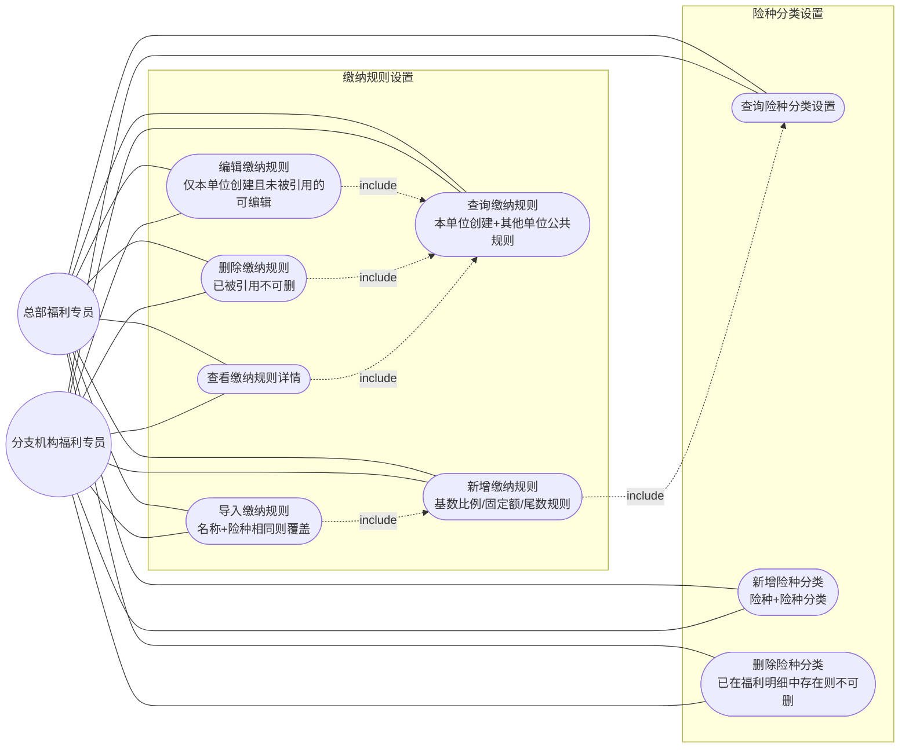
```mermaid
flowchart LR
    HQ((总部福利专员))
    BR((分支机构福利专员))

    subgraph P1["险种分类设置"]
        direction TB
        U11(["查询险种分类设置"])
        U12(["新增险种分类<br/>险种+险种分类"])
        U13(["删除险种分类<br/>已在福利明细中存在则不可删"])
    end
    subgraph P2["缴纳规则设置"]
        direction TB
        U21(["查询缴纳规则<br/>本单位创建+其他单位公共规则"])
        U22(["新增缴纳规则<br/>基数比例/固定额/尾数规则"])
        U23(["编辑缴纳规则<br/>仅本单位创建且未被引用的可编辑"])
        U24(["删除缴纳规则<br/>已被引用不可删"])
        U25(["查看缴纳规则详情"])
        U26(["导入缴纳规则<br/>名称+险种相同则覆盖"])
    end

    HQ --- U11
    HQ --- U12
    HQ --- U13
    HQ --- U21
    HQ --- U22
    HQ --- U23
    HQ --- U24
    HQ --- U25
    HQ --- U26
    BR --- U11
    BR --- U12
    BR --- U13
    BR --- U21
    BR --- U22
    BR --- U23
    BR --- U24
    BR --- U25
    BR --- U26

    U22 -.->|include| U11
    U23 -.->|include| U21
    U24 -.->|include| U21
    U25 -.->|include| U21
    U26 -.->|include| U22
```

### 2.2 社保公积金（二）：参保人员管理

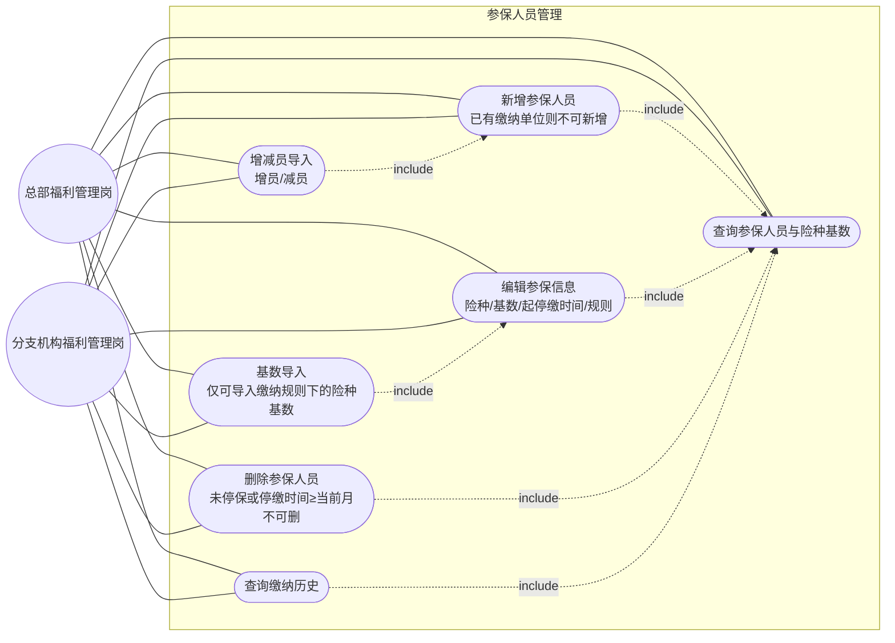
```mermaid
flowchart LR
    HQ((总部福利管理岗))
    BR((分支机构福利管理岗))

    subgraph P3["参保人员管理"]
        direction TB
        U31(["查询参保人员与险种基数"])
        U32(["新增参保人员<br/>已有缴纳单位则不可新增"])
        U33(["编辑参保信息<br/>险种/基数/起停缴时间/规则"])
        U34(["删除参保人员<br/>未停保或停缴时间≥当前月不可删"])
        U35(["增减员导入<br/>增员/减员"])
        U36(["基数导入<br/>仅可导入缴纳规则下的险种基数"])
        U37(["查询缴纳历史"])
    end

    HQ --- U31
    HQ --- U32
    HQ --- U33
    HQ --- U34
    HQ --- U35
    HQ --- U36
    HQ --- U37
    BR --- U31
    BR --- U32
    BR --- U33
    BR --- U34
    BR --- U35
    BR --- U36
    BR --- U37

    U32 -.->|include| U31
    U33 -.->|include| U31
    U34 -.->|include| U31
    U35 -.->|include| U32
    U36 -.->|include| U33
    U37 -.->|include| U31
```

### 2.3 社保公积金（三）：福利月报核算

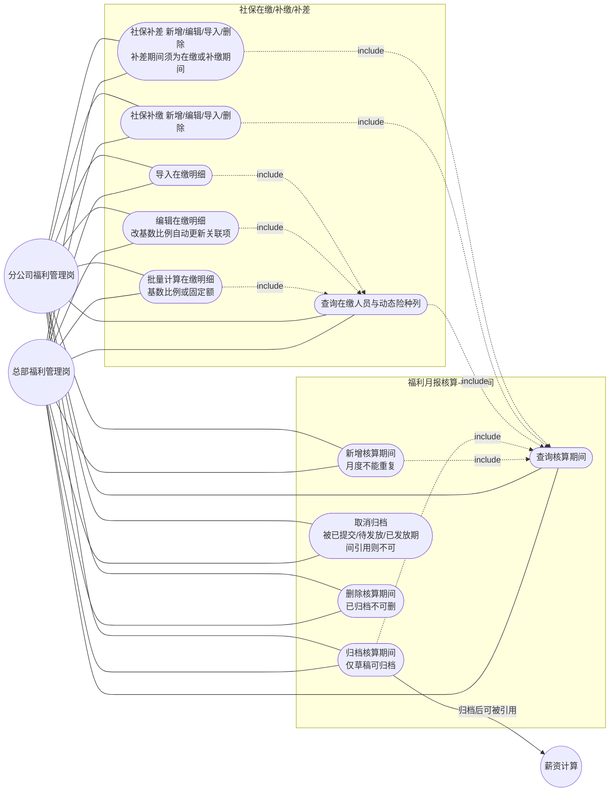
```mermaid
flowchart LR
    HQ((总部福利管理岗))
    BR((分公司福利管理岗))
    PAY((薪资计算))

    subgraph P4["福利月报核算-核算期间"]
        direction TB
        U41(["查询核算期间"])
        U42(["新增核算期间<br/>月度不能重复"])
        U43(["归档核算期间<br/>仅草稿可归档"])
        U44(["取消归档<br/>被已提交/待发放/已发放期间引用则不可"])
        U45(["删除核算期间<br/>已归档不可删"])
    end
    subgraph P5["社保在缴/补缴/补差"]
        direction TB
        U51(["查询在缴人员与动态险种列"])
        U52(["批量计算在缴明细<br/>基数比例或固定额"])
        U53(["编辑在缴明细<br/>改基数比例自动更新关联项"])
        U54(["导入在缴明细"])
        U55(["社保补缴 新增/编辑/导入/删除"])
        U56(["社保补差 新增/编辑/导入/删除<br/>补差期间须为在缴或补缴期间"])
    end

    HQ --- U41
    HQ --- U42
    HQ --- U43
    HQ --- U44
    HQ --- U45
    HQ --- U51
    HQ --- U52
    HQ --- U53
    HQ --- U54
    HQ --- U55
    HQ --- U56
    BR --- U41
    BR --- U42
    BR --- U43
    BR --- U44
    BR --- U45
    BR --- U51
    BR --- U52
    BR --- U53
    BR --- U54
    BR --- U55
    BR --- U56

    U42 -.->|include| U41
    U43 -.->|include| U41
    U51 -.->|include| U41
    U52 -.->|include| U51
    U53 -.->|include| U51
    U54 -.->|include| U51
    U55 -.->|include| U41
    U56 -.->|include| U41
    U43 -->|归档后可被引用| PAY
```

### 2.4 企业年金：年金计划与月报核算

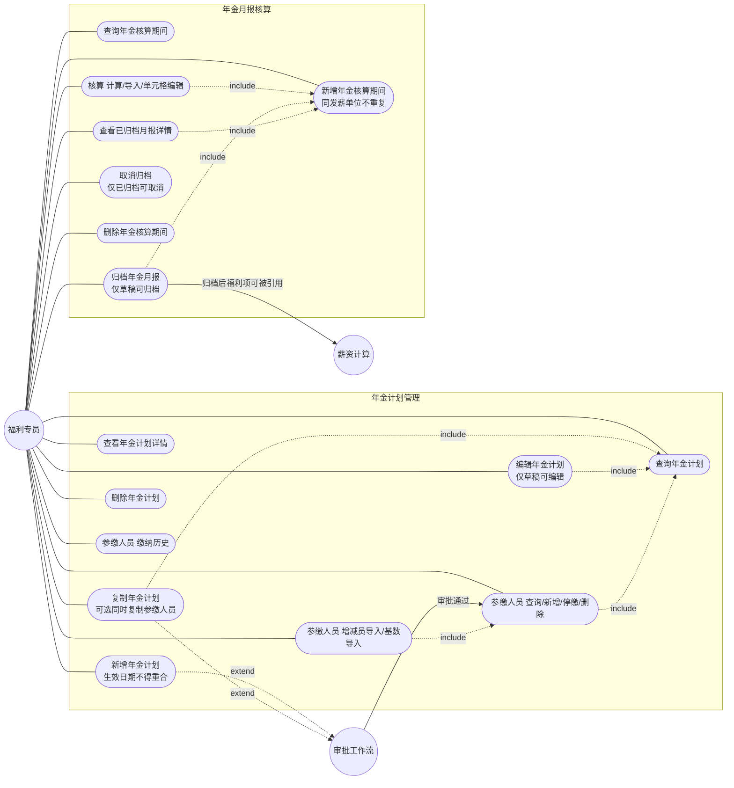
```mermaid
flowchart LR
    WS((福利专员))
    WF((审批工作流))
    PAY((薪资计算))

    subgraph P6["年金计划管理"]
        direction TB
        U61(["查询年金计划"])
        U62(["新增年金计划<br/>生效日期不得重合"])
        U63(["编辑年金计划<br/>仅草稿可编辑"])
        U64(["查看年金计划详情"])
        U65(["复制年金计划<br/>可选同时复制参缴人员"])
        U66(["删除年金计划"])
        U67(["参缴人员 查询/新增/停缴/删除"])
        U68(["参缴人员 增减员导入/基数导入"])
        U69(["参缴人员 缴纳历史"])
    end
    subgraph P7["年金月报核算"]
        direction TB
        U71(["查询年金核算期间"])
        U72(["新增年金核算期间<br/>同发薪单位不重复"])
        U73(["核算 计算/导入/单元格编辑"])
        U74(["查看已归档月报详情"])
        U75(["归档年金月报<br/>仅草稿可归档"])
        U76(["取消归档<br/>仅已归档可取消"])
        U77(["删除年金核算期间"])
    end

    WS --- U61
    WS --- U62
    WS --- U63
    WS --- U64
    WS --- U65
    WS --- U66
    WS --- U67
    WS --- U68
    WS --- U69
    WS --- U71
    WS --- U72
    WS --- U73
    WS --- U74
    WS --- U75
    WS --- U76
    WS --- U77

    U62 -.->|extend| WF
    U65 -.->|extend| WF
    WF -->|审批通过| U67
    U65 -.->|include| U61
    U63 -.->|include| U61
    U67 -.->|include| U61
    U68 -.->|include| U67
    U73 -.->|include| U72
    U75 -.->|include| U72
    U74 -.->|include| U72
    U75 -->|归档后福利项可被引用| PAY
```

---

## 3. 类图 Class Diagram（领域模型）

### 3.1 社保公积金配置域（险种分类 · 缴纳规则）

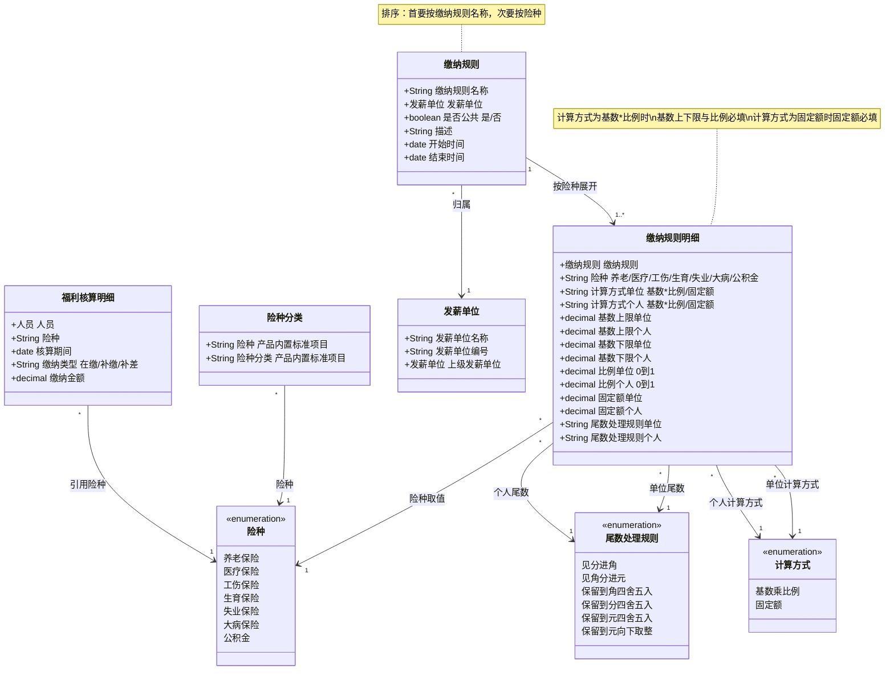
```mermaid
classDiagram
    class 险种分类 {
        +String 险种 产品内置标准项目
        +String 险种分类 产品内置标准项目
    }
    class 缴纳规则 {
        +String 缴纳规则名称
        +发薪单位 发薪单位
        +boolean 是否公共 是/否
        +String 描述
        +date 开始时间
        +date 结束时间
    }
    class 缴纳规则明细 {
        +缴纳规则 缴纳规则
        +String 险种 养老/医疗/工伤/生育/失业/大病/公积金
        +String 计算方式单位 基数*比例/固定额
        +String 计算方式个人 基数*比例/固定额
        +decimal 基数上限单位
        +decimal 基数上限个人
        +decimal 基数下限单位
        +decimal 基数下限个人
        +decimal 比例单位 0到1
        +decimal 比例个人 0到1
        +decimal 固定额单位
        +decimal 固定额个人
        +String 尾数处理规则单位
        +String 尾数处理规则个人
    }
    class 尾数处理规则 {
        <<enumeration>>
        见分进角
        见角分进元
        保留到角四舍五入
        保留到分四舍五入
        保留到元四舍五入
        保留到元向下取整
    }
    class 险种 {
        <<enumeration>>
        养老保险
        医疗保险
        工伤保险
        生育保险
        失业保险
        大病保险
        公积金
    }
    class 计算方式 {
        <<enumeration>>
        基数乘比例
        固定额
    }
    class 发薪单位 {
        +String 发薪单位名称
        +String 发薪单位编号
        +发薪单位 上级发薪单位
    }
    class 福利核算明细 {
        +人员 人员
        +String 险种
        +date 核算期间
        +String 缴纳类型 在缴/补缴/补差
        +decimal 缴纳金额
    }

    缴纳规则 "1" --> "1..*" 缴纳规则明细 : 按险种展开
    缴纳规则 "*" --> "1" 发薪单位 : 归属
    缴纳规则明细 "*" --> "1" 险种 : 险种取值
    缴纳规则明细 "*" --> "1" 尾数处理规则 : 单位尾数
    缴纳规则明细 "*" --> "1" 尾数处理规则 : 个人尾数
    缴纳规则明细 "*" --> "1" 计算方式 : 单位计算方式
    缴纳规则明细 "*" --> "1" 计算方式 : 个人计算方式
    险种分类 "*" --> "1" 险种 : 险种
    福利核算明细 "*" --> "1" 险种 : 引用险种
    note for 缴纳规则 "排序：首要按缴纳规则名称，次要按险种"
    note for 缴纳规则明细 "计算方式为基数*比例时\n基数上下限与比例必填\n计算方式为固定额时固定额必填"
```

### 3.2 参保人员与福利月报核算域

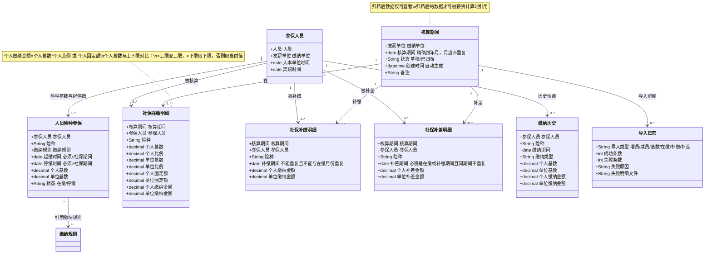
```mermaid
classDiagram
    class 参保人员 {
        +人员 人员
        +发薪单位 缴纳单位
        +date 入本单位时间
        +date 离职时间
    }
    class 人员险种参保 {
        +参保人员 参保人员
        +String 险种
        +缴纳规则 缴纳规则
        +date 起缴时间 必须≤社保期间
        +date 停缴时间 必须≥社保期间
        +decimal 个人基数
        +decimal 单位基数
        +String 状态 在缴/停缴
    }
    class 核算期间 {
        +发薪单位 缴纳单位
        +date 核算期间 精确到年月，月度不重复
        +String 状态 草稿/已归档
        +datetime 创建时间 自动生成
        +String 备注
    }
    class 社保在缴明细 {
        +核算期间 核算期间
        +参保人员 参保人员
        +String 险种
        +decimal 个人基数
        +decimal 个人比例
        +decimal 单位基数
        +decimal 单位比例
        +decimal 个人固定额
        +decimal 单位固定额
        +decimal 个人缴纳金额
        +decimal 单位缴纳金额
    }
    class 社保补缴明细 {
        +核算期间 核算期间
        +参保人员 参保人员
        +String 险种
        +date 补缴期间 不能重复且不能与在缴月份重复
        +decimal 个人缴纳金额
        +decimal 单位缴纳金额
    }
    class 社保补差明细 {
        +核算期间 核算期间
        +参保人员 参保人员
        +String 险种
        +date 补差期间 必须是在缴或补缴期间且同期间不重复
        +decimal 个人补差金额
        +decimal 单位补差金额
    }
    class 缴纳历史 {
        +参保人员 参保人员
        +String 险种
        +date 缴纳期间
        +String 缴纳类型
        +decimal 个人基数
        +decimal 单位基数
        +decimal 个人缴纳金额
        +decimal 单位缴纳金额
    }
    class 导入日志 {
        +String 导入类型 增员/减员/基数/在缴/补缴/补差
        +int 成功条数
        +int 失败条数
        +String 失败原因
        +String 失败明细文件
    }

    参保人员 "1" --> "1..*" 人员险种参保 : 险种基数与起停缴
    人员险种参保 "*" --> "1" 缴纳规则 : 引用缴纳规则
    核算期间 "1" --> "0..*" 社保在缴明细 : 在缴
    核算期间 "1" --> "0..*" 社保补缴明细 : 补缴
    核算期间 "1" --> "0..*" 社保补差明细 : 补差
    参保人员 "1" --> "0..*" 社保在缴明细 : 被核算
    参保人员 "1" --> "0..*" 社保补缴明细 : 被补缴
    参保人员 "1" --> "0..*" 社保补差明细 : 被补差
    参保人员 "1" --> "0..*" 缴纳历史 : 历史留痕
    核算期间 "1" --> "0..*" 导入日志 : 导入留痕
    note for 社保在缴明细 "个人缴纳金额=个人基数*个人比例 或 个人固定额\n个人基数与上下限对比：\n>上限取上限，<下限取下限，否则取当前值"
    note for 核算期间 "归档后数据仅可查看\n归档后的数据才可被薪资计算时引用"
```

### 3.3 企业年金域（年金计划 · 参缴人员 · 月报核算）

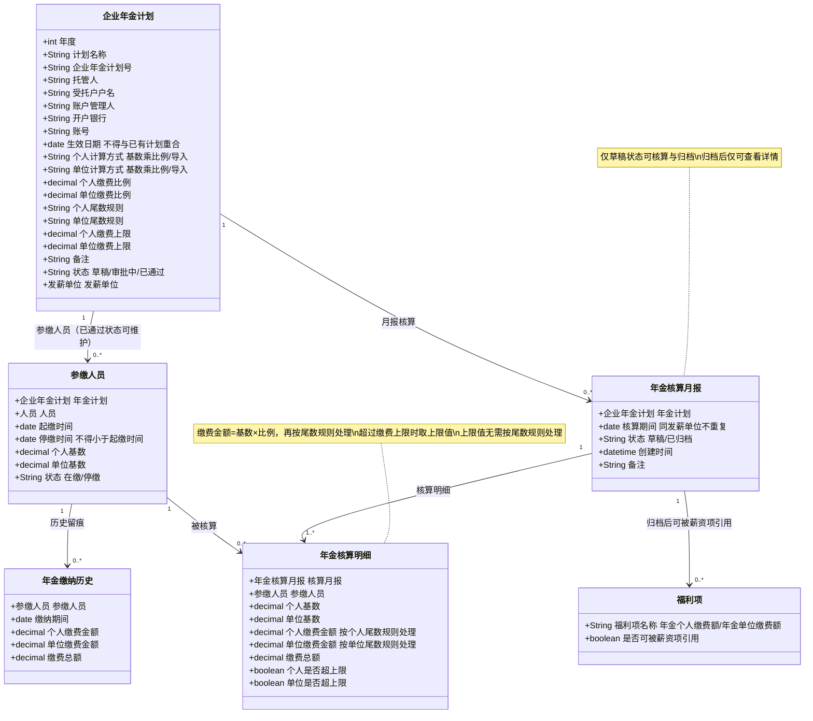
```mermaid
classDiagram
    class 企业年金计划 {
        +int 年度
        +String 计划名称
        +String 企业年金计划号
        +String 托管人
        +String 受托户户名
        +String 账户管理人
        +String 开户银行
        +String 账号
        +date 生效日期 不得与已有计划重合
        +String 个人计算方式 基数乘比例/导入
        +String 单位计算方式 基数乘比例/导入
        +decimal 个人缴费比例
        +decimal 单位缴费比例
        +String 个人尾数规则
        +String 单位尾数规则
        +decimal 个人缴费上限
        +decimal 单位缴费上限
        +String 备注
        +String 状态 草稿/审批中/已通过
        +发薪单位 发薪单位
    }
    class 参缴人员 {
        +企业年金计划 年金计划
        +人员 人员
        +date 起缴时间
        +date 停缴时间 不得小于起缴时间
        +decimal 个人基数
        +decimal 单位基数
        +String 状态 在缴/停缴
    }
    class 年金核算月报 {
        +企业年金计划 年金计划
        +date 核算期间 同发薪单位不重复
        +String 状态 草稿/已归档
        +datetime 创建时间
        +String 备注
    }
    class 年金核算明细 {
        +年金核算月报 核算月报
        +参缴人员 参缴人员
        +decimal 个人基数
        +decimal 单位基数
        +decimal 个人缴费金额 按个人尾数规则处理
        +decimal 单位缴费金额 按单位尾数规则处理
        +decimal 缴费总额
        +boolean 个人是否超上限
        +boolean 单位是否超上限
    }
    class 年金缴纳历史 {
        +参缴人员 参缴人员
        +date 缴纳期间
        +decimal 个人缴费金额
        +decimal 单位缴费金额
        +decimal 缴费总额
    }
    class 福利项 {
        +String 福利项名称 年金个人缴费额/年金单位缴费额
        +boolean 是否可被薪资项引用
    }

    企业年金计划 "1" --> "0..*" 参缴人员 : 参缴人员（已通过状态可维护）
    企业年金计划 "1" --> "0..*" 年金核算月报 : 月报核算
    年金核算月报 "1" --> "1..*" 年金核算明细 : 核算明细
    参缴人员 "1" --> "0..*" 年金核算明细 : 被核算
    参缴人员 "1" --> "0..*" 年金缴纳历史 : 历史留痕
    年金核算月报 "1" --> "0..*" 福利项 : 归档后可被薪资项引用
    note for 年金核算明细 "缴费金额=基数×比例，再按尾数规则处理\n超过缴费上限时取上限值\n上限值无需按尾数规则处理"
    note for 年金核算月报 "仅草稿状态可核算与归档\n归档后仅可查看详情"
```

---

## 4. 对象图 Object Diagram（运行时刻实例快照）

场景：**2024 年 8 月**，「北京分公司」缴纳单位下，张三的社保公积金核算期间处于「草稿」、年金计划「2024 版年金计划」已通过的某时刻快照。

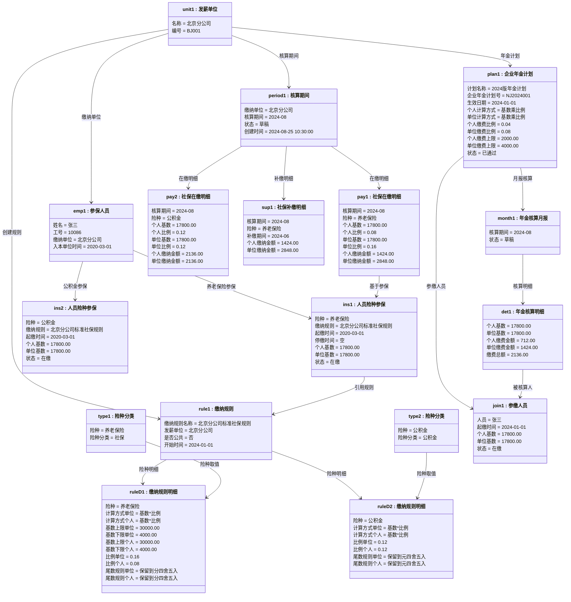
```mermaid
classDiagram
    class unit1["unit1 : 发薪单位"] {
        名称 = 北京分公司
        编号 = BJ001
    }
    class type1["type1 : 险种分类"] {
        险种 = 养老保险
        险种分类 = 社保
    }
    class type2["type2 : 险种分类"] {
        险种 = 公积金
        险种分类 = 公积金
    }
    class rule1["rule1 : 缴纳规则"] {
        缴纳规则名称 = 北京分公司标准社保规则
        发薪单位 = 北京分公司
        是否公共 = 否
        开始时间 = 2024-01-01
    }
    class ruleD1["ruleD1 : 缴纳规则明细"] {
        险种 = 养老保险
        计算方式单位 = 基数*比例
        计算方式个人 = 基数*比例
        基数上限单位 = 30000.00
        基数下限单位 = 4000.00
        基数上限个人 = 30000.00
        基数下限个人 = 4000.00
        比例单位 = 0.16
        比例个人 = 0.08
        尾数规则单位 = 保留到分四舍五入
        尾数规则个人 = 保留到分四舍五入
    }
    class ruleD2["ruleD2 : 缴纳规则明细"] {
        险种 = 公积金
        计算方式单位 = 基数*比例
        计算方式个人 = 基数*比例
        比例单位 = 0.12
        比例个人 = 0.12
        尾数规则单位 = 保留到元四舍五入
        尾数规则个人 = 保留到元四舍五入
    }
    class emp1["emp1 : 参保人员"] {
        姓名 = 张三
        工号 = 10086
        缴纳单位 = 北京分公司
        入本单位时间 = 2020-03-01
    }
    class ins1["ins1 : 人员险种参保"] {
        险种 = 养老保险
        缴纳规则 = 北京分公司标准社保规则
        起缴时间 = 2020-03-01
        停缴时间 = 空
        个人基数 = 17800.00
        单位基数 = 17800.00
        状态 = 在缴
    }
    class ins2["ins2 : 人员险种参保"] {
        险种 = 公积金
        缴纳规则 = 北京分公司标准社保规则
        起缴时间 = 2020-03-01
        个人基数 = 17800.00
        单位基数 = 17800.00
        状态 = 在缴
    }
    class period1["period1 : 核算期间"] {
        缴纳单位 = 北京分公司
        核算期间 = 2024-08
        状态 = 草稿
        创建时间 = 2024-08-25 10:30:00
    }
    class pay1["pay1 : 社保在缴明细"] {
        核算期间 = 2024-08
        险种 = 养老保险
        个人基数 = 17800.00
        个人比例 = 0.08
        单位基数 = 17800.00
        单位比例 = 0.16
        个人缴纳金额 = 1424.00
        单位缴纳金额 = 2848.00
    }
    class pay2["pay2 : 社保在缴明细"] {
        核算期间 = 2024-08
        险种 = 公积金
        个人基数 = 17800.00
        个人比例 = 0.12
        单位基数 = 17800.00
        单位比例 = 0.12
        个人缴纳金额 = 2136.00
        单位缴纳金额 = 2136.00
    }
    class sup1["sup1 : 社保补缴明细"] {
        核算期间 = 2024-08
        险种 = 养老保险
        补缴期间 = 2024-06
        个人缴纳金额 = 1424.00
        单位缴纳金额 = 2848.00
    }
    class plan1["plan1 : 企业年金计划"] {
        计划名称 = 2024版年金计划
        企业年金计划号 = NJ2024001
        生效日期 = 2024-01-01
        个人计算方式 = 基数乘比例
        单位计算方式 = 基数乘比例
        个人缴费比例 = 0.04
        单位缴费比例 = 0.08
        个人缴费上限 = 2000.00
        单位缴费上限 = 4000.00
        状态 = 已通过
    }
    class join1["join1 : 参缴人员"] {
        人员 = 张三
        起缴时间 = 2024-01-01
        个人基数 = 17800.00
        单位基数 = 17800.00
        状态 = 在缴
    }
    class month1["month1 : 年金核算月报"] {
        核算期间 = 2024-08
        状态 = 草稿
    }
    class det1["det1 : 年金核算明细"] {
        个人基数 = 17800.00
        单位基数 = 17800.00
        个人缴费金额 = 712.00
        单位缴费金额 = 1424.00
        缴费总额 = 2136.00
    }

    unit1 --> rule1 : 创建规则
    rule1 --> ruleD1 : 险种明细
    rule1 --> ruleD2 : 险种明细
    type1 --> ruleD1 : 险种取值
    type2 --> ruleD2 : 险种取值
    unit1 --> emp1 : 缴纳单位
    emp1 --> ins1 : 养老保险参保
    emp1 --> ins2 : 公积金参保
    ins1 --> rule1 : 引用规则
    unit1 --> period1 : 核算期间
    period1 --> pay1 : 在缴明细
    period1 --> pay2 : 在缴明细
    period1 --> sup1 : 补缴明细
    pay1 --> ins1 : 基于参保
    unit1 --> plan1 : 年金计划
    plan1 --> join1 : 参缴人员
    plan1 --> month1 : 月报核算
    month1 --> det1 : 核算明细
    det1 --> join1 : 被核算人
```

---

## 5. 包图 Package Diagram（模块划分与依赖）

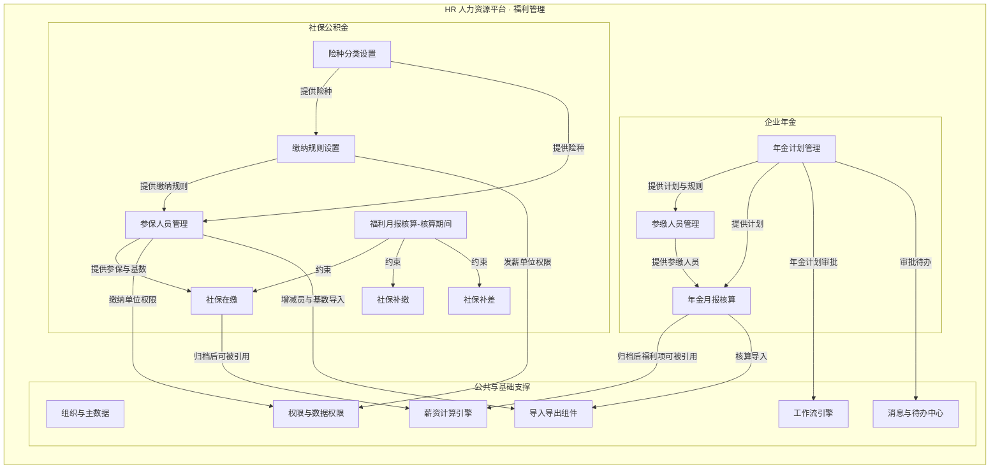
```mermaid
flowchart TB
    subgraph VHR["HR 人力资源平台 · 福利管理"]
        direction TB
        subgraph PKG_SI["社保公积金"]
            direction LR
            P11[险种分类设置]
            P12[缴纳规则设置]
            P13[参保人员管理]
            P14[福利月报核算-核算期间]
            P15[社保在缴]
            P16[社保补缴]
            P17[社保补差]
        end
        subgraph PKG_AN["企业年金"]
            direction LR
            P21[年金计划管理]
            P22[参缴人员管理]
            P23[年金月报核算]
        end
        subgraph PKG_COMMON["公共与基础支撑"]
            direction LR
            P31[组织与主数据]
            P32[权限与数据权限]
            P33[工作流引擎]
            P34[导入导出组件]
            P35[薪资计算引擎]
            P36[消息与待办中心]
        end
    end

    P11 -->|提供险种| P12
    P11 -->|提供险种| P13
    P12 -->|提供缴纳规则| P13
    P13 -->|提供参保与基数| P15
    P14 -->|约束| P15
    P14 -->|约束| P16
    P14 -->|约束| P17
    P15 -->|归档后可被引用| P35
    P21 -->|提供计划与规则| P22
    P21 -->|提供计划| P23
    P22 -->|提供参缴人员| P23
    P23 -->|归档后福利项可被引用| P35
    P12 -->|发薪单位权限| P32
    P13 -->|缴纳单位权限| P32
    P21 -->|年金计划审批| P33
    P13 -->|增减员与基数导入| P34
    P23 -->|核算导入| P34
    P21 -->|审批待办| P36
```

---

## 6. 组件图 Component Diagram（逻辑组件与接口）

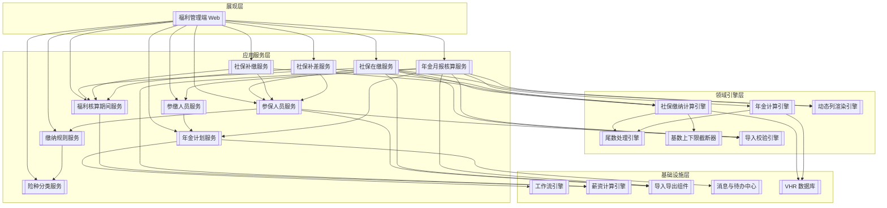
```mermaid
flowchart TB
    subgraph CLIENT["展现层"]
        C1[[福利管理端 Web]]
    end

    subgraph SERVICE["应用服务层"]
        S1[[险种分类服务]]
        S2[[缴纳规则服务]]
        S3[[参保人员服务]]
        S4[[福利核算期间服务]]
        S5[[社保在缴服务]]
        S6[[社保补缴服务]]
        S7[[社保补差服务]]
        S8[[年金计划服务]]
        S9[[参缴人员服务]]
        S10[[年金月报核算服务]]
    end

    subgraph ENGINE["领域引擎层"]
        E1[[社保缴纳计算引擎]]
        E2[[尾数处理引擎]]
        E3[[基数上下限截断器]]
        E4[[年金计算引擎]]
        E5[[动态列渲染引擎]]
        E6[[导入校验引擎]]
    end

    subgraph INFRA["基础设施层"]
        I1[[工作流引擎]]
        I2[[薪资计算引擎]]
        I3[[导入导出组件]]
        I4[[消息与待办中心]]
        I5[[VHR 数据库]]
    end

    C1 --> S1
    C1 --> S2
    C1 --> S3
    C1 --> S4
    C1 --> S5
    C1 --> S6
    C1 --> S7
    C1 --> S8
    C1 --> S9
    C1 --> S10

    S2 --> S1
    S3 --> S2
    S5 --> S3
    S6 --> S3
    S7 --> S3
    S5 --> S4
    S6 --> S4
    S7 --> S4
    S9 --> S8
    S10 --> S8
    S10 --> S9

    S5 --> E1
    S6 --> E1
    S7 --> E1
    E1 --> E2
    E1 --> E3
    S10 --> E4
    E4 --> E2
    S5 --> E5
    S10 --> E5
    S3 --> E6
    S5 --> E6
    S10 --> E6

    S8 --> I1
    S4 --> I2
    S10 --> I2
    S3 --> I3
    S5 --> I3
    S10 --> I3
    S8 --> I4
    E1 --> I5
    E4 --> I5
```

---

## 7. 部署图 Deployment Diagram（物理节点与工件）

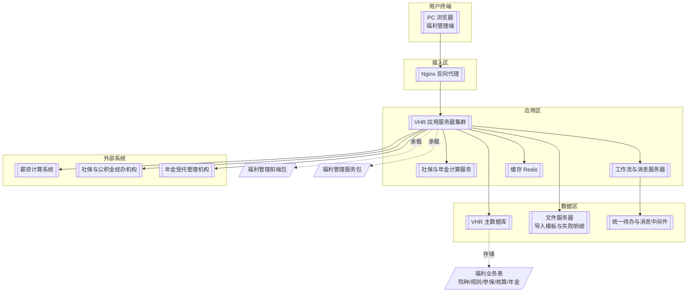
```mermaid
flowchart TB
    subgraph ZONE_USER["用户终端"]
        N1[["PC 浏览器<br/>福利管理端"]]
    end
    subgraph ZONE_DMZ["接入区"]
        N2[["Nginx 反向代理"]]
    end
    subgraph ZONE_APP["应用区"]
        N3[["VHR 应用服务器集群"]]
        N4[["社保与年金计算服务"]]
        N5[["工作流与消息服务器"]]
        N6[["缓存 Redis"]]
    end
    subgraph ZONE_DATA["数据区"]
        N7[["VHR 主数据库"]]
        N8[["文件服务器<br/>导入模板与失败明细"]]
        N9[["统一待办与消息中间件"]]
    end
    subgraph ZONE_EXT["外部系统"]
        N10[["薪资计算系统"]]
        N11[["社保与公积金经办机构"]]
        N12[["年金受托管理机构"]]
    end

    ART1[/"福利管理前端包"/]
    ART2[/"福利管理服务包"/]
    ART3[/"福利业务表<br/>险种/规则/参保/核算/年金"/]

    N1 --> N2
    N2 --> N3
    N3 --> N4
    N3 --> N5
    N3 --> N6
    N3 --> N7
    N3 --> N8
    N5 --> N9
    N3 -.承载.-> ART1
    N3 -.承载.-> ART2
    N7 -.存储.-> ART3
    N3 --> N10
    N3 --> N11
    N3 --> N12
```

---

## 8. 组合结构图 Composite Structure Diagram（缴纳规则内部结构）

以「缴纳规则」为例，展示其内部部件、端口与连接器。

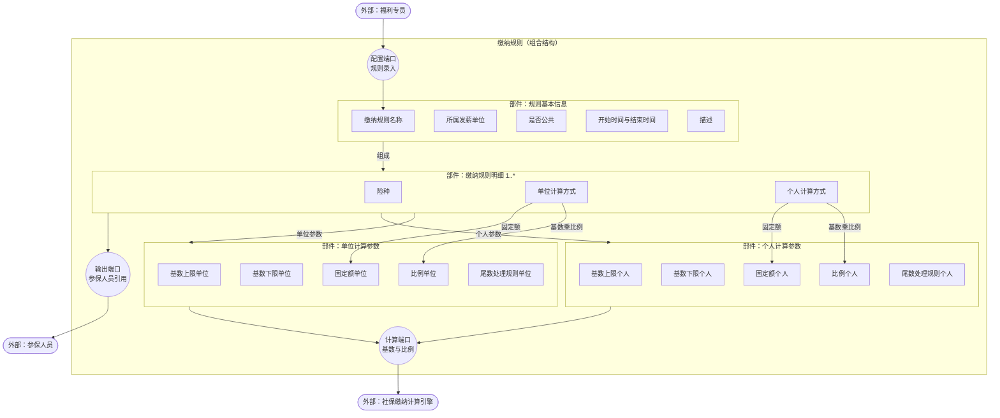
```mermaid
flowchart TB
    subgraph CTX["缴纳规则（组合结构）"]
        direction TB
        PORT_IN((配置端口<br/>规则录入))
        PORT_CALC((计算端口<br/>基数与比例))
        PORT_OUT((输出端口<br/>参保人员引用))

        subgraph PART_BASE["部件：规则基本信息"]
            B1[缴纳规则名称]
            B2[所属发薪单位]
            B3[是否公共]
            B4[开始时间与结束时间]
            B5[描述]
        end
        subgraph PART_ITEM["部件：缴纳规则明细 1..*"]
            I1[险种]
            I2[单位计算方式]
            I3[个人计算方式]
        end
        subgraph PART_UNIT["部件：单位计算参数"]
            U1[基数上限单位]
            U2[基数下限单位]
            U3[比例单位]
            U4[固定额单位]
            U5[尾数处理规则单位]
        end
        subgraph PART_PERS["部件：个人计算参数"]
            P1[基数上限个人]
            P2[基数下限个人]
            P3[比例个人]
            P4[固定额个人]
            P5[尾数处理规则个人]
        end
    end

    ADMIN([外部：福利专员])
    INSURED([外部：参保人员])
    ENGINE([外部：社保缴纳计算引擎])

    ADMIN --> PORT_IN
    PORT_IN --> B1
    PART_BASE -->|组成| PART_ITEM
    PART_ITEM -->|单位参数| PART_UNIT
    PART_ITEM -->|个人参数| PART_PERS
    I2 -->|基数乘比例| U3
    I2 -->|固定额| U4
    I3 -->|基数乘比例| P3
    I3 -->|固定额| P4
    PART_UNIT --> PORT_CALC
    PART_PERS --> PORT_CALC
    PORT_CALC --> ENGINE
    PART_ITEM --> PORT_OUT
    PORT_OUT --> INSURED
```

---

## 9. 剖面图 Profile Diagram（构造型与扩展）

定义本模块的建模构造型（stereotype），约束领域对象的建模语义。

```mermaid
classDiagram
    class Class <<metaclass>>
    class Enumeration <<metaclass>>
    class Component <<metaclass>>
    class 聚合根 <<stereotype>> {
        +boolean 独立生命周期
        +boolean 全局唯一编号
    }
    class 单据实体 <<stereotype>> {
        +boolean 审批流驱动
        +boolean 状态机
        +boolean 草稿可编辑
    }
    class 配置实体 <<stereotype>> {
        +boolean 单位隔离
        +boolean 被引用即锁定
    }
    class 核算实体 <<stereotype>> {
        +boolean 期间隔离
        +boolean 归档锁定
    }
    class 值对象 <<stereotype>> {
        +boolean 无标识
        +boolean 依附聚合根
    }
    class 枚举构造型 <<stereotype>> {
        +String 代码选项
    }
    class 领域服务 <<stereotype>> {
        +boolean 无状态
    }

    聚合根 --|> Class : extend
    单据实体 --|> Class : extend
    配置实体 --|> Class : extend
    核算实体 --|> Class : extend
    值对象 --|> Class : extend
    枚举构造型 --|> Enumeration : extend
    领域服务 --|> Component : extend

    class 缴纳规则
    class 核算期间
    class 企业年金计划
    class 年金核算月报
    class 参保人员
    class 险种分类
    class 发薪单位
    class 福利核算明细
    class 社保在缴明细
    class 社保补缴明细
    class 社保补差明细
    class 参缴人员
    class 年金核算明细
    class 缴纳历史
    class 人员险种参保
    class 缴纳规则明细
    class 险种
    class 尾数处理规则
    class 计算方式
    class 社保缴纳计算引擎
    class 尾数处理引擎
    class 年金计算引擎
    class 导入校验引擎

    缴纳规则 ..> 聚合根 : apply
    核算期间 ..> 核算实体 : apply
    企业年金计划 ..> 单据实体 : apply
    年金核算月报 ..> 核算实体 : apply
    参保人员 ..> 聚合根 : apply
    险种分类 ..> 配置实体 : apply
    发薪单位 ..> 配置实体 : apply
    福利核算明细 ..> 值对象 : apply
    社保在缴明细 ..> 值对象 : apply
    社保补缴明细 ..> 值对象 : apply
    社保补差明细 ..> 值对象 : apply
    参缴人员 ..> 值对象 : apply
    年金核算明细 ..> 值对象 : apply
    缴纳历史 ..> 值对象 : apply
    人员险种参保 ..> 值对象 : apply
    缴纳规则明细 ..> 值对象 : apply
    险种 ..> 枚举构造型 : apply
    尾数处理规则 ..> 枚举构造型 : apply
    计算方式 ..> 枚举构造型 : apply
    社保缴纳计算引擎 ..> 领域服务 : apply
    尾数处理引擎 ..> 领域服务 : apply
    年金计算引擎 ..> 领域服务 : apply
    导入校验引擎 ..> 领域服务 : apply
```

---

## 10. 活动图 Activity Diagram

### 10.1 社保公积金端到端主流程（带泳道）

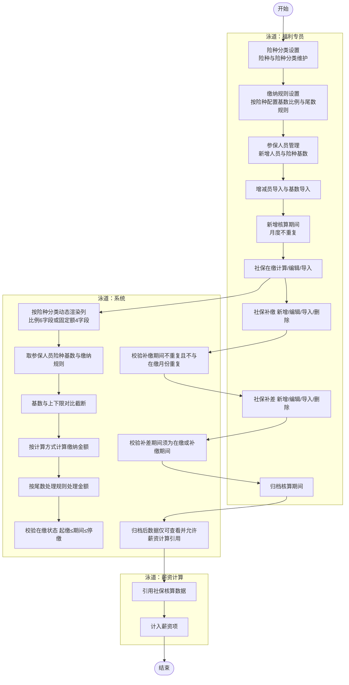
```mermaid
flowchart TB
    START([开始])

    subgraph LANE_WS["泳道：福利专员"]
        A1[险种分类设置<br/>险种与险种分类维护]
        A2[缴纳规则设置<br/>按险种配置基数比例与尾数规则]
        A3[参保人员管理<br/>新增人员与险种基数]
        A4[增减员导入与基数导入]
        A5[新增核算期间<br/>月度不重复]
        A6[社保在缴计算/编辑/导入]
        A7[社保补缴 新增/编辑/导入/删除]
        A8[社保补差 新增/编辑/导入/删除]
        A9[归档核算期间]
    end

    subgraph LANE_SYS["泳道：系统"]
        S1[按险种分类动态渲染列<br/>比例6字段或固定额4字段]
        S2[取参保人员险种基数与缴纳规则]
        S3[基数与上下限对比截断]
        S4[按计算方式计算缴纳金额]
        S5[按尾数处理规则处理金额]
        S6[校验在缴状态 起缴≤期间≤停缴]
        S7[校验补缴期间不重复且不与在缴月份重复]
        S8[校验补差期间须为在缴或补缴期间]
        S9[归档后数据仅可查看并允许薪资计算引用]
    end

    subgraph LANE_PAY["泳道：薪资计算"]
        B1[引用社保核算数据]
        B2[计入薪资项]
    end

    END([结束])

    START --> A1 --> A2 --> A3 --> A4 --> A5 --> A6
    A6 --> S1 --> S2 --> S3 --> S4 --> S5 --> S6
    A6 --> A7 --> S7 --> A8 --> S8 --> A9
    A9 --> S9 --> B1 --> B2 --> END
```

### 10.2 社保在缴计算活动（含基数截断与尾数处理）

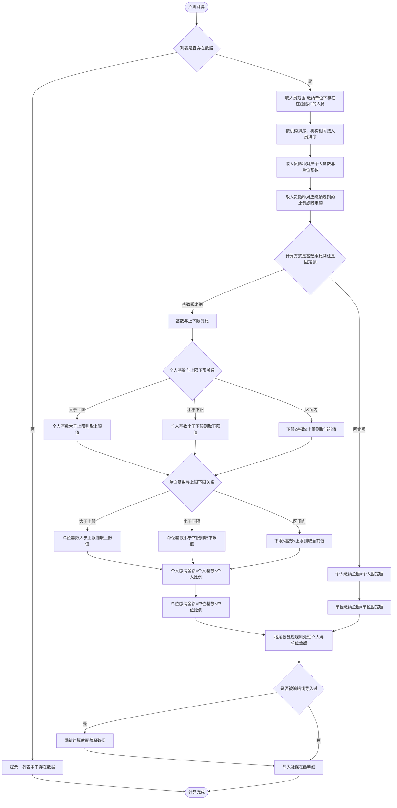
```mermaid
flowchart TB
    C0([点击计算])
    C1{列表是否存在数据}
    C2[提示：列表中不存在数据]
    C3[取人员范围 缴纳单位下存在在缴险种的人员]
    C4[按机构排序，机构相同按人员排序]
    C5[取人员险种对应个人基数与单位基数]
    C6[取人员险种对应缴纳规则的比例或固定额]
    C7{计算方式是基数乘比例还是固定额}
    C8[基数与上下限对比]
    C9{个人基数与上限下限关系}
    C10[个人基数大于上限则取上限值]
    C11[个人基数小于下限则取下限值]
    C12[下限≤基数≤上限则取当前值]
    C13{单位基数与上限下限关系}
    C14[单位基数大于上限则取上限值]
    C15[单位基数小于下限则取下限值]
    C16[下限≤基数≤上限则取当前值]
    C17[个人缴纳金额=个人基数×个人比例]
    C18[单位缴纳金额=单位基数×单位比例]
    C19[个人缴纳金额=个人固定额]
    C20[单位缴纳金额=单位固定额]
    C21[按尾数处理规则处理个人与单位金额]
    C22{是否被编辑或导入过}
    C23[重新计算后覆盖原数据]
    C24[写入社保在缴明细]
    C25([计算完成])

    C0 --> C1
    C1 -->|否| C2 --> C25
    C1 -->|是| C3 --> C4 --> C5 --> C6 --> C7
    C7 -->|基数乘比例| C8 --> C9
    C9 -->|大于上限| C10 --> C13
    C9 -->|小于下限| C11 --> C13
    C9 -->|区间内| C12 --> C13
    C13 -->|大于上限| C14 --> C17
    C13 -->|小于下限| C15 --> C17
    C13 -->|区间内| C16 --> C17
    C17 --> C18 --> C21
    C7 -->|固定额| C19 --> C20 --> C21
    C21 --> C22
    C22 -->|是| C23 --> C24
    C22 -->|否| C24 --> C25
```

### 10.3 企业年金计划与月报核算活动

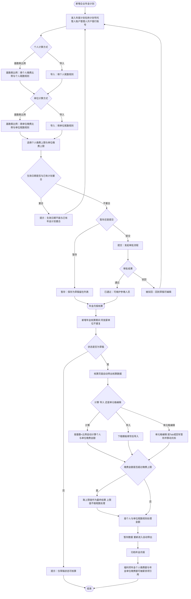
```mermaid
flowchart TB
    D0([新增企业年金计划])
    D1[录入年度计划名称计划号托管人账户管理人开户银行账号]
    D2{个人计算方式}
    D3[基数乘比例：填个人缴费比例与个人尾数规则]
    D4[导入：填个人尾数规则]
    D5{单位计算方式}
    D6[基数乘比例：填单位缴费比例与单位尾数规则]
    D7[导入：填单位尾数规则]
    D8[选填个人缴费上限与单位缴费上限]
    D9{生效日期是否与已有计划重合}
    D10[提示：生效日期不能与已有年金计划重合]
    D11{暂存还是提交}
    D12[暂存：保存为草稿留在列表]
    D13[提交：发起审批流程]
    D14{审批结果}
    D15[已通过：可维护参缴人员]
    D16[被驳回：回到草稿可编辑]
    E0([年金月报核算])
    E1[新增年金核算期间 同发薪单位不重复]
    E2{状态是否为草稿}
    E3[提示：仅草稿状态可核算]
    E4[核算页面自动带出核算数据]
    E5{计算 导入 还是单元格编辑}
    E6[按基数×比例自动计算个人与单位缴费金额]
    E7[下载模板填写后导入]
    E8[单元格编辑 按Tab或回车暂存并移动光标]
    E9{缴费金额是否超过缴费上限}
    E10[取上限值作为最终结果 上限值不做尾数处理]
    E11[按个人与单位尾数规则处理金额]
    E12[暂存数据 重新进入自动带出]
    E13[归档年金月报]
    E14[福利项年金个人缴费额与年金单位缴费额可被薪资项引用]
    E15([结束])

    D0 --> D1 --> D2
    D2 -->|基数乘比例| D3 --> D5
    D2 -->|导入| D4 --> D5
    D5 -->|基数乘比例| D6 --> D8
    D5 -->|导入| D7 --> D8
    D8 --> D9
    D9 -->|重合| D10 --> D1
    D9 -->|不重合| D11
    D11 -->|暂存| D12 --> E0
    D11 -->|提交| D13 --> D14
    D14 -->|通过| D15 --> E0
    D14 -->|驳回| D16 --> D1
    E0 --> E1 --> E2
    E2 -->|否| E3 --> E15
    E2 -->|是| E4 --> E5
    E5 -->|计算| E6 --> E9
    E5 -->|导入| E7 --> E9
    E5 -->|单元格编辑| E8 --> E9
    E9 -->|是| E10 --> E11
    E9 -->|否| E11
    E11 --> E12 --> E13 --> E14 --> E15
```

---

## 11. 状态机图 State Machine Diagram

### 11.1 核算期间（社保公积金）

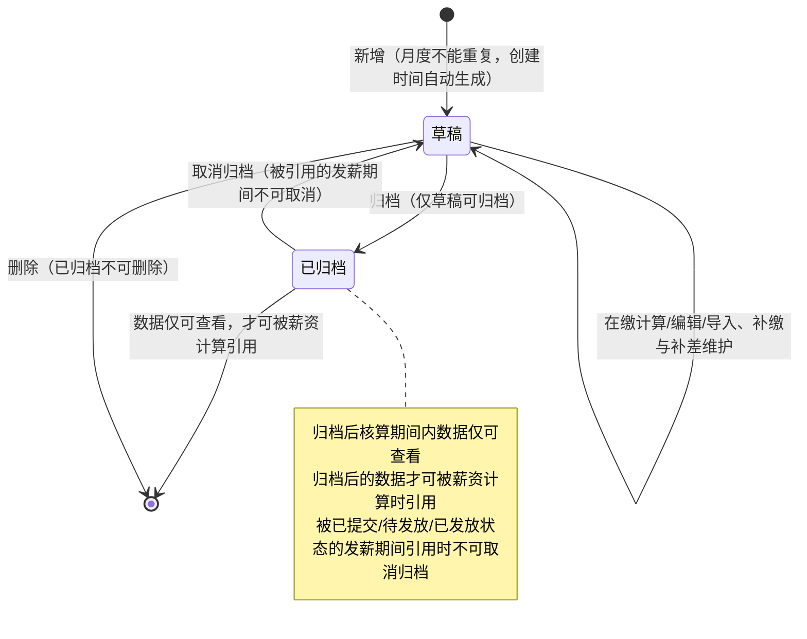
```mermaid
stateDiagram-v2
    [*] --> 草稿 : 新增（月度不能重复，创建时间自动生成）
    草稿 --> 草稿 : 在缴计算/编辑/导入、补缴与补差维护
    草稿 --> 已归档 : 归档（仅草稿可归档）
    已归档 --> 草稿 : 取消归档（被引用的发薪期间不可取消）
    已归档 --> [*] : 数据仅可查看，才可被薪资计算引用
    草稿 --> [*] : 删除（已归档不可删除）
    note right of 已归档
        归档后核算期间内数据仅可查看
        归档后的数据才可被薪资计算时引用
        被已提交/待发放/已发放状态的发薪期间引用时不可取消归档
    end note
```

### 11.2 企业年金计划

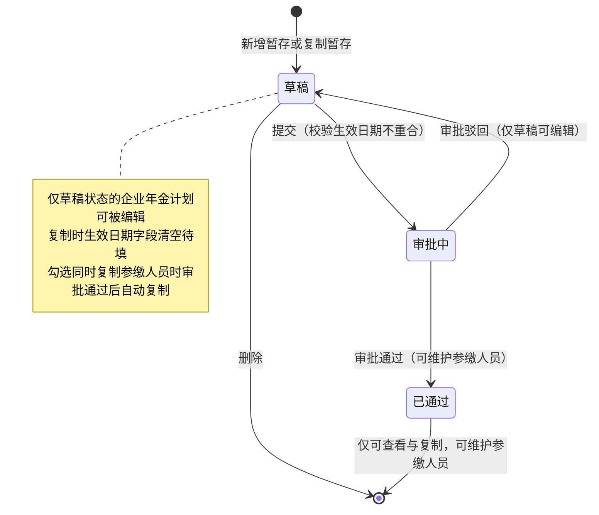
```mermaid
stateDiagram-v2
    [*] --> 草稿 : 新增暂存或复制暂存
    草稿 --> 审批中 : 提交（校验生效日期不重合）
    审批中 --> 已通过 : 审批通过（可维护参缴人员）
    审批中 --> 草稿 : 审批驳回（仅草稿可编辑）
    草稿 --> [*] : 删除
    已通过 --> [*] : 仅可查看与复制，可维护参缴人员
    note right of 草稿
        仅草稿状态的企业年金计划可被编辑
        复制时生效日期字段清空待填
        勾选同时复制参缴人员时审批通过后自动复制
    end note
```

### 11.3 年金核算月报

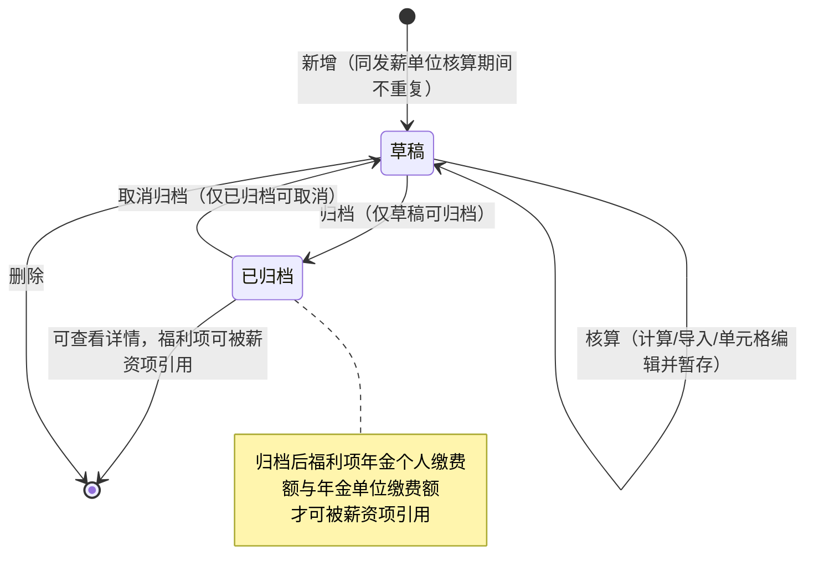
```mermaid
stateDiagram-v2
    [*] --> 草稿 : 新增（同发薪单位核算期间不重复）
    草稿 --> 草稿 : 核算（计算/导入/单元格编辑并暂存）
    草稿 --> 已归档 : 归档（仅草稿可归档）
    已归档 --> 草稿 : 取消归档（仅已归档可取消）
    已归档 --> [*] : 可查看详情，福利项可被薪资项引用
    草稿 --> [*] : 删除
    note right of 已归档
        归档后福利项年金个人缴费额与年金单位缴费额
        才可被薪资项引用
    end note
```

### 11.4 参保人员险种状态

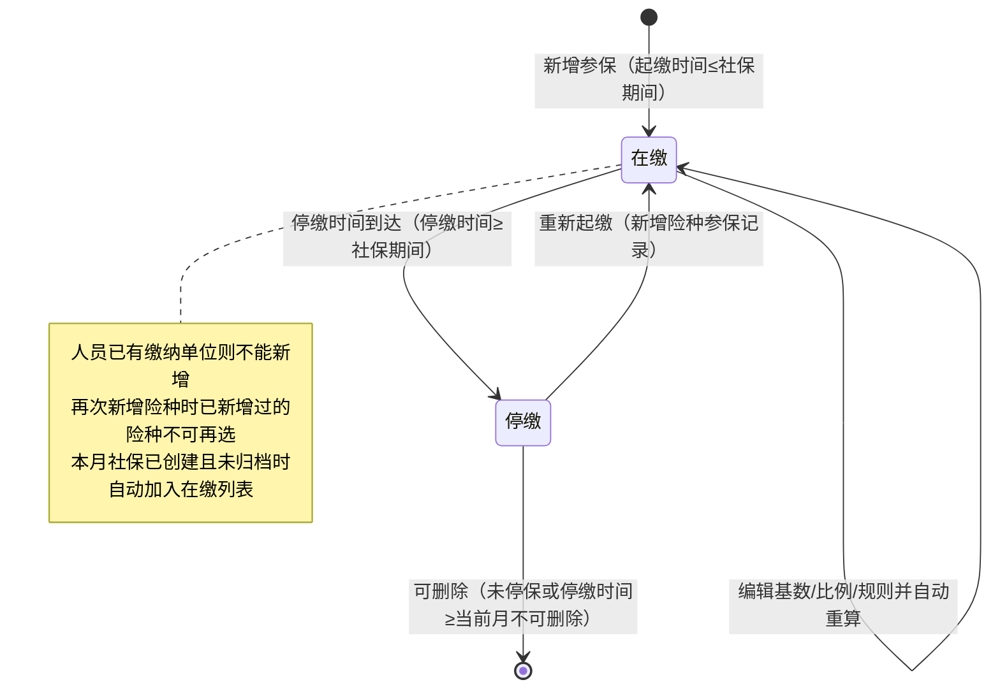
```mermaid
stateDiagram-v2
    [*] --> 在缴 : 新增参保（起缴时间≤社保期间）
    在缴 --> 停缴 : 停缴时间到达（停缴时间≥社保期间）
    在缴 --> 在缴 : 编辑基数/比例/规则并自动重算
    停缴 --> 在缴 : 重新起缴（新增险种参保记录）
    停缴 --> [*] : 可删除（未停保或停缴时间≥当前月不可删除）
    note right of 在缴
        人员已有缴纳单位则不能新增
        再次新增险种时已新增过的险种不可再选
        本月社保已创建且未归档时自动加入在缴列表
    end note
```

### 11.5 缴纳规则（引用锁定）

```mermaid
stateDiagram-v2
    [*] --> 未引用 : 发薪单位自主创建
    未引用 --> 已引用 : 被参保人员引用
    已引用 --> 已引用 : 不可编辑也不可删除
    未引用 --> [*] : 可编辑可删除（仅本单位自主创建的规则）
    note right of 已引用
        已被引用提示：参保人员引用了此规则，不能删除
        只能对本单位自主创建的缴纳规则进行编辑与删除
        公共规则可被其他发薪单位查看
    end note
```

### 11.6 险种分类（引用锁定）

```mermaid
stateDiagram-v2
    [*] --> 未使用 : 新增险种与险种分类
    未使用 --> 已使用 : 在福利核算明细中存在
    已使用 --> 已使用 : 不可删除
    未使用 --> [*] : 可删除
    note right of 已使用
        提示：险种已在福利明细中存在，不能删除
    end note
```

---

## 12. 序列图 Sequence Diagram

### 12.1 场景一：缴纳规则配置与参保人员引用

```mermaid
sequenceDiagram
    actor WS as 福利专员
    participant TS as 险种分类服务
    participant RS as 缴纳规则服务
    participant IS as 参保人员服务
    participant DB as VHR 数据库

    WS->>TS: 查询险种分类设置
    TS->>DB: 返回险种与险种分类映射
    WS->>RS: 新增缴纳规则（名称/是否公共/起止时间）
    RS->>DB: 校验必填项与输入规则
    loop 每个险种明细
        WS->>RS: 选择险种并配置计算方式
        alt 计算方式为基数乘比例
            RS->>DB: 校验基数上下限与比例必填（0到1）
        else 计算方式为固定额
            RS->>DB: 校验固定额必填
        end
        WS->>RS: 选择单位与个人尾数处理规则
        RS->>DB: 保存缴纳规则明细
    end
    RS->>DB: 按缴纳规则名称排序，次要按险种排序
    WS->>IS: 新增参保人员并选择险种与缴纳规则
    IS->>DB: 校验人员是否已有缴纳单位
    alt 已有缴纳单位
        IS-->>WS: 提示当前人员已有缴纳单位
    else 无缴纳单位
        IS->>DB: 维护险种基数与起缴时间（须≤社保期间）
        IS->>DB: 保存参保记录
        IS-->>WS: 参保人员新增成功
    end
    Note over WS,DB: 本月社保已创建且未归档时自动加入对应险种在缴列表
```

### 12.2 场景二：社保在缴计算（含基数截断与尾数处理）

```mermaid
sequenceDiagram
    actor WS as 福利管理岗
    participant CS as 社保在缴服务
    participant CE as 社保缴纳计算引擎
    participant TE as 尾数处理引擎
    participant DE as 动态列渲染引擎
    participant DB as VHR 数据库

    WS->>CS: 选择核算期间并点击计算
    CS->>DB: 校验列表是否存在数据
    alt 列表无数据
        CS-->>WS: 提示列表中不存在数据
    end
    CS->>DB: 取人员范围（缴纳单位下存在在缴险种的人员）
    CS->>DB: 按机构排序，机构相同按人员排序
    loop 每个人员与险种
        CS->>DB: 取参保人员险种的个人基数与单位基数
        CS->>DB: 取对应缴纳规则的比例或固定额
        alt 计算方式为基数乘比例
            CS->>CE: 传入基数、上下限、比例
            CE->>CE: 基数大于上限取上限，小于下限取下限，否则取当前值
            CE->>CE: 缴纳金额=基数×比例
        else 计算方式为固定额
            CS->>CE: 传入固定额
            CE->>CE: 缴纳金额=固定额
        end
        CE->>TE: 按单位与个人尾数处理规则处理金额
        TE-->>CS: 返回处理后的金额
        alt 该数据曾被编辑或导入
            CS->>DB: 重新计算后覆盖原数据
        else 未编辑
            CS->>DB: 写入社保在缴明细
        end
    end
    CS->>DE: 按计算方式动态渲染列（比例6字段或固定额4字段）
    DE-->>WS: 展示在缴明细
```

### 12.3 场景三：社保补缴与社保补差

```mermaid
sequenceDiagram
    actor WS as 福利管理岗
    participant SP as 社保补缴服务
    participant SD as 社保补差服务
    participant IV as 导入校验引擎
    participant DB as VHR 数据库

    WS->>SP: 新增社保补缴人员
    SP->>DB: 校验必填项与输入规则
    SP->>DB: 保存补缴人员与险种明细
    opt 批量导入补缴
        WS->>SP: 下载模板并上传
        SP->>IV: 校验姓名工号是否匹配且在缴纳单位下
        IV->>DB: 校验补缴期间不重复且不与在缴月份重复
        alt 列表已有该补缴期间人员
            IV->>DB: 覆盖原数据
        else 列表无该人员
            IV->>DB: 新增并自动匹配人员信息
        end
    end
    WS->>SD: 新增社保补差人员
    SD->>DB: 校验补差期间必须是在缴或补缴期间
    alt 不存在在缴或补缴记录
        SD-->>WS: 提示不存在在缴或补缴记录，不能新增补差
    else 存在记录
        SD->>DB: 校验同一核算期间内补差期间不重复
        SD->>DB: 保存补差明细
    end
    opt 批量导入补差
        WS->>SD: 下载模板并上传
        SD->>IV: 校验人员匹配与补差期间合法性
        IV->>DB: 已存在则覆盖，不存在则新增
    end
    WS->>SP: 删除补缴或补差人员
    SP->>DB: 删除对应人员与缴纳明细数据
```

### 12.4 场景四：核算期间归档与薪资计算引用

```mermaid
sequenceDiagram
    actor WS as 福利管理岗
    participant PS as 福利核算期间服务
    participant CE as 薪资计算引擎
    participant DB as VHR 数据库

    WS->>PS: 勾选核算期间并点击归档
    PS->>DB: 校验是否至少选择一条数据
    PS->>DB: 校验状态是否为草稿
    alt 非草稿状态
        PS-->>WS: 提示仅可归档草稿状态的数据
    else 草稿状态
        PS->>DB: 状态更新为已归档
        PS->>DB: 核算期间内数据置为仅可查看
        PS-->>WS: 归档成功
    end
    CE->>PS: 请求引用社保核算数据
    PS->>DB: 校验该核算期间是否已归档
    alt 已归档
        PS-->>CE: 返回核算数据供薪资计算引用
    else 草稿
        PS-->>CE: 拒绝引用（草稿数据不可被引用）
    end
    opt 取消归档
        WS->>PS: 勾选已归档数据并取消归档
        PS->>DB: 校验是否被已提交/待发放/已发放发薪期间引用
        alt 已被引用
            PS-->>WS: 提示不可取消归档
        else 未被引用
            PS->>DB: 状态回退为草稿
        end
    end
```

### 12.5 场景五：企业年金计划审批与参缴人员维护

```mermaid
sequenceDiagram
    actor WS as 福利专员
    participant PS as 年金计划服务
    participant WF as 工作流引擎
    participant JS as 参缴人员服务
    participant DB as VHR 数据库

    WS->>PS: 新增企业年金计划并录入基本信息
    PS->>DB: 校验必填项
    alt 个人计算方式为基数乘比例
        PS->>DB: 校验个人缴费比例与个人尾数规则
    else 个人计算方式为导入
        PS->>DB: 校验个人尾数规则
    end
    alt 单位计算方式为基数乘比例
        PS->>DB: 校验单位缴费比例与单位尾数规则
    else 单位计算方式为导入
        PS->>DB: 校验单位尾数规则
    end
    WS->>PS: 选填个人与单位缴费上限
    WS->>PS: 暂存或提交
    alt 暂存
        PS->>DB: 保存为草稿留在列表
    else 提交
        PS->>DB: 校验生效日期与已有计划是否重合
        alt 重合
            PS-->>WS: 提示生效日期不能与已有的年金计划有重合
        else 不重合
            PS->>WF: 发起年金计划审批
            WF-->>PS: 审批通过回调
            PS->>DB: 状态更新为已通过
        end
    end
    WS->>JS: 进入参缴人员维护（仅已通过计划可操作）
    JS->>DB: 新增参缴人员并校验不可重复选择
    JS->>DB: 维护起缴时间与基数
    WS->>JS: 停缴操作
    JS->>DB: 校验停缴时间不得小于起缴时间
    opt 增减员导入与基数导入
        WS->>JS: 选择增员或减员并上传模板
        JS->>DB: 增员则添加并修改信息，减员则从参缴人员中删除
        WS->>JS: 基数导入
        JS->>DB: 按导入内容修改对应员工基数信息
    end
```

### 12.6 场景六：年金月报核算与归档

```mermaid
sequenceDiagram
    actor WS as 福利专员
    participant MS as 年金月报核算服务
    participant AE as 年金计算引擎
    participant TE as 尾数处理引擎
    participant DB as VHR 数据库

    WS->>MS: 新增年金核算期间
    MS->>DB: 校验该发薪单位下核算期间是否重复
    MS->>DB: 保存（状态=草稿）
    WS->>MS: 点击核算进入核算页面
    MS->>DB: 自动带出核算数据
    alt 点击计算
        MS->>AE: 按基数与比例计算个人与单位缴费金额
        AE->>TE: 按年金计划的个人与单位尾数规则处理
        TE-->>AE: 返回处理后金额
        AE->>AE: 缴费金额超上限时取上限值（上限不做尾数处理）
        AE-->>MS: 返回缴费总额
    else 点击导入
        MS->>DB: 下载模板并导入数据到对应员工字段
    else 单元格编辑
        MS->>DB: 除缴费金额按尾数规则外其余四舍五入保留两位
        MS->>DB: 按Tab或回车暂存并移动光标
    end
    MS->>DB: 暂存数据（重新进入自动带出）
    WS->>MS: 归档年金月报
    MS->>DB: 校验状态是否为草稿
    alt 非草稿
        MS-->>WS: 提示仅可归档草稿状态的月报
    else 草稿
        MS->>DB: 状态更新为已归档
        MS->>DB: 福利项年金个人缴费额与年金单位缴费额可被薪资项引用
        MS-->>WS: 归档成功
    end
    opt 取消归档
        WS->>MS: 勾选已归档月报取消归档
        MS->>DB: 校验是否为已归档状态
        MS->>DB: 状态回退为草稿
    end
```

---

## 13. 通信图 Communication Diagram（社保在缴计算的对象协作）

```mermaid
flowchart LR
    WS((福利管理岗))
    CS["社保在缴服务"]
    PER["核算期间"]
    INS["参保人员"]
    RULE["缴纳规则明细"]
    CE["社保缴纳计算引擎"]
    TE["尾数处理引擎"]
    DET["社保在缴明细"]
    DE["动态列渲染引擎"]
    DB["VHR 数据库"]

    WS -->|"1 点击计算"| CS
    CS -->|"2 校验期间与列表数据"| PER
    PER -->|"3 返回期间状态"| CS
    CS -->|"4 取在缴人员范围"| INS
    INS -->|"5 返回人员与起停缴时间"| CS
    CS -->|"6 取险种基数与缴纳规则"| RULE
    RULE -->|"7 返回比例或固定额与上下限"| CE
    CS -->|"8 传入基数与规则"| CE
    CE -->|"9 基数上下限截断"| CE
    CE -->|"10 计算缴纳金额"| TE
    TE -->|"11 按尾数规则处理"| CE
    CE -->|"12 返回金额"| DET
    DET -->|"13 写入或覆盖明细"| DB
    CS -->|"14 请求动态列"| DE
    DE -->|"15 返回列配置"| WS
    CS -->|"16 返回计算结果"| WS
```

---

## 14. 交互概览图 Interaction Overview Diagram（活动节点引用各交互）

```mermaid
flowchart TB
    N0([初始])
    N1["sd 险种分类设置"]
    N2["sd 缴纳规则配置与参保人员引用<br/>（见 12.1）"]
    FORK[/并发：参保人员维护 与 年金计划审批\]
    JOIN[/合并\]
    N3["sd 增减员导入与基数导入"]
    N4["sd 企业年金计划审批与参缴人员维护<br/>（见 12.5）"]
    N5["sd 新增核算期间"]
    N6["sd 社保在缴计算<br/>（见 12.2）"]
    N7["sd 社保补缴与社保补差<br/>（见 12.3）"]
    N8["sd 核算期间归档与薪资计算引用<br/>（见 12.4）"]
    N9["sd 年金月报核算与归档<br/>（见 12.6）"]
    N10([终止])

    N0 --> N1 --> N2 --> FORK
    FORK --> N3
    FORK --> N4
    N3 --> JOIN
    N4 --> JOIN
    JOIN --> N5 --> N6 --> N7 --> N8 --> N10
    N4 --> N9 --> N10
    N8 -.->|被薪资计算引用后不可取消归档| N8
```

---

## 15. 时序图 Timing Diagram（状态随时间变化，Mermaid 用甘特等价表达）

Mermaid 暂无原生 Timing Diagram 语法，以下以时间轴状态带表达同一语义：**横轴为时间，纵轴为对象，色带表示其所处状态**。

```mermaid
gantt
    title 2024年8月 福利核算与年金月报状态时序
    dateFormat YYYY-MM-DD
    axisFormat %m-%d
    section 社保核算期间(2024-08)
    草稿                :done,    p1, 2024-08-25, 2024-09-01
    已归档              :active,  p2, 2024-09-01, 2024-09-30
    section 参保人员险种(养老保险)
    在缴                :active,  i1, 2024-01-01, 2024-12-31
    section 年金计划(2024版)
    草稿                :done,    a1, 2023-12-20, 2023-12-25
    审批中              :done,    a2, 2023-12-25, 2023-12-31
    已通过              :active,  a3, 2023-12-31, 2024-12-31
    section 年金月报(2024-08)
    草稿                :done,    m1, 2024-08-26, 2024-09-02
    已归档              :active,  m2, 2024-09-02, 2024-09-30
    section 关键里程碑
    核算期间创建        :milestone, k1, 2024-08-25, 0d
    社保归档            :milestone, k2, 2024-09-01, 0d
    年金月报归档        :milestone, k3, 2024-09-02, 0d
    薪资计算引用        :milestone, k4, 2024-09-05, 0d
```

---

## 16. 附录 A：ER 数据模型图（核心实体与基数）

```mermaid
erDiagram
    缴纳规则 ||--|{ 缴纳规则明细 : "按险种展开"
    缴纳规则 }o--|| 发薪单位 : "归属"
    缴纳规则明细 }o--|| 险种 : "险种取值"
    缴纳规则明细 }o--|| 尾数处理规则 : "单位尾数"
    缴纳规则明细 }o--|| 尾数处理规则 : "个人尾数"
    缴纳规则明细 }o--|| 计算方式 : "单位计算方式"
    缴纳规则明细 }o--|| 计算方式 : "个人计算方式"
    险种分类 }o--|| 险种 : "险种"
    福利核算明细 }o--|| 险种 : "引用险种"
    参保人员 ||--|{ 人员险种参保 : "险种基数与起停缴"
    人员险种参保 }o--|| 缴纳规则 : "引用缴纳规则"
    参保人员 }o--|| 发薪单位 : "缴纳单位"
    核算期间 ||--o{ 社保在缴明细 : "在缴"
    核算期间 ||--o{ 社保补缴明细 : "补缴"
    核算期间 ||--o{ 社保补差明细 : "补差"
    核算期间 }o--|| 发薪单位 : "缴纳单位"
    参保人员 ||--o{ 社保在缴明细 : "被核算"
    参保人员 ||--o{ 社保补缴明细 : "被补缴"
    参保人员 ||--o{ 社保补差明细 : "被补差"
    参保人员 ||--o{ 缴纳历史 : "历史留痕"
    核算期间 ||--o{ 导入日志 : "导入留痕"
    企业年金计划 ||--o{ 参缴人员 : "参缴人员"
    企业年金计划 ||--o{ 年金核算月报 : "月报核算"
    企业年金计划 }o--|| 发薪单位 : "归属"
    年金核算月报 ||--|{ 年金核算明细 : "核算明细"
    参缴人员 ||--o{ 年金核算明细 : "被核算"
    参缴人员 ||--o{ 年金缴纳历史 : "历史留痕"
    年金核算月报 ||--o{ 福利项 : "归档后可被薪资项引用"
```

---

## 17. 附录 B：需求追溯图 Requirement Traceability

> 说明：Mermaid 的 `requirementDiagram` 语法目前不支持中文文本，故图内需求名与服务名使用英文标签，中文对照如下。

| 需求编号 | 图内标签（英文） | 中文需求项 | 说明书章节 |
|---|---|---|---|
| FR-01 | insurance type category | 险种分类设置（查询/新增/删除） | 2.1.2.2 险种分类设置 |
| FR-02 | payment rule config | 缴纳规则设置（查询/新增/编辑/删除/查看/导入） | 2.1.2.3 缴纳规则设置 |
| FR-03 | insured person management | 参保人员管理（查询/新增/编辑/删除） | 2.1.2.4 参保人员管理 |
| FR-04 | insured import | 增减员导入与基数导入 | 2.1.2.4.5 / 2.1.2.4.6 |
| FR-05 | payment history | 缴纳历史查询 | 2.1.2.4.7 缴纳历史 |
| FR-06 | welfare period | 福利月报核算-核算期间（查询/新增/归档/取消归档/删除） | 2.1.2.5.1 核算期间 |
| FR-07 | social insurance paying | 社保在缴（查询/计算/编辑/导入） | 2.1.2.5.2 社保在缴 |
| FR-08 | social insurance supplement | 社保补缴（查询/新增/编辑/导入/删除） | 2.1.2.5.3 社保补缴 |
| FR-09 | social insurance diff | 社保补差（查询/新增/编辑/导入/删除） | 2.1.2.5.4 社保补差 |
| FR-10 | annuity plan management | 年金计划管理（查询/新增/编辑/查看/复制/删除） | 2.1.3.1 年金计划管理 |
| FR-11 | annuity participant | 参缴人员管理（查询/新增/停缴/导入/删除/缴纳历史） | 2.1.3.1.7 参缴人员 |
| FR-12 | annuity monthly calc | 年金月报核算（查询/新增/核算/详情/归档/取消归档/删除） | 2.1.3.2 年金月报核算 |

```mermaid
requirementDiagram
    requirement FR01 {
        id: FR01
        text: insurance type category
        risk: Low
        verifymethod: Test
    }
    requirement FR02 {
        id: FR02
        text: payment rule config
        risk: High
        verifymethod: Test
    }
    requirement FR03 {
        id: FR03
        text: insured person management
        risk: High
        verifymethod: Test
    }
    requirement FR04 {
        id: FR04
        text: insured import
        risk: Medium
        verifymethod: Test
    }
    requirement FR05 {
        id: FR05
        text: payment history
        risk: Low
        verifymethod: Test
    }
    requirement FR06 {
        id: FR06
        text: welfare period
        risk: High
        verifymethod: Test
    }
    requirement FR07 {
        id: FR07
        text: social insurance paying
        risk: High
        verifymethod: Test
    }
    requirement FR08 {
        id: FR08
        text: social insurance supplement
        risk: Medium
        verifymethod: Test
    }
    requirement FR09 {
        id: FR09
        text: social insurance diff
        risk: Medium
        verifymethod: Test
    }
    requirement FR10 {
        id: FR10
        text: annuity plan management
        risk: High
        verifymethod: Test
    }
    requirement FR11 {
        id: FR11
        text: annuity participant
        risk: Medium
        verifymethod: Test
    }
    requirement FR12 {
        id: FR12
        text: annuity monthly calc
        risk: High
        verifymethod: Test
    }

    element InsuranceTypeService {
        type: ApplicationService
        docref: spec 2.1.2.2
    }
    element RuleService {
        type: ApplicationService
        docref: spec 2.1.2.3
    }
    element InsuredService {
        type: ApplicationService
        docref: spec 2.1.2.4
    }
    element ImportValidator {
        type: DomainService
        docref: spec 2.1.2.4.5
    }
    element PeriodService {
        type: ApplicationService
        docref: spec 2.1.2.5.1
    }
    element CalcEngine {
        type: DomainService
        docref: spec 2.1.2.5.2
    }
    element RoundingEngine {
        type: DomainService
        docref: spec 2.1.2.3
    }
    element DynamicColumnEngine {
        type: DomainService
        docref: spec 2.1.2.5.2
    }
    element SupplementService {
        type: ApplicationService
        docref: spec 2.1.2.5.3
    }
    element DiffService {
        type: ApplicationService
        docref: spec 2.1.2.5.4
    }
    element AnnuityPlanService {
        type: ApplicationService
        docref: spec 2.1.3.1
    }
    element ParticipantService {
        type: ApplicationService
        docref: spec 2.1.3.1.7
    }
    element AnnuityCalcEngine {
        type: DomainService
        docref: spec 2.1.3.2
    }
    element MonthlyReportService {
        type: ApplicationService
        docref: spec 2.1.3.2
    }

    InsuranceTypeService - satisfies -> FR01
    RuleService - satisfies -> FR02
    RoundingEngine - satisfies -> FR02
    InsuredService - satisfies -> FR03
    InsuredService - satisfies -> FR05
    ImportValidator - satisfies -> FR04
    PeriodService - satisfies -> FR06
    PeriodService - satisfies -> FR05
    CalcEngine - satisfies -> FR07
    RoundingEngine - satisfies -> FR07
    DynamicColumnEngine - satisfies -> FR07
    SupplementService - satisfies -> FR08
    DiffService - satisfies -> FR09
    AnnuityPlanService - satisfies -> FR10
    ParticipantService - satisfies -> FR11
    AnnuityCalcEngine - satisfies -> FR12
    MonthlyReportService - satisfies -> FR12
    RoundingEngine - satisfies -> FR12
```

---

## 18. 建模要点与关键规则索引（便于开发自测与测试用例编写）

| 主题 | 关键规则 |
|---|---|
| 唯一性约束 | 核算期间月度不能重复；年金核算期间同发薪单位不重复；年金计划生效日期不得与已有计划重合；同一核算期间内补差期间不重复；补缴期间不能重复且不能与在缴月份重复；参缴人员不可重复选择 |
| 引用锁定 | 险种已在福利核算明细中存在不可删除；缴纳规则被参保人员引用不可编辑与删除；已归档核算期间不可删除；已归档年金月报不可删除；仅发薪单位自主创建的缴纳规则可编辑删除 |
| 状态驱动 | 核算期间：草稿→已归档（仅草稿可归档与删除）；年金计划：草稿→审批中→已通过/驳回（仅草稿可编辑）；年金月报：草稿→已归档（仅草稿可核算与归档）；参保险种：在缴↔停缴 |
| 时间校验 | 起缴时间必须≤社保期间才可缴纳；停缴时间必须≥社保期间才可缴纳；停缴时间不得小于起缴时间；在缴判定为起缴时间≤社保期间≤停缴时间；补差期间必须是在缴或补缴的期间 |
| 计算规则 | 基数乘比例：缴纳金额=基数×比例；固定额：缴纳金额=固定额；基数>上限取上限，基数<下限取下限，区间内取当前值；尾数处理规则 6 种（见分进角/见角分进元/保留到角四舍五入/保留到分四舍五入/保留到元四舍五入/保留到元向下取整） |
| 年金计算 | 缴费金额=基数×比例并按尾数规则处理；超过个人/单位缴费上限时取上限值，且上限值不再按尾数规则处理；导入方式仅填尾数规则；单元格编辑时除缴费金额外其余四舍五入保留两位；Tab 与回车暂存并移动光标 |
| 归档约束 | 社保核算期间仅草稿可归档，归档后数据仅可查看且才可被薪资计算引用；被已提交/待发放/已发放状态发薪期间引用的核算期间不可取消归档；年金月报归档后福利项年金个人缴费额与年金单位缴费额才可被薪资项引用 |
| 删除约束 | 参保人员有险种停保时间为空、或停缴时间≥当前月份时不可删除（提示 XX的XX保险未停保，不能删除）；未勾选数据时提示请至少选择一条数据 |
| 动态列渲染 | 按比例计算的险种展示个人/单位基数、比例、缴纳金额 6 个字段；按固定额计算的险种展示个人/单位固定额、缴纳金额 4 个字段；仅展示在缴状态险种 |
| 导入规则 | 工号与姓名默认必选且须与系统匹配；人员必须是当前缴纳单位下人员；导入后原数据存在则覆盖，不存在则新增；基数导入仅可导入缴纳规则下的险种基数；导入失败返回成功失败条数与失败明细 |
| 数据权限 | 缴纳规则按发薪单位可读取/可编辑权限隔离；公共规则可被其他发薪单位查看；参保人员按所属缴纳单位权限隔离；年金计划按机构树权限查询 |
