# HR 组织管理 · UML 需求分析图集（Mermaid）

## 0. 图种覆盖清单（UML 2.x 全部 14 种图）

| # | UML 图 | 英文 | 类别 | 本文对应章节 | Mermaid 实现方式 |
|---|---|---|---|---|---|
| 1 | 用例图 | Use Case Diagram | 行为 | §2 | `flowchart`（角色/用例/包含/扩展） |
| 2 | 类图 | Class Diagram | 结构 | §3 | `classDiagram` |
| 3 | 对象图 | Object Diagram | 结构 | §4 | `classDiagram`（对象实例写法） |
| 4 | 包图 | Package Diagram | 结构 | §5 | `flowchart` + `subgraph` |
| 5 | 组件图 | Component Diagram | 结构 | §6 | `flowchart`（组件/接口/依赖） |
| 6 | 部署图 | Deployment Diagram | 结构 | §7 | `flowchart`（节点/工件/通信路径） |
| 7 | 组合结构图 | Composite Structure Diagram | 结构 | §8 | `flowchart`（部件/端口/连接器） |
| 8 | 剖面图 | Profile Diagram | 结构 | §9 | `classDiagram`（`stereotype` 扩展元类） |
| 9 | 活动图 | Activity Diagram | 行为 | §10 | `flowchart`（含泳道、分支、并发） |
| 10 | 状态机图 | State Machine Diagram | 行为 | §11 | `stateDiagram-v2`（8 个核心对象） |
| 11 | 序列图 | Sequence Diagram | 行为 | §12 | `sequenceDiagram`（6 个关键场景） |
| 12 | 通信图 | Communication Diagram | 行为 | §13 | `flowchart`（对象 + 序号消息） |
| 13 | 交互概览图 | Interaction Overview Diagram | 行为 | §14 | `flowchart`（交互引用 + 控制流） |
| 14 | 时序图 | Timing Diagram | 行为 | §15 | `gantt`（时间轴状态带，Mermaid 无原生 timing 图，此为等价近似） |

**附录（非 UML 标准图，用于需求落地）**

| # | 图 | 章节 | 说明 |
|---|---|---|---|
| A | ER 数据模型图 | §16 | `erDiagram`，核心实体与基数，供建表参考 |
| B | 需求追溯图 | §17 | `requirementDiagram`，需求项 → 服务/模块的满足关系 |

---

## 1. 需求全景（模块与角色）

需求文档共 **2 个一级模块、10 个二级功能域**：

| 一级模块 | 二级功能域 |
|---|---|
| **机构** | 组织维度管理、组织异动管理（机构设立/更名/主管机构变更/合并/撤销/编制变更）、组织管理（查看/新增/编辑/排序/导入/批量编辑/表头设置）、虚拟组织管理、组织架构图、机构编制、法人公司、职务体系方案、撤销机构管理 |
| **岗位** | 岗位分布（机构岗位管理、岗位撤销记录） |

**关键角色**：机构管理专员（组织维度、组织异动、组织管理、虚拟组织、法人公司、撤销机构的主责）、职务体系方案专员（职务序列/职级/职务/岗位方案）、分支机构管理员（权限范围内岗位维护）、机构负责人与 HRBP（组织属性中的被指派者）、系统（定时任务与架构图渲染）。

**核心业务主线**：
- **组织骨架**：行政维度是系统角色授权的基础单元 → 在行政维度上扩展自定义维度（业务维度等）→ 每个维度形成独立组织架构树 → 组织架构图按维度 + 展示级数渲染（虚拟组织以虚线呈现）
- **组织生命周期**：机构设立 → 机构更名 / 主管机构变更 / 机构合并 → 机构撤销 → 撤销机构管理（可恢复），全部走审批流并记录机构变动子集
- **编制管控**：机构编制设置强/弱管控 → 人员入职或调入时校验（强管控拦截，弱管控提示）
- **职务体系**：职务体系方案 → 职务序列 / 职级分类与职级 / 职务 / 标准岗位 → 岗位批量发布至机构形成机构岗位 → 岗位分布与岗位撤销

**贯穿全局的通用机制**：组织维度（行政维度为默认且禁止停用）、机构逻辑删除标志、编制强/弱管控、审批流（草稿/已提交/已退回）、机构变动子集留痕、信息集可配置、数据权限按机构树授权。

---

## 2. 用例图 Use Case Diagram

### 2.1 机构（一）：组织维度 · 组织异动

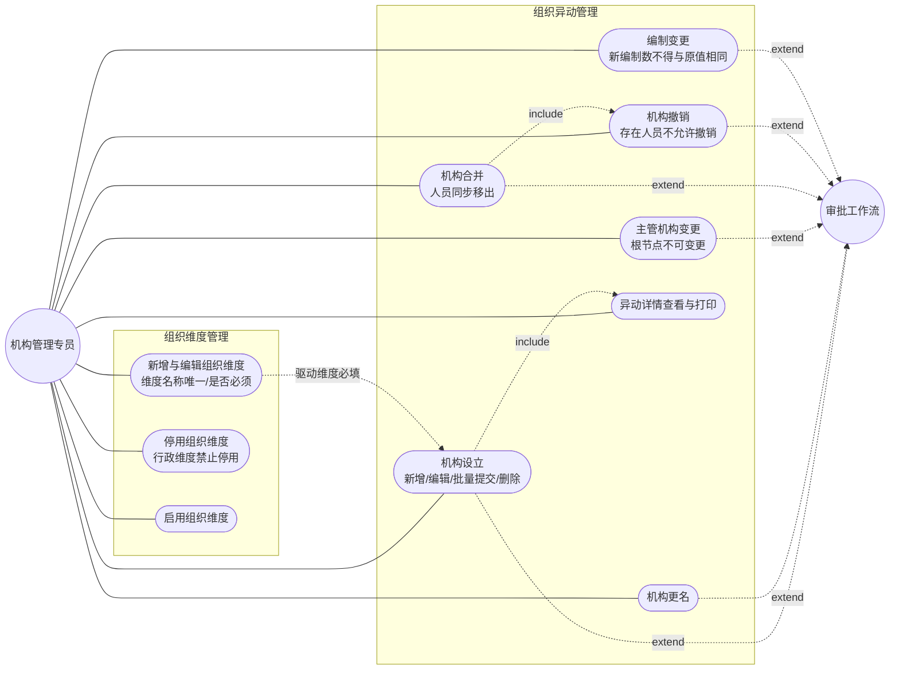
```mermaid
flowchart LR
    OM((机构管理专员))
    WF((审批工作流))

    subgraph P1["组织维度管理"]
        direction TB
        U11(["新增与编辑组织维度<br/>维度名称唯一/是否必须"])
        U12(["停用组织维度<br/>行政维度禁止停用"])
        U13(["启用组织维度"])
    end
    subgraph P2["组织异动管理"]
        direction TB
        U21(["机构设立<br/>新增/编辑/批量提交/删除"])
        U22(["机构更名"])
        U23(["主管机构变更<br/>根节点不可变更"])
        U24(["机构合并<br/>人员同步移出"])
        U25(["机构撤销<br/>存在人员不允许撤销"])
        U26(["编制变更<br/>新编制数不得与原值相同"])
        U27(["异动详情查看与打印"])
    end

    OM --- U11
    OM --- U12
    OM --- U13
    OM --- U21
    OM --- U22
    OM --- U23
    OM --- U24
    OM --- U25
    OM --- U26
    OM --- U27

    U21 -.->|extend| WF
    U22 -.->|extend| WF
    U23 -.->|extend| WF
    U24 -.->|extend| WF
    U25 -.->|extend| WF
    U26 -.->|extend| WF
    U21 -.->|include| U27
    U24 -.->|include| U25
    U11 -.->|驱动维度必填| U21
```

### 2.2 机构（二）：组织管理 · 虚拟组织 · 组织架构图

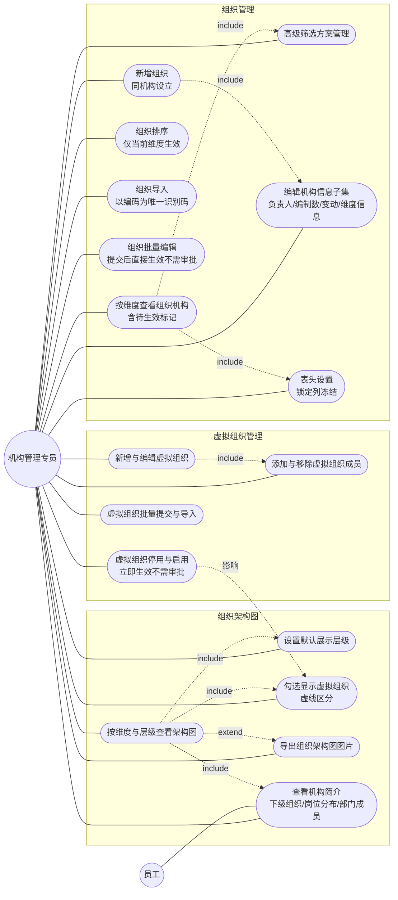
```mermaid
flowchart LR
    OM((机构管理专员))
    EMP((员工))

    subgraph P3["组织管理"]
        direction TB
        U31(["按维度查看组织机构<br/>含待生效标记"])
        U32(["高级筛选方案管理"])
        U33(["新增组织<br/>同机构设立"])
        U34(["编辑机构信息子集<br/>负责人/编制数/变动/维度信息"])
        U35(["组织排序<br/>仅当前维度生效"])
        U36(["组织导入<br/>以编码为唯一识别码"])
        U37(["组织批量编辑<br/>提交后直接生效不需审批"])
        U38(["表头设置<br/>锁定列冻结"])
    end
    subgraph P4["虚拟组织管理"]
        direction TB
        U41(["新增与编辑虚拟组织"])
        U42(["添加与移除虚拟组织成员"])
        U43(["虚拟组织停用与启用<br/>立即生效不需审批"])
        U44(["虚拟组织批量提交与导入"])
    end
    subgraph P5["组织架构图"]
        direction TB
        U51(["按维度与层级查看架构图"])
        U52(["设置默认展示层级"])
        U53(["勾选显示虚拟组织<br/>虚线区分"])
        U54(["导出组织架构图图片"])
        U55(["查看机构简介<br/>下级组织/岗位分布/部门成员"])
    end

    OM --- U31
    OM --- U32
    OM --- U33
    OM --- U34
    OM --- U35
    OM --- U36
    OM --- U37
    OM --- U38
    OM --- U41
    OM --- U42
    OM --- U43
    OM --- U44
    OM --- U51
    OM --- U52
    OM --- U53
    OM --- U54
    OM --- U55
    EMP --- U55

    U31 -.->|include| U32
    U31 -.->|include| U38
    U33 -.->|include| U34
    U41 -.->|include| U42
    U51 -.->|include| U52
    U51 -.->|include| U53
    U51 -.->|extend| U54
    U51 -.->|include| U55
    U43 -.->|影响| U53
```

### 2.3 机构（三）：机构编制 · 法人公司 · 职务体系 · 撤销机构

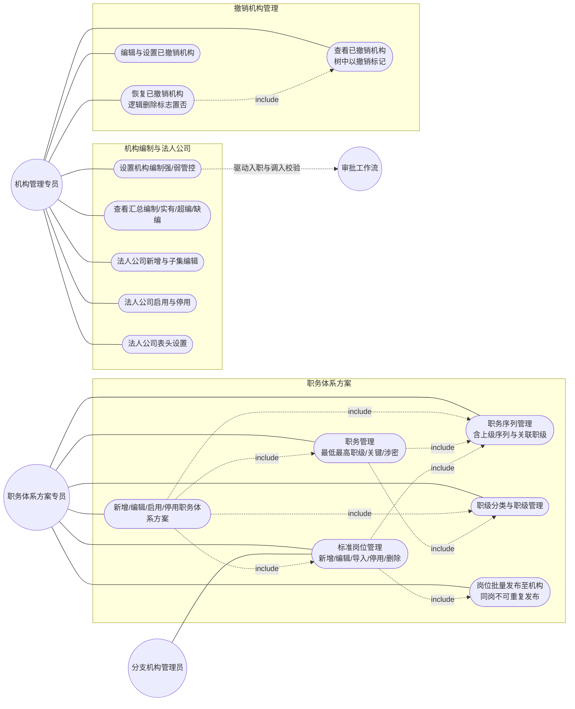
```mermaid
flowchart LR
    OM((机构管理专员))
    JS((职务体系方案专员))
    BR((分支机构管理员))
    WF((审批工作流))

    subgraph P6["机构编制与法人公司"]
        direction TB
        U61(["设置机构编制强/弱管控"])
        U62(["查看汇总编制/实有/超编/缺编"])
        U63(["法人公司新增与子集编辑"])
        U64(["法人公司启用与停用"])
        U65(["法人公司表头设置"])
    end
    subgraph P7["职务体系方案"]
        direction TB
        U71(["新增/编辑/启用/停用职务体系方案"])
        U72(["职务序列管理<br/>含上级序列与关联职级"])
        U73(["职级分类与职级管理"])
        U74(["职务管理<br/>最低最高职级/关键/涉密"])
        U75(["标准岗位管理<br/>新增/编辑/导入/停用/删除"])
        U76(["岗位批量发布至机构<br/>同岗不可重复发布"])
    end
    subgraph P8["撤销机构管理"]
        direction TB
        U81(["查看已撤销机构<br/>树中以撤销标记"])
        U82(["恢复已撤销机构<br/>逻辑删除标志置否"])
        U83(["编辑与设置已撤销机构"])
    end

    OM --- U61
    OM --- U62
    OM --- U63
    OM --- U64
    OM --- U65
    OM --- U81
    OM --- U82
    OM --- U83
    JS --- U71
    JS --- U72
    JS --- U73
    JS --- U74
    JS --- U75
    JS --- U76
    BR --- U75

    U71 -.->|include| U72
    U71 -.->|include| U73
    U71 -.->|include| U74
    U71 -.->|include| U75
    U75 -.->|include| U76
    U74 -.->|include| U72
    U74 -.->|include| U73
    U75 -.->|include| U72
    U82 -.->|include| U81
    U61 -.->|驱动入职与调入校验| WF
```

### 2.4 岗位

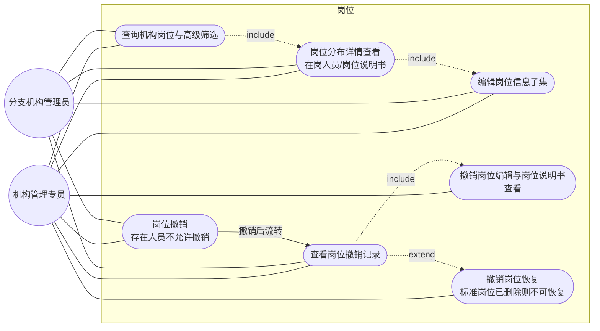
```mermaid
flowchart LR
    OM((机构管理专员))
    BR((分支机构管理员))

    subgraph P9["岗位"]
        direction TB
        U91(["查询机构岗位与高级筛选"])
        U92(["岗位分布详情查看<br/>在岗人员/岗位说明书"])
        U93(["编辑岗位信息子集"])
        U94(["岗位撤销<br/>存在人员不允许撤销"])
        U95(["查看岗位撤销记录"])
        U96(["撤销岗位编辑与岗位说明书查看"])
        U97(["撤销岗位恢复<br/>标准岗位已删除则不可恢复"])
    end

    OM --- U91
    OM --- U92
    OM --- U93
    OM --- U94
    OM --- U95
    OM --- U96
    OM --- U97
    BR --- U91
    BR --- U92
    BR --- U93
    BR --- U94
    BR --- U95

    U91 -.->|include| U92
    U92 -.->|include| U93
    U94 -->|撤销后流转| U95
    U95 -.->|include| U96
    U95 -.->|extend| U97
```

---

## 3. 类图 Class Diagram（领域模型）

### 3.1 组织与维度域

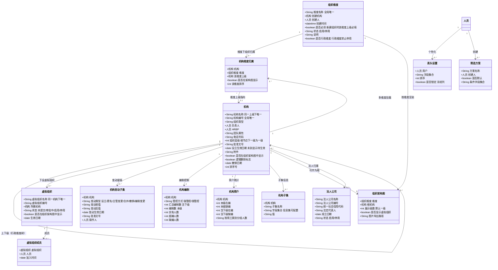
```mermaid
classDiagram
    class 组织维度 {
        +String 维度名称 全局唯一
        +机构 创建机构
        +人员 创建人
        +datetime 创建时间
        +boolean 是否必须 新建组织时该维度上级必填
        +String 状态 启用/停用
        +String 说明
        +boolean 是否行政维度 行政维度禁止停用
    }
    class 机构 {
        +String 机构名称 同一上级下唯一
        +String 机构编号 全局唯一
        +String 组织类型
        +人员 负责人
        +人员 HRBP
        +String 团队属性
        +String 电话号码
        +int 组织层级 根节点下一级为一级
        +String 批准文号
        +date 设立生效日期 未到显示待生效
        +String 附件
        +boolean 是否在组织架构图中显示
        +boolean 逻辑删除标志
        +date 撤销日期
        +int 排序号
    }
    class 机构维度归属 {
        +机构 机构
        +组织维度 维度
        +机构 该维度上级
        +boolean 是否在架构图显示
        +int 该维度排序
    }
    class 虚拟组织 {
        +String 虚拟组织名称 同一机构下唯一
        +String 虚拟组织编号
        +机构 所属机构
        +String 状态 未提交/审批中/启用/停用
        +boolean 是否在组织架构图中显示
        +date 生效日期
    }
    class 虚拟组织成员 {
        +虚拟组织 虚拟组织
        +人员 人员
        +date 加入时间
    }
    class 机构变动子集 {
        +机构 机构
        +String 变动类型 设立/更名/主管变更/合并/撤销/编制变更
        +String 变动前值
        +String 变动后值
        +date 变动生效日期
        +String 批准文号
        +人员 操作人
    }
    class 机构编制 {
        +机构 机构
        +String 管控方式 强管控/弱管控
        +int 汇总编制数 含下级
        +int 编制数 本级
        +int 实有人数
        +int 超编人数
        +int 缺编人数
    }
    class 法人公司 {
        +String 法人公司名称
        +String 法人公司编号
        +String 统一社会信用代码
        +String 法定代表人
        +date 成立日期
        +String 状态 启用/停用
    }
    class 组织架构图 {
        +组织维度 维度
        +机构 根机构
        +int 展示级数 默认一级
        +boolean 是否显示虚拟组织
        +String 图片导出路径
    }
    class 机构简介 {
        +机构 机构
        +int 本级在编
        +int 本级缺编
        +int 含下级在编
        +int 含下级缺编
        +String 按用工类别分组人数
    }
    class 机构子集 {
        +机构 机构
        +String 子集名称
        +String 字段集合 信息集可配置
        +String 值
    }
    class 表头设置 {
        +人员 用户
        +String 字段集合
        +int 排序
        +boolean 是否锁定 冻结列
    }
    class 筛选方案 {
        +String 方案名称
        +人员 创建人
        +boolean 是否默认
        +String 条件字段集合
    }

    组织维度 "1" --> "0..*" 机构维度归属 : 维度下组织归属
    机构 "1" --> "1..*" 机构维度归属 : 多维度挂载
    机构维度归属 "*" --> "0..1" 机构 : 维度上级指向
    机构 "1" --> "0..*" 机构 : 上下级（行政维度树）
    机构 "1" --> "0..*" 虚拟组织 : 下设虚拟组织
    虚拟组织 "1" --> "0..*" 虚拟组织成员 : 成员
    机构 "1" --> "0..*" 机构变动子集 : 变动留痕
    机构 "1" --> "1" 机构编制 : 编制控制
    机构 "1" --> "1" 机构简介 : 简介统计
    机构 "1" --> "0..*" 机构子集 : 子集信息
    组织维度 "1" --> "0..*" 组织架构图 : 按维度渲染
    机构 "1" --> "0..*" 组织架构图 : 可作为根
    人员 "1" --> "0..*" 表头设置 : 个性化
    人员 "1" --> "0..*" 筛选方案 : 创建
    机构 "*" --> "0..1" 法人公司 : 法人归属
```

### 3.2 组织异动域（6 类异动单据）

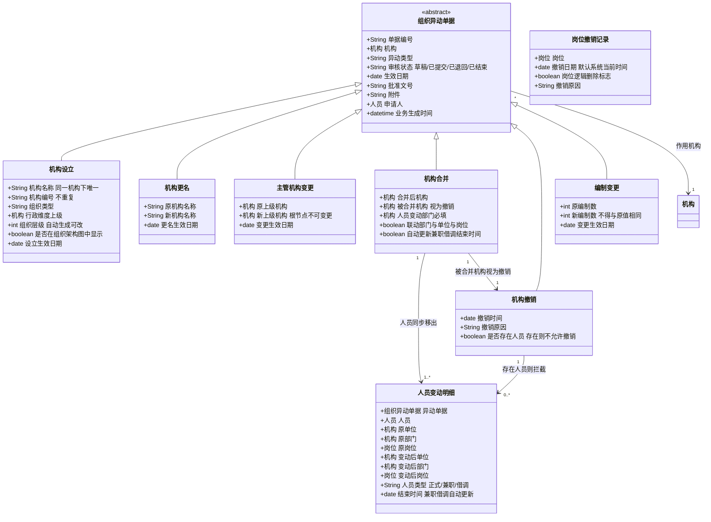
```mermaid
classDiagram
    class 组织异动单据 {
        <<abstract>>
        +String 单据编号
        +机构 机构
        +String 异动类型
        +String 审核状态 草稿/已提交/已退回/已结束
        +date 生效日期
        +String 批准文号
        +String 附件
        +人员 申请人
        +datetime 业务生成时间
    }
    class 机构设立 {
        +String 机构名称 同一机构下唯一
        +String 机构编号 不重复
        +String 组织类型
        +机构 行政维度上级
        +int 组织层级 自动生成可改
        +boolean 是否在组织架构图中显示
        +date 设立生效日期
    }
    class 机构更名 {
        +String 原机构名称
        +String 新机构名称
        +date 更名生效日期
    }
    class 主管机构变更 {
        +机构 原上级机构
        +机构 新上级机构 根节点不可变更
        +date 变更生效日期
    }
    class 机构合并 {
        +机构 合并后机构
        +机构 被合并机构 视为撤销
        +机构 人员变动部门必填
        +boolean 联动部门与单位与岗位
        +boolean 自动更新兼职借调结束时间
    }
    class 机构撤销 {
        +date 撤销时间
        +String 撤销原因
        +boolean 是否存在人员 存在则不允许撤销
    }
    class 编制变更 {
        +int 原编制数
        +int 新编制数 不得与原值相同
        +date 变更生效日期
    }
    class 人员变动明细 {
        +组织异动单据 异动单据
        +人员 人员
        +机构 原单位
        +机构 原部门
        +岗位 原岗位
        +机构 变动后单位
        +机构 变动后部门
        +岗位 变动后岗位
        +String 人员类型 正式/兼职/借调
        +date 结束时间 兼职借调自动更新
    }
    class 岗位撤销记录 {
        +岗位 岗位
        +date 撤销日期 默认系统当前时间
        +boolean 岗位逻辑删除标志
        +String 撤销原因
    }

    组织异动单据 <|-- 机构设立
    组织异动单据 <|-- 机构更名
    组织异动单据 <|-- 主管机构变更
    组织异动单据 <|-- 机构合并
    组织异动单据 <|-- 机构撤销
    组织异动单据 <|-- 编制变更
    组织异动单据 "*" --> "1" 机构 : 作用机构
    机构合并 "1" --> "1..*" 人员变动明细 : 人员同步移出
    机构撤销 "1" --> "0..*" 人员变动明细 : 存在人员则拦截
    机构合并 "1" --> "1" 机构撤销 : 被合并机构视为撤销
```

### 3.3 职务体系与岗位域

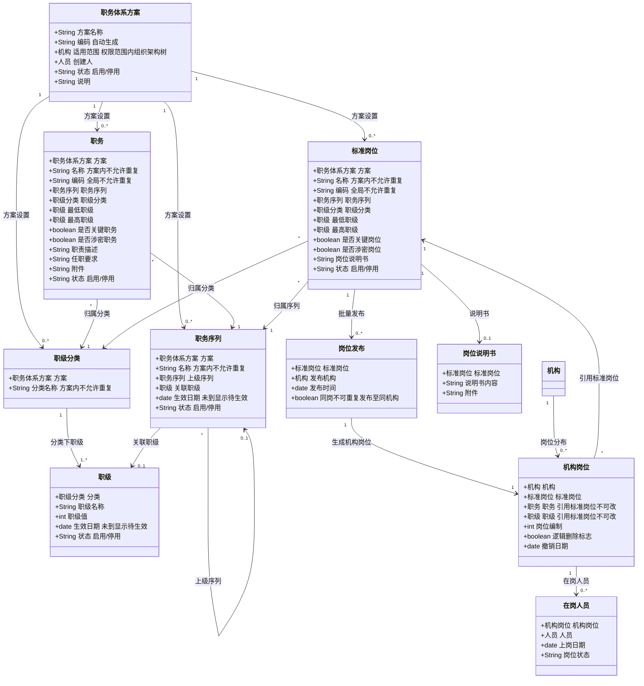
```mermaid
classDiagram
    class 职务体系方案 {
        +String 方案名称
        +String 编码 自动生成
        +机构 适用范围 权限范围内组织架构树
        +人员 创建人
        +String 状态 启用/停用
        +String 说明
    }
    class 职务序列 {
        +职务体系方案 方案
        +String 名称 方案内不允许重复
        +职务序列 上级序列
        +职级 关联职级
        +date 生效日期 未到显示待生效
        +String 状态 启用/停用
    }
    class 职级分类 {
        +职务体系方案 方案
        +String 分类名称 方案内不允许重复
    }
    class 职级 {
        +职级分类 分类
        +String 职级名称
        +int 职级值
        +date 生效日期 未到显示待生效
        +String 状态 启用/停用
    }
    class 职务 {
        +职务体系方案 方案
        +String 名称 方案内不允许重复
        +String 编码 全局不允许重复
        +职务序列 职务序列
        +职级分类 职级分类
        +职级 最低职级
        +职级 最高职级
        +boolean 是否关键职务
        +boolean 是否涉密职务
        +String 职责描述
        +String 任职要求
        +String 附件
        +String 状态 启用/停用
    }
    class 标准岗位 {
        +职务体系方案 方案
        +String 名称 方案内不允许重复
        +String 编码 全局不允许重复
        +职务序列 职务序列
        +职级分类 职级分类
        +职级 最低职级
        +职级 最高职级
        +boolean 是否关键岗位
        +boolean 是否涉密岗位
        +String 岗位说明书
        +String 状态 启用/停用
    }
    class 岗位发布 {
        +标准岗位 标准岗位
        +机构 发布机构
        +date 发布时间
        +boolean 同岗不可重复发布至同机构
    }
    class 机构岗位 {
        +机构 机构
        +标准岗位 标准岗位
        +职务 职务 引用标准岗位不可改
        +职级 职级 引用标准岗位不可改
        +int 岗位编制
        +boolean 逻辑删除标志
        +date 撤销日期
    }
    class 在岗人员 {
        +机构岗位 机构岗位
        +人员 人员
        +date 上岗日期
        +String 岗位状态
    }
    class 岗位说明书 {
        +标准岗位 标准岗位
        +String 说明书内容
        +String 附件
    }

    职务体系方案 "1" --> "0..*" 职务序列 : 方案设置
    职务体系方案 "1" --> "0..*" 职级分类 : 方案设置
    职务体系方案 "1" --> "0..*" 职务 : 方案设置
    职务体系方案 "1" --> "0..*" 标准岗位 : 方案设置
    职级分类 "1" --> "1..*" 职级 : 分类下职级
    职务序列 "*" --> "0..1" 职务序列 : 上级序列
    职务序列 "*" --> "0..1" 职级 : 关联职级
    职务 "*" --> "1" 职务序列 : 归属序列
    职务 "*" --> "1" 职级分类 : 归属分类
    标准岗位 "*" --> "1" 职务序列 : 归属序列
    标准岗位 "*" --> "1" 职级分类 : 归属分类
    标准岗位 "1" --> "0..1" 岗位说明书 : 说明书
    标准岗位 "1" --> "0..*" 岗位发布 : 批量发布
    岗位发布 "1" --> "1" 机构岗位 : 生成机构岗位
    机构岗位 "1" --> "0..*" 在岗人员 : 在岗人员
    机构 "1" --> "0..*" 机构岗位 : 岗位分布
    机构岗位 "*" --> "1" 标准岗位 : 引用标准岗位
```

---

## 4. 对象图 Object Diagram（运行时刻实例快照）

场景：**2024 年 4 月**，「北京分公司」下新增「数字化部」（机构设立已审批通过），同时在「业务维度」下挂载，并发布「数据分析岗」的某时刻快照。

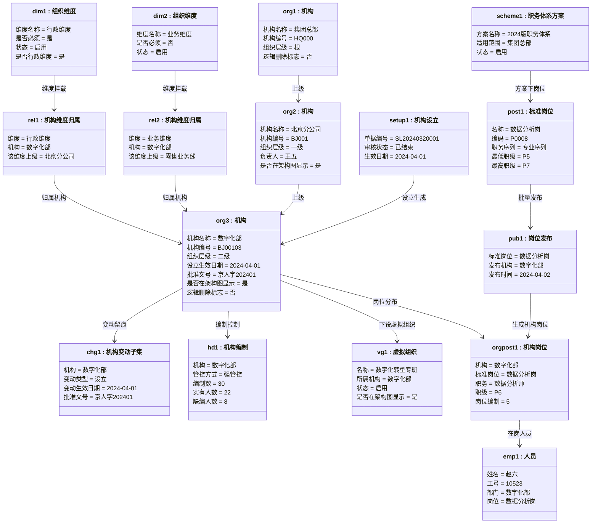
```mermaid
classDiagram
    class dim1["dim1 : 组织维度"] {
        维度名称 = 行政维度
        是否必须 = 是
        状态 = 启用
        是否行政维度 = 是
    }
    class dim2["dim2 : 组织维度"] {
        维度名称 = 业务维度
        是否必须 = 否
        状态 = 启用
    }
    class org1["org1 : 机构"] {
        机构名称 = 集团总部
        机构编号 = HQ000
        组织层级 = 根
        逻辑删除标志 = 否
    }
    class org2["org2 : 机构"] {
        机构名称 = 北京分公司
        机构编号 = BJ001
        组织层级 = 一级
        负责人 = 王五
        是否在架构图显示 = 是
    }
    class org3["org3 : 机构"] {
        机构名称 = 数字化部
        机构编号 = BJ00103
        组织层级 = 二级
        设立生效日期 = 2024-04-01
        批准文号 = 京人字202401
        是否在架构图显示 = 是
        逻辑删除标志 = 否
    }
    class rel1["rel1 : 机构维度归属"] {
        维度 = 行政维度
        机构 = 数字化部
        该维度上级 = 北京分公司
    }
    class rel2["rel2 : 机构维度归属"] {
        维度 = 业务维度
        机构 = 数字化部
        该维度上级 = 零售业务线
    }
    class setup1["setup1 : 机构设立"] {
        单据编号 = SL20240320001
        审核状态 = 已结束
        生效日期 = 2024-04-01
    }
    class chg1["chg1 : 机构变动子集"] {
        机构 = 数字化部
        变动类型 = 设立
        变动生效日期 = 2024-04-01
        批准文号 = 京人字202401
    }
    class hd1["hd1 : 机构编制"] {
        机构 = 数字化部
        管控方式 = 强管控
        编制数 = 30
        实有人数 = 22
        缺编人数 = 8
    }
    class vg1["vg1 : 虚拟组织"] {
        名称 = 数字化转型专班
        所属机构 = 数字化部
        状态 = 启用
        是否在架构图显示 = 是
    }
    class scheme1["scheme1 : 职务体系方案"] {
        方案名称 = 2024版职务体系
        适用范围 = 集团总部
        状态 = 启用
    }
    class post1["post1 : 标准岗位"] {
        名称 = 数据分析岗
        编码 = P0008
        职务序列 = 专业序列
        最低职级 = P5
        最高职级 = P7
    }
    class pub1["pub1 : 岗位发布"] {
        标准岗位 = 数据分析岗
        发布机构 = 数字化部
        发布时间 = 2024-04-02
    }
    class orgpost1["orgpost1 : 机构岗位"] {
        机构 = 数字化部
        标准岗位 = 数据分析岗
        职务 = 数据分析师
        职级 = P6
        岗位编制 = 5
    }
    class emp1["emp1 : 人员"] {
        姓名 = 赵六
        工号 = 10523
        部门 = 数字化部
        岗位 = 数据分析岗
    }

    dim1 --> rel1 : 维度挂载
    dim2 --> rel2 : 维度挂载
    rel1 --> org3 : 归属机构
    rel2 --> org3 : 归属机构
    org1 --> org2 : 上级
    org2 --> org3 : 上级
    setup1 --> org3 : 设立生成
    org3 --> chg1 : 变动留痕
    org3 --> hd1 : 编制控制
    org3 --> vg1 : 下设虚拟组织
    org3 --> orgpost1 : 岗位分布
    scheme1 --> post1 : 方案下岗位
    post1 --> pub1 : 批量发布
    pub1 --> orgpost1 : 生成机构岗位
    orgpost1 --> emp1 : 在岗人员
```

---

## 5. 包图 Package Diagram（模块划分与依赖）

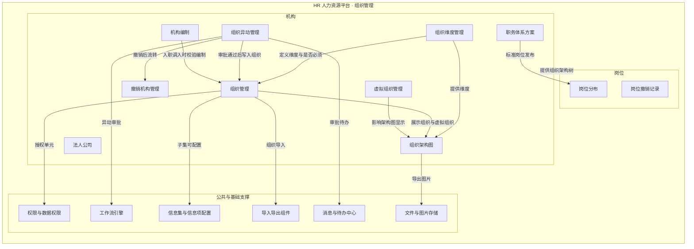
```mermaid
flowchart TB
    subgraph VHR["HR 人力资源平台 · 组织管理"]
        direction TB
        subgraph PKG_ORG["机构"]
            direction LR
            P11[组织维度管理]
            P12[组织异动管理]
            P13[组织管理]
            P14[虚拟组织管理]
            P15[组织架构图]
            P16[机构编制]
            P17[法人公司]
            P18[职务体系方案]
            P19[撤销机构管理]
        end
        subgraph PKG_POST["岗位"]
            direction LR
            P21[岗位分布]
            P22[岗位撤销记录]
        end
        subgraph PKG_COMMON["公共与基础支撑"]
            direction LR
            P31[权限与数据权限]
            P32[工作流引擎]
            P33[信息集与信息项配置]
            P34[导入导出组件]
            P35[消息与待办中心]
            P36[文件与图片存储]
        end
    end

    PKG_ORG -->|提供组织架构树| PKG_POST
    P11 -->|定义维度与是否必须| P13
    P11 -->|提供维度| P15
    P12 -->|审批通过后写入组织| P13
    P12 -->|撤销后流转| P19
    P13 -->|展示组织与虚拟组织| P15
    P14 -->|影响架构图显示| P15
    P16 -->|入职调入时校验编制| P13
    P18 -->|标准岗位发布| P21
    P13 -->|授权单元| P31
    P12 -->|异动审批| P32
    P13 -->|子集可配置| P33
    P13 -->|组织导入| P34
    P12 -->|审批待办| P35
    P15 -->|导出图片| P36
```

---

## 6. 组件图 Component Diagram（逻辑组件与接口）

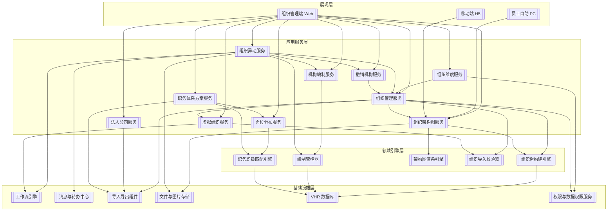
```mermaid
flowchart TB
    subgraph CLIENT["展现层"]
        C1[[组织管理端 Web]]
        C2[[员工自助 PC]]
        C3[[移动端 H5]]
    end

    subgraph SERVICE["应用服务层"]
        S1[[组织维度服务]]
        S2[[组织异动服务]]
        S3[[组织管理服务]]
        S4[[虚拟组织服务]]
        S5[[组织架构图服务]]
        S6[[机构编制服务]]
        S7[[法人公司服务]]
        S8[[职务体系方案服务]]
        S9[[撤销机构服务]]
        S10[[岗位分布服务]]
    end

    subgraph ENGINE["领域引擎层"]
        E1[[组织树构建引擎]]
        E2[[编制管控器]]
        E3[[架构图渲染引擎]]
        E4[[组织导入校验器]]
        E5[[职务职级匹配引擎]]
    end

    subgraph INFRA["基础设施层"]
        I1[[工作流引擎]]
        I2[[消息与待办中心]]
        I3[[导入导出组件]]
        I4[[文件与图片存储]]
        I5[[VHR 数据库]]
        I6[[权限与数据权限服务]]
    end

    C1 --> S1
    C1 --> S2
    C1 --> S3
    C1 --> S4
    C1 --> S5
    C1 --> S6
    C1 --> S7
    C1 --> S8
    C1 --> S9
    C1 --> S10
    C2 --> S5
    C3 --> S5

    S1 --> S3
    S2 --> S3
    S2 --> S6
    S2 --> S9
    S3 --> S4
    S3 --> S5
    S8 --> S10
    S9 --> S3

    S3 --> E1
    S5 --> E1
    S6 --> E2
    S2 --> E2
    S5 --> E3
    S3 --> E4
    S4 --> E4
    S10 --> E5
    S8 --> E5

    S2 --> I1
    S4 --> I1
    S2 --> I2
    S3 --> I3
    S7 --> I3
    S8 --> I3
    S5 --> I4
    S2 --> I4
    E1 --> I5
    E2 --> I5
    E5 --> I5
    S1 --> I6
    S3 --> I6
```

---

## 7. 部署图 Deployment Diagram（物理节点与工件）

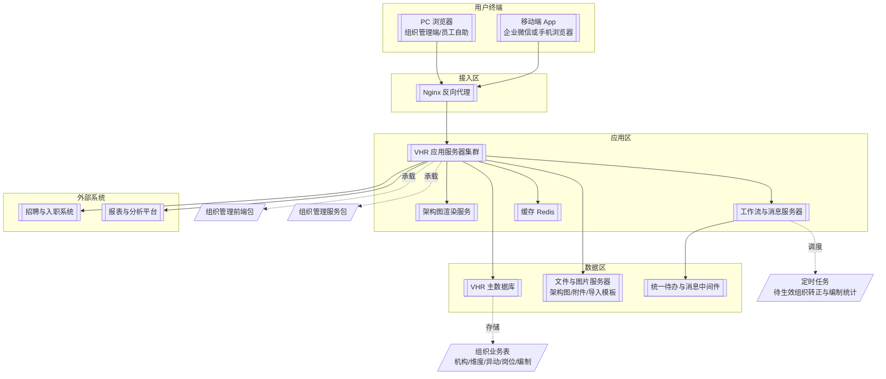
```mermaid
flowchart TB
    subgraph ZONE_USER["用户终端"]
        N1[["PC 浏览器<br/>组织管理端/员工自助"]]
        N2[["移动端 App<br/>企业微信或手机浏览器"]]
    end
    subgraph ZONE_DMZ["接入区"]
        N3[["Nginx 反向代理"]]
    end
    subgraph ZONE_APP["应用区"]
        N4[["VHR 应用服务器集群"]]
        N5[["架构图渲染服务"]]
        N6[["工作流与消息服务器"]]
        N7[["缓存 Redis"]]
    end
    subgraph ZONE_DATA["数据区"]
        N8[["VHR 主数据库"]]
        N9[["文件与图片服务器<br/>架构图/附件/导入模板"]]
        N10[["统一待办与消息中间件"]]
    end
    subgraph ZONE_EXT["外部系统"]
        N11[["招聘与入职系统"]]
        N12[["报表与分析平台"]]
    end

    ART1[/"组织管理前端包"/]
    ART2[/"组织管理服务包"/]
    ART3[/"组织业务表<br/>机构/维度/异动/岗位/编制"/]
    ART4[/"定时任务<br/>待生效组织转正与编制统计"/]

    N1 --> N3
    N2 --> N3
    N3 --> N4
    N4 --> N5
    N4 --> N6
    N4 --> N7
    N4 --> N8
    N4 --> N9
    N6 --> N10
    N4 -.承载.-> ART1
    N4 -.承载.-> ART2
    N8 -.存储.-> ART3
    N6 -.调度.-> ART4
    N4 --> N11
    N4 --> N12
```

---

## 8. 组合结构图 Composite Structure Diagram（机构内部结构）

以「机构」为例，展示其内部部件、端口与连接器。

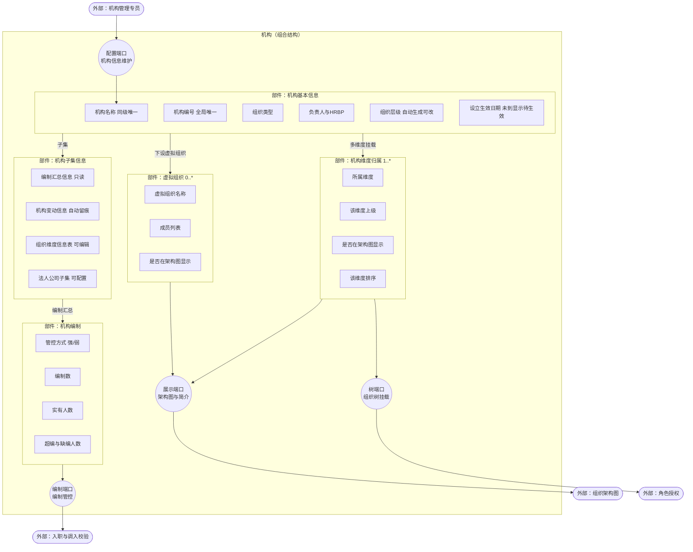
```mermaid
flowchart TB
    subgraph CTX["机构（组合结构）"]
        direction TB
        PORT_IN((配置端口<br/>机构信息维护))
        PORT_TREE((树端口<br/>组织树挂载))
        PORT_HD((编制端口<br/>编制管控))
        PORT_OUT((展示端口<br/>架构图与简介))

        subgraph PART_BASE["部件：机构基本信息"]
            M1[机构名称 同级唯一]
            M2[机构编号 全局唯一]
            M3[组织类型]
            M4[负责人与HRBP]
            M5[组织层级 自动生成可改]
            M6[设立生效日期 未到显示待生效]
        end
        subgraph PART_DIM["部件：机构维度归属 1..*"]
            D1[所属维度]
            D2[该维度上级]
            D3[是否在架构图显示]
            D4[该维度排序]
        end
        subgraph PART_SUB["部件：机构子集信息"]
            S1[编制汇总信息 只读]
            S2[机构变动信息 自动留痕]
            S3[组织维度信息表 可编辑]
            S4[法人公司子集 可配置]
        end
        subgraph PART_HD["部件：机构编制"]
            H1[管控方式 强/弱]
            H2[编制数]
            H3[实有人数]
            H4[超编与缺编人数]
        end
        subgraph PART_VG["部件：虚拟组织 0..*"]
            V1[虚拟组织名称]
            V2[成员列表]
            V3[是否在架构图显示]
        end
    end

    ADMIN([外部：机构管理专员])
    CHART([外部：组织架构图])
    TRANS([外部：入职与调入校验])
    AUTH([外部：角色授权])

    ADMIN --> PORT_IN
    PORT_IN --> M1
    PART_BASE -->|多维度挂载| PART_DIM
    PART_DIM --> PORT_TREE
    PORT_TREE --> AUTH
    PART_BASE -->|子集| PART_SUB
    PART_SUB -->|编制汇总| PART_HD
    PART_HD --> PORT_HD
    PORT_HD --> TRANS
    PART_BASE -->|下设虚拟组织| PART_VG
    PART_VG --> PORT_OUT
    PART_DIM --> PORT_OUT
    PORT_OUT --> CHART
```

---

## 9. 剖面图 Profile Diagram（构造型与扩展）

定义本模块的建模构造型（stereotype），约束领域对象的建模语义。

```mermaid
classDiagram
    class Class <<metaclass>>
    class Enumeration <<metaclass>>
    class Component <<metaclass>>
    class 聚合根 <<stereotype>> {
        +boolean 独立生命周期
        +boolean 全局唯一编号
    }
    class 单据实体 <<stereotype>> {
        +boolean 审批流驱动
        +boolean 状态机
        +boolean 草稿可编辑
    }
    class 配置实体 <<stereotype>> {
        +boolean 单位隔离
        +boolean 被引用即锁定
    }
    class 树节点 <<stereotype>> {
        +boolean 多维度挂载
        +boolean 层级递归
        +boolean 逻辑删除
    }
    class 值对象 <<stereotype>> {
        +boolean 无标识
        +boolean 依附聚合根
    }
    class 枚举构造型 <<stereotype>> {
        +String 代码选项
    }
    class 领域服务 <<stereotype>> {
        +boolean 无状态
    }

    聚合根 --|> Class : extend
    单据实体 --|> Class : extend
    配置实体 --|> Class : extend
    树节点 --|> Class : extend
    值对象 --|> Class : extend
    枚举构造型 --|> Enumeration : extend
    领域服务 --|> Component : extend

    class 机构
    class 组织维度
    class 职务体系方案
    class 标准岗位
    class 机构岗位
    class 法人公司
    class 组织异动单据
    class 机构设立
    class 机构合并
    class 机构撤销
    class 虚拟组织
    class 组织维度归属
    class 机构编制
    class 职务序列
    class 职级
    class 职务
    class 岗位发布
    class 机构变动子集
    class 虚拟组织成员
    class 在岗人员
    class 管控方式
    class 维度状态
    class 异动类型
    class 组织树构建引擎
    class 编制管控器
    class 架构图渲染引擎
    class 职务职级匹配引擎

    机构 ..> 聚合根 : apply
    机构 ..> 树节点 : apply
    组织维度 ..> 配置实体 : apply
    职务体系方案 ..> 聚合根 : apply
    标准岗位 ..> 配置实体 : apply
    机构岗位 ..> 树节点 : apply
    法人公司 ..> 聚合根 : apply
    组织异动单据 ..> 单据实体 : apply
    机构设立 ..> 单据实体 : apply
    机构合并 ..> 单据实体 : apply
    机构撤销 ..> 单据实体 : apply
    虚拟组织 ..> 树节点 : apply
    组织维度归属 ..> 值对象 : apply
    机构编制 ..> 值对象 : apply
    职务序列 ..> 配置实体 : apply
    职级 ..> 配置实体 : apply
    职务 ..> 配置实体 : apply
    岗位发布 ..> 值对象 : apply
    机构变动子集 ..> 值对象 : apply
    虚拟组织成员 ..> 值对象 : apply
    在岗人员 ..> 值对象 : apply
    管控方式 ..> 枚举构造型 : apply
    维度状态 ..> 枚举构造型 : apply
    异动类型 ..> 枚举构造型 : apply
    组织树构建引擎 ..> 领域服务 : apply
    编制管控器 ..> 领域服务 : apply
    架构图渲染引擎 ..> 领域服务 : apply
    职务职级匹配引擎 ..> 领域服务 : apply
```

---

## 10. 活动图 Activity Diagram

### 10.1 组织生命周期主流程（带泳道）

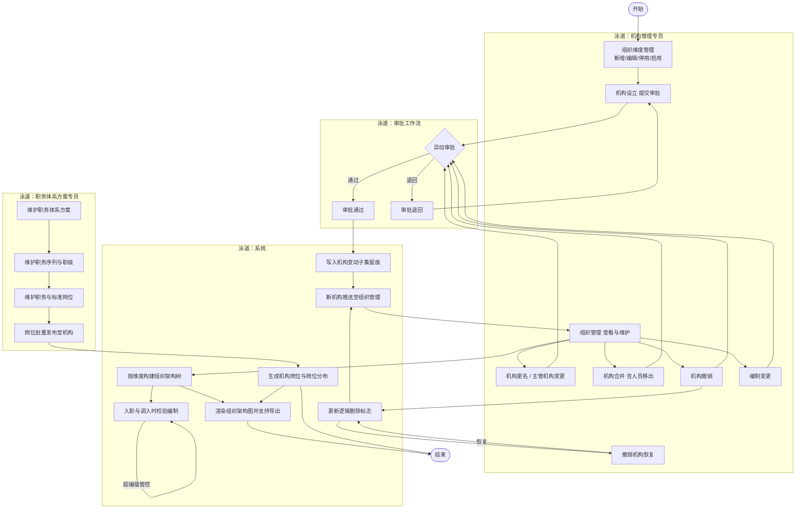
```mermaid
flowchart TB
    START([开始])

    subgraph LANE_OM["泳道：机构管理专员"]
        A1[组织维度管理<br/>新增/编辑/停用/启用]
        A2[机构设立 提交审批]
        A3[组织管理 查看与维护]
        A4[机构更名 / 主管机构变更]
        A5[机构合并 含人员移出]
        A6[机构撤销]
        A7[编制变更]
        A8[撤销机构恢复]
    end

    subgraph LANE_JS["泳道：职务体系方案专员"]
        B1[维护职务体系方案]
        B2[维护职务序列与职级]
        B3[维护职务与标准岗位]
        B4[岗位批量发布至机构]
    end

    subgraph LANE_WF["泳道：审批工作流"]
        W1{异动审批}
        W2[审批通过]
        W3[审批退回]
    end

    subgraph LANE_SYS["泳道：系统"]
        S1[写入机构变动子集留痕]
        S2[新机构推送至组织管理]
        S3[按维度构建组织架构树]
        S4[渲染组织架构图并支持导出]
        S5[更新逻辑删除标志]
        S6[入职与调入时校验编制]
        S7[生成机构岗位与岗位分布]
    end

    END([结束])

    START --> A1 --> A2 --> W1
    W1 -->|退回| W3 --> A2
    W1 -->|通过| W2 --> S1 --> S2 --> A3
    A3 --> S3 --> S4
    A3 --> A4 --> W1
    A3 --> A5 --> W1
    A3 --> A6 --> W1
    A3 --> A7 --> W1
    A6 --> S5 --> A8
    A8 -->|恢复| S5 --> S2
    B1 --> B2 --> B3 --> B4 --> S7 --> S4
    S3 --> S6
    S6 -->|超编强管控| S6
    S4 --> END
    S7 --> END
```

### 10.2 机构合并活动（含人员同步移出）

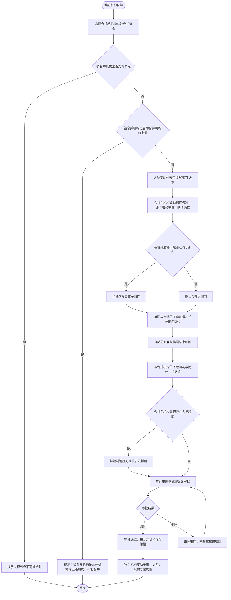
```mermaid
flowchart TB
    C0([发起机构合并])
    C1[选择合并后机构与被合并机构]
    C2{被合并机构是否为根节点}
    C3[提示：根节点不可被合并]
    C4{被合并机构是否为合并机构的上级}
    C5[提示：被合并机构是合并机构的上级机构，不能合并]
    C6[人员变动列表中填写部门 必填]
    C7[合并后机构联动部门选项，部门联动单位，联动岗位]
    C8{被合并后部门是否还有子部门}
    C9[允许选择具体子部门]
    C10[默认合并后部门]
    C11[兼职与借调员工自动带出单位部门岗位]
    C12[自动更新兼职借调结束时间]
    C13[被合并机构的下级机构与岗位一并撤销]
    C14{合并后机构是否存在人员超限}
    C15[按编制管控方式提示或拦截]
    C16[暂存生成草稿或提交审批]
    C17{审批结果}
    C18[审批通过，被合并机构视为撤销]
    C19[写入机构变动子集，更新组织树与架构图]
    C20[审批退回，回到草稿可编辑]
    C21([结束])

    C0 --> C1 --> C2
    C2 -->|是| C3 --> C21
    C2 -->|否| C4
    C4 -->|是| C5 --> C21
    C4 -->|否| C6 --> C7 --> C8
    C8 -->|是| C9 --> C11
    C8 -->|否| C10 --> C11
    C11 --> C12 --> C13 --> C14
    C14 -->|是| C15 --> C16
    C14 -->|否| C16
    C16 --> C17
    C17 -->|通过| C18 --> C19 --> C21
    C17 -->|退回| C20 --> C16
```

### 10.3 岗位发布与岗位撤销活动

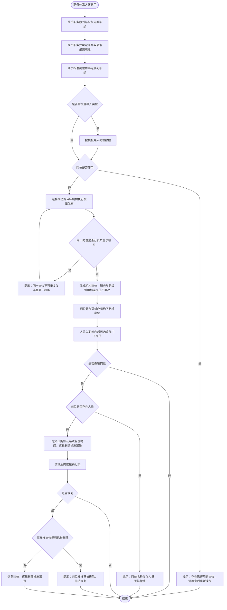
```mermaid
flowchart TB
    D0([职务体系方案启用])
    D1[维护职务序列与职级分类职级]
    D2[维护职务并绑定序列与最低最高职级]
    D3[维护标准岗位并绑定序列职级]
    D4{是否需批量导入岗位}
    D5[按模板导入岗位数据]
    D6{岗位是否停用}
    D7[提示：存在已停用的岗位，请检查后重新操作]
    D8[选择岗位与目标机构执行批量发布]
    D9{同一岗位是否已发布至该机构}
    D10[提示：同一岗位不可重复发布至同一机构]
    D11[生成机构岗位，职务与职级引用标准岗位不可改]
    D12[岗位分布页对应机构下新增岗位]
    D13[人员入职部门后可选该部门下岗位]
    D14{是否撤销岗位}
    D15{岗位是否存在人员}
    D16[提示：岗位名称存在人员，无法撤销]
    D17[撤销日期默认系统当前时间，逻辑删除标志置是]
    D18[流转至岗位撤销记录]
    D19{是否恢复}
    D20{原标准岗位是否已被删除}
    D21[提示：岗位标准已被删除，无法恢复]
    D22[恢复岗位，逻辑删除标志置否]
    D23([结束])

    D0 --> D1 --> D2 --> D3 --> D4
    D4 -->|是| D5 --> D6
    D4 -->|否| D6
    D6 -->|是| D7 --> D23
    D6 -->|否| D8 --> D9
    D9 -->|是| D10 --> D8
    D9 -->|否| D11 --> D12 --> D13 --> D14
    D14 -->|否| D23
    D14 -->|是| D15
    D15 -->|是| D16 --> D23
    D15 -->|否| D17 --> D18 --> D19
    D19 -->|否| D23
    D19 -->|是| D20
    D20 -->|是| D21 --> D23
    D20 -->|否| D22 --> D23
```

---

## 11. 状态机图 State Machine Diagram

### 11.1 组织异动单据（6 类通用）

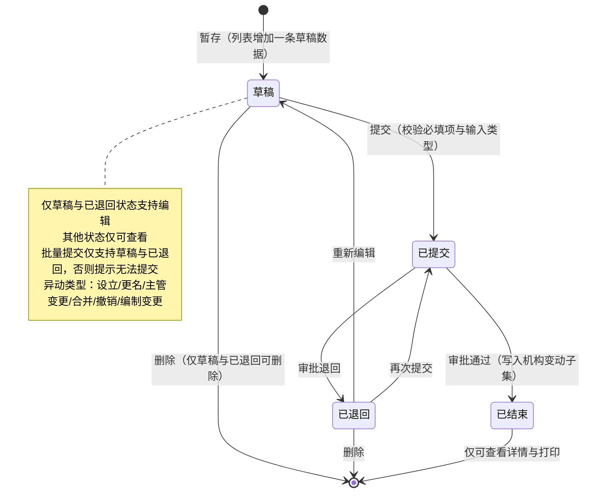
```mermaid
stateDiagram-v2
    [*] --> 草稿 : 暂存（列表增加一条草稿数据）
    草稿 --> 已提交 : 提交（校验必填项与输入类型）
    已提交 --> 已结束 : 审批通过（写入机构变动子集）
    已提交 --> 已退回 : 审批退回
    已退回 --> 草稿 : 重新编辑
    已退回 --> 已提交 : 再次提交
    草稿 --> [*] : 删除（仅草稿与已退回可删除）
    已退回 --> [*] : 删除
    已结束 --> [*] : 仅可查看详情与打印
    note right of 草稿
        仅草稿与已退回状态支持编辑
        其他状态仅可查看
        批量提交仅支持草稿与已退回，否则提示无法提交
        异动类型：设立/更名/主管变更/合并/撤销/编制变更
    end note
```

### 11.2 机构

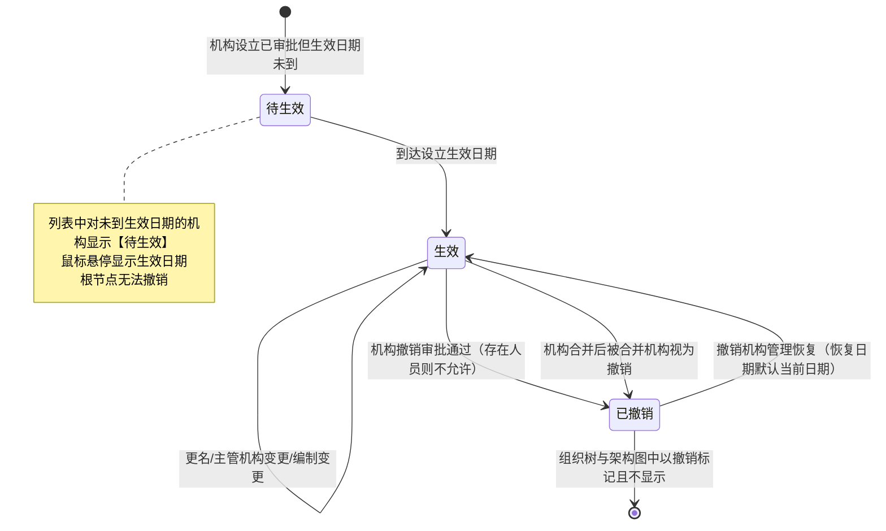
```mermaid
stateDiagram-v2
    [*] --> 待生效 : 机构设立已审批但生效日期未到
    待生效 --> 生效 : 到达设立生效日期
    生效 --> 生效 : 更名/主管机构变更/编制变更
    生效 --> 已撤销 : 机构撤销审批通过（存在人员则不允许）
    生效 --> 已撤销 : 机构合并后被合并机构视为撤销
    已撤销 --> 生效 : 撤销机构管理恢复（恢复日期默认当前日期）
    已撤销 --> [*] : 组织树与架构图中以撤销标记且不显示
    note right of 待生效
        列表中对未到生效日期的机构显示【待生效】
        鼠标悬停显示生效日期
        根节点无法撤销
    end note
```

### 11.3 组织维度

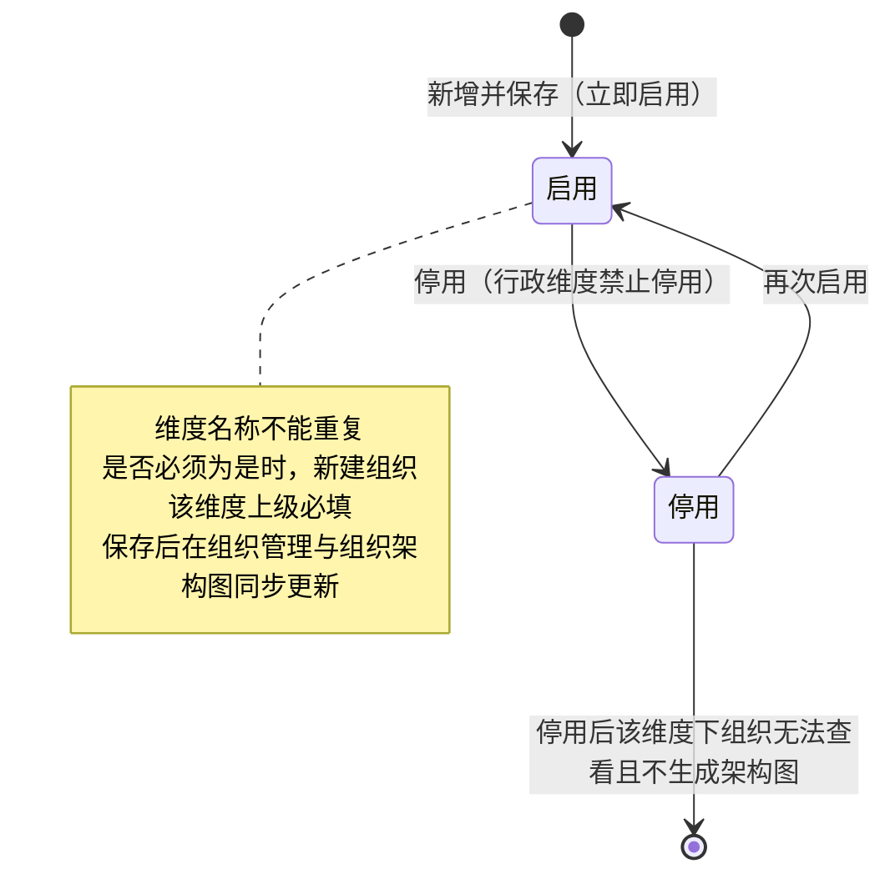
```mermaid
stateDiagram-v2
    [*] --> 启用 : 新增并保存（立即启用）
    启用 --> 停用 : 停用（行政维度禁止停用）
    停用 --> 启用 : 再次启用
    停用 --> [*] : 停用后该维度下组织无法查看且不生成架构图
    note right of 启用
        维度名称不能重复
        是否必须为是时，新建组织该维度上级必填
        保存后在组织管理与组织架构图同步更新
    end note
```

### 11.4 虚拟组织

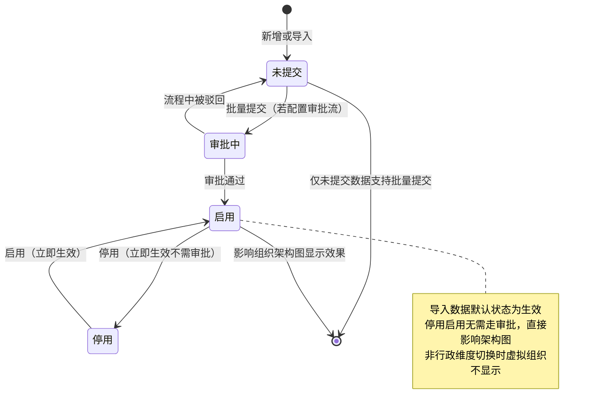
```mermaid
stateDiagram-v2
    [*] --> 未提交 : 新增或导入
    未提交 --> 审批中 : 批量提交（若配置审批流）
    审批中 --> 启用 : 审批通过
    审批中 --> 未提交 : 流程中被驳回
    启用 --> 停用 : 停用（立即生效不需审批）
    停用 --> 启用 : 启用（立即生效）
    未提交 --> [*] : 仅未提交数据支持批量提交
    启用 --> [*] : 影响组织架构图显示效果
    note right of 启用
        导入数据默认状态为生效
        停用启用无需走审批，直接影响架构图
        非行政维度切换时虚拟组织不显示
    end note
```

### 11.5 机构编制管控

```mermaid
stateDiagram-v2
    [*] --> 强管控 : 默认强管控
    强管控 --> 弱管控 : 设置为弱管控
    弱管控 --> 强管控 : 设置为强管控
    强管控 --> 强管控 : 入职与调入超编时拦截业务
    弱管控 --> 弱管控 : 入职与调入超编时仅提醒不拦截
    note right of 强管控
        父节点为强管控则子节点均为强管控
        若某一子节点为弱管控则父节点为弱管控
        汇总编制数含机构及其子机构
    end note
```

### 11.6 职务体系方案

```mermaid
stateDiagram-v2
    [*] --> 启用 : 新增方案
    启用 --> 停用 : 停用方案
    停用 --> 启用 : 启用方案
    启用 --> 启用 : 维护职务序列/职级/职务/岗位
    停用 --> [*] : 停用后方案下数据不可被选择
```

### 11.7 职务序列与职级

```mermaid
stateDiagram-v2
    [*] --> 待生效 : 新增但未到生效日期
    待生效 --> 启用 : 到达生效日期（凌晨）
    启用 --> 停用 : 停用
    停用 --> 启用 : 启用
    启用 --> [*] : 有关联职务或岗位时不可删除
    待生效 --> [*] : 列表中显示待生效且不可被人员模块选择
    note right of 停用
        停用职务提示：此职务已被使用，停用后对应部门无法再选择
        停用不影响历史已使用此职务的人员信息
        职级分类被职级引用时不可删除
    end note
```

### 11.8 标准岗位与机构岗位

```mermaid
stateDiagram-v2
    [*] --> 未发布 : 新增标准岗位或导入
    未发布 --> 已发布 : 批量发布至机构（同岗不可重复发布）
    已发布 --> 停用 : 停用岗位
    停用 --> 已发布 : 启用岗位
    已发布 --> 已撤销 : 岗位撤销（存在人员则不允许）
    已撤销 --> 已发布 : 岗位恢复（标准岗位已删除则不可恢复）
    未发布 --> [*] : 未被分布可删除
    已发布 --> [*] : 已分布至部门使用不允许删除
    note right of 停用
        停用岗位不允许被发布
        停用不影响人员信息中已选择的岗位
        编辑标准岗位后已分布岗位信息同步修改
    end note
```

---

## 12. 序列图 Sequence Diagram

### 12.1 场景一：机构设立审批与组织树写入

```mermaid
sequenceDiagram
    actor OM as 机构管理专员
    participant TS as 组织异动服务
    participant DS as 组织维度服务
    participant WF as 工作流引擎
    participant OS as 组织管理服务
    participant DB as VHR 数据库

    OM->>TS: 打开机构设立并录入机构信息
    TS->>DS: 加载维度必填配置
    DS-->>TS: 返回行政维度及自定义维度是否必须
    TS->>TS: 校验必填项与输入类型
    TS->>DB: 校验同一机构下机构名称唯一、编号不重复
    TS->>DB: 按根节点自动计算组织层级（可修改）
    alt 点击暂存
        TS->>DB: 保存为草稿，列表增加一条草稿数据
    else 点击提交
        TS->>DB: 保存并发起审批
        TS->>WF: 提交机构设立审批流
        WF-->>TS: 审批通过回调
        TS->>DB: 设立新机构，写入机构变动子集
        TS->>OS: 新机构自动推送至组织管理
        OS->>DB: 按各维度挂载组织树节点
        OS-->>OM: 组织管理与组织架构图同步更新
    end
    OM->>TS: 查看详情或打印
    TS-->>OM: 展示机构设立页面与流程图
    Note over OM,DB: 仅草稿与已退回状态支持编辑与删除，批量提交同此限制
```

### 12.2 场景二：机构合并与人员同步移出

```mermaid
sequenceDiagram
    actor OM as 机构管理专员
    participant TS as 组织异动服务
    participant OS as 组织管理服务
    participant HC as 编制管控器
    participant WF as 工作流引擎
    participant DB as VHR 数据库

    OM->>TS: 发起机构合并并选择合并后与被合并机构
    TS->>DB: 校验被合并机构是否为根节点
    alt 是根节点
        TS-->>OM: 提示根节点不可被合并
    end
    TS->>DB: 校验被合并机构是否为合并机构的上级
    alt 是上级机构
        TS-->>OM: 提示被合并机构是合并机构的上级机构，不能合并
    end
    OM->>TS: 填写人员变动部门（必填）
    TS->>DB: 合并后机构联动部门，部门联动单位，联动岗位
    TS->>DB: 被合并后部门仍有子部门时允许选择
    TS->>DB: 兼职与借调员工自动带出单位部门岗位
    TS->>DB: 自动更新兼职借调结束时间
    TS->>DB: 被合并机构的下级机构与岗位一并撤销
    TS->>HC: 校验合并后机构编制占用
    alt 超编且强管控
        HC-->>OM: 拦截并提示已超编
    else 超编且弱管控
        HC-->>OM: 仅提醒超编
    end
    OM->>TS: 提交审批
    TS->>WF: 发起机构合并审批流
    WF-->>TS: 审批通过回调
    TS->>DB: 被合并机构视为撤销并更新逻辑删除标志
    TS->>DB: 写入机构变动子集
    TS->>OS: 刷新组织树与组织架构图
    TS-->>OM: 合并完成
```

### 12.3 场景三：机构撤销与撤销机构恢复

```mermaid
sequenceDiagram
    actor OM as 机构管理专员
    participant TS as 组织异动服务
    participant RS as 撤销机构服务
    participant WF as 工作流引擎
    participant DB as VHR 数据库

    OM->>TS: 发起机构撤销并选择机构
    TS->>DB: 校验所选机构是否为根节点
    alt 是根节点
        TS-->>OM: 提示根节点无法撤销
    end
    TS->>DB: 检查该机构及子机构是否存在人员
    alt 存在人员
        TS-->>OM: 提示该机构或子机构存在人员，不允许撤销
    else 无人员
        OM->>TS: 填写撤销时间与撤销原因并提交
        TS->>WF: 发起机构撤销审批流
        WF-->>TS: 审批通过回调
        TS->>DB: 按撤销时间更新机构撤销日期，逻辑删除标志置为是
        TS->>DB: 写入机构变动子集
        TS->>RS: 机构进入撤销机构管理
        RS-->>OM: 撤销机构列表新增数据
    end
    OM->>RS: 在撤销机构管理选择机构并恢复
    RS->>DB: 恢复日期默认当前系统日期
    RS->>DB: 逻辑删除标志更新为否
    RS->>DB: 机构重新出现在组织树与组织架构图
    RS-->>OM: 恢复成功
```

### 12.4 场景四：组织架构图渲染与导出

```mermaid
sequenceDiagram
    actor OM as 机构管理专员
    actor EMP as 员工
    participant CS as 组织架构图服务
    participant TE as 组织树构建引擎
    participant RE as 架构图渲染引擎
    participant FS as 文件与图片存储
    participant DB as VHR 数据库

    OM->>CS: 进入组织架构图页面
    CS->>DB: 读取上次设置的默认展示级数
    CS->>TE: 按行政维度构建组织树（默认一级）
    TE-->>CS: 返回根节点及下一层节点
    CS->>RE: 渲染架构图并默认勾选显示虚拟组织
    RE-->>OM: 展示架构图，虚拟组织以虚线区分
    OM->>CS: 切换组织维度
    alt 切换到非行政维度
        CS->>TE: 按该维度构建组织树
        CS->>RE: 虚拟组织不显示
    else 行政维度
        CS->>RE: 显示下级机构对应虚拟组织
    end
    OM->>CS: 调整展示级数并下钻
    CS->>DB: 保存默认展示层级供下次使用
    OM->>CS: 点击某节点查看详情
    CS->>DB: 查询本级在编/缺编与含下级在编/缺编
    CS->>DB: 按用工类别分组统计人数
    CS-->>OM: 展示机构简介（下级组织/岗位分布/部门成员）
    OM->>CS: 导出组织架构图
    CS->>FS: 生成图片并存储
    FS-->>OM: 下载架构图图片
    EMP->>CS: 员工自助查看架构图与机构简介
```

### 12.5 场景五：职务体系方案设置与岗位批量发布

```mermaid
sequenceDiagram
    actor JS as 职务体系方案专员
    participant SS as 职务体系方案服务
    participant ME as 职务职级匹配引擎
    participant PS as 岗位分布服务
    participant DB as VHR 数据库

    JS->>SS: 新增职务体系方案并设置适用范围
    SS->>DB: 保存方案（默认启用）
    JS->>SS: 维护职务序列（名称/上级序列/关联职级/生效日期）
    JS->>SS: 维护职级分类与职级（分类名称不重复）
    JS->>SS: 维护职务并绑定序列与最低最高职级
    JS->>SS: 维护标准岗位并绑定序列与职级
    alt 批量导入岗位
        JS->>SS: 下载模板并上传
        SS->>DB: 校验模板格式与字段后导入
    end
    JS->>SS: 选择岗位与目标机构执行批量发布
    SS->>DB: 校验岗位是否已停用
    alt 岗位已停用
        SS-->>JS: 提示存在已停用的岗位，请检查后重新操作
    end
    SS->>DB: 校验同一岗位是否已发布至该机构
    alt 已发布
        SS-->>JS: 提示同一岗位不可重复发布至同一机构
    end
    SS->>ME: 按标准岗位带出职务与职级
    ME-->>SS: 返回职务与职级（机构岗位不可修改）
    SS->>DB: 生成机构岗位
    SS->>PS: 岗位分布页对应机构下新增岗位
    PS-->>JS: 人员入职该部门后可选对应岗位
    Note over JS,DB: 编辑标准岗位后已分布岗位信息同步修改
```

### 12.6 场景六：组织导入与批量编辑

```mermaid
sequenceDiagram
    actor OM as 机构管理专员
    participant OS as 组织管理服务
    participant IV as 组织导入校验器
    participant DB as VHR 数据库

    OM->>OS: 下载组织导入模板
    OS-->>OM: 返回模板（列头需与系统名称一致）
    OM->>OS: 上传填写后的模板
    OS->>IV: 校验模板格式与必填项
    IV->>DB: 以编码作为唯一识别码逐条匹配
    alt 编码已存在且在权限范围内
        IV->>DB: 执行更新
    else 编码已存在但无权限
        IV-->>OM: 报错 XXX编码已存在无权限导入，请检查后重试
    else 编码不存在
        IV->>DB: 执行新增
    end
    alt 必填项缺失
        IV-->>OM: 提示成功XX条失败XX条，失败原因缺少编码
        IV-->>OM: 自动下载失败明细 Excel 并标注原因
    end
    OS->>DB: 导入完成，组织树与架构图更新

    OM->>OS: 选择字段执行批量编辑
    OS->>OS: 按所选数据项校验输入规则
    OS->>DB: 提交后直接生效，不需审批
    OS-->>OM: 批量编辑完成
```

---

## 13. 通信图 Communication Diagram（机构设立审批通过的对象协作）

```mermaid
flowchart LR
    OM((机构管理专员))
    TS["机构设立单据"]
    DS["组织维度服务"]
    WF["工作流引擎"]
    ORG["机构"]
    CHG["机构变动子集"]
    DIM["机构维度归属"]
    TREE["组织树构建引擎"]
    CHART["组织架构图"]
    DB["VHR 数据库"]

    OM -->|"1 录入并提交"| TS
    TS -->|"2 加载维度必填配置"| DS
    DS -->|"3 返回是否必须"| TS
    TS -->|"4 校验名称唯一与编号不重复"| DB
    TS -->|"5 发起审批"| WF
    WF -->|"6 审批通过回调"| TS
    TS -->|"7 设立新机构"| ORG
    ORG -->|"8 写入机构信息"| DB
    TS -->|"9 记录机构变动子集"| CHG
    CHG -->|"10 留痕入库"| DB
    TS -->|"11 按各维度挂载上级"| DIM
    DIM -->|"12 写入维度归属"| DB
    TS -->|"13 刷新组织树"| TREE
    TREE -->|"14 推送新节点"| CHART
    CHART -->|"15 架构图同步更新"| OM
    TS -->|"16 返回设立成功"| OM
```

---

## 14. 交互概览图 Interaction Overview Diagram（活动节点引用各交互）

```mermaid
flowchart TB
    N0([初始])
    N1["sd 组织维度管理<br/>新增/编辑/停用/启用"]
    N2["sd 机构设立审批与组织树写入<br/>（见 12.1）"]
    FORK[/并发：组织维护 与 职务体系维护\]
    JOIN[/合并\]
    N3["sd 组织管理 查看/编辑/排序/导入<br/>（见 12.6）"]
    N4["sd 虚拟组织管理与架构图显示"]
    N5["sd 职务体系方案设置与岗位批量发布<br/>（见 12.5）"]
    D1{组织是否需要异动}
    N6["sd 机构更名 或 主管机构变更"]
    N7["sd 机构合并与人员移出<br/>（见 12.2）"]
    N8["sd 机构撤销与恢复<br/>（见 12.3）"]
    N9["sd 编制变更与编制管控"]
    N10["sd 组织架构图渲染与导出<br/>（见 12.4）"]
    N11["sd 岗位撤销与恢复"]
    N12([终止])

    N0 --> N1 --> N2 --> FORK
    FORK --> N3
    FORK --> N5
    N3 --> JOIN
    N5 --> JOIN
    JOIN --> N4 --> D1
    D1 -->|更名或主管变更| N6 --> N10
    D1 -->|合并| N7 --> N10
    D1 -->|撤销| N8 --> N10
    D1 -->|编制变更| N9 --> N10
    D1 -->|无需异动| N10
    N5 --> N11 --> N12
    N10 --> N12
    N8 -.->|恢复后| N3
```

---

## 15. 时序图 Timing Diagram（状态随时间变化，Mermaid 用甘特等价表达）

Mermaid 暂无原生 Timing Diagram 语法，以下以时间轴状态带表达同一语义：**横轴为时间，纵轴为对象，色带表示其所处状态**。

```mermaid
gantt
    title 2024年Q1-Q2 组织与岗位状态时序
    dateFormat YYYY-MM-DD
    axisFormat %m-%d
    section 组织维度(业务维度)
    启用                :active,  d1, 2024-01-05, 2024-12-31
    section 数字化部(机构设立)
    草稿                :done,    s1, 2024-03-10, 2024-03-15
    已提交              :done,    s2, 2024-03-15, 2024-03-25
    已结束              :active,  s3, 2024-03-25, 2024-06-30
    section 数字化部(机构状态)
    待生效              :done,    o1, 2024-03-25, 2024-04-01
    生效                :active,  o2, 2024-04-01, 2024-12-31
    section 职务体系方案
    启用                :active,  p1, 2024-01-01, 2024-12-31
    section 数据分析岗
    未发布              :done,    g1, 2024-01-10, 2024-04-02
    已发布              :active,  g2, 2024-04-02, 2024-12-31
    section 虚拟组织(数字化专班)
    未提交              :done,    v1, 2024-04-05, 2024-04-08
    审批中              :done,    v2, 2024-04-08, 2024-04-12
    启用                :active,  v3, 2024-04-12, 2024-12-31
    section 关键里程碑
    维度启用            :milestone, m1, 2024-01-05, 0d
    机构设立提交        :milestone, m2, 2024-03-15, 0d
    机构生效            :milestone, m3, 2024-04-01, 0d
    岗位发布            :milestone, m4, 2024-04-02, 0d
    虚拟组织启用        :milestone, m5, 2024-04-12, 0d
```

---

## 16. 附录 A：ER 数据模型图（核心实体与基数）

```mermaid
erDiagram
    组织维度 ||--o{ 机构维度归属 : "维度下组织归属"
    机构 ||--|{ 机构维度归属 : "多维度挂载"
    机构维度归属 }o--o| 机构 : "维度上级指向"
    机构 ||--o{ 机构 : "上下级（行政维度树）"
    机构 ||--o{ 虚拟组织 : "下设虚拟组织"
    虚拟组织 ||--o{ 虚拟组织成员 : "成员"
    机构 ||--o{ 机构变动子集 : "变动留痕"
    机构 ||--|| 机构编制 : "编制控制"
    机构 ||--|| 机构简介 : "简介统计"
    机构 ||--o{ 机构子集 : "子集信息"
    组织维度 ||--o{ 组织架构图 : "按维度渲染"
    机构 ||--o{ 组织架构图 : "可作为根节点"
    人员 ||--o{ 表头设置 : "个性化"
    人员 ||--o{ 筛选方案 : "创建"
    机构 }o--o| 法人公司 : "法人归属"
    组织异动单据 ||--o| 机构设立 : "特化"
    组织异动单据 ||--o| 机构更名 : "特化"
    组织异动单据 ||--o| 主管机构变更 : "特化"
    组织异动单据 ||--o| 机构合并 : "特化"
    组织异动单据 ||--o| 机构撤销 : "特化"
    组织异动单据 ||--o| 编制变更 : "特化"
    组织异动单据 }o--|| 机构 : "作用机构"
    机构合并 ||--|{ 人员变动明细 : "人员同步移出"
    机构撤销 ||--o{ 人员变动明细 : "存在人员则拦截"
    机构合并 ||--|| 机构撤销 : "被合并机构视为撤销"
    职务体系方案 ||--o{ 职务序列 : "方案设置"
    职务体系方案 ||--o{ 职级分类 : "方案设置"
    职务体系方案 ||--o{ 职务 : "方案设置"
    职务体系方案 ||--o{ 标准岗位 : "方案设置"
    职级分类 ||--|{ 职级 : "分类下职级"
    职务序列 }o--o| 职务序列 : "上级序列"
    职务序列 }o--o| 职级 : "关联职级"
    职务 }o--|| 职务序列 : "归属序列"
    职务 }o--|| 职级分类 : "归属分类"
    标准岗位 }o--|| 职务序列 : "归属序列"
    标准岗位 }o--|| 职级分类 : "归属分类"
    标准岗位 ||--o| 岗位说明书 : "说明书"
    标准岗位 ||--o{ 岗位发布 : "批量发布"
    岗位发布 ||--|| 机构岗位 : "生成机构岗位"
    机构岗位 ||--o{ 在岗人员 : "在岗人员"
    机构 ||--o{ 机构岗位 : "岗位分布"
    机构岗位 }o--|| 标准岗位 : "引用标准岗位"
```

---

## 17. 附录 B：需求追溯图 Requirement Traceability

> 说明：Mermaid 的 `requirementDiagram` 语法目前不支持中文文本，故图内需求名与服务名使用英文标签，中文对照如下。

| 需求编号 | 图内标签（英文） | 中文需求项 | 说明书章节 |
|---|---|---|---|
| FR-01 | org dimension management | 组织维度管理（新增/编辑/停用/启用，行政维度禁止停用） | 2.1.3.1 组织维度管理 |
| FR-02 | org establish | 组织异动-机构设立（含批量提交与删除） | 2.1.3.2.1 机构设立 |
| FR-03 | org rename | 组织异动-机构更名 | 2.1.3.2.2 机构更名 |
| FR-04 | parent org change | 组织异动-主管机构变更（根节点不可变更） | 2.1.3.2.3 主管机构变更 |
| FR-05 | org merge | 组织异动-机构合并（含人员同步移出） | 2.1.3.2.4 机构合并 |
| FR-06 | org revoke | 组织异动-机构撤销（存在人员不允许撤销） | 2.1.3.2.5 机构撤销 |
| FR-07 | headcount change | 组织异动-编制变更 | 2.1.3.2.6 编制变更 |
| FR-08 | org view and maintain | 组织管理（查看/新增/编辑/子集维护） | 2.1.3.3 组织管理 |
| FR-09 | org sort import batch edit | 组织排序、导入、批量编辑与表头设置 | 2.1.3.3.4~2.1.3.3.7 |
| FR-10 | virtual org management | 虚拟组织管理（新增/编辑/成员/停用启用/导入） | 2.1.3.4 虚拟组织管理 |
| FR-11 | org chart | 组织架构图（多维度/展示级数/虚拟组织/导出/机构简介） | 2.1.3.5 组织架构图 |
| FR-12 | org headcount control | 机构编制强/弱管控 | 2.1.3.6 机构编制 |
| FR-13 | legal company | 法人公司管理（新增/编辑/启用停用/表头设置） | 2.1.3.7 法人公司 |
| FR-14 | job system scheme | 职务体系方案（职务序列/职级/职务/标准岗位） | 2.1.3.8 职务体系方案 |
| FR-15 | post publish | 岗位批量发布至机构形成机构岗位 | 2.1.3.8 职务方案设置-岗位 |
| FR-16 | revoked org management | 撤销机构管理（查看/恢复/编辑/设置） | 2.1.3.9 撤销机构管理 |
| FR-17 | post distribution | 岗位分布（机构岗位管理/编辑/在岗人员/岗位说明书） | 2.2.1.1 岗位分布详情 |
| FR-18 | post revoke record | 岗位撤销记录（编辑/说明书/恢复） | 2.2.1.2 岗位撤销记录 |

```mermaid
requirementDiagram
    requirement FR01 {
        id: FR01
        text: org dimension management
        risk: Medium
        verifymethod: Test
    }
    requirement FR02 {
        id: FR02
        text: org establish
        risk: High
        verifymethod: Test
    }
    requirement FR03 {
        id: FR03
        text: org rename
        risk: Medium
        verifymethod: Test
    }
    requirement FR04 {
        id: FR04
        text: parent org change
        risk: Medium
        verifymethod: Test
    }
    requirement FR05 {
        id: FR05
        text: org merge
        risk: High
        verifymethod: Test
    }
    requirement FR06 {
        id: FR06
        text: org revoke
        risk: High
        verifymethod: Test
    }
    requirement FR07 {
        id: FR07
        text: headcount change
        risk: Medium
        verifymethod: Test
    }
    requirement FR08 {
        id: FR08
        text: org view and maintain
        risk: High
        verifymethod: Test
    }
    requirement FR09 {
        id: FR09
        text: org sort import batch edit
        risk: Medium
        verifymethod: Test
    }
    requirement FR10 {
        id: FR10
        text: virtual org management
        risk: Medium
        verifymethod: Test
    }
    requirement FR11 {
        id: FR11
        text: org chart
        risk: Medium
        verifymethod: Test
    }
    requirement FR12 {
        id: FR12
        text: org headcount control
        risk: High
        verifymethod: Test
    }
    requirement FR13 {
        id: FR13
        text: legal company
        risk: Low
        verifymethod: Test
    }
    requirement FR14 {
        id: FR14
        text: job system scheme
        risk: High
        verifymethod: Test
    }
    requirement FR15 {
        id: FR15
        text: post publish
        risk: High
        verifymethod: Test
    }
    requirement FR16 {
        id: FR16
        text: revoked org management
        risk: Medium
        verifymethod: Test
    }
    requirement FR17 {
        id: FR17
        text: post distribution
        risk: Medium
        verifymethod: Test
    }
    requirement FR18 {
        id: FR18
        text: post revoke record
        risk: Low
        verifymethod: Test
    }

    element DimensionService {
        type: ApplicationService
        docref: spec 2.1.3.1
    }
    element TransferService {
        type: ApplicationService
        docref: spec 2.1.3.2
    }
    element OrgTreeEngine {
        type: DomainService
        docref: spec 2.1.3.3
    }
    element OrgService {
        type: ApplicationService
        docref: spec 2.1.3.3
    }
    element ImportValidator {
        type: DomainService
        docref: spec 2.1.3.3.5
    }
    element VirtualOrgService {
        type: ApplicationService
        docref: spec 2.1.3.4
    }
    element ChartRenderEngine {
        type: DomainService
        docref: spec 2.1.3.5
    }
    element HeadcountController {
        type: DomainService
        docref: spec 2.1.3.6
    }
    element LegalCompanyService {
        type: ApplicationService
        docref: spec 2.1.3.7
    }
    element JobSchemeService {
        type: ApplicationService
        docref: spec 2.1.3.8
    }
    element JobMatchEngine {
        type: DomainService
        docref: spec 2.1.3.8
    }
    element RevokedOrgService {
        type: ApplicationService
        docref: spec 2.1.3.9
    }
    element PostService {
        type: ApplicationService
        docref: spec 2.2.1
    }

    DimensionService - satisfies -> FR01
    TransferService - satisfies -> FR02
    TransferService - satisfies -> FR03
    TransferService - satisfies -> FR04
    TransferService - satisfies -> FR05
    TransferService - satisfies -> FR06
    TransferService - satisfies -> FR07
    OrgTreeEngine - satisfies -> FR02
    OrgTreeEngine - satisfies -> FR08
    OrgTreeEngine - satisfies -> FR11
    OrgService - satisfies -> FR08
    OrgService - satisfies -> FR09
    ImportValidator - satisfies -> FR09
    VirtualOrgService - satisfies -> FR10
    ChartRenderEngine - satisfies -> FR11
    HeadcountController - satisfies -> FR12
    HeadcountController - satisfies -> FR05
    LegalCompanyService - satisfies -> FR13
    JobSchemeService - satisfies -> FR14
    JobSchemeService - satisfies -> FR15
    JobMatchEngine - satisfies -> FR14
    JobMatchEngine - satisfies -> FR15
    RevokedOrgService - satisfies -> FR16
    PostService - satisfies -> FR17
    PostService - satisfies -> FR18
```

---

## 18. 建模要点与关键规则索引（便于开发自测与测试用例编写）

| 主题 | 关键规则 |
|---|---|
| 唯一性约束 | 组织维度名称不能重复；同一机构下机构名称唯一；机构编号不重复；虚拟组织名称同一机构下唯一；职务序列名称方案内不重复；职级分类名称方案内不重复；职务与标准岗位名称方案内不重复且编码全局不重复 |
| 根节点保护 | 行政维度禁止停用；根节点不可变更上级；根节点不可被合并；根节点无法撤销（提示根节点无法撤销） |
| 状态驱动 | 组织异动单据：草稿→已提交→已结束/已退回（仅草稿与已退回可编辑删除与批量提交）；机构：待生效→生效→已撤销→可恢复；组织维度：启用↔停用；虚拟组织：未提交→审批中→启用↔停用；编制：强管控↔弱管控；标准岗位：未发布→已发布→已撤销/停用 |
| 引用锁定 | 职务序列被职务或岗位关联不可删除；职级被职务序列/职务/岗位关联不可删除；职级分类被职级引用不可删除；标准岗位已分布至部门不可删除；撤销岗位的原标准岗位已删除则不可恢复 |
| 编制管控 | 默认强管控；父节点强管控则子节点均强管控；任一子节点弱管控则父节点弱管控；强管控下入职与调入超编拦截，弱管控仅提醒；汇总编制数含机构及子机构；编制变更新值不得与原值相同 |
| 合并规则 | 被合并机构不得为合并机构的上级；人员变动部门必填；合并后机构联动部门→单位→岗位；兼职借调员工自动带出并更新结束时间；被合并机构下级机构与岗位一并撤销；被合并机构视为撤销 |
| 撤销规则 | 机构或子机构存在人员不允许撤销；撤销日期取申请表单撤销时间；逻辑删除标志置是；撤销后不在组织树与架构图显示；进入撤销机构管理可恢复（恢复日期默认当前日期，标志置否） |
| 组织维度与架构图 | 切换非行政维度时虚拟组织不显示；行政维度下机构设为不可见则其下虚拟组织一并不可见但不影响组织树；展示级数可调整并记住；虚拟组织以虚线区分颜色 |
| 导入规则 | 以编码为唯一识别码；编码存在且有权限则更新，无权限则报错；编码不存在则新增；必填项缺失提示成功失败条数与原因并自动下载失败明细 Excel |
| 批量操作 | 组织批量编辑提交后直接生效不需审批；组织异动批量提交仅支持草稿与已退回；虚拟组织批量提交仅支持未提交且需配置审批流；虚拟组织停用启用立即生效无需审批 |
| 生效日期 | 机构未到设立生效日期显示待生效并可悬停查看日期；职务序列与职级未到生效日期凌晨不可被人员模块选择并显示待生效 |
| 数据权限 | 机构树可读取与可编辑权限隔离；职务体系方案适用范围取权限范围内组织架构树；导入时按权限判断能否覆盖；法人公司与机构子集字段可在系统信息集管理中配置 |
