# HR 考核管理 · UML 需求分析图集（Mermaid）

## 0. 图种覆盖清单（UML 2.x 全部 14 种图）

| # | UML 图 | 英文 | 类别 | 本文对应章节 | Mermaid 实现方式 |
|---|---|---|---|---|---|
| 1 | 用例图 | Use Case Diagram | 行为 | §2 | `flowchart`（角色/用例/包含/扩展） |
| 2 | 类图 | Class Diagram | 结构 | §3 | `classDiagram` |
| 3 | 对象图 | Object Diagram | 结构 | §4 | `classDiagram`（对象实例写法） |
| 4 | 包图 | Package Diagram | 结构 | §5 | `flowchart` + `subgraph` |
| 5 | 组件图 | Component Diagram | 结构 | §6 | `flowchart`（组件/接口/依赖） |
| 6 | 部署图 | Deployment Diagram | 结构 | §7 | `flowchart`（节点/工件/通信路径） |
| 7 | 组合结构图 | Composite Structure Diagram | 结构 | §8 | `flowchart`（部件/端口/连接器） |
| 8 | 剖面图 | Profile Diagram | 结构 | §9 | `classDiagram`（`<<stereotype>>` 扩展元类） |
| 9 | 活动图 | Activity Diagram | 行为 | §10 | `flowchart`（含泳道、分支、并发） |
| 10 | 状态机图 | State Machine Diagram | 行为 | §11 | `stateDiagram-v2`（6 个核心对象） |
| 11 | 序列图 | Sequence Diagram | 行为 | §12 | `sequenceDiagram`（6 个关键场景） |
| 12 | 通信图 | Communication Diagram | 行为 | §13 | `flowchart`（对象 + 序号消息） |
| 13 | 交互概览图 | Interaction Overview Diagram | 行为 | §14 | `flowchart`（交互引用 + 控制流） |
| 14 | 时序图 | Timing Diagram | 行为 | §15 | `gantt`（时间轴状态带，Mermaid 无原生 timing 图，此为等价近似） |

**附录（非 UML 标准图，用于需求落地）**

| # | 图 | 章节 | 说明 |
|---|---|---|---|
| A | ER 数据模型图 | §16 | `erDiagram`，核心实体与基数，供建表参考 |
| B | 需求追溯图 | §17 | `requirementDiagram`，需求项 → 用例/模块的满足关系 |

---

## 1. 需求全景（模块与角色）

需求文档共 4 个一级模块、16 个功能域：

- **考核基础设置**：考核指标设置、指标计算规则设置、评价方式设置、考核等级设置、强分规则设置、考核表设置、评价角色设置、考核流程设置
- **考核过程管理**：考核方案设置、考核计划设置、考核对象设置、考核进程管理、考核结果管理
- **员工自助**：考核对象、考核任务（8 类步骤处理）、考核结果、自行邀请评价人
- **移动端**：我的绩效（查询/查看/申诉）

关键角色：**考核管理专员**（功能权限主体）、**考核负责人**（考核范围责任人）、**评价人**（直线上级/同级/下级/部门负责人/员工本人等）、**员工本人**（被考核对象）、**审批人**（工作流）。

两种考核模式贯穿全局：**360 模式**（考核表 + 层级 + 评价角色）、**绩效考核模式 / KPI**（考核流程 8 类步骤 + 考核模板模块）。

---

## 2. 用例图 Use Case Diagram

### 2.1 考核基础设置

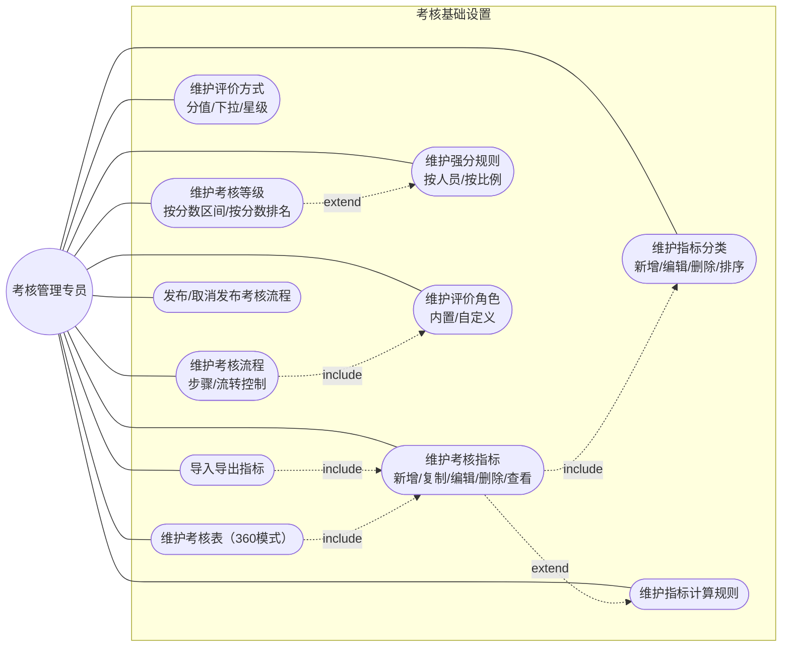
```mermaid
flowchart LR
    A1((考核管理专员))

    subgraph P1["考核基础设置"]
        direction TB
        U11(["维护指标分类<br/>新增/编辑/删除/排序"])
        U12(["维护考核指标<br/>新增/复制/编辑/删除/查看"])
        U13(["导入导出指标"])
        U14(["维护评价方式<br/>分值/下拉/星级"])
        U15(["维护指标计算规则"])
        U16(["维护考核等级<br/>按分数区间/按分数排名"])
        U17(["维护强分规则<br/>按人员/按比例"])
        U18(["维护考核表（360模式）"])
        U19(["维护评价角色<br/>内置/自定义"])
        U110(["维护考核流程<br/>步骤/流转控制"])
        U111(["发布/取消发布考核流程"])
    end

    A1 --- U11
    A1 --- U12
    A1 --- U13
    A1 --- U14
    A1 --- U15
    A1 --- U16
    A1 --- U17
    A1 --- U18
    A1 --- U19
    A1 --- U110
    A1 --- U111

    U12 -.->|include| U11
    U12 -.->|extend| U15
    U13 -.->|include| U12
    U16 -.->|extend| U17
    U110 -.->|include| U19
    U18 -.->|include| U12
```

### 2.2 考核过程管理

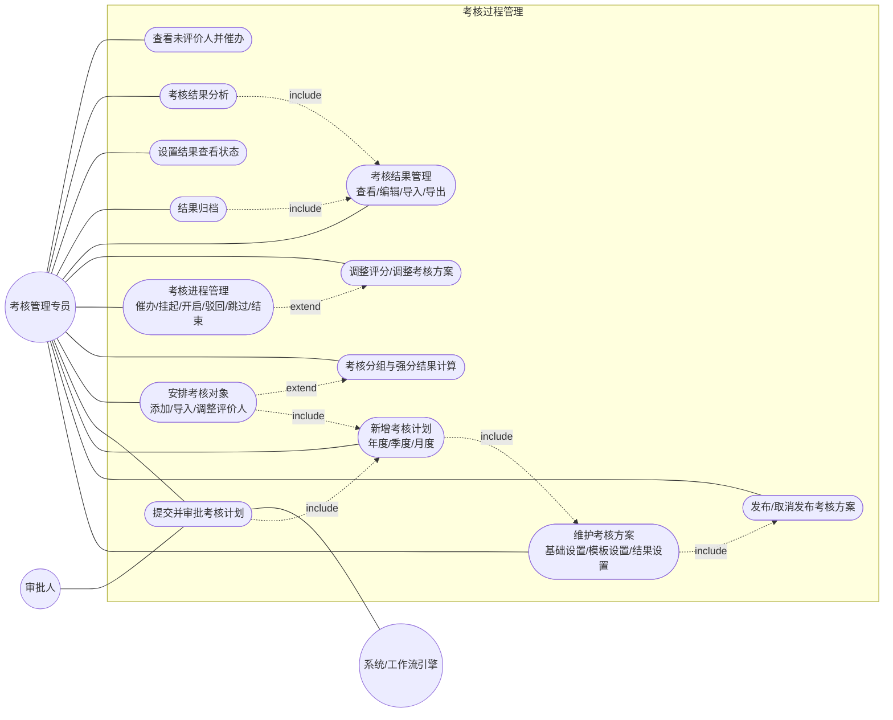
```mermaid
flowchart LR
    A2((考核管理专员))
    A3((审批人))
    SYS((系统/工作流引擎))

    subgraph P2["考核过程管理"]
        direction TB
        U21(["维护考核方案<br/>基础设置/模板设置/结果设置"])
        U22(["发布/取消发布考核方案"])
        U23(["新增考核计划<br/>年度/季度/月度"])
        U24(["提交并审批考核计划"])
        U25(["安排考核对象<br/>添加/导入/调整评价人"])
        U26(["考核分组与强分结果计算"])
        U27(["考核进程管理<br/>催办/挂起/开启/驳回/跳过/结束"])
        U28(["调整评分/调整考核方案"])
        U29(["考核结果管理<br/>查看/编辑/导入/导出"])
        U210(["结果归档"])
        U211(["设置结果查看状态"])
        U212(["考核结果分析"])
        U213(["查看未评价人并催办"])
    end

    A2 --- U21
    A2 --- U22
    A2 --- U23
    A2 --- U24
    A2 --- U25
    A2 --- U26
    A2 --- U27
    A2 --- U28
    A2 --- U29
    A2 --- U210
    A2 --- U211
    A2 --- U212
    A2 --- U213

    U21 -.->|include| U22
    U23 -.->|include| U21
    U24 -.->|include| U23
    U25 -.->|include| U23
    U25 -.->|extend| U26
    U27 -.->|extend| U28
    U210 -.->|include| U29
    U212 -.->|include| U29

    A3 --- U24
    U24 --- SYS
```

### 2.3 员工自助与移动端

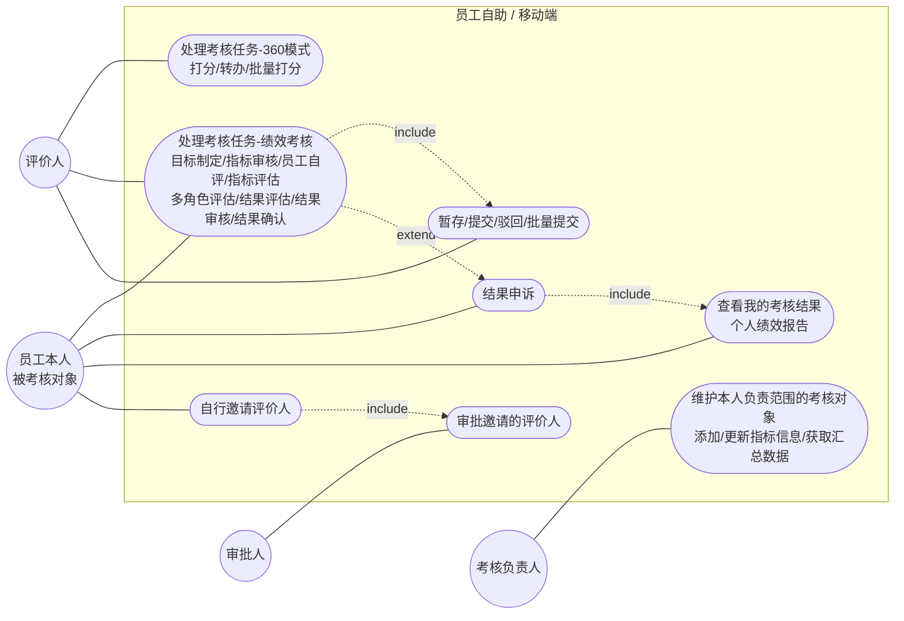
```mermaid
flowchart LR
    A4((员工本人<br/>被考核对象))
    A5((评价人))
    A6((考核负责人))
    A7((审批人))

    subgraph P3["员工自助 / 移动端"]
        direction TB
        U31(["处理考核任务-360模式<br/>打分/转办/批量打分"])
        U32(["处理考核任务-绩效考核<br/>目标制定/指标审核/员工自评/指标评估<br/>多角色评估/结果评估/结果审核/结果确认"])
        U33(["暂存/提交/驳回/批量提交"])
        U34(["结果申诉"])
        U35(["查看我的考核结果<br/>个人绩效报告"])
        U36(["维护本人负责范围的考核对象<br/>添加/更新指标信息/获取汇总数据"])
        U37(["自行邀请评价人"])
        U38(["审批邀请的评价人"])
    end

    A5 --- U31
    A5 --- U32
    A5 --- U33
    A4 --- U32
    A4 --- U34
    A4 --- U35
    A6 --- U36
    A4 --- U37
    A7 --- U38

    U32 -.->|include| U33
    U32 -.->|extend| U34
    U34 -.->|include| U35
    U37 -.->|include| U38
```

---

## 3. 类图 Class Diagram（领域模型）

### 3.1 考核基础设置域

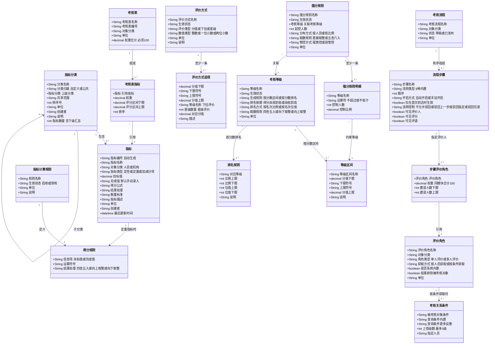
```mermaid
classDiagram
    class 指标分类 {
        +String 分类名称
        +String 分类归属 自定义或公共
        +指标分类 上级分类
        +String 共享范围
        +int 排序号
        +String 单位
        +String 创建者
        +String 说明
        +int 指标数量 含下级汇总
    }
    class 指标 {
        +String 指标编号 自动生成
        +String 指标名称
        +String 对象分类 人员或机构
        +String 指标类型 定性或定量或加减分项
        +decimal 目标值
        +String 完成值 默认手动录入
        +String 得分公式
        +String 结果处理
        +String 衡量标准
        +String 指标描述
        +String 单位
        +String 创建者
        +datetime 最后更新时间
    }
    class 得分规则 {
        +String 信息项 目标值或完成值
        +String 运算符号
        +String 结果处理 四舍五入或向上取整或向下取整
    }
    class 指标计算规则 {
        +String 规则名称
        +String 生效状态 启用或禁用
        +String 单位
        +String 说明
    }
    class 评价方式 {
        +String 评价方式名称
        +String 生效状态
        +String 评价类型 分值或下拉或星级
        +String 数值类型 整数或一位小数或两位小数
        +String 单位
        +String 说明
    }
    class 评价方式选项 {
        +decimal 分值下限
        +String 下限符号
        +String 上限符号
        +decimal 分值上限
        +String 等级名称 下拉评价
        +int 星级数量 星级评价
        +decimal 对应分值
        +String 描述
    }
    class 考核等级 {
        +String 等级名称
        +String 生效状态
        +String 生成规则 按分数区间或按分数排名
        +String 排名依据 得分由高到低或由低到高
        +String 排名方式 按名次比例或按名次位值
        +String 取数规则 四舍五入或向下取整或向上取整
        +String 单位
    }
    class 等级区间 {
        +String 等级区间名称
        +decimal 分值下限
        +String 下限符号
        +String 上限符号
        +decimal 分值上限
        +String 说明
    }
    class 排名规则 {
        +String 对应等级
        +int 比例上限
        +int 比例下限
        +int 位值上限
        +int 位值下限
        +String 说明
    }
    class 强分规则 {
        +String 强分规则名称
        +String 生效状态
        +考核等级 关联考核等级
        +int 起控人数
        +String 分布方式 按人员或按比例
        +String 取数规则 直接取整或五舍六入
        +String 管控方式 强管控或弱管控
        +String 单位
    }
    class 强分规则明细 {
        +String 等级名称
        +String 运算符 不超过或不低于
        +int 控制人数
        +decimal 控制比例
    }
    class 考核表 {
        +String 考核表名称
        +String 考核表编号
        +String 对象分类
        +String 单位
        +decimal 权重合计 必须100
    }
    class 考核表指标 {
        +指标 引用指标
        +decimal 权重
        +decimal 评分区间下限
        +decimal 评分区间上限
        +int 排序
    }
    class 评价角色 {
        +String 评价角色名称
        +String 对象分类
        +String 角色类型 单人评价或多人评价
        +String 获取方式 按人员获取或按条件获取
        +boolean 是否系统内置
        +boolean 结果排除被考核对象
        +String 单位
    }
    class 考核关系条件 {
        +String 被考核对象条件
        +String 查询条件内置
        +String 查询条件更多设置
        +int 上查级数 最多5级
        +String 指定人员
    }
    class 考核流程 {
        +String 考核流程名称
        +String 对象分类
        +String 状态 草稿或已发布
        +String 单位
    }
    class 流程步骤 {
        +String 步骤名称
        +String 流转类型 8种内置
        +int 顺序
        +String 开启方式 自动开启或手动开启
        +boolean 仅在首次到达时生效
        +String 流转控制 不允许驳回或驳回上一步或驳回指定或驳回任意
        +boolean 可见评价人
        +boolean 可见评分
        +boolean 可见评语
    }
    class 步骤评价角色 {
        +评价角色 评价角色
        +decimal 权重 同模块合计100
        +int 邀请人数下限
        +int 邀请人数上限
    }

    指标分类 "1" --> "0..*" 指标 : 包含
    指标分类 "1" --> "0..*" 指标分类 : 子分类
    指标 "1" --> "0..1" 得分规则 : 定量指标时
    指标计算规则 "1" --> "1" 得分规则 : 定义
    评价方式 "1" --> "1..*" 评价方式选项 : 至少一条
    考核等级 "1" --> "1..*" 等级区间 : 按分数区间
    考核等级 "1" --> "1..*" 排名规则 : 按分数排名
    强分规则 "1" --> "1..*" 强分规则明细 : 至少一条
    强分规则 "*" --> "1" 考核等级 : 关联
    强分规则明细 "*" --> "1" 等级区间 : 约束等级
    考核表 "1" --> "1..*" 考核表指标 : 组成
    考核表指标 "*" --> "1" 指标 : 引用
    评价角色 "1" --> "1..*" 考核关系条件 : 按条件获取时
    考核流程 "1" --> "1..*" 流程步骤 : 有序组成
    流程步骤 "1" --> "1..*" 步骤评价角色 : 指定评价人
    步骤评价角色 "*" --> "1" 评价角色 : 引用
```

### 3.2 考核过程管理域（方案 · 计划 · 对象 · 结果）

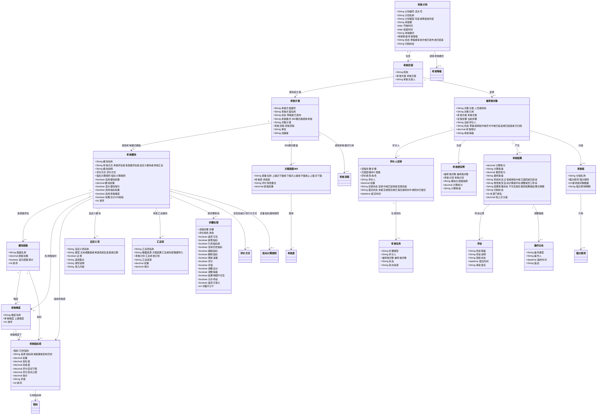
```mermaid
classDiagram
    class 考核方案 {
        +String 考核方案编号
        +String 考核方案名称
        +String 状态 草稿或已发布
        +String 考核模式 360模式或绩效考核
        +String 对象分类
        +考核流程 考核流程
        +String 单位
        +String 创建者
    }
    class 考核模块 {
        +String 模块名称
        +String 考核方式 考核评估或多层级评估或自定义模块或考核汇总
        +String 模块说明
        +评价方式 评价方式
        +指标计算规则 指标计算规则
        +boolean 启用模块权重
        +decimal 模块权重
        +boolean 显示模块得分
        +boolean 启用指标权重
        +boolean 启用考核维度
        +boolean 权重合计100校验
        +int 排序
    }
    class 模块层级 {
        +String 层级名称
        +decimal 层级权重
        +boolean 显示层级得分
        +int 排序
    }
    class 方案层级360 {
        +String 层级名称 上级对下级或下级对上级或平级或上上级对下级
        +考核表 考核表
        +String 评价角色集合
        +decimal 层级权重
    }
    class 考核维度 {
        +String 维度名称
        +考核维度 上级维度
        +int 排序
    }
    class 考核指标项 {
        +指标 引用指标
        +String 来源 指标库或新建或复制历史
        +decimal 权重
        +decimal 目标值
        +decimal 完成值
        +decimal 评分区间下限
        +decimal 评分区间上限
        +decimal 得分
        +String 评语
        +int 排序
    }
    class 自定义项 {
        +String 自定义项名称
        +String 类型 文本或数值或单选项或复选框或日期
        +boolean 必填
        +String 选项集合
        +String 填写说明
        +String 录入内容
    }
    class 汇总项 {
        +String 汇总项名称
        +String 数据来源 方案结果汇总或外部数据导入
        +考核计划 汇总考核计划
        +String 汇总来源
        +decimal 权重
        +decimal 得分
    }
    class 步骤权限 {
        +流程步骤 步骤
        +评价角色 角色
        +boolean 是否可见
        +boolean 新增指标
        +boolean 引用指标库
        +boolean 复制历史指标
        +boolean 编辑指标
        +boolean 删除指标
        +boolean 更新进展
        +boolean 评分
        +boolean 评语
        +boolean 调整总分
        +boolean 调整等级
        +boolean 结果明细不可见
        +boolean 允许申诉
        +boolean 是否可录入
        +int 字数不少于
    }
    class 考核计划 {
        +String 计划编号 流水号
        +String 计划名称
        +String 计划类型 年度或季度或月度
        +String 考核期
        +date 开始时间
        +date 结束时间
        +String 考核模式
        +考核等级 考核等级
        +String 状态 草稿或审批中或已发布或已结束
        +String 归档状态
    }
    class 考核范围 {
        +String 机构
        +考核方案 考核方案
        +String 考核负责人
    }
    class 被考核对象 {
        +String 对象分类 人员或机构
        +String 对象引用
        +考核方案 考核方案
        +流程步骤 当前步骤
        +String 当前评价人
        +String 状态 草稿或审批中或评价中或已挂起或已结束或已归档
        +decimal 考核得分
        +String 考核等级
    }
    class 评价人安排 {
        +流程步骤 步骤
        +方案层级360 层级
        +评价角色 角色
        +String 评价人
        +decimal 权重
        +String 安排状态 安排中或已安排或安排失败
        +String 提交状态 未提交或暂存或已提交或转办中或转办已提交
        +datetime 提交时间
    }
    class 考核组 {
        +String 分组名称
        +强分规则 强分规则
        +int 被考核对象数量
        +String 强分控制明细
    }
    class 考核表实例 {
        +被考核对象 被考核对象
        +考核计划 考核计划
        +String 模块与层级快照
        +decimal 计算得分
        +String 计算等级
    }
    class 考核结果 {
        +decimal 计算得分
        +String 计算等级
        +decimal 最终得分
        +String 最终等级
        +String 申诉状态 正常或审批中或已退回或已结束
        +String 修改类型 自动计算或手动调整或员工申诉
        +String 结果查看状态 不可见或仅最终结果或结果与明细
        +String 归档状态
        +int 本部门排名
        +decimal 较上次分差
    }
    class 考核任务 {
        +String 步骤类型
        +String 评价人
        +被考核对象 被考核对象
        +String 状态
        +String 待办来源
    }
    class 申诉 {
        +String 申诉等级
        +String 申诉说明
        +String 审批状态
        +datetime 提交时间
        +String 审批意见
    }
    class 操作日志 {
        +String 操作类型
        +String 操作人
        +datetime 操作时间
        +String 描述
    }

    考核方案 "1" --> "1..*" 考核模块 : 绩效考核模式模板
    考核方案 "1" --> "1..*" 方案层级360 : 360模式模板
    考核方案 "1" --> "0..1" 考核流程 : 绩效考核模式引用
    考核模块 "1" --> "0..*" 模块层级 : 多层级评估
    考核模块 "1" --> "0..*" 考核维度 : 启用维度时
    考核模块 "1" --> "0..*" 考核指标项 : 组成考核表
    考核模块 "1" --> "1..*" 自定义项 : 自定义模块
    考核模块 "1" --> "1..*" 汇总项 : 考核汇总模块
    考核模块 "1" --> "1..*" 步骤权限 : 按步骤授权
    考核模块 "*" --> "0..1" 评价方式 : 定性加减分项打分方式
    考核模块 "*" --> "0..1" 指标计算规则 : 定量指标通用规则
    模块层级 "1" --> "0..*" 考核维度 : 维度
    模块层级 "1" --> "0..*" 考核指标项 : 指标
    考核维度 "1" --> "0..*" 考核指标项 : 末级维度下
    方案层级360 "*" --> "1" 考核表 : 使用
    考核计划 "1" --> "1..*" 考核范围 : 包含
    考核范围 "*" --> "1" 考核方案 : 使用该方案
    考核范围 "1" --> "0..*" 被考核对象 : 安排
    考核计划 "*" --> "0..1" 考核等级 : 绩效考核模式
    被考核对象 "1" --> "1..*" 评价人安排 : 评价人
    被考核对象 "1" --> "1" 考核表实例 : 生成
    被考核对象 "1" --> "0..1" 考核结果 : 产生
    被考核对象 "*" --> "0..1" 考核组 : 分组
    考核组 "*" --> "0..1" 强分规则 : 引用
    评价人安排 "1" --> "0..1" 考核任务 : 生成待办
    考核结果 "1" --> "0..*" 申诉 : 申诉记录
    考核结果 "1" --> "0..*" 操作日志 : 调整留痕
    考核指标项 "*" --> "1" 指标 : 引用指标库
```

---

## 4. 对象图 Object Diagram（运行时刻实例快照）

场景：**2024 年度绩效考核计划** 已发布，被考核对象「张三」处于「员工自评」步骤的某时刻快照。

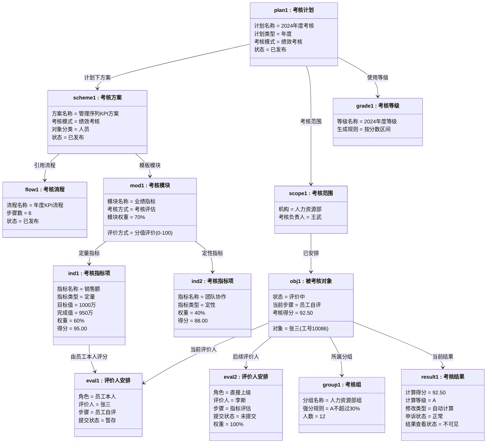
```mermaid
classDiagram
    class plan1["plan1 : 考核计划"] {
        计划名称 = 2024年度考核
        计划类型 = 年度
        考核模式 = 绩效考核
        状态 = 已发布
    }
    class scheme1["scheme1 : 考核方案"] {
        方案名称 = 管理序列KPI方案
        考核模式 = 绩效考核
        对象分类 = 人员
        状态 = 已发布
    }
    class flow1["flow1 : 考核流程"] {
        流程名称 = 年度KPI流程
        步骤数 = 6
        状态 = 已发布
    }
    class scope1["scope1 : 考核范围"] {
        机构 = 人力资源部
        考核负责人 = 王武
    }
    class obj1["obj1 : 被考核对象"] {
        对象 = 张三(工号10086)
        状态 = 评价中
        当前步骤 = 员工自评
        考核得分 = 92.50
    }
    class mod1["mod1 : 考核模块"] {
        模块名称 = 业绩指标
        考核方式 = 考核评估
        模块权重 = 70%
        评价方式 = 分值评价(0-100)
    }
    class ind1["ind1 : 考核指标项"] {
        指标名称 = 销售额
        指标类型 = 定量
        目标值 = 1000万
        完成值 = 950万
        权重 = 60%
        得分 = 95.00
    }
    class ind2["ind2 : 考核指标项"] {
        指标名称 = 团队协作
        指标类型 = 定性
        权重 = 40%
        得分 = 88.00
    }
    class eval1["eval1 : 评价人安排"] {
        角色 = 员工本人
        评价人 = 张三
        步骤 = 员工自评
        提交状态 = 暂存
    }
    class eval2["eval2 : 评价人安排"] {
        角色 = 直接上级
        评价人 = 李斯
        步骤 = 指标评估
        提交状态 = 未提交
        权重 = 100%
    }
    class grade1["grade1 : 考核等级"] {
        等级名称 = 2024年度等级
        生成规则 = 按分数区间
    }
    class group1["group1 : 考核组"] {
        分组名称 = 人力资源部组
        强分规则 = A不超过30%
        人数 = 12
    }
    class result1["result1 : 考核结果"] {
        计算得分 = 92.50
        计算等级 = A
        修改类型 = 自动计算
        申诉状态 = 正常
        结果查看状态 = 不可见
    }

    plan1 --> scheme1 : 计划下方案
    plan1 --> scope1 : 考核范围
    plan1 --> grade1 : 使用等级
    scheme1 --> flow1 : 引用流程
    scheme1 --> mod1 : 模板模块
    scope1 --> obj1 : 已安排
    obj1 --> eval1 : 当前评价人
    obj1 --> eval2 : 后续评价人
    obj1 --> group1 : 所属分组
    obj1 --> result1 : 当前结果
    mod1 --> ind1 : 定量指标
    mod1 --> ind2 : 定性指标
    ind1 --> eval1 : 由员工本人评分
```

---

## 5. 包图 Package Diagram（模块划分与依赖）

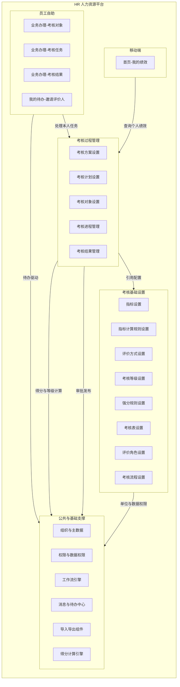
```mermaid
flowchart TB
    subgraph VHR["HR 人力资源平台"]
        direction TB
        subgraph PKG_BASE["考核基础设置"]
            direction LR
            P11[指标设置]
            P12[指标计算规则设置]
            P13[评价方式设置]
            P14[考核等级设置]
            P15[强分规则设置]
            P16[考核表设置]
            P17[评价角色设置]
            P18[考核流程设置]
        end
        subgraph PKG_PROC["考核过程管理"]
            direction LR
            P21[考核方案设置]
            P22[考核计划设置]
            P23[考核对象设置]
            P24[考核进程管理]
            P25[考核结果管理]
        end
        subgraph PKG_ESS["员工自助"]
            direction LR
            P31[业务办理-考核对象]
            P32[业务办理-考核任务]
            P33[业务办理-考核结果]
            P34[我的待办-邀请评价人]
        end
        subgraph PKG_MOB["移动端"]
            direction LR
            P41[首页-我的绩效]
        end
        subgraph PKG_COMMON["公共与基础支撑"]
            direction LR
            P51[组织与主数据]
            P52[权限与数据权限]
            P53[工作流引擎]
            P54[消息与待办中心]
            P55[导入导出组件]
            P56[得分计算引擎]
        end
    end

    PKG_PROC -->|引用配置| PKG_BASE
    PKG_ESS -->|处理本人任务| PKG_PROC
    PKG_MOB -->|查询个人绩效| PKG_PROC
    PKG_BASE -->|单位与数据权限| PKG_COMMON
    PKG_PROC -->|审批发布| PKG_COMMON
    PKG_ESS -->|待办驱动| PKG_COMMON
    PKG_PROC -->|得分与等级计算| PKG_COMMON
```

---

## 6. 组件图 Component Diagram（逻辑组件与接口）

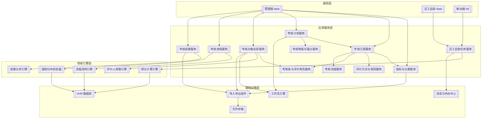
```mermaid
flowchart TB
    subgraph CLIENT["展现层"]
        C1[[管理端 Web]]
        C2[[员工自助 Web]]
        C3[[移动端 H5]]
    end

    subgraph SERVICE["应用服务层"]
        S1[[指标与分类服务]]
        S2[[评价方式与规则服务]]
        S3[[考核等级与强分服务]]
        S4[[考核表与评价角色服务]]
        S5[[考核流程服务]]
        S6[[考核方案服务]]
        S7[[考核计划服务]]
        S8[[考核对象安排服务]]
        S9[[考核进程服务]]
        S10[[考核结果服务]]
        S11[[员工自助任务服务]]
    end

    subgraph ENGINE["领域引擎层"]
        E1[[得分计算引擎]]
        E2[[强制分布校验器]]
        E3[[流程流转引擎]]
        E4[[评价人获取引擎]]
        E5[[结果分析引擎]]
    end

    subgraph INFRA["基础设施层"]
        I1[[工作流引擎]]
        I2[[消息与待办中心]]
        I3[[导入导出组件]]
        I4[[文件存储]]
        I5[[VHR 数据库]]
    end

    C1 --> S1
    C1 --> S6
    C1 --> S7
    C1 --> S8
    C1 --> S9
    C1 --> S10
    C2 --> S11
    C3 --> S11

    S6 --> S1
    S6 --> S2
    S6 --> S4
    S6 --> S5
    S7 --> S6
    S7 --> S3
    S8 --> S4
    S8 --> E4
    S9 --> E3
    S10 --> E5
    S11 --> E1

    S8 --> I1
    S7 --> I1
    S11 --> I2
    S1 --> I3
    S8 --> I3
    S10 --> I3
    E1 --> I5
    E2 --> I5
    E3 --> I5
    I3 --> I4
    S9 --> E2
```

---

## 7. 部署图 Deployment Diagram（物理节点与工件）

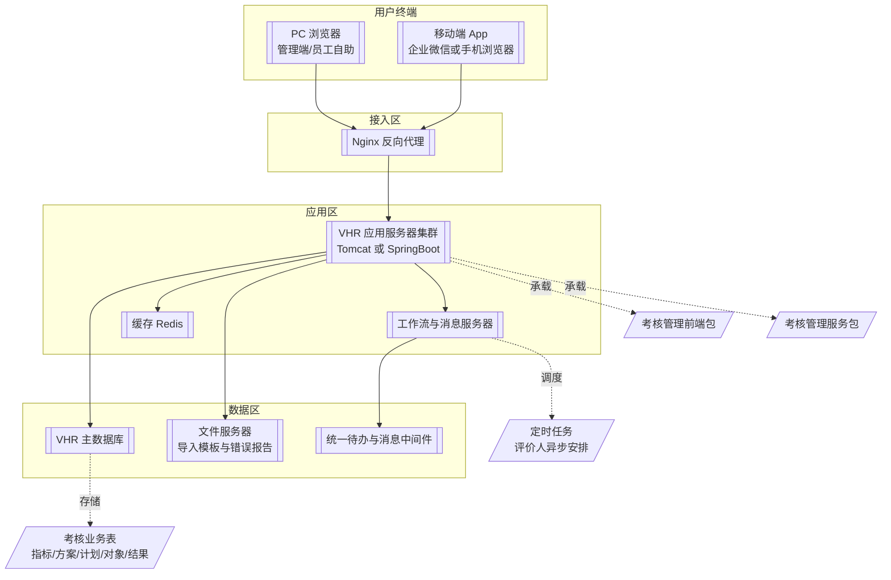
```mermaid
flowchart TB
    subgraph ZONE_USER["用户终端"]
        N1[["PC 浏览器<br/>管理端/员工自助"]]
        N2[["移动端 App<br/>企业微信或手机浏览器"]]
    end
    subgraph ZONE_DMZ["接入区"]
        N3[["Nginx 反向代理"]]
    end
    subgraph ZONE_APP["应用区"]
        N4[["VHR 应用服务器集群<br/>Tomcat 或 SpringBoot"]]
        N5[["工作流与消息服务器"]]
        N6[["缓存 Redis"]]
    end
    subgraph ZONE_DATA["数据区"]
        N7[["VHR 主数据库"]]
        N8[["文件服务器<br/>导入模板与错误报告"]]
        N9[["统一待办与消息中间件"]]
    end

    ART1[/"考核管理前端包"/]
    ART2[/"考核管理服务包"/]
    ART3[/"考核业务表<br/>指标/方案/计划/对象/结果"/]
    ART4[/"定时任务<br/>评价人异步安排"/]

    N1 --> N3
    N2 --> N3
    N3 --> N4
    N4 --> N5
    N4 --> N6
    N4 --> N7
    N4 --> N8
    N5 --> N9
    N4 -.承载.-> ART1
    N4 -.承载.-> ART2
    N7 -.存储.-> ART3
    N5 -.调度.-> ART4
```

---

## 8. 组合结构图 Composite Structure Diagram（考核模板内部结构）

以「绩效考核模式 · 考核方案模板」为例，展示其内部部件、端口与连接器。

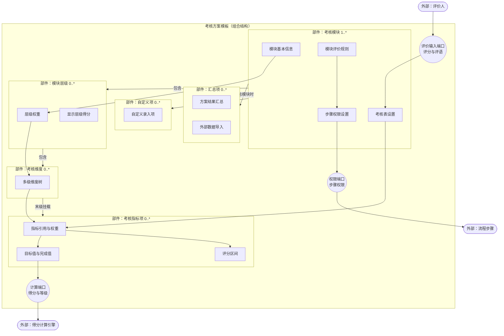
```mermaid
flowchart TB
    subgraph CTX["考核方案模板（组合结构）"]
        direction TB
        PORT_IN((评价输入端口<br/>评分与评语))
        PORT_CALC((计算端口<br/>得分与等级))
        PORT_PERM((权限端口<br/>步骤权限))

        subgraph PART_MOD["部件：考核模块 1..*"]
            M1[模块基本信息]
            M2[模块评价规则]
            M3[考核表设置]
            M4[步骤权限设置]
        end
        subgraph PART_LVL["部件：模块层级 0..*"]
            L1[层级权重]
            L2[显示层级得分]
        end
        subgraph PART_DIM["部件：考核维度 0..*"]
            D1[多级维度树]
        end
        subgraph PART_IND["部件：考核指标项 0..*"]
            I1[指标引用与权重]
            I2[目标值与完成值]
            I3[评分区间]
        end
        subgraph PART_CUS["部件：自定义项 0..*"]
            K1[自定义录入项]
        end
        subgraph PART_SUM["部件：汇总项 0..*"]
            U1[方案结果汇总]
            U2[外部数据导入]
        end
    end

    EVAL_ROLE([外部：评价人])
    CALC_ENGINE([外部：得分计算引擎])
    STEP([外部：流程步骤])

    EVAL_ROLE --> PORT_IN
    PORT_IN --> M3
    M3 --> I1
    M2 --> M4
    M1 --> L1
    L1 --> D1
    D1 --> I1
    I1 --> I2
    I1 --> I3
    PART_MOD -->|包含| PART_LVL
    PART_LVL -->|包含| PART_DIM
    PART_DIM -->|末级挂载| PART_IND
    PART_MOD -->|自定义模块时| PART_CUS
    PART_MOD -->|汇总模块时| PART_SUM
    I2 --> PORT_CALC
    PORT_CALC --> CALC_ENGINE
    M4 --> PORT_PERM
    PORT_PERM --> STEP
```

---

## 9. 剖面图 Profile Diagram（构造型与扩展）

定义本模块的建模构造型（stereotype），约束领域对象的建模语义。

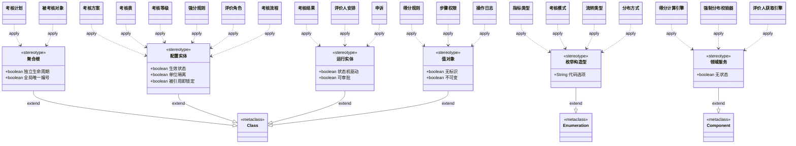
```mermaid
classDiagram
    class Class <<metaclass>>
    class Enumeration <<metaclass>>
    class Component <<metaclass>>
    class 聚合根 <<stereotype>> {
        +boolean 独立生命周期
        +boolean 全局唯一编号
    }
    class 配置实体 <<stereotype>> {
        +boolean 生效状态
        +boolean 单位隔离
        +boolean 被引用即锁定
    }
    class 运行实体 <<stereotype>> {
        +boolean 状态机驱动
        +boolean 可审批
    }
    class 值对象 <<stereotype>> {
        +boolean 无标识
        +boolean 不可变
    }
    class 枚举构造型 <<stereotype>> {
        +String 代码选项
    }
    class 领域服务 <<stereotype>> {
        +boolean 无状态
    }

    聚合根 --|> Class : extend
    配置实体 --|> Class : extend
    运行实体 --|> Class : extend
    值对象 --|> Class : extend
    枚举构造型 --|> Enumeration : extend
    领域服务 --|> Component : extend

    class 考核计划
    class 被考核对象
    class 考核方案
    class 考核表
    class 考核等级
    class 强分规则
    class 评价角色
    class 考核流程
    class 考核结果
    class 评价人安排
    class 申诉
    class 得分规则
    class 步骤权限
    class 操作日志
    class 指标类型
    class 考核模式
    class 流转类型
    class 分布方式
    class 得分计算引擎
    class 强制分布校验器
    class 评价人获取引擎

    考核计划 ..> 聚合根 : apply
    被考核对象 ..> 聚合根 : apply
    考核方案 ..> 配置实体 : apply
    考核表 ..> 配置实体 : apply
    考核等级 ..> 配置实体 : apply
    强分规则 ..> 配置实体 : apply
    评价角色 ..> 配置实体 : apply
    考核流程 ..> 配置实体 : apply
    考核结果 ..> 运行实体 : apply
    评价人安排 ..> 运行实体 : apply
    申诉 ..> 运行实体 : apply
    得分规则 ..> 值对象 : apply
    步骤权限 ..> 值对象 : apply
    操作日志 ..> 值对象 : apply
    指标类型 ..> 枚举构造型 : apply
    考核模式 ..> 枚举构造型 : apply
    流转类型 ..> 枚举构造型 : apply
    分布方式 ..> 枚举构造型 : apply
    得分计算引擎 ..> 领域服务 : apply
    强制分布校验器 ..> 领域服务 : apply
    评价人获取引擎 ..> 领域服务 : apply
```

---

## 10. 活动图 Activity Diagram

### 10.1 考核业务端到端主流程（带泳道）

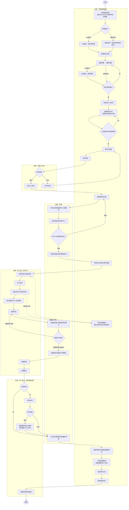
```mermaid
flowchart TB
    START([开始])

    subgraph LANE_HR["泳道：考核管理专员"]
        A1[考核基础设置<br/>指标/评价方式/计算规则/考核等级]
        A2{考核模式?}
        A3[360模式：维护考核表]
        A4[绩效考核：维护考核流程与步骤]
        A5[新建考核方案]
        A6[基础设置 → 模板设置]
        A7[360模式：结果设置]
        A8{发布校验通过?}
        A9[方案状态=已发布]
        A10[新建考核计划<br/>设置考核范围与方案]
        A11{计划类型与考核期校验}
        A12[保存为草稿]
        A13[提交审批]
        A14[安排被考核对象]
        A15[考核分组与强分规则设置]
        A16[考核进程管理<br/>催办/挂起/开启/驳回/跳过]
        A17[结束考核并设置结果查看状态]
        A18[考核结果管理<br/>查看/编辑/导入/导出]
        A19[归档考核计划]
        A20[考核结果分析]
    end

    subgraph LANE_WF["泳道：审批工作流"]
        W1{审批结果}
        W2[状态=已发布]
        W3[工作流否决]
    end

    subgraph LANE_SYS["泳道：系统"]
        S1[自动生成指标编号与计划编号]
        S2[异步获取并安排评价人]
        S3{评价人全部安排成功?}
        S4[生成考核表实例并推送待办]
        S5[定量指标按计算规则自动算分]
        S6{强制分布校验}
        S7[按等级生成规则计算等级]
        S8[汇总各步骤得分得出最终结果]
    end

    subgraph LANE_EV["泳道：员工本人与评价人"]
        E1[目标制定与指标审核]
        E2[员工自评]
        E3[指标评估与多角色评估]
        E4[自行邀请评价人并经审批]
        E5[结果评估]
        E6[结果审核]
        E7[结果确认]
    end

    subgraph LANE_EMP["泳道：员工本人（自助/移动端）"]
        P1{是否申诉}
        P2[提交申诉]
        P3{申诉审批}
        P4[更新最终得分与等级<br/>修改类型=员工申诉]
        P5[查看我的绩效结果]
    end

    END([结束])

    START --> A1 --> A2
    A2 -->|360模式| A3
    A2 -->|绩效考核| A4
    A3 --> A5
    A4 --> A5
    A5 --> A6
    A6 -->|360模式| A7
    A7 --> A8
    A6 -->|绩效考核| A8
    A8 -->|否| A6
    A8 -->|是| A9
    A9 --> A10 --> A11
    A11 -->|否| A10
    A11 -->|是| A12 --> A13 --> W1
    W1 -->|通过| W2
    W1 -->|否决| W3 --> A12
    W2 --> A14 --> S1 --> S2 --> S3
    S3 -->|失败| A14
    S3 -->|成功| S4
    S4 --> A15 --> E1 --> E2 --> E3
    E3 --> E4 --> E5 --> S5 --> S6
    S6 -->|强管控不通过| E5
    S6 -->|弱管控提示或通过| S7 --> E6 --> E7 --> P1
    E5 -.->|管理员干预| A16
    E3 -.->|管理员干预| A16
    A16 -.-> E1
    P1 -->|否| S8
    P1 -->|是| P2 --> P3
    P3 -->|通过| P4 --> S8
    P3 -->|否决| S8
    S8 --> A17 --> A18 --> A19 --> A20 --> P5 --> END
```

### 10.2 考核得分与等级计算活动（评分提交时）

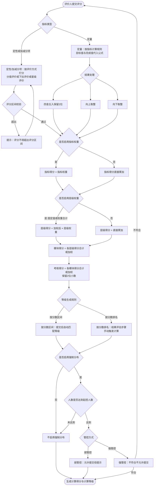
```mermaid
flowchart TB
    B0([评价人提交评分])
    B1{指标类型}
    B2[定量：按指标计算规则<br/>目标值与完成值代入公式]
    B3{结果处理}
    B4[四舍五入保留2位]
    B5[向上取整]
    B6[向下取整]
    B7[定性/加减分项：按评价方式打分<br/>分值评价或下拉评价或星级评价]
    B8{评分区间校验}
    B9[提示：评分不得超出评分区间]
    B10{是否启用指标权重}
    B11[指标得分 × 指标权重]
    B12[指标得分直接累加]
    B13{是否启用层级权重}
    B14[层级得分 = 加权后 × 层级权重]
    B15[层级得分 = 直接累加]
    B16[模块得分 = 各层级得分合计或加权]
    B17[考核得分 = 各模块得分合计或加权<br/>保留2位小数]
    B18{等级生成规则}
    B19[按分数区间：提交后自动匹配等级]
    B20[按分数排名：结果评估步骤手动触发计算]
    B21{是否启用强制分布}
    B22{人数是否达到起控人数}
    B23[不启用强制分布]
    B24{管控方式}
    B25[强管控：不符合不允许提交]
    B26[弱管控：允许提交但提示]
    B27([生成计算得分与计算等级])

    B0 --> B1
    B1 -->|定量| B2 --> B3
    B3 --> B4
    B3 --> B5
    B3 --> B6
    B1 -->|定性或加减分项| B7 --> B8
    B8 -->|超出| B9 --> B7
    B8 -->|通过| B10
    B4 --> B10
    B5 --> B10
    B6 --> B10
    B10 -->|是| B11 --> B13
    B10 -->|否| B12 --> B13
    B13 -->|是 固定值或权重合计| B14 --> B16
    B13 -->|否| B15 --> B16
    B16 --> B17 --> B18
    B18 -->|按分数区间| B19 --> B21
    B18 -->|按分数排名| B20 --> B21
    B21 -->|否| B23 --> B27
    B21 -->|是| B22
    B22 -->|未达到| B23
    B22 -->|达到| B24
    B24 -->|强管控| B25
    B24 -->|弱管控| B26 --> B27
    B25 -->|不符合| B0
    B25 -->|符合| B27
```

---

## 11. 状态机图 State Machine Diagram

### 11.1 考核方案与考核流程

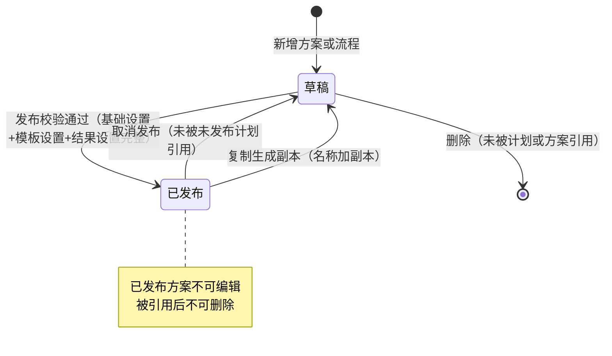
```mermaid
stateDiagram-v2
    [*] --> 草稿 : 新增方案或流程
    草稿 --> 已发布 : 发布校验通过（基础设置+模板设置+结果设置完整）
    已发布 --> 草稿 : 取消发布（未被未发布计划引用）
    已发布 --> 草稿 : 复制生成副本（名称加副本）
    草稿 --> [*] : 删除（未被计划或方案引用）
    note right of 已发布
        已发布方案不可编辑
        被引用后不可删除
    end note
```

### 11.2 考核计划

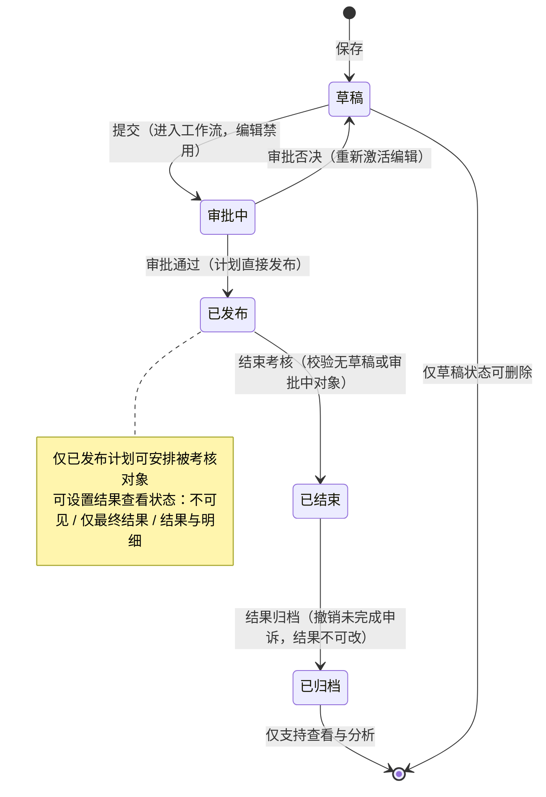
```mermaid
stateDiagram-v2
    [*] --> 草稿 : 保存
    草稿 --> 审批中 : 提交（进入工作流，编辑禁用）
    审批中 --> 草稿 : 审批否决（重新激活编辑）
    审批中 --> 已发布 : 审批通过（计划直接发布）
    已发布 --> 已结束 : 结束考核（校验无草稿或审批中对象）
    已结束 --> 已归档 : 结果归档（撤销未完成申诉，结果不可改）
    已归档 --> [*] : 仅支持查看与分析
    草稿 --> [*] : 仅草稿状态可删除
    note right of 已发布
        仅已发布计划可安排被考核对象
        可设置结果查看状态：不可见 / 仅最终结果 / 结果与明细
    end note
```

### 11.3 被考核对象

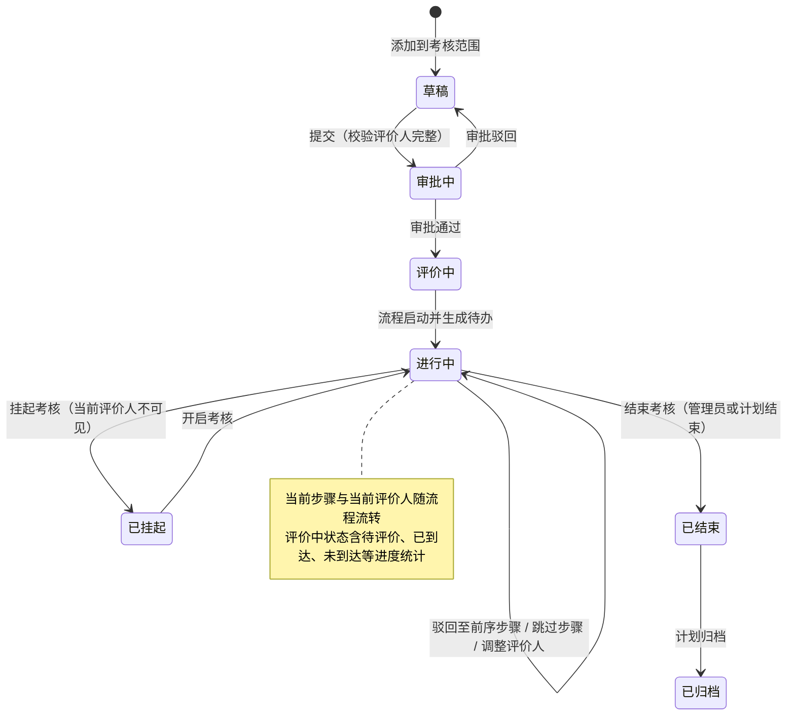
```mermaid
stateDiagram-v2
    [*] --> 草稿 : 添加到考核范围
    草稿 --> 审批中 : 提交（校验评价人完整）
    审批中 --> 草稿 : 审批驳回
    审批中 --> 评价中 : 审批通过
    评价中 --> 进行中 : 流程启动并生成待办
    进行中 --> 已挂起 : 挂起考核（当前评价人不可见）
    已挂起 --> 进行中 : 开启考核
    进行中 --> 进行中 : 驳回至前序步骤 / 跳过步骤 / 调整评价人
    进行中 --> 已结束 : 结束考核（管理员或计划结束）
    已结束 --> 已归档 : 计划归档
    note right of 进行中
        当前步骤与当前评价人随流程流转
        评价中状态含待评价、已到达、未到达等进度统计
    end note
```

### 11.4 评价人安排与考核任务

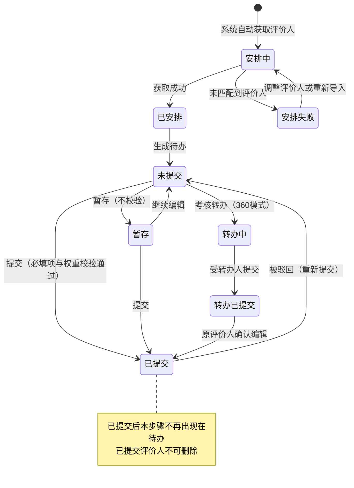
```mermaid
stateDiagram-v2
    [*] --> 安排中 : 系统自动获取评价人
    安排中 --> 已安排 : 获取成功
    安排中 --> 安排失败 : 未匹配到评价人
    安排失败 --> 安排中 : 调整评价人或重新导入
    已安排 --> 未提交 : 生成待办
    未提交 --> 暂存 : 暂存（不校验）
    暂存 --> 未提交 : 继续编辑
    未提交 --> 已提交 : 提交（必填项与权重校验通过）
    暂存 --> 已提交 : 提交
    已提交 --> 未提交 : 被驳回（重新提交）
    未提交 --> 转办中 : 考核转办（360模式）
    转办中 --> 转办已提交 : 受转办人提交
    转办已提交 --> 已提交 : 原评价人确认编辑
    note right of 已提交
        已提交后本步骤不再出现在待办
        已提交评价人不可删除
    end note
```

### 11.5 考核结果

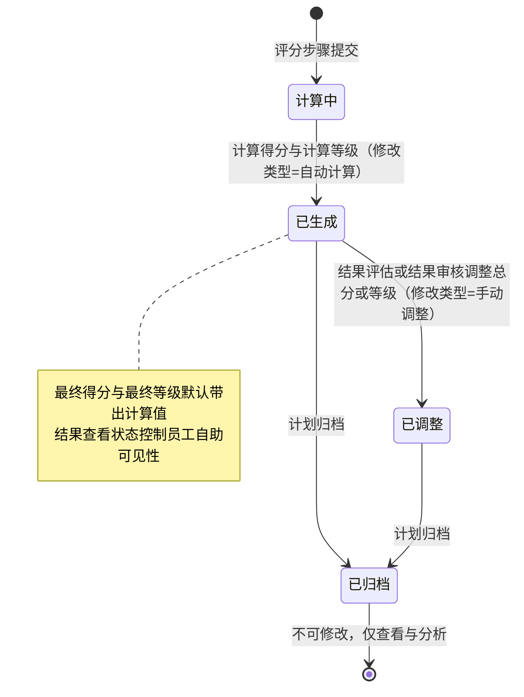
```mermaid
stateDiagram-v2
    [*] --> 计算中 : 评分步骤提交
    计算中 --> 已生成 : 计算得分与计算等级（修改类型=自动计算）
    已生成 --> 已调整 : 结果评估或结果审核调整总分或等级（修改类型=手动调整）
    已生成 --> 已归档 : 计划归档
    已调整 --> 已归档 : 计划归档
    已归档 --> [*] : 不可修改，仅查看与分析
    note right of 已生成
        最终得分与最终等级默认带出计算值
        结果查看状态控制员工自助可见性
    end note
```

### 11.6 员工申诉

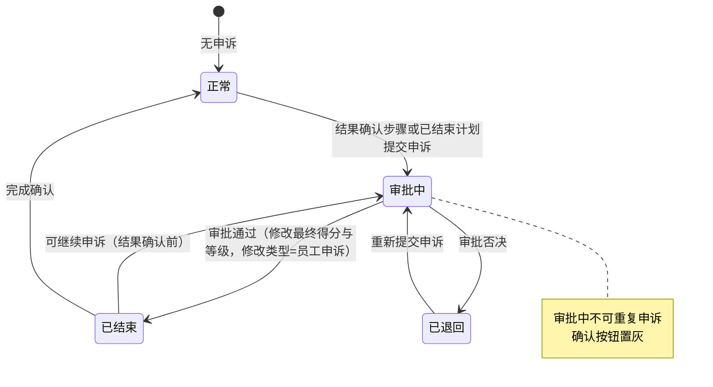
```mermaid
stateDiagram-v2
    [*] --> 正常 : 无申诉
    正常 --> 审批中 : 结果确认步骤或已结束计划提交申诉
    审批中 --> 已结束 : 审批通过（修改最终得分与等级，修改类型=员工申诉）
    审批中 --> 已退回 : 审批否决
    已结束 --> 审批中 : 可继续申诉（结果确认前）
    已退回 --> 审批中 : 重新提交申诉
    已结束 --> 正常 : 完成确认
    note right of 审批中
        审批中不可重复申诉
        确认按钮置灰
    end note
```

---

## 12. 序列图 Sequence Diagram

### 12.1 场景一：新增并发布考核方案

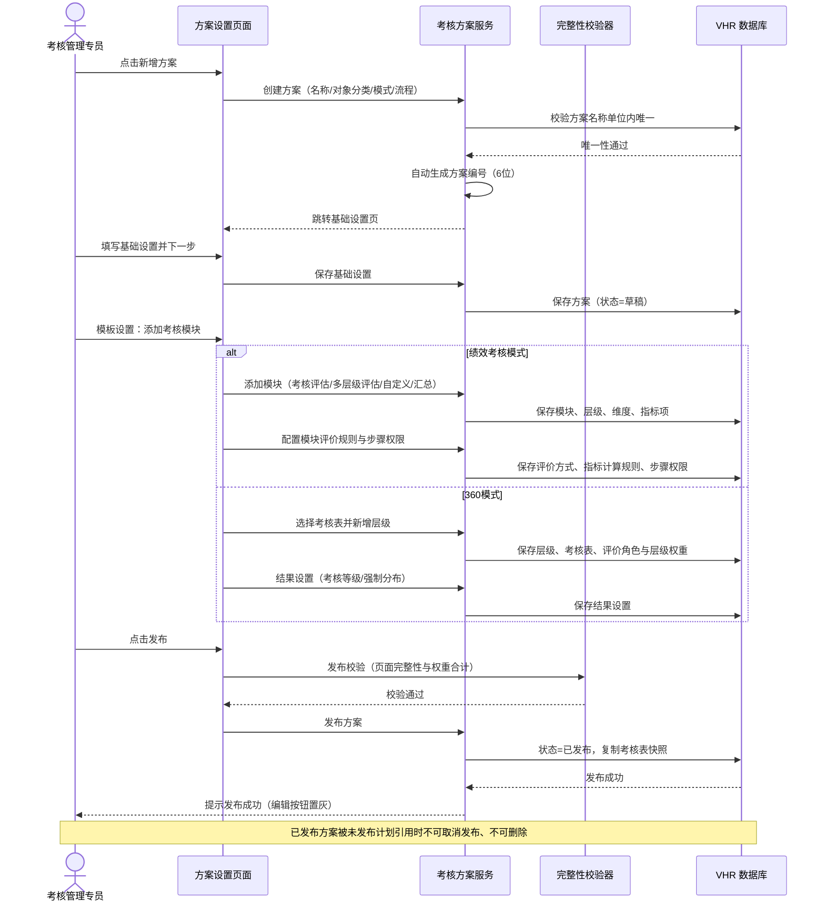
```mermaid
sequenceDiagram
    actor HR as 考核管理专员
    participant UI as 方案设置页面
    participant SV as 考核方案服务
    participant VL as 完整性校验器
    participant DB as VHR 数据库

    HR->>UI: 点击新增方案
    UI->>SV: 创建方案（名称/对象分类/模式/流程）
    SV->>DB: 校验方案名称单位内唯一
    DB-->>SV: 唯一性通过
    SV->>SV: 自动生成方案编号（6位）
    SV-->>UI: 跳转基础设置页
    HR->>UI: 填写基础设置并下一步
    UI->>SV: 保存基础设置
    SV->>DB: 保存方案（状态=草稿）
    HR->>UI: 模板设置：添加考核模块
    alt 绩效考核模式
        UI->>SV: 添加模块（考核评估/多层级评估/自定义/汇总）
        SV->>DB: 保存模块、层级、维度、指标项
        UI->>SV: 配置模块评价规则与步骤权限
        SV->>DB: 保存评价方式、指标计算规则、步骤权限
    else 360模式
        UI->>SV: 选择考核表并新增层级
        SV->>DB: 保存层级、考核表、评价角色与层级权重
        UI->>SV: 结果设置（考核等级/强制分布）
        SV->>DB: 保存结果设置
    end
    HR->>UI: 点击发布
    UI->>VL: 发布校验（页面完整性与权重合计）
    VL-->>UI: 校验通过
    UI->>SV: 发布方案
    SV->>DB: 状态=已发布，复制考核表快照
    DB-->>SV: 发布成功
    SV-->>HR: 提示发布成功（编辑按钮置灰）
    Note over HR,DB: 已发布方案被未发布计划引用时不可取消发布、不可删除
```

### 12.2 场景二：创建考核计划并审批发布

```mermaid
sequenceDiagram
    actor HR as 考核管理专员
    participant UI as 考核计划页面
    participant PS as 考核计划服务
    participant WF as 工作流引擎
    participant DB as VHR 数据库

    HR->>UI: 新增考核计划
    UI->>PS: 初始化计划编号（系统流水号）
    HR->>UI: 填写计划类型、考核期、起止时间、考核等级
    UI->>UI: 校验开始时间早于结束时间
    HR->>UI: 添加考核范围（机构与方案，上级机构互斥）
    UI->>PS: 增量保存考核范围与考核负责人
    PS->>DB: 查询已发布方案列表（按对象分类过滤）
    DB-->>UI: 返回可选方案
    HR->>UI: 点击保存
    UI->>PS: 保存计划
    PS->>DB: 计划状态=草稿
    HR->>UI: 点击提交
    UI->>PS: 提交计划（校验名称唯一与必填项）
    PS->>WF: 发起计划审批工作流
    PS->>DB: 计划状态=审批中（编辑禁用）
    WF-->>HR: 生成审批人待办
    alt 审批通过
        WF->>PS: 审批通过回调
        PS->>DB: 计划状态=已发布（记录发布时间）
        PS-->>HR: 计划发布完成，可安排考核对象
    else 审批否决
        WF->>PS: 审批否决回调
        PS->>DB: 计划状态=草稿（重新激活编辑）
        PS-->>HR: 提示被否决，可编辑后重新提交
    end
```

### 12.3 场景三：安排被考核对象与自动获取评价人

```mermaid
sequenceDiagram
    actor HR as 考核管理专员
    actor MGR as 考核负责人（员工自助）
    participant OS as 考核对象安排服务
    participant EE as 评价人获取引擎
    participant WF as 工作流引擎
    participant MSG as 消息与待办中心
    participant DB as VHR 数据库

    HR->>OS: 选择考核范围并添加被考核对象
    OS->>DB: 校验对象是否已存在（提示 XXX已存在列表中）
    OS->>DB: 创建对象（状态=草稿）并带出考核方案
    OS->>EE: 异步触发评价人获取（按评价角色规则）
    EE->>DB: 查询组织主数据（岗位上下级/部门/单位/机构负责人）
    DB-->>EE: 返回匹配人员
    EE->>DB: 写入评价人安排（状态=安排中）
    alt 安排成功
        EE->>DB: 状态=已安排
    else 安排失败
        EE->>DB: 状态=安排失败
        EE-->>HR: 提示需手动调整或导入评价人
    end
    HR->>OS: 调整评价人（补充或删除）
    OS->>DB: 校验已提交评价人不可删除、单层级至少一人
    HR->>OS: 设置考核分组与强分规则（绩效考核模式）
    OS->>DB: 计算各分组各等级强分人数
    HR->>OS: 提交被考核对象
    OS->>DB: 校验各层级是否有评价人（否则提示评价人缺失）
    OS->>WF: 发起对象审批
    OS->>DB: 对象状态=审批中
    WF-->>HR: 审批待办
    alt 审批通过
        WF->>OS: 通过回调
        OS->>DB: 对象状态=评价中
        OS->>MSG: 推送首个步骤评价人待办
        MSG-->>MGR: 展示待办任务
    else 审批驳回
        WF->>OS: 驳回回调
        OS->>DB: 对象状态=草稿
    end
```

### 12.4 场景四：评价人处理考核任务并提交（绩效考核模式）

```mermaid
sequenceDiagram
    actor EV as 评价人
    participant TS as 员工自助任务服务
    participant FM as 考核表实例
    participant CE as 得分计算引擎
    participant FD as 强制分布校验器
    participant FE as 流程流转引擎
    participant MSG as 消息与待办中心

    EV->>TS: 打开考核任务（按步骤类型分页）
    TS->>FM: 加载考核表（按步骤权限渲染列与按钮）
    FM-->>EV: 展示模块/层级/指标项与参考评分
    EV->>TS: 维护指标（新增/引用指标库/复制历史/更新进展）
    TS->>FM: 保存指标项（校验名称唯一与权重合计）
    EV->>TS: 评分与评语
    alt 定量指标
        TS->>CE: 按指标计算规则计算得分
        CE-->>FM: 返回得分（按结果处理取整规则）
    else 定性或加减分项
        TS->>FM: 按评价方式录入（分值/下拉/星级）
        FM->>FM: 校验评分区间与评语字数
    end
    FM->>FM: 计算模块得分、层级得分与步骤得分
    EV->>TS: 点击提交
    TS->>TS: 校验必填项、权重合计100%、评分区间
    opt 结果评估步骤且启用强制分布
        TS->>FD: 校验分组等级人数（不超过/不低于）
        alt 强管控且不符合
            FD-->>TS: 不允许提交并提示超出控制范围
        else 弱管控
            FD-->>TS: 允许提交并提示
        end
    end
    TS->>FM: 记录评分、评语与操作日志
    TS->>FE: 推进流程至下一步骤
    FE->>MSG: 删除当前待办并推送下一步待办
    FE-->>TS: 更新当前步骤与当前评价人
    TS-->>EV: 提交成功，待办消失
    Note over EV,MSG: 驳回时按流转控制回到指定步骤，暂存的历史评分自动带出
```

### 12.5 场景五：360 模式批量打分与考核转办

```mermaid
sequenceDiagram
    actor EV as 评价人
    participant TS as 员工自助任务服务
    participant BD as 批量打分组件
    participant TB as 转办组件
    participant FD as 强制分布校验器
    participant DB as VHR 数据库

    EV->>TS: 打开360模式考核任务
    TS-->>EV: 展示层级、考核表指标与实时等级统计
    opt 批量打分
        EV->>BD: 勾选多个被考核对象并统一打分
        BD->>DB: 校验是否已有分数（提示覆盖）
        BD->>DB: 批量写入指标得分
        BD->>TS: 实时刷新各等级已评人数
    end
    opt 考核转办
        EV->>TB: 搜索并选择转办人
        TB->>DB: 开放打分权限（状态=转办中）
        TB-->>EV: 原评价人不可编辑
        TB->>DB: 受转办人提交后状态=转办已提交
        DB-->>EV: 原评价人可编辑后状态=已提交
    end
    EV->>TS: 点击提交
    TS->>TS: 校验指标是否全部评分
    TS->>FD: 校验强管控等级控制率
    FD-->>TS: 校验通过
    TS->>DB: 提交层级评分（转办数据不计入等级人数）
    TS-->>EV: 提交成功
```

### 12.6 场景六：结果确认、申诉与归档

```mermaid
sequenceDiagram
    actor EMP as 员工本人
    actor EV as 评价人
    participant TS as 员工自助任务服务
    participant RS as 考核结果服务
    participant WF as 工作流引擎
    participant DB as VHR 数据库

    EV->>TS: 结果评估与结果审核（调整总分或调整等级）
    TS->>DB: 写入调整得分与调整等级（修改类型=手动调整）
    TS->>EMP: 推送结果确认待办
    EMP->>TS: 打开结果确认
    alt 允许申诉且员工有异议
        EMP->>TS: 提交申诉（申诉等级与说明必填）
        TS->>WF: 发起申诉审批流
        TS->>DB: 申诉状态=审批中（确认按钮置灰）
        alt 审批通过
            WF->>RS: 审批通过回调
            RS->>DB: 修改最终得分与等级（修改类型=员工申诉）
            RS->>DB: 申诉状态=已结束
        else 审批否决
            WF->>DB: 申诉状态=已退回
            DB-->>EMP: 可继续申诉或确认
        end
    else 无异议
        EMP->>TS: 二次确认提交
        TS->>DB: 结果确认完成，不可再申诉
    end
    Note over EMP,DB: 管理员结束考核后设置结果查看状态：不可见 / 仅最终结果 / 结果与明细
    EMP->>RS: 员工自助或移动端查看我的绩效
    RS-->>EMP: 按查看状态展示得分、等级、明细与个人绩效报告
    opt 计划归档
        RS->>WF: 校验是否存在未完成申诉（提示是否撤销）
        RS->>DB: 结果状态=已归档（不可修改）
        RS-->>EMP: 展示近三次趋势、本部门排名、较上次分差
    end
```

---

## 13. 通信图 Communication Diagram（评价人提交评分的对象协作）

```mermaid
flowchart LR
    EV((评价人))
    TASK["考核任务<br/>（员工自助）"]
    FORM["考核表实例<br/>模块/层级/指标项"]
    IND["考核指标项<br/>定性或定量"]
    CE["得分计算引擎"]
    FD["强制分布校验器"]
    FE["流程流转引擎"]
    LOG["操作日志"]
    MSG["消息与待办中心"]
    RES["考核结果"]

    EV -->|"1 打开待办任务"| TASK
    TASK -->|"2 加载考核表"| FORM
    FORM -->|"3 遍历指标项"| IND
    EV -->|"4 录入评分与评语"| IND
    IND -->|"5 请求计算得分（定量）"| CE
    CE -->|"6 返回指标得分"| IND
    IND -->|"7 回写模块与层级得分"| FORM
    FORM -->|"8 提交校验"| FD
    FD -->|"9 返回强管控结果"| FORM
    FORM -->|"10 记录评分与操作日志"| LOG
    FORM -->|"11 推进步骤"| FE
    FE -->|"12 更新待办"| MSG
    FE -->|"13 汇总更新计算得分与等级"| RES
    RES -->|"14 返回提交结果"| EV
```

---

## 14. 交互概览图 Interaction Overview Diagram（活动节点引用各交互）

```mermaid
flowchart TB
    N0([初始])
    N1["sd 考核基础设置<br/>（指标/规则/等级/表/角色/流程）"]
    N2["sd 新增并发布考核方案<br/>（见 12.1）"]
    N3["sd 创建并审批发布考核计划<br/>（见 12.2）"]
    N4["sd 安排被考核对象与评价人<br/>（见 12.3）"]
    D1{考核模式}
    N5["sd 360模式打分与转办<br/>（见 12.5）"]
    N6["sd 绩效考核模式八类步骤处理<br/>（见 12.4）"]
    N7["sd 结果评估与强制分布校验<br/>（见 12.4/12.6）"]
    N8["sd 结果确认与申诉审批<br/>（见 12.6）"]
    D2{是否申诉}
    N9["sd 结束考核与结果归档<br/>（见 12.6）"]
    N10["sd 员工自助查看绩效结果<br/>（见 12.6）"]
    FORK[/并发：进程管理干预/催办/挂起/驳回\]
    JOIN[/合并\]
    N11([终止])

    N0 --> N1 --> N2 --> N3 --> N4 --> FORK
    FORK --> D1
    D1 -->|360模式| N5
    D1 -->|绩效考核| N6
    N5 --> JOIN
    N6 --> JOIN
    JOIN --> N7 --> N8 --> D2
    D2 -->|是| N8
    D2 -->|否| N9
    N8 -->|申诉完成| N9
    N9 --> N10 --> N11
    FORK -.->|管理员干预| JOIN
```

---

## 15. 时序图 Timing Diagram（状态随时间变化，Mermaid 用甘特等价表达）

Mermaid 暂无原生 Timing Diagram 语法，以下以时间轴状态带表达同一语义：**横轴为时间，纵轴为对象，色带表示其所处状态**。

```mermaid
gantt
    title 2024年度考核计划生命周期状态时序
    dateFormat YYYY-MM-DD
    axisFormat %m-%d
    section 考核计划
    草稿                :done,    p1, 2024-01-02, 2024-01-05
    审批中              :done,    p2, 2024-01-05, 2024-01-08
    已发布              :active,  p3, 2024-01-08, 2024-03-20
    已结束              :         p4, 2024-03-20, 2024-03-25
    已归档              :         p5, 2024-03-25, 2024-03-31
    section 被考核对象
    草稿                :done,    o1, 2024-01-10, 2024-01-15
    审批中              :done,    o2, 2024-01-15, 2024-01-18
    评价中              :done,    o3, 2024-01-18, 2024-01-20
    进行中（目标制定至结果审核）:active, o4, 2024-01-20, 2024-03-15
    已结束              :         o5, 2024-03-20, 2024-03-25
    已归档              :         o6, 2024-03-25, 2024-03-31
    section 评价人任务
    待办未提交          :done,    t1, 2024-01-20, 2024-02-10
    暂存中              :done,    t2, 2024-02-10, 2024-02-20
    已提交              :active,  t3, 2024-02-20, 2024-03-15
    section 关键里程碑
    计划发布            :milestone, m1, 2024-01-08, 0d
    对象审批通过        :milestone, m2, 2024-01-18, 0d
    结果确认完成        :milestone, m3, 2024-03-15, 0d
    结果归档            :milestone, m4, 2024-03-25, 0d
```

---

## 16. 附录 A：ER 数据模型图（核心实体与基数）

```mermaid
erDiagram
    指标分类 ||--o{ 指标 : "包含"
    指标分类 ||--o{ 指标分类 : "子分类"
    指标 ||--o| 得分规则 : "定量时定义"
    指标计算规则 ||--|| 得分规则 : "定义"
    评价方式 ||--|{ 评价方式选项 : "至少一条"
    考核等级 ||--|{ 等级区间 : "按分数区间"
    考核等级 ||--|{ 排名规则 : "按分数排名"
    强分规则 }o--|| 考核等级 : "关联"
    强分规则 ||--|{ 强分规则明细 : "至少一条"
    考核表 ||--|{ 考核表指标 : "组成"
    考核表指标 }o--|| 指标 : "引用"
    评价角色 ||--o{ 考核关系条件 : "按条件获取"
    考核流程 ||--|{ 流程步骤 : "有序组成"
    流程步骤 ||--|{ 步骤评价角色 : "指定评价人"
    步骤评价角色 }o--|| 评价角色 : "引用"
    考核方案 ||--o{ 考核模块 : "绩效考核模板"
    考核方案 ||--o{ 方案层级360 : "360模板"
    考核方案 }o--o| 考核流程 : "绩效考核引用"
    考核模块 ||--o{ 模块层级 : "多层级评估"
    考核模块 ||--o{ 考核维度 : "启用维度"
    考核模块 ||--o{ 考核指标项 : "考核表"
    考核模块 ||--o{ 自定义项 : "自定义模块"
    考核模块 ||--o{ 汇总项 : "汇总模块"
    考核模块 ||--|{ 步骤权限 : "按步骤授权"
    考核模块 }o--o| 评价方式 : "打分方式"
    考核模块 }o--o| 指标计算规则 : "定量通用规则"
    模块层级 ||--o{ 考核维度 : "维度"
    模块层级 ||--o{ 考核指标项 : "指标"
    考核维度 ||--o{ 考核指标项 : "末级挂载"
    方案层级360 }o--|| 考核表 : "使用"
    考核计划 ||--|{ 考核范围 : "包含"
    考核范围 }o--|| 考核方案 : "使用"
    考核范围 ||--o{ 被考核对象 : "安排"
    考核计划 }o--o| 考核等级 : "绩效考核模式"
    被考核对象 ||--|{ 评价人安排 : "评价人"
    被考核对象 ||--|| 考核表实例 : "生成"
    被考核对象 ||--o| 考核结果 : "产生"
    被考核对象 }o--o| 考核组 : "分组"
    考核组 }o--o| 强分规则 : "引用"
    评价人安排 ||--o| 考核任务 : "生成待办"
    考核结果 ||--o{ 申诉 : "申诉记录"
    考核结果 ||--o{ 操作日志 : "调整留痕"
    考核指标项 }o--|| 指标 : "引用指标库"
```

---

## 17. 附录 B：需求追溯图 Requirement Traceability

> 说明：Mermaid 的 `requirementDiagram` 语法目前不支持中文文本，故图内需求名与服务名使用英文标签，中文对照如下。

| 需求编号 | 图内标签（英文） | 中文需求项 | 说明书章节 |
|---|---|---|---|
| FR-01 | indicator and category config | 考核指标与指标分类设置（自定义/公共/共享） | 3.1.1 考核指标设置 |
| FR-02 | quantitative indicator score rule | 指标计算规则设置，定量指标自动算分 | 3.1.2 指标计算规则设置 |
| FR-03 | evaluation method score dropdown star | 评价方式设置（分值/下拉/星级） | 3.1.3 评价方式设置 |
| FR-04 | grade by score range or rank | 考核等级设置（按分数区间/按分数排名） | 3.1.4 考核等级设置 |
| FR-05 | forced distribution rule and control | 强分规则设置（按人员/按比例，强/弱管控） | 3.1.5 强分规则设置 |
| FR-06 | assessment table for 360 mode | 考核表设置（360 模式） | 3.1.6 考核表设置 |
| FR-07 | evaluator role and fetch rule | 评价角色设置与评价人获取规则 | 3.1.7 评价角色设置 |
| FR-08 | assessment flow with eight step types | 考核流程设置（8 类步骤与流转控制） | 3.1.8 考核流程设置 |
| FR-09 | scheme for 360 and KPI mode | 考核方案设置（360 模式 / 绩效考核模式） | 3.2.1 考核方案设置 |
| FR-10 | plan by year quarter month and approval | 考核计划设置（年度/季度/月度，审批发布） | 3.2.2 考核计划设置 |
| FR-11 | assessment object arrangement and group | 考核对象设置（对象安排、分组、强分结果） | 3.2.3 考核对象设置 |
| FR-12 | process management and intervention | 考核进程管理（催办/挂起/开启/驳回/跳过/结束） | 3.2.4 考核进程管理 |
| FR-13 | result management archive and analysis | 考核结果管理（查看/调整/导入导出/归档/分析） | 3.2.5 考核结果管理 |
| FR-14 | self service task for eight steps | 员工自助考核任务（8 类步骤处理、批量操作） | 3.3 员工自助-考核任务 |
| FR-15 | my performance result and appeal | 我的考核结果与申诉（自助端与移动端） | 3.3 考核结果 / 3.4 移动端 |
| FR-16 | invite evaluator and approval | 自行邀请评价人及其审批 | 3.3 我的待办 |

```mermaid
requirementDiagram
    requirement FR01 {
        id: FR01
        text: indicator and category config
        risk: Medium
        verifymethod: Test
    }
    requirement FR02 {
        id: FR02
        text: quantitative indicator score rule
        risk: High
        verifymethod: Test
    }
    requirement FR03 {
        id: FR03
        text: evaluation method score dropdown star
        risk: Low
        verifymethod: Test
    }
    requirement FR04 {
        id: FR04
        text: grade by score range or rank
        risk: High
        verifymethod: Test
    }
    requirement FR05 {
        id: FR05
        text: forced distribution rule and control
        risk: High
        verifymethod: Test
    }
    requirement FR06 {
        id: FR06
        text: assessment table for 360 mode
        risk: Medium
        verifymethod: Test
    }
    requirement FR07 {
        id: FR07
        text: evaluator role and fetch rule
        risk: High
        verifymethod: Test
    }
    requirement FR08 {
        id: FR08
        text: assessment flow with eight step types
        risk: High
        verifymethod: Test
    }
    requirement FR09 {
        id: FR09
        text: scheme for 360 and KPI mode
        risk: High
        verifymethod: Test
    }
    requirement FR10 {
        id: FR10
        text: plan by year quarter month and approval
        risk: Medium
        verifymethod: Test
    }
    requirement FR11 {
        id: FR11
        text: assessment object arrangement and group
        risk: High
        verifymethod: Test
    }
    requirement FR12 {
        id: FR12
        text: process management and intervention
        risk: Medium
        verifymethod: Test
    }
    requirement FR13 {
        id: FR13
        text: result management archive and analysis
        risk: High
        verifymethod: Test
    }
    requirement FR14 {
        id: FR14
        text: self service task for eight steps
        risk: High
        verifymethod: Test
    }
    requirement FR15 {
        id: FR15
        text: my performance result and appeal
        risk: Medium
        verifymethod: Test
    }
    requirement FR16 {
        id: FR16
        text: invite evaluator and approval
        risk: Medium
        verifymethod: Test
    }

    element IndicatorService {
        type: ApplicationService
        docref: spec 3.1.1
    }
    element ScoreEngine {
        type: DomainService
        docref: spec 3.1.2
    }
    element MethodService {
        type: ApplicationService
        docref: spec 3.1.3
    }
    element GradeService {
        type: ApplicationService
        docref: spec 3.1.4
    }
    element DistributionValidator {
        type: DomainService
        docref: spec 3.1.5
    }
    element TableService {
        type: ApplicationService
        docref: spec 3.1.6
    }
    element EvaluatorEngine {
        type: DomainService
        docref: spec 3.1.7
    }
    element FlowEngine {
        type: DomainService
        docref: spec 3.1.8
    }
    element SchemeService {
        type: ApplicationService
        docref: spec 3.2.1
    }
    element PlanService {
        type: ApplicationService
        docref: spec 3.2.2
    }
    element ObjectService {
        type: ApplicationService
        docref: spec 3.2.3
    }
    element ProcessService {
        type: ApplicationService
        docref: spec 3.2.4
    }
    element ResultService {
        type: ApplicationService
        docref: spec 3.2.5
    }
    element EssTaskService {
        type: ApplicationService
        docref: spec 3.3
    }
    element MobileMyPerformance {
        type: FrontendModule
        docref: spec 3.4
    }

    IndicatorService - satisfies -> FR01
    ScoreEngine - satisfies -> FR02
    MethodService - satisfies -> FR03
    GradeService - satisfies -> FR04
    DistributionValidator - satisfies -> FR05
    DistributionValidator - satisfies -> FR04
    TableService - satisfies -> FR06
    EvaluatorEngine - satisfies -> FR07
    FlowEngine - satisfies -> FR08
    FlowEngine - satisfies -> FR16
    SchemeService - satisfies -> FR09
    SchemeService - satisfies -> FR06
    PlanService - satisfies -> FR10
    ObjectService - satisfies -> FR11
    ProcessService - satisfies -> FR12
    ResultService - satisfies -> FR13
    EssTaskService - satisfies -> FR14
    EssTaskService - satisfies -> FR15
    MobileMyPerformance - satisfies -> FR15
```

---

## 18. 建模要点与关键规则索引（便于开发自测与测试用例编写）

| 主题 | 关键规则 |
|---|---|
| 唯一性约束 | 指标分类同层级名称唯一；指标名称创建者内唯一；评价方式、指标计算规则、考核等级、强分规则、考核方案、考核流程、考核计划名称均需单位内唯一 |
| 引用锁定 | 被考核方案引用的评价方式/计算规则/等级不可删除；被已发布方案引用的不可编辑；被强分规则或考核计划引用的考核等级不可编辑；被对象设置引用的强分规则不可调整 |
| 状态驱动 | 方案/流程：草稿↔已发布；计划：草稿→审批中→已发布→已结束→已归档；对象：草稿→审批中→评价中→进行中→已挂起/已结束→已归档 |
| 权重校验 | 模块权重合计保存时≤100%、发布时=100%；层级权重、指标权重、汇总项权重按模板权重设置表校验；提交时校验合计100% |
| 得分计算 | 定量按指标计算规则公式（目标值/完成值）与结果处理取整；定性/加减分按评价方式并在评分区间内；模块=层级=总分逐级加权 |
| 强制分布 | 仅在结果评估步骤生效；未达起控人数不启用；强管控不允许提交、弱管控允许提交并提示；按人数或按比例（直接取整/五舍六入） |
| 流程控制 | 8 类步骤类型；结果评估与结果确认各仅一步；流转控制含不允许驳回、驳回上一步、驳回指定、驳回任意；支持跳过步骤与自动/手动开启 |
| 权限与可见性 | 步骤权限矩阵控制模块/层级/指标在各步骤的可见、可编辑、评分、评语、调整总分与等级、结果明细不可见、允许申诉 |
| 数据权限 | 单位隔离；指标分类区分自定义、共享给我的、公共三类；仅本人创建的分类与指标可维护 |
| 留痕 | 所有评分调整、结果编辑、导入、申诉、驳回均记录操作日志与修改类型（自动计算/手动调整/员工申诉） |
