# HR 薪酬管理 · UML 需求分析图集（Mermaid）

---

## 0. 图种覆盖清单（UML 2.x 全部 14 种图）

| # | UML 图 | 英文 | 类别 | 本文对应章节 | Mermaid 实现方式 |
|---|---|---|---|---|---|
| 1 | 用例图 | Use Case Diagram | 行为 | §2 | `flowchart`（角色/用例/包含/扩展） |
| 2 | 类图 | Class Diagram | 结构 | §3 | `classDiagram` |
| 3 | 对象图 | Object Diagram | 结构 | §4 | `classDiagram`（对象实例写法） |
| 4 | 包图 | Package Diagram | 结构 | §5 | `flowchart` + `subgraph` |
| 5 | 组件图 | Component Diagram | 结构 | §6 | `flowchart`（组件/接口/依赖） |
| 6 | 部署图 | Deployment Diagram | 结构 | §7 | `flowchart`（节点/工件/通信路径） |
| 7 | 组合结构图 | Composite Structure Diagram | 结构 | §8 | `flowchart`（部件/端口/连接器） |
| 8 | 剖面图 | Profile Diagram | 结构 | §9 | `classDiagram`（`stereotype` 扩展元类） |
| 9 | 活动图 | Activity Diagram | 行为 | §10 | `flowchart`（含泳道、分支、并发） |
| 10 | 状态机图 | State Machine Diagram | 行为 | §11 | `stateDiagram-v2`（8 个核心对象） |
| 11 | 序列图 | Sequence Diagram | 行为 | §12 | `sequenceDiagram`（6 个关键场景） |
| 12 | 通信图 | Communication Diagram | 行为 | §13 | `flowchart`（对象 + 序号消息） |
| 13 | 交互概览图 | Interaction Overview Diagram | 行为 | §14 | `flowchart`（交互引用 + 控制流） |
| 14 | 时序图 | Timing Diagram | 行为 | §15 | `gantt`（时间轴状态带，Mermaid 无原生 timing 图，此为等价近似） |

**附录（非 UML 标准图，用于需求落地）**

| # | 图 | 章节 | 说明 |
|---|---|---|---|
| A | ER 数据模型图 | §16 | `erDiagram`，核心实体与基数，供建表参考 |
| B | 需求追溯图 | §17 | `requirementDiagram`，需求项 → 服务/模块的满足关系 |

---

## 1. 需求全景（模块与角色）

需求文档共 **6 个一级模块、27 个二级功能域**：

| 一级模块 | 二级功能域 |
|---|---|
| **薪资总额** | 预算类型设置、薪资总额预算、薪资总额确认、薪资总额管理、成本归结设置 |
| **薪资设置** | 纳税主体设置、人员发薪单位设置、薪资项设置、薪资账套设置、薪资组管理、报盘文件设置、工资条设置、参数表设置 |
| **薪资调整** | 薪资结构设置、定调薪管理 |
| **薪资计算管理** | 薪资计算、薪资复核、薪资发放、薪资记录 |
| **代发薪管理** | 代发薪资、代发薪资台账 |
| **延期支付** | 返还规则设置、计提管理、发放管理、个人年度汇总、个人暂停金额管理 |

**关键角色**：总部薪酬专员（配置类功能主责）、分支机构薪酬专员（本单位数据与执行）、发薪单位领导（总额确认与审批）、薪资组/账套管理员、员工本人（工资条查看）。

**核心业务主线**：有预算才能发薪 → 预算类型 → 总额预算（审批）→ 总额确认 → 总额管理（追加/划转）→ 成本归结（薪资项↔预算类型映射）→ 薪资设置（纳税主体/发薪单位/薪资项/账套/薪资组/报盘/工资条/参数表）→ 薪资计算（期间→计税→计算→复核→发放→记录）→ 成本回写总额发生额。

---

## 2. 用例图 Use Case Diagram

### 2.1 薪资总额

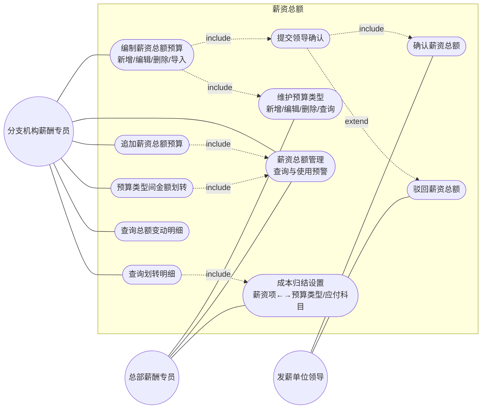
```mermaid
flowchart LR
    HQ((总部薪酬专员))
    BR((分支机构薪酬专员))
    LD((发薪单位领导))

    subgraph P1["薪资总额"]
        direction TB
        U11(["维护预算类型<br/>新增/编辑/删除/查询"])
        U12(["编制薪资总额预算<br/>新增/编辑/删除/导入"])
        U13(["提交领导确认"])
        U14(["确认薪资总额"])
        U15(["驳回薪资总额"])
        U16(["薪资总额管理<br/>查询与使用预警"])
        U17(["追加薪资总额预算"])
        U18(["预算类型间金额划转"])
        U19(["查询总额变动明细"])
        U110(["查询划转明细"])
        U111(["成本归结设置<br/>薪资项←→预算类型/应付科目"])
    end

    HQ --- U11
    HQ --- U16
    HQ --- U111
    BR --- U12
    BR --- U16
    BR --- U17
    BR --- U18
    BR --- U19
    BR --- U110
    LD --- U14
    LD --- U15

    U12 -.->|include| U13
    U13 -.->|include| U14
    U13 -.->|extend| U15
    U12 -.->|include| U11
    U17 -.->|include| U16
    U18 -.->|include| U16
    U110 -.->|include| U111
```

### 2.2 薪资设置

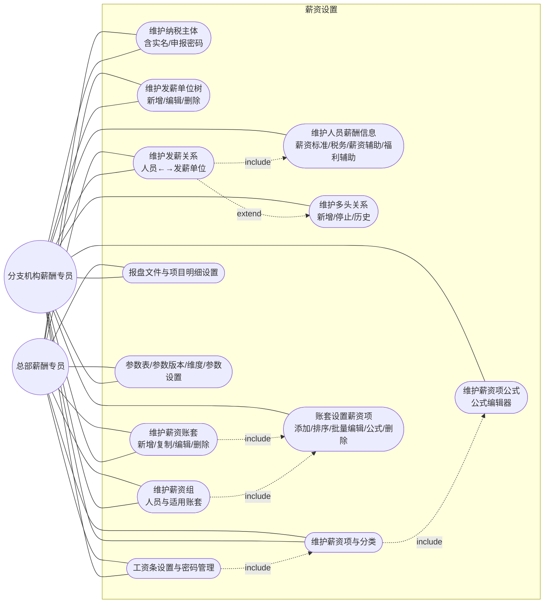
```mermaid
flowchart LR
    HQ((总部薪酬专员))
    BR((分支机构薪酬专员))

    subgraph P2["薪资设置"]
        direction TB
        U21(["维护纳税主体<br/>含实名/申报密码"])
        U22(["维护发薪单位树<br/>新增/编辑/删除"])
        U23(["维护发薪关系<br/>人员←→发薪单位"])
        U24(["维护人员薪酬信息<br/>薪资标准/税务/薪资辅助/福利辅助"])
        U25(["维护多头关系<br/>新增/停止/历史"])
        U26(["维护薪资项与分类"])
        U27(["维护薪资项公式<br/>公式编辑器"])
        U28(["维护薪资账套<br/>新增/复制/编辑/删除"])
        U29(["账套设置薪资项<br/>添加/排序/批量编辑/公式/删除"])
        U210(["维护薪资组<br/>人员与适用账套"])
        U211(["工资条设置与密码管理"])
        U212(["报盘文件与项目明细设置"])
        U213(["参数表/参数版本/维度/参数设置"])
    end

    HQ --- U21
    HQ --- U22
    HQ --- U23
    HQ --- U26
    HQ --- U28
    HQ --- U210
    HQ --- U211
    HQ --- U212
    HQ --- U213
    BR --- U21
    BR --- U22
    BR --- U23
    BR --- U24
    BR --- U25
    BR --- U26
    BR --- U27
    BR --- U28
    BR --- U29
    BR --- U210
    BR --- U211
    BR --- U212
    BR --- U213

    U23 -.->|include| U24
    U23 -.->|extend| U25
    U26 -.->|include| U27
    U28 -.->|include| U29
    U210 -.->|include| U29
    U211 -.->|include| U26
```

### 2.3 薪资调整 · 薪资计算管理

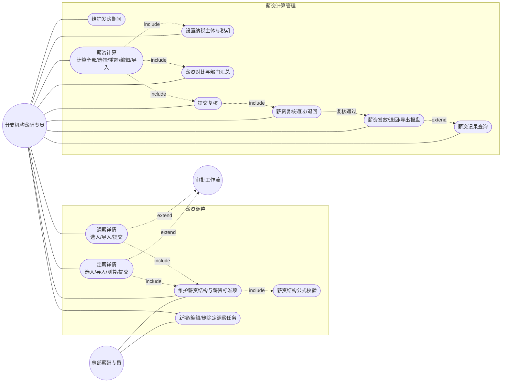
```mermaid
flowchart LR
    HQ((总部薪酬专员))
    BR((分支机构薪酬专员))
    WF((审批工作流))

    subgraph P3["薪资调整"]
        direction TB
        U31(["维护薪资结构与薪资标准项"])
        U32(["薪资结构公式校验"])
        U33(["新增/编辑/删除定调薪任务"])
        U34(["定薪详情<br/>选人/导入/测算/提交"])
        U35(["调薪详情<br/>选人/导入/提交"])
    end
    subgraph P4["薪资计算管理"]
        direction TB
        U41(["维护发薪期间"])
        U42(["设置纳税主体与税期"])
        U43(["薪资计算<br/>计算全部/选择/重置/编辑/导入"])
        U44(["薪资对比与部门汇总"])
        U45(["提交复核"])
        U46(["薪资复核通过/退回"])
        U47(["薪资发放/退回/导出报盘"])
        U48(["薪资记录查询"])
    end

    HQ --- U31
    HQ --- U33
    BR --- U31
    BR --- U33
    BR --- U34
    BR --- U35
    BR --- U41
    BR --- U42
    BR --- U43
    BR --- U44
    BR --- U45
    BR --- U46
    BR --- U47
    BR --- U48

    U31 -.->|include| U32
    U34 -.->|include| U31
    U35 -.->|include| U31
    U34 -.->|extend| WF
    U35 -.->|extend| WF
    U43 -.->|include| U42
    U43 -.->|include| U44
    U43 -.->|include| U45
    U45 -.->|include| U46
    U46 -->|复核通过| U47
    U47 -.->|extend| U48
```

### 2.4 代发薪管理 · 延期支付

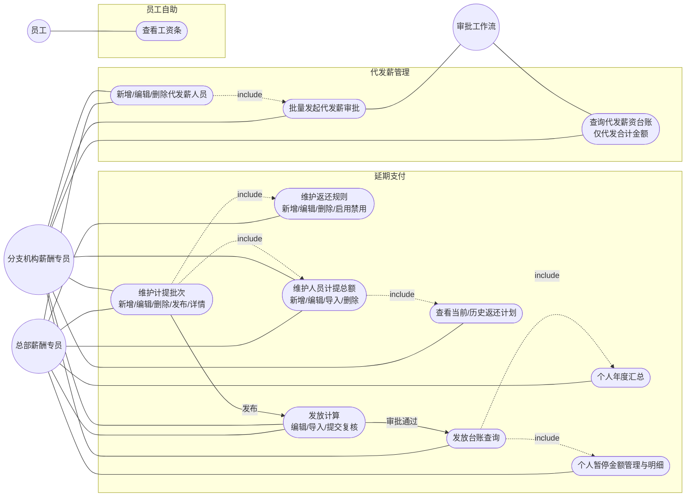
```mermaid
flowchart LR
    HQ((总部薪酬专员))
    BR((分支机构薪酬专员))
    WF((审批工作流))
    EMP((员工))

    subgraph P5["代发薪管理"]
        direction TB
        U51(["新增/编辑/删除代发薪人员"])
        U52(["批量发起代发薪审批"])
        U53(["查询代发薪资台账<br/>仅代发合计金额"])
    end
    subgraph P6["延期支付"]
        direction TB
        U61(["维护返还规则<br/>新增/编辑/删除/启用禁用"])
        U62(["维护计提批次<br/>新增/编辑/删除/发布/详情"])
        U63(["维护人员计提总额<br/>新增/编辑/导入/删除"])
        U64(["查看当前/历史返还计划"])
        U65(["发放计算<br/>编辑/导入/提交复核"])
        U66(["发放台账查询"])
        U67(["个人年度汇总"])
        U68(["个人暂停金额管理与明细"])
    end
    subgraph P7["员工自助"]
        direction TB
        U71(["查看工资条"])
    end

    HQ --- U51
    HQ --- U61
    HQ --- U62
    HQ --- U63
    HQ --- U65
    HQ --- U67
    HQ --- U68
    BR --- U51
    BR --- U52
    BR --- U53
    BR --- U62
    BR --- U63
    BR --- U64
    BR --- U65
    BR --- U66
    EMP --- U71

    U51 -.->|include| U52
    U52 --- WF
    WF --- U53
    U62 -.->|include| U63
    U62 -.->|include| U61
    U63 -.->|include| U64
    U62 -->|发布| U65
    U65 -->|审批通过| U66
    U66 -.->|include| U67
    U66 -.->|include| U68
```

---

## 3. 类图 Class Diagram（领域模型）

### 3.1 薪资总额域

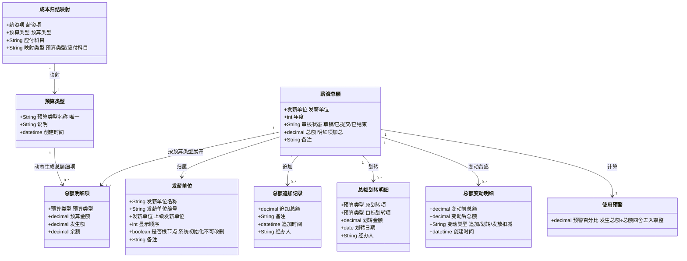
```mermaid
classDiagram
    class 预算类型 {
        +String 预算类型名称 唯一
        +String 说明
        +datetime 创建时间
    }
    class 薪资总额 {
        +发薪单位 发薪单位
        +int 年度
        +String 审核状态 草稿/已提交/已结束
        +decimal 总额 明细项加总
        +String 备注
    }
    class 总额明细项 {
        +预算类型 预算类型
        +decimal 预算金额
        +decimal 发生额
        +decimal 余额
    }
    class 总额追加记录 {
        +decimal 追加总额
        +String 备注
        +datetime 追加时间
        +String 经办人
    }
    class 总额划转明细 {
        +预算类型 原划转项
        +预算类型 目标划转项
        +decimal 划转金额
        +date 划转日期
        +String 经办人
    }
    class 总额变动明细 {
        +decimal 变动前总额
        +decimal 变动后总额
        +String 变动类型 追加/划转/发放扣减
        +datetime 创建时间
    }
    class 使用预警 {
        +decimal 预警百分比 发生总额÷总额四舍五入取整
    }
    class 成本归结映射 {
        +薪资项 薪资项
        +预算类型 预算类型
        +String 应付科目
        +String 映射类型 预算类型/应付科目
    }
    class 发薪单位 {
        +String 发薪单位名称
        +String 发薪单位编号
        +发薪单位 上级发薪单位
        +int 显示顺序
        +boolean 是否根节点 系统初始化不可改删
        +String 备注
    }

    预算类型 "1" --> "0..*" 总额明细项 : 动态生成总额细项
    薪资总额 "1" --> "1..*" 总额明细项 : 按预算类型展开
    薪资总额 "*" --> "1" 发薪单位 : 归属
    薪资总额 "1" --> "0..*" 总额追加记录 : 追加
    薪资总额 "1" --> "0..*" 总额划转明细 : 划转
    薪资总额 "1" --> "0..*" 总额变动明细 : 变动留痕
    薪资总额 "1" --> "1" 使用预警 : 计算
    成本归结映射 "*" --> "1" 预算类型 : 映射
```

### 3.2 薪资设置域（纳税主体 · 发薪关系 · 薪资项 · 账套 · 薪资组）

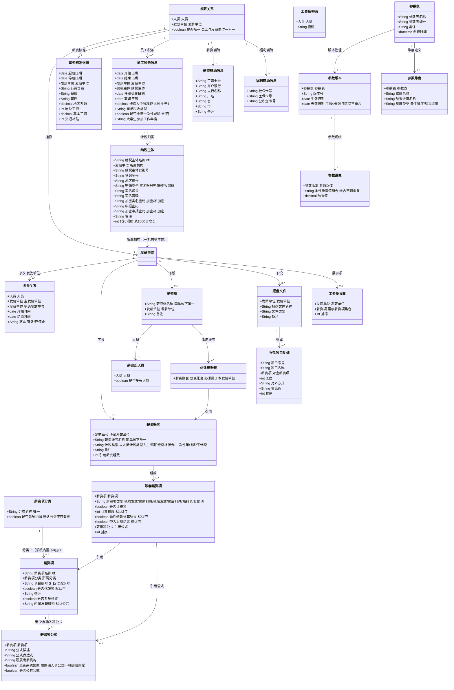
```mermaid
classDiagram
    class 纳税主体 {
        +String 纳税主体名称 唯一
        +发薪单位 所属机构
        +String 纳税主体识别号
        +String 登记序号
        +String 地区编号
        +String 密码类型 实名账号密码/申报密码
        +String 实名账号
        +String 实名密码
        +String 加密实名密码 加密/不加密
        +String 申报密码
        +String 加密申报密码 加密/不加密
        +String 备注
        +int 代码项ID 从1000自增长
    }
    class 发薪关系 {
        +人员 人员
        +发薪单位 发薪单位
        +boolean 是否唯一 员工与发薪单位一对一
    }
    class 薪资标准信息 {
        +date 起薪日期
        +date 停薪日期
        +发薪单位 发薪单位
        +String 行员等级
        +String 薪级
        +String 薪档
        +decimal 地区系数
        +int 岗位工资
        +decimal 基本工资
        +int 交通补贴
    }
    class 员工税务信息 {
        +date 开始日期
        +date 结束日期
        +发薪单位 发薪单位
        +纳税主体 纳税主体
        +date 任职受雇日期
        +date 离职日期
        +decimal 残疾人个税减征比例 小于1
        +String 雇员税收类型
        +boolean 是否全年一次性减除 是/否
        +String 大学生参加工作年度
    }
    class 薪资辅助信息 {
        +String 工资卡号
        +String 开户银行
        +String 支行名称
        +String 户名
        +String 省
        +String 市
        +String 备注
    }
    class 福利辅助信息 {
        +String 社保卡号
        +String 医保卡号
        +String 公积金卡号
    }
    class 多头关系 {
        +人员 人员
        +发薪单位 主发薪单位
        +发薪单位 多头发放单位
        +date 开始时间
        +date 结束时间
        +String 状态 有效/已停止
    }
    class 薪资项分类 {
        +String 分类名称 唯一
        +boolean 是否系统内置 默认分类不可改删
    }
    class 薪资项 {
        +String 薪资项名称 唯一
        +薪资项分类 所属分类
        +String 项目编号 S_四位流水号
        +boolean 是否代发项 默认否
        +String 备注
        +boolean 是否系统预置
        +String 所属发薪机构 默认公共
    }
    class 薪资项公式 {
        +薪资项 薪资项
        +String 公式描述
        +String 公式表达式
        +String 所属发薪机构
        +boolean 是否系统预置 预置输入项公式不可编辑删除
        +boolean 是否公共公式
    }
    class 薪资账套 {
        +发薪单位 所属发薪单位
        +String 薪资账套名称 同单位下唯一
        +String 计税类型 以人员计税类型为主/离职经济补偿金/一次性年终奖/不计税
        +String 备注
        +int 引用薪资组数
    }
    class 账套薪资项 {
        +薪资项 薪资项
        +String 薪资项类型 税前发放/税前扣减/税后发放/税后扣减/福利项/其他项
        +boolean 是否计税项
        +int 计算精度 默认2位
        +boolean 允许修改计算结果 默认否
        +boolean 带入上期结果 默认否
        +薪资项公式 引用公式
        +int 排序
    }
    class 薪资组 {
        +String 薪资组名称 同单位下唯一
        +发薪单位 发薪单位
        +String 备注
    }
    class 薪资组人员 {
        +人员 人员
        +boolean 是否多头人员
    }
    class 组适用账套 {
        +薪资账套 薪资账套 必须属于本发薪单位
    }
    class 报盘文件 {
        +发薪单位 发薪单位
        +String 报盘文件名称
        +String 文件类型
        +String 备注
    }
    class 报盘项目明细 {
        +String 项目序号
        +String 项目名称
        +薪资项 对应薪资项
        +int 长度
        +String 对齐方式
        +String 填充符
        +int 排序
    }
    class 工资条设置 {
        +发薪单位 发薪单位
        +薪资项 展示薪资项集合
        +int 排序
    }
    class 工资条密码 {
        +人员 人员
        +String 密码
    }
    class 参数表 {
        +String 参数表名称
        +String 参数表编号
        +String 备注
        +datetime 创建时间
    }
    class 参数版本 {
        +参数表 参数表
        +String 版本号
        +date 生效日期
        +date 失效日期 生效≤失效且区间不重合
    }
    class 参数维度 {
        +参数表 参数表
        +String 维度名称
        +String 结果维度名称
        +String 维度类型 条件维度/结果维度
    }
    class 参数设置 {
        +参数版本 参数版本
        +String 条件维度值组合 组合不可重复
        +decimal 结果值
    }

    纳税主体 "*" --> "1" 发薪单位 : 所属机构（一机构多主体）
    发薪关系 "*" --> "1" 发薪单位 : 挂靠
    发薪关系 "1" --> "1" 薪资标准信息 : 薪资标准
    发薪关系 "1" --> "1..*" 员工税务信息 : 员工税务
    发薪关系 "1" --> "1" 薪资辅助信息 : 薪资辅助
    发薪关系 "1" --> "1" 福利辅助信息 : 福利辅助
    员工税务信息 "*" --> "1" 纳税主体 : 计税归属
    发薪单位 "1" --> "0..*" 多头关系 : 多头发放单位
    薪资项分类 "1" --> "0..*" 薪资项 : 分类下（系统内置不可加）
    薪资项 "1" --> "1..*" 薪资项公式 : 至少含输入项公式
    薪资账套 "1" --> "1..*" 账套薪资项 : 组成
    账套薪资项 "*" --> "1" 薪资项 : 引用
    账套薪资项 "*" --> "0..1" 薪资项公式 : 引用公式
    薪资组 "1" --> "0..*" 薪资组人员 : 人员
    薪资组 "1" --> "1..*" 组适用账套 : 适用账套
    组适用账套 "*" --> "1" 薪资账套 : 引用
    发薪单位 "1" --> "0..*" 薪资账套 : 下设
    发薪单位 "1" --> "0..*" 薪资组 : 下设
    发薪单位 "1" --> "0..*" 报盘文件 : 下设
    报盘文件 "1" --> "1..*" 报盘项目明细 : 组成
    发薪单位 "1" --> "0..1" 工资条设置 : 展示项
    参数表 "1" --> "1..*" 参数版本 : 版本管理
    参数表 "1" --> "1..*" 参数维度 : 维度定义
    参数版本 "1" --> "1..*" 参数设置 : 参数明细
```

### 3.3 薪资调整 · 薪资计算 · 代发薪 · 延期支付域

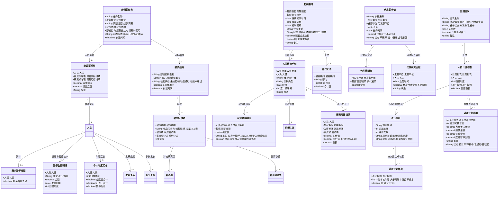
```mermaid
classDiagram
    class 薪资结构 {
        +String 薪资结构名称
        +String 归属 公共/薪资单位
        +String 校验状态 未校验/校验已通过/校验未通过
        +boolean 是否使用中
        +datetime 创建时间
    }
    class 薪资标准项 {
        +薪资结构 薪资结构
        +String 信息项名称 如薪级/薪档/基本工资
        +薪资项 对应薪资项
        +薪资项公式 引用公式
        +int 排序
    }
    class 定调薪任务 {
        +String 任务名称
        +发薪单位 薪资单位
        +String 调整类型 定薪/调薪
        +薪资结构 薪资结构
        +薪资结构 原薪资结构 调薪时使用
        +String 审核状态 草稿/已提交/已结束
        +datetime 创建时间
    }
    class 定调薪明细 {
        +人员 人员
        +薪资标准项 调薪前标准项
        +薪资标准项 调薪后标准项
        +decimal 调整前值
        +decimal 调整后值
        +String 备注
    }
    class 发薪期间 {
        +薪资账套 所属账套
        +薪资组 薪资组
        +date 发薪期间年月
        +date 考勤周期
        +date 福利周期
        +String 计税类型
        +String 状态 草稿/审核中/待发放/已发放
        +decimal 账套应发金额
        +decimal 账套实发金额
        +String 备注
    }
    class 人员薪资明细 {
        +发薪期间 发薪期间
        +人员 人员
        +纳税主体 纳税主体
        +String 计税类型
        +date 税期
        +int 累计顺序号
        +String 状态
    }
    class 薪资项明细值 {
        +人员薪资明细 人员薪资明细
        +薪资项 薪资项
        +decimal 数值
        +String 来源 公式计算/手工输入/上期带入/修改结果
        +boolean 是否标橙 带入或修改的公式项
    }
    class 薪资对比记录 {
        +人员 人员
        +发薪期间 本期期间
        +发薪期间 对比期间
        +薪资项 薪资项
        +decimal 本期值
        +decimal 历史值 未找到默认0.00
        +decimal 差额
    }
    class 部门汇总 {
        +发薪期间 发薪期间
        +String 部门
        +薪资项 薪资项
        +decimal 合计值
    }
    class 代发薪申请 {
        +String 单据编号
        +发薪单位 发薪单位
        +发薪单位 代发薪单位
        +人员 人员
        +date 业务时间
        +decimal 代发合计 不可为0
        +String 状态 草稿/审批中/已通过/已驳回
    }
    class 代发薪明细 {
        +代发薪申请 代发薪申请
        +薪资项 薪资项 仅代发项
        +decimal 金额
    }
    class 代发薪资台账 {
        +发薪单位 发薪单位
        +人员 人员
        +date 业务时间
        +decimal 代发合计金额 不含明细
        +String 状态
    }
    class 返还规则 {
        +String 规则名称
        +int 归属年度
        +int 返还次数
        +String 周期类型 年度/季度/月度
        +String 状态 启用/禁用 新增默认禁用
    }
    class 返还计划年度 {
        +返还规则 返还规则
        +int 计划考核年度 大于归属年度且不重复
        +decimal 比例 合计为1
    }
    class 计提批次 {
        +String 批次名称
        +String 批次编号 年月日时分秒自动生成
        +String 发布状态 未发布/已发布
        +int 人员总数
        +decimal 计提总额合计
        +String 备注
    }
    class 人员计提总额 {
        +计提批次 计提批次
        +人员 人员
        +int 归属年度
        +返还规则 返还规则
        +decimal 计提总额
    }
    class 返还计划明细 {
        +人员计提总额 人员计提总额
        +int 计划考核年度
        +decimal 当期考核金额
        +decimal 扣罚金额
        +decimal 暂停金额
        +decimal 返还暂停金额
        +String 备注
        +String 状态 待计算/审核中/已通过/已驳回
    }
    class 剩余暂停总额 {
        +人员 人员
        +decimal 剩余暂停总额
    }
    class 暂停金额明细 {
        +人员 人员
        +String 类型 返还/暂停
        +decimal 金额
        +date 发生日期
        +int 归属年度
    }
    class 个人年度汇总 {
        +人员 人员
        +int 归属年度
        +decimal 应返还合计
        +decimal 已返还合计
        +decimal 暂停合计
    }

    薪资结构 "1" --> "1..*" 薪资标准项 : 组成
    薪资标准项 "*" --> "0..1" 薪资项 : 对应薪资项
    薪资标准项 "*" --> "0..1" 薪资项公式 : 计算数值
    定调薪任务 "1" --> "1..*" 定调薪明细 : 人员清单
    定调薪任务 "*" --> "1" 薪资结构 : 目标结构
    定调薪明细 "*" --> "1" 人员 : 被调整人
    发薪期间 "1" --> "1..*" 人员薪资明细 : 计算范围
    人员薪资明细 "1" --> "1..*" 薪资项明细值 : 薪资项取值
    人员薪资明细 "*" --> "1" 纳税主体 : 计税归属
    发薪期间 "1" --> "0..*" 部门汇总 : 汇总
    人员薪资明细 "1" --> "0..*" 薪资对比记录 : 与历史对比
    代发薪申请 "1" --> "1..*" 代发薪明细 : 代发薪资项
    代发薪申请 "*" --> "1" 代发薪资台账 : 通过后入台账
    返还规则 "1" --> "1..*" 返还计划年度 : 按次数生成年度
    计提批次 "1" --> "1..*" 人员计提总额 : 人员
    人员计提总额 "*" --> "1" 返还规则 : 匹配归属年度
    人员计提总额 "1" --> "1..*" 返还计划明细 : 生成返还计划
    人员 "1" --> "0..1" 剩余暂停总额 : 累计
    人员 "1" --> "0..*" 暂停金额明细 : 返还与暂停流水
    人员 "1" --> "0..*" 个人年度汇总 : 年度汇总
    人员 "1" --> "0..*" 发薪关系 : 发薪归属
    人员 "1" --> "0..*" 多头关系 : 多头发放
```

---

## 4. 对象图 Object Diagram（运行时刻实例快照）

场景：**北京分公司 2024 年 8 月**发薪期间，人员「张三」薪资计算完成、待复核的某时刻快照。

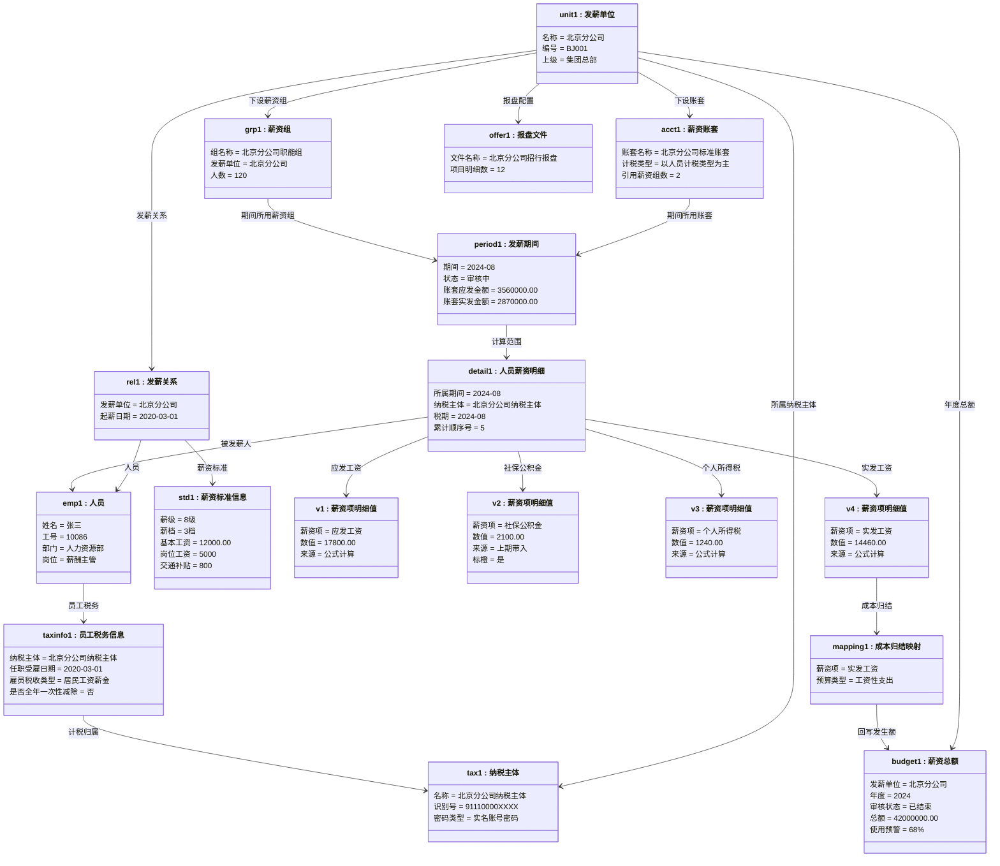
```mermaid
classDiagram
    class unit1["unit1 : 发薪单位"] {
        名称 = 北京分公司
        编号 = BJ001
        上级 = 集团总部
    }
    class acct1["acct1 : 薪资账套"] {
        账套名称 = 北京分公司标准账套
        计税类型 = 以人员计税类型为主
        引用薪资组数 = 2
    }
    class grp1["grp1 : 薪资组"] {
        组名称 = 北京分公司职能组
        发薪单位 = 北京分公司
        人数 = 120
    }
    class period1["period1 : 发薪期间"] {
        期间 = 2024-08
        状态 = 审核中
        账套应发金额 = 3560000.00
        账套实发金额 = 2870000.00
    }
    class tax1["tax1 : 纳税主体"] {
        名称 = 北京分公司纳税主体
        识别号 = 91110000XXXX
        密码类型 = 实名账号密码
    }
    class emp1["emp1 : 人员"] {
        姓名 = 张三
        工号 = 10086
        部门 = 人力资源部
        岗位 = 薪酬主管
    }
    class rel1["rel1 : 发薪关系"] {
        发薪单位 = 北京分公司
        起薪日期 = 2020-03-01
    }
    class std1["std1 : 薪资标准信息"] {
        薪级 = 8级
        薪档 = 3档
        基本工资 = 12000.00
        岗位工资 = 5000
        交通补贴 = 800
    }
    class taxinfo1["taxinfo1 : 员工税务信息"] {
        纳税主体 = 北京分公司纳税主体
        任职受雇日期 = 2020-03-01
        雇员税收类型 = 居民工资薪金
        是否全年一次性减除 = 否
    }
    class detail1["detail1 : 人员薪资明细"] {
        所属期间 = 2024-08
        纳税主体 = 北京分公司纳税主体
        税期 = 2024-08
        累计顺序号 = 5
    }
    class v1["v1 : 薪资项明细值"] {
        薪资项 = 应发工资
        数值 = 17800.00
        来源 = 公式计算
    }
    class v2["v2 : 薪资项明细值"] {
        薪资项 = 社保公积金
        数值 = 2100.00
        来源 = 上期带入
        标橙 = 是
    }
    class v3["v3 : 薪资项明细值"] {
        薪资项 = 个人所得税
        数值 = 1240.00
        来源 = 公式计算
    }
    class v4["v4 : 薪资项明细值"] {
        薪资项 = 实发工资
        数值 = 14460.00
        来源 = 公式计算
    }
    class budget1["budget1 : 薪资总额"] {
        发薪单位 = 北京分公司
        年度 = 2024
        审核状态 = 已结束
        总额 = 42000000.00
        使用预警 = 68%
    }
    class mapping1["mapping1 : 成本归结映射"] {
        薪资项 = 实发工资
        预算类型 = 工资性支出
    }
    class offer1["offer1 : 报盘文件"] {
        文件名称 = 北京分公司招行报盘
        项目明细数 = 12
    }

    unit1 --> acct1 : 下设账套
    unit1 --> grp1 : 下设薪资组
    acct1 --> period1 : 期间所用账套
    grp1 --> period1 : 期间所用薪资组
    unit1 --> tax1 : 所属纳税主体
    unit1 --> rel1 : 发薪关系
    rel1 --> emp1 : 人员
    rel1 --> std1 : 薪资标准
    emp1 --> taxinfo1 : 员工税务
    taxinfo1 --> tax1 : 计税归属
    period1 --> detail1 : 计算范围
    detail1 --> emp1 : 被发薪人
    detail1 --> v1 : 应发工资
    detail1 --> v2 : 社保公积金
    detail1 --> v3 : 个人所得税
    detail1 --> v4 : 实发工资
    unit1 --> budget1 : 年度总额
    v4 --> mapping1 : 成本归结
    mapping1 --> budget1 : 回写发生额
    unit1 --> offer1 : 报盘配置
```

---

## 5. 包图 Package Diagram（模块划分与依赖）

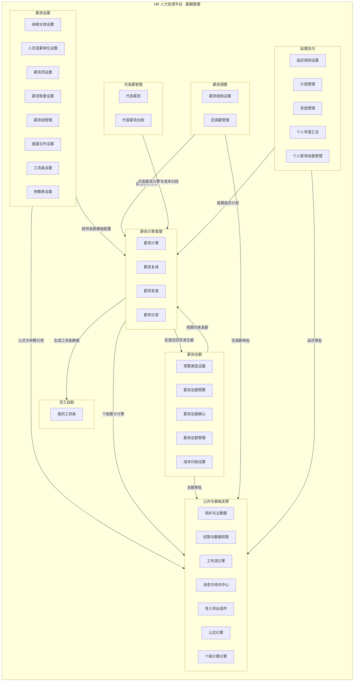
```mermaid
flowchart TB
    subgraph VHR["HR 人力资源平台 · 薪酬管理"]
        direction TB
        subgraph PKG_TOTAL["薪资总额"]
            direction LR
            P11[预算类型设置]
            P12[薪资总额预算]
            P13[薪资总额确认]
            P14[薪资总额管理]
            P15[成本归结设置]
        end
        subgraph PKG_SET["薪资设置"]
            direction LR
            P21[纳税主体设置]
            P22[人员发薪单位设置]
            P23[薪资项设置]
            P24[薪资账套设置]
            P25[薪资组管理]
            P26[报盘文件设置]
            P27[工资条设置]
            P28[参数表设置]
        end
        subgraph PKG_ADJ["薪资调整"]
            direction LR
            P31[薪资结构设置]
            P32[定调薪管理]
        end
        subgraph PKG_CALC["薪资计算管理"]
            direction LR
            P41[薪资计算]
            P42[薪资复核]
            P43[薪资发放]
            P44[薪资记录]
        end
        subgraph PKG_AGT["代发薪管理"]
            direction LR
            P51[代发薪资]
            P52[代发薪资台账]
        end
        subgraph PKG_DEF["延期支付"]
            direction LR
            P61[返还规则设置]
            P62[计提管理]
            P63[发放管理]
            P64[个人年度汇总]
            P65[个人暂停金额管理]
        end
        subgraph PKG_ESS["员工自助"]
            direction LR
            P71[我的工资条]
        end
        subgraph PKG_COMMON["公共与基础支撑"]
            direction LR
            P81[组织与主数据]
            P82[权限与数据权限]
            P83[工作流引擎]
            P84[消息与待办中心]
            P85[导入导出组件]
            P86[公式引擎]
            P87[个税计算引擎]
        end
    end

    PKG_SET -->|提供发薪基础配置| PKG_CALC
    PKG_TOTAL -->|预算约束发薪| PKG_CALC
    PKG_CALC -->|发放后回写发生额| PKG_TOTAL
    PKG_ADJ -->|调整薪资标准| PKG_CALC
    PKG_AGT -->|代发薪资计算与成本归结| PKG_CALC
    PKG_DEF -->|延期返还计划| PKG_CALC
    PKG_CALC -->|生成工资条数据| PKG_ESS
    PKG_SET -->|公式与参数引用| PKG_COMMON
    PKG_CALC -->|个税累计计算| PKG_COMMON
    PKG_TOTAL -->|总额审批| PKG_COMMON
    PKG_ADJ -->|定调薪审批| PKG_COMMON
    PKG_DEF -->|返还审批| PKG_COMMON
```

---

## 6. 组件图 Component Diagram（逻辑组件与接口）

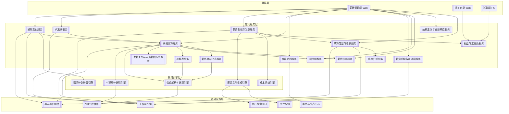
```mermaid
flowchart TB
    subgraph CLIENT["展现层"]
        C1[[薪酬管理端 Web]]
        C2[[员工自助 Web]]
        C3[[移动端 H5]]
    end

    subgraph SERVICE["应用服务层"]
        S1[[预算类型与总额服务]]
        S2[[成本归结服务]]
        S3[[纳税主体与发薪单位服务]]
        S4[[发薪关系与人员薪酬信息服务]]
        S5[[薪资项与公式服务]]
        S6[[薪资账套服务]]
        S7[[薪资组服务]]
        S8[[报盘与工资条服务]]
        S9[[参数表服务]]
        S10[[薪资结构与定调薪服务]]
        S11[[发薪期间服务]]
        S12[[薪资计算服务]]
        S13[[薪资复核与发放服务]]
        S14[[代发薪服务]]
        S15[[延期支付服务]]
    end

    subgraph ENGINE["领域引擎层"]
        E1[[公式解析与计算引擎]]
        E2[[个税累计计税引擎]]
        E3[[成本归结引擎]]
        E4[[报盘文件生成引擎]]
        E5[[返还计划计算引擎]]
    end

    subgraph INFRA["基础设施层"]
        I1[[工作流引擎]]
        I2[[消息与待办中心]]
        I3[[导入导出组件]]
        I4[[文件存储]]
        I5[[VHR 数据库]]
        I6[[银行报盘接口]]
    end

    C1 --> S1
    C1 --> S3
    C1 --> S6
    C1 --> S7
    C1 --> S10
    C1 --> S11
    C1 --> S12
    C1 --> S13
    C1 --> S14
    C1 --> S15
    C2 --> S8
    C3 --> S8

    S1 --> S2
    S12 --> S5
    S12 --> S6
    S12 --> S7
    S12 --> S9
    S12 --> S4
    S13 --> S8
    S13 --> S1
    S14 --> S12
    S15 --> S12
    S5 --> E1
    S12 --> E1
    S12 --> E2
    S13 --> E3
    S13 --> E4
    S15 --> E5
    S9 --> E1

    S1 --> I1
    S10 --> I1
    S13 --> I1
    S14 --> I1
    S15 --> I1
    S11 --> I2
    S1 --> I3
    S12 --> I3
    S15 --> I3
    E1 --> I5
    E2 --> I5
    E4 --> I4
    E4 --> I6
```

---

## 7. 部署图 Deployment Diagram（物理节点与工件）

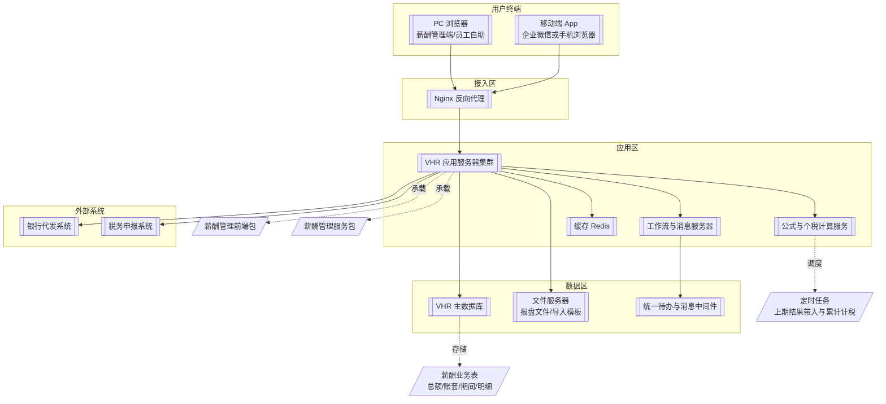
```mermaid
flowchart TB
    subgraph ZONE_USER["用户终端"]
        N1[["PC 浏览器<br/>薪酬管理端/员工自助"]]
        N2[["移动端 App<br/>企业微信或手机浏览器"]]
    end
    subgraph ZONE_DMZ["接入区"]
        N3[["Nginx 反向代理"]]
    end
    subgraph ZONE_APP["应用区"]
        N4[["VHR 应用服务器集群"]]
        N5[["公式与个税计算服务"]]
        N6[["工作流与消息服务器"]]
        N7[["缓存 Redis"]]
    end
    subgraph ZONE_DATA["数据区"]
        N8[["VHR 主数据库"]]
        N9[["文件服务器<br/>报盘文件/导入模板"]]
        N10[["统一待办与消息中间件"]]
    end
    subgraph ZONE_EXT["外部系统"]
        N11[["银行代发系统"]]
        N12[["税务申报系统"]]
    end

    ART1[/"薪酬管理前端包"/]
    ART2[/"薪酬管理服务包"/]
    ART3[/"薪酬业务表<br/>总额/账套/期间/明细"/]
    ART4[/"定时任务<br/>上期结果带入与累计计税"/]

    N1 --> N3
    N2 --> N3
    N3 --> N4
    N4 --> N5
    N4 --> N6
    N4 --> N7
    N4 --> N8
    N4 --> N9
    N6 --> N10
    N4 -.承载.-> ART1
    N4 -.承载.-> ART2
    N8 -.存储.-> ART3
    N5 -.调度.-> ART4
    N4 --> N11
    N4 --> N12
```

---

## 8. 组合结构图 Composite Structure Diagram（薪资账套内部结构）

以「薪资账套」为例，展示其内部部件、端口与连接器。

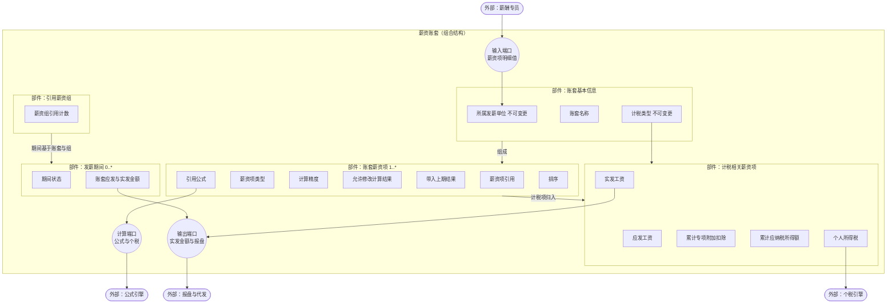
```mermaid
flowchart TB
    subgraph CTX["薪资账套（组合结构）"]
        direction TB
        PORT_IN((输入端口<br/>薪资项明细值))
        PORT_CALC((计算端口<br/>公式与个税))
        PORT_OUT((输出端口<br/>实发金额与报盘))

        subgraph PART_BASE["部件：账套基本信息"]
            M1[所属发薪单位 不可变更]
            M2[账套名称]
            M3[计税类型 不可变更]
        end
        subgraph PART_ITEM["部件：账套薪资项 1..*"]
            I1[薪资项引用]
            I2[薪资项类型]
            I3[计算精度]
            I4[允许修改计算结果]
            I5[带入上期结果]
            I6[引用公式]
            I7[排序]
        end
        subgraph PART_TAX["部件：计税相关薪资项"]
            T1[应发工资]
            T2[累计专项附加扣除]
            T3[累计应纳税所得额]
            T4[个人所得税]
            T5[实发工资]
        end
        subgraph PART_GROUP["部件：引用薪资组"]
            G1[薪资组引用计数]
        end
        subgraph PART_PERIOD["部件：发薪期间 0..*"]
            D1[期间状态]
            D2[账套应发与实发金额]
        end
    end

    ADMIN([外部：薪酬专员])
    FORMULA([外部：公式引擎])
    TAXENGINE([外部：个税引擎])
    BANK([外部：报盘与代发])

    ADMIN --> PORT_IN
    PORT_IN --> M1
    M3 --> PART_TAX
    PART_BASE -->|组成| PART_ITEM
    PART_ITEM -->|计税项归入| PART_TAX
    PART_GROUP -->|期间基于账套与组| PART_PERIOD
    I6 --> PORT_CALC
    PORT_CALC --> FORMULA
    T4 --> TAXENGINE
    T5 --> PORT_OUT
    D2 --> PORT_OUT
    PORT_OUT --> BANK
```

---

## 9. 剖面图 Profile Diagram（构造型与扩展）

定义本模块的建模构造型（stereotype），约束领域对象的建模语义。

```mermaid
classDiagram
    class Class <<metaclass>>
    class Enumeration <<metaclass>>
    class Component <<metaclass>>
    class 聚合根 <<stereotype>> {
        +boolean 独立生命周期
        +boolean 全局唯一编号
    }
    class 配置实体 <<stereotype>> {
        +boolean 单位隔离
        +boolean 被引用即锁定
    }
    class 单据实体 <<stereotype>> {
        +boolean 审批流驱动
        +boolean 状态机
        +boolean 草稿可编辑
    }
    class 值对象 <<stereotype>> {
        +boolean 无标识
        +boolean 依附聚合根
    }
    class 枚举构造型 <<stereotype>> {
        +String 代码选项
    }
    class 领域服务 <<stereotype>> {
        +boolean 无状态
    }

    聚合根 --|> Class : extend
    配置实体 --|> Class : extend
    单据实体 --|> Class : extend
    值对象 --|> Class : extend
    枚举构造型 --|> Enumeration : extend
    领域服务 --|> Component : extend

    class 发薪期间
    class 代发薪申请
    class 计提批次
    class 定调薪任务
    class 薪资总额
    class 薪资账套
    class 薪资项
    class 纳税主体
    class 发薪单位
    class 薪资组
    class 返还规则
    class 薪资标准项
    class 账套薪资项
    class 薪资项明细值
    class 返还计划明细
    class 成本归结映射
    class 计税类型
    class 发薪期间状态
    class 周期类型
    class 公式引擎
    class 个税引擎
    class 成本归结引擎

    发薪期间 ..> 聚合根 : apply
    代发薪申请 ..> 单据实体 : apply
    计提批次 ..> 单据实体 : apply
    定调薪任务 ..> 单据实体 : apply
    薪资总额 ..> 单据实体 : apply
    薪资账套 ..> 配置实体 : apply
    薪资项 ..> 配置实体 : apply
    纳税主体 ..> 配置实体 : apply
    发薪单位 ..> 配置实体 : apply
    薪资组 ..> 配置实体 : apply
    返还规则 ..> 配置实体 : apply
    薪资标准项 ..> 值对象 : apply
    账套薪资项 ..> 值对象 : apply
    薪资项明细值 ..> 值对象 : apply
    返还计划明细 ..> 值对象 : apply
    成本归结映射 ..> 值对象 : apply
    计税类型 ..> 枚举构造型 : apply
    发薪期间状态 ..> 枚举构造型 : apply
    周期类型 ..> 枚举构造型 : apply
    公式引擎 ..> 领域服务 : apply
    个税引擎 ..> 领域服务 : apply
    成本归结引擎 ..> 领域服务 : apply
```

---

## 10. 活动图 Activity Diagram

### 10.1 薪酬业务端到端主流程（带泳道）

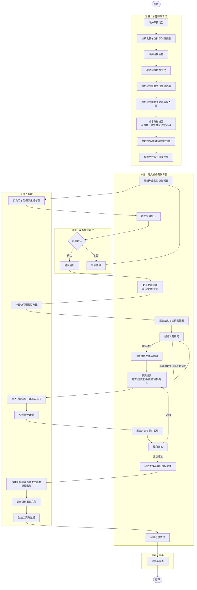
```mermaid
flowchart TB
    START([开始])

    subgraph LANE_HQ["泳道：总部薪酬专员"]
        A1[维护预算类型]
        A2[维护发薪单位树与发薪关系]
        A3[维护纳税主体]
        A4[维护薪资项与公式]
        A5[维护薪资账套并设置薪资项]
        A6[维护薪资组并关联账套与人员]
        A7[成本归结设置<br/>薪资项↔预算类型/应付科目]
        A8[参数表/版本/维度/参数设置]
        A9[报盘文件与工资条设置]
    end

    subgraph LANE_BR["泳道：分支机构薪酬专员"]
        B1[编制年度薪资总额预算]
        B2[提交领导确认]
        B3[薪资总额管理<br/>追加/划转/查询]
        B4[薪资结构与定调薪管理]
        B5[新建发薪期间]
        B6[设置纳税主体与税期]
        B7[薪资计算<br/>计算全部/选择/重置/编辑/导入]
        B8[薪资对比与部门汇总]
        B9[提交复核]
        B10[薪资发放与导出报盘文件]
        B11[薪资记录查询]
    end

    subgraph LANE_LD["泳道：发薪单位领导"]
        L1{总额确认}
        L2[确认通过]
        L3[驳回重编]
    end

    subgraph LANE_SYS["泳道：系统"]
        S1[自动汇总明细项生成总额]
        S2[计算使用预警百分比]
        S3[带入上期结果并计算公式项]
        S4[个税累计计税]
        S5[成本归结回写总额发生额并重算余额]
        S6[生成工资条数据]
        S7[更新银行报盘文件]
    end

    subgraph LANE_EMP["泳道：员工"]
        E1[查看工资条]
    end

    END([结束])

    START --> A1 --> A2 --> A3 --> A4 --> A5 --> A6 --> A7
    A7 --> A8 --> A9 --> B1 --> S1 --> B2 --> L1
    L1 -->|确认| L2 --> B3
    L1 -->|驳回| L3 --> B1
    B3 --> S2 --> B4 --> B5
    B5 -->|未添加薪资项或无薪资组| B5
    B5 -->|校验通过| B6
    B6 --> B7 --> S3 --> S4 --> B8 --> B9
    B9 -->|复核通过| B10
    B9 -->|退回| B7
    B10 --> S5 --> S7 --> S6 --> B11 --> E1 --> END
```

### 10.2 薪资计算活动（单期计算过程）

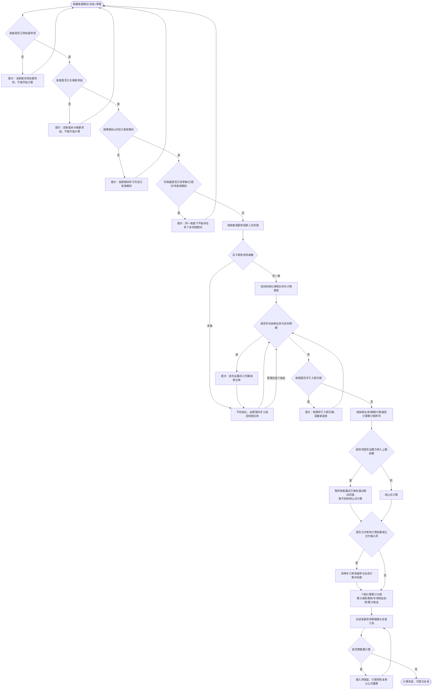
```mermaid
flowchart TB
    C0([新建发薪期间 状态=草稿])
    C1{账套是否已添加薪资项}
    C2[提示：该账套未添加薪资项，不能开始计算]
    C3{账套是否已关联薪资组}
    C4[提示：该账套未关联薪资组，不能开始计算]
    C5{新建期间≥历史已发放期间}
    C6[提示：发薪期间早于历史已发放期间]
    C7{同账套是否已有草稿/已提交/待发放期间}
    C8[提示：同一账套下不能存在多个未完结期间]
    C9[按账套或薪资组取人员范围]
    C10{员工税务信息条数}
    C11[自动初始化纳税主体与计税类型]
    C12[不初始化，由管理员手工指定纳税主体]
    C13{是否存在纳税主体为空的明细}
    C14[提示：请先设置员工所属纳税主体]
    C15{税期是否早于入职日期}
    C16[提示：税期早于入职日期，请重新选择]
    C17[按纳税主体/税期/计税类型计算累计顺序号]
    C18{薪资项是否设置为带入上期结果}
    C19[取同账套最近已审批通过期间的值<br/>取不到则用公式计算]
    C20[按公式计算]
    C21{是否允许修改计算结果或公式为输入项}
    C22[采用手工修改值参与后续计算并标橙]
    C23[个税引擎累计计税<br/>累计减除费用/专项附加扣除/累计税金]
    C24[生成各薪资项明细值与实发工资]
    C25{是否需重置计算}
    C26[输入项保留，计算项恢复默认公式重算]
    C27([计算完成，可提交复核])

    C0 --> C1
    C1 -->|否| C2 --> C0
    C1 -->|是| C3
    C3 -->|否| C4 --> C0
    C3 -->|是| C5
    C5 -->|否| C6 --> C0
    C5 -->|是| C7
    C7 -->|是| C8 --> C0
    C7 -->|否| C9 --> C10
    C10 -->|仅一条| C11 --> C13
    C10 -->|多条| C12 --> C13
    C12 -->|管理员逐个指定| C13
    C13 -->|是| C14 --> C12
    C13 -->|否| C15
    C15 -->|是| C16 --> C13
    C15 -->|否| C17 --> C18
    C18 -->|是| C19 --> C21
    C18 -->|否| C20 --> C21
    C21 -->|是| C22 --> C23
    C21 -->|否| C23
    C23 --> C24 --> C25
    C25 -->|是| C26 --> C24
    C25 -->|否| C27
```

### 10.3 延期支付返还活动

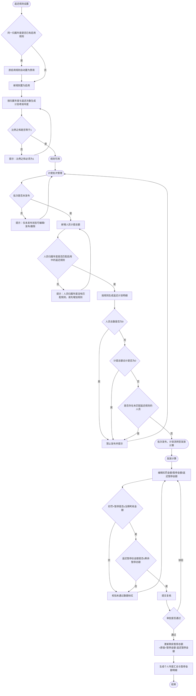
```mermaid
flowchart TB
    D0([返还规则设置])
    D1{同一归属年度是否已有启用规则}
    D2[原启用规则自动置为禁用]
    D3[新规则置为启用]
    D4[按归属年度与返还次数生成计划考核年度]
    D5{比例之和是否等于1}
    D6[提示：比例之和必须为1]
    D7([规则可用])
    E0([计提批次管理])
    E1{批次是否未发布}
    E2[提示：仅未发布状态可编辑/发布/删除]
    E3[新增人员计提总额]
    E4{人员归属年度是否匹配启用中的返还规则}
    E5[提示：人员归属年度没有匹配规则，请先增加规则]
    E6[按规则生成返还计划明细]
    E7{人员总数是否为0}
    E8{计提总额合计是否为0}
    E9{是否存在未匹配返还规则的人员}
    E10[禁止发布并提示]
    E11([批次发布，计划流转至发放计算])
    F0([发放计算])
    F1[编辑扣罚金额/暂停金额/返还暂停金额]
    F2{扣罚+暂停是否≤当期考核金额}
    F3{返还暂停总金额是否≤剩余暂停总额}
    F4[校验未通过数据标红]
    F5[提交复核]
    F6{审批是否通过}
    F7[更新剩余暂停总额<br/>=原值+暂停金额-返还暂停金额]
    F8[生成个人年度汇总与暂停金额明细]
    F9([结束])

    D0 --> D1
    D1 -->|是| D2 --> D3
    D1 -->|否| D3
    D3 --> D4 --> D5
    D5 -->|否| D6 --> D4
    D5 -->|是| D7 --> E0
    E0 --> E1
    E1 -->|否| E2 --> E0
    E1 -->|是| E3 --> E4
    E4 -->|否| E5 --> E3
    E4 -->|是| E6 --> E7
    E7 -->|是| E10
    E7 -->|否| E8
    E8 -->|是| E10
    E8 -->|否| E9
    E9 -->|是| E10 --> E0
    E9 -->|否| E11 --> F0
    F0 --> F1 --> F2
    F2 -->|否| F4 --> F1
    F2 -->|是| F3
    F3 -->|否| F4
    F3 -->|是| F5 --> F6
    F6 -->|驳回| F1
    F6 -->|通过| F7 --> F8 --> F9
```

---

## 11. 状态机图 State Machine Diagram

### 11.1 薪资总额预算

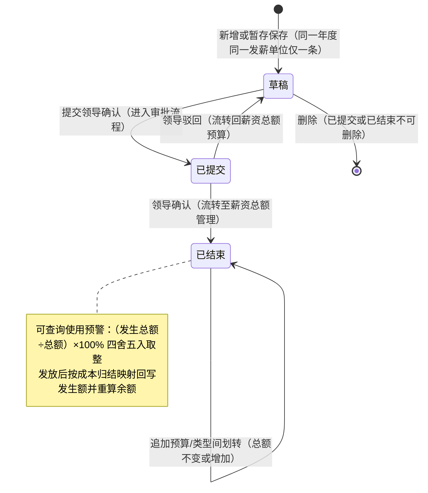
```mermaid
stateDiagram-v2
    [*] --> 草稿 : 新增或暂存保存（同一年度同一发薪单位仅一条）
    草稿 --> 已提交 : 提交领导确认（进入审批流程）
    已提交 --> 已结束 : 领导确认（流转至薪资总额管理）
    已提交 --> 草稿 : 领导驳回（流转回薪资总额预算）
    已结束 --> 已结束 : 追加预算/类型间划转（总额不变或增加）
    草稿 --> [*] : 删除（已提交或已结束不可删除）
    note right of 已结束
        可查询使用预警：（发生总额÷总额）×100% 四舍五入取整
        发放后按成本归结映射回写发生额并重算余额
    end note
```

### 11.2 发薪期间

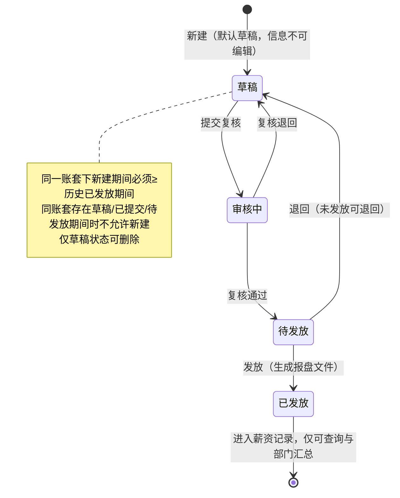
```mermaid
stateDiagram-v2
    [*] --> 草稿 : 新建（默认草稿，信息不可编辑）
    草稿 --> 审核中 : 提交复核
    审核中 --> 待发放 : 复核通过
    审核中 --> 草稿 : 复核退回
    待发放 --> 已发放 : 发放（生成报盘文件）
    待发放 --> 草稿 : 退回（未发放可退回）
    已发放 --> [*] : 进入薪资记录，仅可查询与部门汇总
    note right of 草稿
        同一账套下新建期间必须≥历史已发放期间
        同账套存在草稿/已提交/待发放期间时不允许新建
        仅草稿状态可删除
    end note
```

### 11.3 定调薪任务

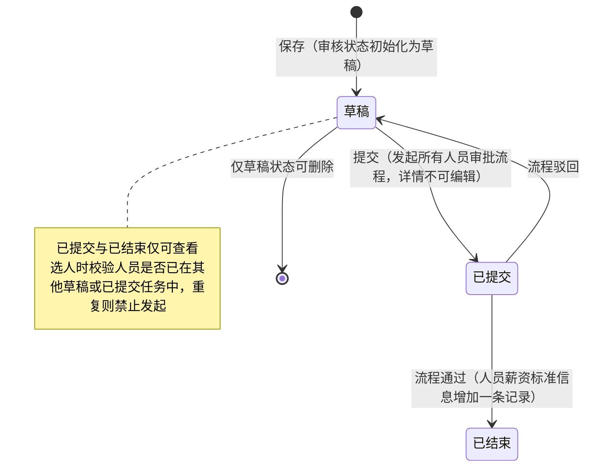
```mermaid
stateDiagram-v2
    [*] --> 草稿 : 保存（审核状态初始化为草稿）
    草稿 --> 已提交 : 提交（发起所有人员审批流程，详情不可编辑）
    已提交 --> 已结束 : 流程通过（人员薪资标准信息增加一条记录）
    已提交 --> 草稿 : 流程驳回
    草稿 --> [*] : 仅草稿状态可删除
    note right of 草稿
        已提交与已结束仅可查看
        选人时校验人员是否已在其他草稿或已提交任务中，重复则禁止发起
    end note
```

### 11.4 代发薪申请

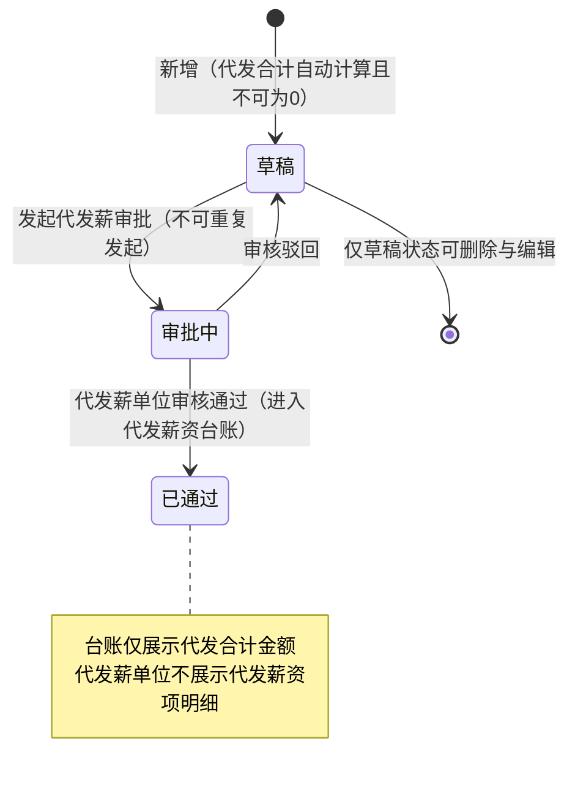
```mermaid
stateDiagram-v2
    [*] --> 草稿 : 新增（代发合计自动计算且不可为0）
    草稿 --> 审批中 : 发起代发薪审批（不可重复发起）
    审批中 --> 已通过 : 代发薪单位审核通过（进入代发薪资台账）
    审批中 --> 草稿 : 审核驳回
    草稿 --> [*] : 仅草稿状态可删除与编辑
    note right of 已通过
        台账仅展示代发合计金额
        代发薪单位不展示代发薪资项明细
    end note
```

### 11.5 计提批次

```mermaid
stateDiagram-v2
    [*] --> 未发布 : 新建（批次编号自动生成不可改）
    未发布 --> 未发布 : 编辑/新增人员计提总额/导入/删除
    未发布 --> 已发布 : 发布（校验人员总数、计提总额、归属年度匹配）
    已发布 --> [*] : 仅可查看详情，不可编辑与删除
    note right of 未发布
        发布后人员返还计划明细流转至发放计算
        人员归属年度必须有启用中的返还规则
    end note
```

### 11.6 返还计划明细

```mermaid
stateDiagram-v2
    [*] --> 待计算 : 批次发布后生成返还计划
    待计算 --> 待计算 : 编辑扣罚/暂停/返还暂停金额或导入
    待计算 --> 审核中 : 提交复核（校验金额约束）
    审核中 --> 已通过 : 审批通过（更新人员剩余暂停总额）
    审核中 --> 待计算 : 审批驳回
    已通过 --> [*] : 进入发放台账、个人年度汇总与暂停金额明细
    note right of 审核中
        扣罚+暂停 ≤ 当期考核金额
        返还暂停总金额 ≤ 剩余暂停总额 - 审核中的返还暂停金额
    end note
```

### 11.7 返还规则

```mermaid
stateDiagram-v2
    [*] --> 禁用 : 新增（默认禁用）
    禁用 --> 启用 : 启用（同归属年度其他规则自动置为禁用）
    启用 --> 禁用 : 手动禁用
    禁用 --> [*] : 删除
    note right of 启用
        同一归属年度仅允许一条启用中的规则
        人员计提总额必须匹配启用中的规则
    end note
```

### 11.8 薪资账套与薪资组（引用锁定）

```mermaid
stateDiagram-v2
    [*] --> 可编辑 : 新建后未被引用的账套或薪资组
    可编辑 --> 已引用 : 被薪资组引用或存在发薪期间
    已引用 --> 可编辑 : 解除引用（删除薪资组或结束期间后）
    可编辑 --> [*] : 删除（提示：该账套已被XX薪资组引用，不可删除）
    已引用 --> [*] : 不可删除
    note right of 已引用
        薪资组在发薪期间内不支持删除
        账套下存在发薪期间不可删除
        账套的所属发薪单位与计税类型新增后不可变更
    end note
```

---

## 12. 序列图 Sequence Diagram

### 12.1 场景一：编制并确认薪资总额预算

```mermaid
sequenceDiagram
    actor BR as 分支机构薪酬专员
    actor LD as 发薪单位领导
    participant UI as 薪资总额预算页面
    participant TS as 预算与总额服务
    participant WF as 工作流引擎
    participant DB as VHR 数据库

    BR->>UI: 新增年度薪资总额
    UI->>TS: 校验同一年度同一发薪单位唯一性
    TS->>DB: 查询已有总额记录
    DB-->>TS: 无重复记录
    TS->>UI: 加载预算类型生成总额细项列
    BR->>UI: 录入各细项金额
    UI->>TS: 自动汇总明细项生成薪资总额
    BR->>UI: 点击保存
    TS->>DB: 保存（审核状态=草稿）
    BR->>UI: 点击提交领导确认
    TS->>DB: 状态=已提交
    TS->>WF: 发起总额预算审批
    WF-->>LD: 生成确认待办
    alt 领导确认
        LD->>UI: 勾选数据并确认
        UI->>TS: 确认薪资总额
        TS->>DB: 状态=已结束，流转至薪资总额管理
        TS-->>BR: 总额生效，可用于发薪
    else 领导驳回
        LD->>UI: 勾选数据并驳回
        UI->>TS: 驳回薪资总额
        TS->>DB: 状态=草稿，流转回薪资总额预算
        TS-->>BR: 可修改后重新提交
    end
    opt 导入方式
        BR->>UI: 下载模板并上传
        UI->>TS: 按机构编号与年度匹配
        TS->>DB: 校验后导入，总额为明细项加总
    end
```

### 12.2 场景二：薪资总额追加与预算类型间划转

```mermaid
sequenceDiagram
    actor BR as 分支机构薪酬专员
    participant UI as 薪资总额管理页面
    participant TS as 预算与总额服务
    participant DB as VHR 数据库

    BR->>UI: 选择一条总额记录并点击追加
    UI->>TS: 带出发薪单位/年度/总额/余额
    BR->>UI: 录入各细项追加金额
    UI->>TS: 自动汇总追加总额
    TS->>DB: 更新总额与各细项金额
    TS->>DB: 写入总额变动明细
    TS-->>BR: 追加成功，余额与预警百分比刷新

    BR->>UI: 选择一条总额记录并点击划转
    UI->>TS: 带出总额信息
    BR->>UI: 选择原划转项与目标划转项及金额
    UI->>TS: 校验划转项合法性
    TS->>TS: 校验原项≠目标项、目标项不重复、金额不为0
    TS->>DB: 薪资总额不变，调整细项金额
    TS->>DB: 写入划转明细（一次划转可产生多条记录）
    TS-->>BR: 划转成功，可在划转明细中查询
```

### 12.3 场景三：定调薪任务（含人员占用校验）

```mermaid
sequenceDiagram
    actor BR as 分支机构薪酬专员
    participant UI as 定调薪管理页面
    participant AS as 薪资结构与定调薪服务
    participant FE as 公式引擎
    participant WF as 工作流引擎
    participant DB as VHR 数据库

    BR->>UI: 新增定薪或调薪任务
    UI->>AS: 校验任务名称与必填项
    AS->>DB: 保存（审核状态=草稿）
    BR->>UI: 打开定薪详情并选择人员
    UI->>AS: 校验人员是否已在其他草稿或已提交任务中
    alt 人员已被占用
        AS-->>UI: 提示《姓名》已在定调薪业务办理中，不得重复提交
        UI-->>BR: 禁止发起所有流程
    else 人员可用
        AS->>DB: 加载薪资结构对应的薪资标准项
        AS->>FE: 按对应薪资项引用的公式计算数值
        FE-->>UI: 返回计算后的薪资标准项数值
    end
    opt 批量导入
        BR->>UI: 下载模板并录入后导入
        UI->>AS: 校验与页面输入规则一致
        AS->>DB: 写入定调薪明细
    end
    BR->>UI: 暂存或提交
    UI->>AS: 发起所有人员审批流程
    AS->>WF: 提交审批
    AS->>DB: 任务状态=已提交，详情不可编辑
    WF-->>AS: 审批通过回调
    AS->>DB: 任务状态=已结束
    AS->>DB: 为所有人员薪资标准信息增加一条记录
    AS-->>BR: 定调薪完成
```

### 12.4 场景四：薪资计算（期间初始化 · 计算 · 提交复核）

```mermaid
sequenceDiagram
    actor BR as 分支机构薪酬专员
    participant PS as 发薪期间服务
    participant CS as 薪资计算服务
    participant FE as 公式引擎
    participant TE as 个税引擎
    participant DB as VHR 数据库

    BR->>PS: 新增发薪期间（选择账套与薪资组）
    PS->>DB: 校验账套已添加薪资项且已关联薪资组
    PS->>DB: 校验新建期间≥历史已发放期间
    PS->>DB: 校验同账套无未完结期间
    PS->>DB: 创建期间（状态=草稿）
    BR->>PS: 设置纳税主体
    PS->>DB: 单条税务信息自动初始化，多条时管理员手工指定
    BR->>PS: 设置税期
    PS->>DB: 校验税期不早于入职日期
    PS->>DB: 计算累计顺序号（按纳税主体/税期/计税类型）
    BR->>CS: 点击计算全部
    CS->>DB: 取账套或薪资组下人员范围并排序
    loop 每个人员
        CS->>CS: 判断薪资项是否带入上期结果
        CS->>DB: 取同账套最近已审批通过期间的值（取不到则用公式）
        CS->>FE: 计算公式项（带入值与修改值优先参与关联计算）
        FE-->>CS: 返回各薪资项值
        CS->>TE: 累计计税（累计减除费用/专项附加扣除/累计税金）
        TE-->>CS: 返回个人所得税
        CS->>DB: 写入人员薪资明细与薪资项明细值
    end
    alt 重置计算
        BR->>CS: 重置并计算
        CS->>FE: 输入项保留，计算项恢复默认公式重算
    end
    BR->>CS: 薪资对比与部门汇总
    CS-->>BR: 展示与上期差异及部门合计
    BR->>CS: 提交复核
    CS->>DB: 期间状态=审核中
    CS-->>BR: 流转至薪资复核
```

### 12.5 场景五：薪资复核与发放（含成本归结回写）

```mermaid
sequenceDiagram
    actor RV as 薪酬专员（复核）
    actor BR as 薪酬专员（发放）
    participant RS as 薪资复核与发放服务
    participant CE as 成本归结引擎
    participant BE as 报盘生成引擎
    participant TS as 预算与总额服务
    participant DB as VHR 数据库
    participant BANK as 银行代发系统

    R>>RS: 查询审核中的发薪期间
    alt 复核通过
        R>>RS: 复核通过
        RS->>DB: 状态=待发放
        RS-->>BR: 展示在薪资发放列表
    else 退回
        R>>RS: 退回
        RS->>DB: 状态=草稿
        RS-->>BR: 需重新计算后提交
    end
    BR->>RS: 选择待发放期间并执行发放
    RS->>DB: 状态=已发放，记录发薪时间
    RS->>BE: 按报盘文件项目明细生成报盘文件
    BE-->>BR: 下载报盘文件
    BE->>BANK: 推送代发数据
    RS->>CE: 触发成本归结
    CE->>DB: 按薪资项与预算类型映射关系汇总发生额
    CE->>TS: 回写总额发生额
    TS->>DB: 重算各细项余额与使用预警百分比
    TS->>DB: 写入总额变动明细
    RS->>DB: 生成工资条数据
    RS-->>BR: 发放完成，进入薪资记录
```

### 12.6 场景六：代发薪与延期支付返还

```mermaid
sequenceDiagram
    actor HQ as 总部薪酬专员
    participant AG as 代发薪服务
    participant DP as 延期支付服务
    participant WF as 工作流引擎
    participant DB as VHR 数据库
    participant BANK as 银行代发系统

    HQ->>AG: 新增代发薪人员并选择代发薪资项
    AG->>DB: 自动计算代发合计（不可为0）
    HQ->>AG: 发起代发薪审批（仅草稿可发起，不可重复）
    AG->>WF: 提交代发薪单位审核
    WF-->>AG: 审核通过回调
    AG->>DB: 状态=已通过，写入代发薪资台账（仅合计金额）
    AG->>BANK: 由代发薪单位计算、计税并发薪
    AG-->>HQ: 发薪单位进行成本归结

    HQ->>DP: 维护返还规则并启用
    DP->>DB: 同归属年度其他规则自动置为禁用
    DP->>DB: 按返还次数生成计划考核年度并分配比例（合计为1）
    HQ->>DP: 新建计提批次并新增人员计提总额
    DP->>DB: 校验人员归属年度存在启用中的返还规则
    DP->>DB: 生成人员返还计划明细
    HQ->>DP: 发布批次
    DP->>DB: 校验人员总数、计提总额合计、规则匹配
    DP->>DB: 批次状态=已发布，计划流转至发放计算
    HQ->>DP: 编辑扣罚/暂停/返还暂停金额并提交复核
    DP->>DP: 校验扣罚+暂停≤当期考核金额
    DP->>DP: 校验返还暂停总金额≤剩余暂停总额
    DP->>WF: 提交审批
    WF-->>DP: 审批通过回调
    DP->>DB: 剩余暂停总额=原值+暂停金额-返还暂停金额
    DP->>DB: 写入个人年度汇总与暂停金额明细
    DP-->>HQ: 返还完成
```

---

## 13. 通信图 Communication Diagram（薪资计算提交复核的对象协作）

```mermaid
flowchart LR
    BR((薪酬专员))
    PS["发薪期间"]
    CS["薪资计算服务"]
    EMP["人员薪资明细"]
    VAL["薪资项明细值"]
    FE["公式引擎"]
    TE["个税引擎"]
    DB["VHR 数据库"]
    RV["薪资复核"]
    LOG["操作日志"]

    BR -->|"1 点击计算全部"| CS
    CS -->|"2 校验期间状态与账套配置"| PS
    PS -->|"3 返回人员范围"| CS
    CS -->|"4 遍历人员薪资明细"| EMP
    EMP -->|"5 取上期带入值"| DB
    DB -->|"6 返回上期结果"| VAL
    VAL -->|"7 请求公式计算"| FE
    FE -->|"8 返回各薪资项值"| VAL
    VAL -->|"9 请求累计计税"| TE
    TE -->|"10 返回个人所得税"| VAL
    VAL -->|"11 回写明细值并标橙"| EMP
    EMP -->|"12 汇总账套应发与实发金额"| CS
    CS -->|"13 记录操作日志"| LOG
    CS -->|"14 提交复核"| RV
    RV -->|"15 更新期间状态为审核中"| PS
    CS -->|"16 返回计算结果"| BR
```

---

## 14. 交互概览图 Interaction Overview Diagram（活动节点引用各交互）

```mermaid
flowchart TB
    N0([初始])
    N1["sd 薪资基础设置<br/>预算类型/发薪单位/纳税主体/薪资项"]
    N2["sd 账套与薪资组配置<br/>薪资项类型与公式校验"]
    N3["sd 编制并确认薪资总额预算<br/>（见 12.1）"]
    N4["sd 总额追加与划转<br/>（见 12.2）"]
    N5["sd 成本归结映射设置"]
    N6["sd 定调薪任务与审批<br/>（见 12.3）"]
    FORK[/并发：薪资结构维护 与 参数表维护\]
    JOIN[/合并\]
    N7["sd 薪资计算<br/>（见 12.4）"]
    D1{复核结果}
    N8["sd 薪资复核与发放<br/>（见 12.5）"]
    N9["sd 成本归结回写与工资条生成<br/>（见 12.5）"]
    N10["sd 代发薪与延期支付返还<br/>（见 12.6）"]
    N11["sd 薪资记录查询与部门汇总"]
    N12([终止])

    N0 --> N1 --> N2 --> FORK
    FORK --> N3
    FORK --> N5
    FORK --> N6
    N3 --> JOIN
    N5 --> JOIN
    N6 --> JOIN
    JOIN --> N4 --> N7 --> D1
    D1 -->|通过| N8
    D1 -->|退回| N7
    N8 --> N9 --> N10 --> N11 --> N12
    N10 -.->|代发薪成本归结| N9
```

---

## 15. 时序图 Timing Diagram（状态随时间变化，Mermaid 用甘特等价表达）

Mermaid 暂无原生 Timing Diagram 语法，以下以时间轴状态带表达同一语义：**横轴为时间，纵轴为对象，色带表示其所处状态**。

```mermaid
gantt
    title 2024年8月发薪周期状态时序
    dateFormat YYYY-MM-DD
    axisFormat %m-%d
    section 薪资总额预算
    草稿                :done,    b1, 2024-01-05, 2024-01-10
    已提交              :done,    b2, 2024-01-10, 2024-01-15
    已结束              :active,  b3, 2024-01-15, 2024-12-31
    section 发薪期间2024-08
    草稿                :done,    p1, 2024-08-25, 2024-08-28
    审核中              :done,    p2, 2024-08-28, 2024-08-30
    待发放              :done,    p3, 2024-08-30, 2024-09-05
    已发放              :active,  p4, 2024-09-05, 2024-09-10
    section 定调薪任务
    草稿                :done,    a1, 2024-07-01, 2024-07-05
    已提交              :done,    a2, 2024-07-05, 2024-07-12
    已结束              :active,  a3, 2024-07-12, 2024-07-20
    section 计提批次
    未发布              :done,    d1, 2024-06-01, 2024-06-20
    已发布              :active,  d2, 2024-06-20, 2024-09-30
    section 关键里程碑
    总额确认通过        :milestone, m1, 2024-01-15, 0d
    发薪期间创建        :milestone, m2, 2024-08-25, 0d
    提交复核            :milestone, m3, 2024-08-28, 0d
    薪资发放            :milestone, m4, 2024-09-05, 0d
    成本归结回写        :milestone, m5, 2024-09-06, 0d
```

---

## 16. 附录 A：ER 数据模型图（核心实体与基数）

```mermaid
erDiagram
    预算类型 ||--o{ 总额明细项 : "动态生成总额细项"
    薪资总额 ||--|{ 总额明细项 : "按预算类型展开"
    薪资总额 }o--|| 发薪单位 : "归属"
    薪资总额 ||--o{ 总额追加记录 : "追加"
    薪资总额 ||--o{ 总额划转明细 : "划转"
    薪资总额 ||--o{ 总额变动明细 : "变动留痕"
    薪资总额 ||--|| 使用预警 : "计算"
    成本归结映射 }o--|| 预算类型 : "映射"
    成本归结映射 }o--|| 薪资项 : "映射"
    发薪单位 ||--o{ 纳税主体 : "一机构多主体"
    发薪单位 ||--o{ 发薪关系 : "挂靠人员"
    发薪单位 ||--o{ 薪资账套 : "下设"
    发薪单位 ||--o{ 薪资组 : "下设"
    发薪单位 ||--o{ 报盘文件 : "下设"
    发薪单位 ||--o| 工资条设置 : "展示项"
    发薪单位 ||--o{ 多头关系 : "多头发放单位"
    发薪关系 ||--|| 薪资标准信息 : "薪资标准"
    发薪关系 ||--|{ 员工税务信息 : "员工税务"
    发薪关系 ||--|| 薪资辅助信息 : "薪资辅助"
    发薪关系 ||--|| 福利辅助信息 : "福利辅助"
    员工税务信息 }o--|| 纳税主体 : "计税归属"
    薪资项分类 ||--o{ 薪资项 : "分类下"
    薪资项 ||--|{ 薪资项公式 : "至少输入项公式"
    薪资账套 ||--|{ 账套薪资项 : "组成"
    账套薪资项 }o--|| 薪资项 : "引用"
    账套薪资项 }o--o| 薪资项公式 : "引用公式"
    薪资组 ||--o{ 薪资组人员 : "人员"
    薪资组 ||--|{ 组适用账套 : "适用账套"
    组适用账套 }o--|| 薪资账套 : "引用"
    报盘文件 ||--|{ 报盘项目明细 : "组成"
    参数表 ||--|{ 参数版本 : "版本管理"
    参数表 ||--|{ 参数维度 : "维度定义"
    参数版本 ||--|{ 参数设置 : "参数明细"
    薪资结构 ||--|{ 薪资标准项 : "组成"
    薪资标准项 }o--o| 薪资项 : "对应薪资项"
    薪资标准项 }o--o| 薪资项公式 : "计算数值"
    定调薪任务 ||--|{ 定调薪明细 : "人员清单"
    定调薪任务 }o--|| 薪资结构 : "目标结构"
    定调薪明细 }o--|| 人员 : "被调整人"
    发薪期间 ||--|{ 人员薪资明细 : "计算范围"
    发薪期间 ||--o{ 部门汇总 : "汇总"
    发薪期间 }o--|| 薪资账套 : "所属账套"
    发薪期间 }o--|| 薪资组 : "所属薪资组"
    人员薪资明细 ||--|{ 薪资项明细值 : "薪资项取值"
    人员薪资明细 }o--|| 纳税主体 : "计税归属"
    人员薪资明细 ||--o{ 薪资对比记录 : "与历史对比"
    代发薪申请 ||--|{ 代发薪明细 : "代发薪资项"
    代发薪申请 }o--o| 代发薪资台账 : "通过后入台账"
    返还规则 ||--|{ 返还计划年度 : "按次数生成年度"
    计提批次 ||--|{ 人员计提总额 : "人员"
    人员计提总额 }o--|| 返还规则 : "匹配归属年度"
    人员计提总额 ||--|{ 返还计划明细 : "生成返还计划"
    人员 ||--o| 剩余暂停总额 : "累计"
    人员 ||--o{ 暂停金额明细 : "返还与暂停流水"
    人员 ||--o{ 个人年度汇总 : "年度汇总"
    人员 ||--o{ 发薪关系 : "发薪归属"
    人员 ||--o{ 多头关系 : "多头发放"
```

---

## 17. 附录 B：需求追溯图 Requirement Traceability

> 说明：Mermaid 的 `requirementDiagram` 语法目前不支持中文文本，故图内需求名与服务名使用英文标签，中文对照如下。

| 需求编号 | 图内标签（英文） | 中文需求项 | 说明书章节 |
|---|---|---|---|
| FR-01 | budget type config | 预算类型设置（名称唯一，被引用不可删改） | 3.1.1 预算类型设置 |
| FR-02 | salary total budget and approval | 薪资总额预算编制、导入与提交审批 | 3.1.2 薪资总额预算 |
| FR-03 | total confirm and reject | 薪资总额确认与驳回 | 3.1.3 薪资总额确认 |
| FR-04 | total management append transfer | 薪资总额管理（使用预警、追加、划转、明细） | 3.1.4 薪资总额管理 |
| FR-05 | cost attribution mapping | 成本归结设置（薪资项↔预算类型/应付科目） | 3.1.5 成本归结设置 |
| FR-06 | tax subject config | 纳税主体设置（含密码类型与代码项同步） | 3.2.1 纳税主体设置 |
| FR-07 | payroll unit and relation | 人员发薪单位设置（发薪单位树、发薪关系、多头关系） | 3.2.2 人员发薪单位设置 |
| FR-08 | salary item and formula | 薪资项设置与公式编辑器 | 3.2.3 薪资项设置 |
| FR-09 | salary account package | 薪资账套设置（按计税类型预置薪资项） | 3.2.4 薪资账套设置 |
| FR-10 | salary group management | 薪资组管理（人员与适用账套） | 3.2.5 薪资组管理 |
| FR-11 | payslip and bank file | 工资条设置与报盘文件设置 | 3.2.6/3.2.7 工资条/报盘文件 |
| FR-12 | parameter table and version | 参数表、参数版本、维度与参数设置 | 3.2.8 参数表设置 |
| FR-13 | salary structure and verify | 薪资结构设置与公式校验 | 3.3.1 薪资结构设置 |
| FR-14 | fixed and adjusted salary | 定调薪管理（定薪/调薪详情与审批） | 3.3.2 定调薪管理 |
| FR-15 | payroll period and calc | 发薪期间与薪资计算（含纳税主体、税期、重置、导入） | 3.4.1 薪资计算 |
| FR-16 | payroll review | 薪资复核（通过/退回） | 3.4.2 薪资复核 |
| FR-17 | payroll payment and bank file | 薪资发放、退回与报盘文件导出 | 3.4.3 薪资发放 |
| FR-18 | payroll record and summary | 薪资记录与部门汇总 | 3.4.4 薪资记录 |
| FR-19 | agency payroll | 代发薪资与代发薪资台账 | 3.5 代发薪管理 |
| FR-20 | deferred pay rule | 延期支付返还规则设置与启用禁用 | 3.6.1 返还规则设置 |
| FR-21 | provision batch | 计提管理（批次、人员计提总额、返还计划） | 3.6.2 计提管理 |
| FR-22 | deferred payment calc | 发放管理（发放计算、导入、提交复核、台账） | 3.6.3 发放管理 |
| FR-23 | personal annual summary | 个人年度汇总与个人暂停金额管理 | 3.6.4/3.6.5 |

```mermaid
requirementDiagram
    requirement FR01 {
        id: FR01
        text: budget type config
        risk: Low
        verifymethod: Test
    }
    requirement FR02 {
        id: FR02
        text: salary total budget and approval
        risk: Medium
        verifymethod: Test
    }
    requirement FR03 {
        id: FR03
        text: total confirm and reject
        risk: Medium
        verifymethod: Test
    }
    requirement FR04 {
        id: FR04
        text: total management append transfer
        risk: High
        verifymethod: Test
    }
    requirement FR05 {
        id: FR05
        text: cost attribution mapping
        risk: High
        verifymethod: Test
    }
    requirement FR06 {
        id: FR06
        text: tax subject config
        risk: Medium
        verifymethod: Test
    }
    requirement FR07 {
        id: FR07
        text: payroll unit and relation
        risk: High
        verifymethod: Test
    }
    requirement FR08 {
        id: FR08
        text: salary item and formula
        risk: High
        verifymethod: Test
    }
    requirement FR09 {
        id: FR09
        text: salary account package
        risk: High
        verifymethod: Test
    }
    requirement FR10 {
        id: FR10
        text: salary group management
        risk: Medium
        verifymethod: Test
    }
    requirement FR11 {
        id: FR11
        text: payslip and bank file
        risk: Medium
        verifymethod: Test
    }
    requirement FR12 {
        id: FR12
        text: parameter table and version
        risk: Medium
        verifymethod: Test
    }
    requirement FR13 {
        id: FR13
        text: salary structure and verify
        risk: High
        verifymethod: Test
    }
    requirement FR14 {
        id: FR14
        text: fixed and adjusted salary
        risk: High
        verifymethod: Test
    }
    requirement FR15 {
        id: FR15
        text: payroll period and calc
        risk: High
        verifymethod: Test
    }
    requirement FR16 {
        id: FR16
        text: payroll review
        risk: Medium
        verifymethod: Test
    }
    requirement FR17 {
        id: FR17
        text: payroll payment and bank file
        risk: High
        verifymethod: Test
    }
    requirement FR18 {
        id: FR18
        text: payroll record and summary
        risk: Low
        verifymethod: Test
    }
    requirement FR19 {
        id: FR19
        text: agency payroll
        risk: Medium
        verifymethod: Test
    }
    requirement FR20 {
        id: FR20
        text: deferred pay rule
        risk: Medium
        verifymethod: Test
    }
    requirement FR21 {
        id: FR21
        text: provision batch
        risk: High
        verifymethod: Test
    }
    requirement FR22 {
        id: FR22
        text: deferred payment calc
        risk: High
        verifymethod: Test
    }
    requirement FR23 {
        id: FR23
        text: personal annual summary
        risk: Medium
        verifymethod: Test
    }

    element BudgetService {
        type: ApplicationService
        docref: spec 3.1.1
    }
    element TotalService {
        type: ApplicationService
        docref: spec 3.1.2
    }
    element CostAttributionEngine {
        type: DomainService
        docref: spec 3.1.5
    }
    element TaxSubjectService {
        type: ApplicationService
        docref: spec 3.2.1
    }
    element PayrollUnitService {
        type: ApplicationService
        docref: spec 3.2.2
    }
    element SalaryItemService {
        type: ApplicationService
        docref: spec 3.2.3
    }
    element FormulaEngine {
        type: DomainService
        docref: spec 3.2.3
    }
    element AccountPackageService {
        type: ApplicationService
        docref: spec 3.2.4
    }
    element SalaryGroupService {
        type: ApplicationService
        docref: spec 3.2.5
    }
    element PayslipService {
        type: ApplicationService
        docref: spec 3.2.6
    }
    element BankFileEngine {
        type: DomainService
        docref: spec 3.2.7
    }
    element ParameterService {
        type: ApplicationService
        docref: spec 3.2.8
    }
    element StructureService {
        type: ApplicationService
        docref: spec 3.3.1
    }
    element AdjustmentService {
        type: ApplicationService
        docref: spec 3.3.2
    }
    element PeriodService {
        type: ApplicationService
        docref: spec 3.4.1
    }
    element TaxEngine {
        type: DomainService
        docref: spec 3.4.1
    }
    element CalcService {
        type: ApplicationService
        docref: spec 3.4.1
    }
    element ReviewService {
        type: ApplicationService
        docref: spec 3.4.2
    }
    element PaymentService {
        type: ApplicationService
        docref: spec 3.4.3
    }
    element RecordService {
        type: ApplicationService
        docref: spec 3.4.4
    }
    element AgencyPayrollService {
        type: ApplicationService
        docref: spec 3.5
    }
    element DeferredRuleService {
        type: ApplicationService
        docref: spec 3.6.1
    }
    element ProvisionService {
        type: ApplicationService
        docref: spec 3.6.2
    }
    element PaymentCalcEngine {
        type: DomainService
        docref: spec 3.6.3
    }

    BudgetService - satisfies -> FR01
    TotalService - satisfies -> FR02
    TotalService - satisfies -> FR03
    TotalService - satisfies -> FR04
    CostAttributionEngine - satisfies -> FR05
    CostAttributionEngine - satisfies -> FR17
    TaxSubjectService - satisfies -> FR06
    PayrollUnitService - satisfies -> FR07
    SalaryItemService - satisfies -> FR08
    FormulaEngine - satisfies -> FR08
    FormulaEngine - satisfies -> FR13
    FormulaEngine - satisfies -> FR15
    AccountPackageService - satisfies -> FR09
    SalaryGroupService - satisfies -> FR10
    PayslipService - satisfies -> FR11
    BankFileEngine - satisfies -> FR11
    BankFileEngine - satisfies -> FR17
    ParameterService - satisfies -> FR12
    StructureService - satisfies -> FR13
    AdjustmentService - satisfies -> FR14
    PeriodService - satisfies -> FR15
    TaxEngine - satisfies -> FR15
    CalcService - satisfies -> FR15
    ReviewService - satisfies -> FR16
    PaymentService - satisfies -> FR17
    RecordService - satisfies -> FR18
    AgencyPayrollService - satisfies -> FR19
    DeferredRuleService - satisfies -> FR20
    ProvisionService - satisfies -> FR21
    PaymentCalcEngine - satisfies -> FR22
    ProvisionService - satisfies -> FR23
```

---

## 18. 建模要点与关键规则索引（便于开发自测与测试用例编写）

| 主题 | 关键规则 |
|---|---|
| 唯一性约束 | 预算类型名称唯一；同一年度同一发薪单位仅一条薪资总额；纳税主体名称唯一；发薪单位下名称不重复；薪资项名称与项目编号（S_四位流水号）唯一；薪资项分类名称唯一；同一发薪单位下账套名称、薪资组名称不重复；参数维度组合不重复 |
| 引用锁定 | 预算类型被总额作为明细项有数据不可编辑删除；成本归结映射在预算类型有数据不可删除；纳税主体被人员税务信息关联不可删除；发薪单位下有人员、发薪记录或子单位不可删除；薪资项被账套/公式/薪资标准项引用不可删除；预置输入项公式不可编辑删除；账套被薪资组引用或存在发薪期间不可删除；薪资组在发薪期间内不可删除；参数表被公式引用不可删除；结果维度名称被薪资项引用不可删除 |
| 状态驱动 | 总额：草稿→已提交→已结束；发薪期间：草稿→审核中→待发放→已发放；定调薪任务：草稿→已提交→已结束；代发薪：草稿→审批中→已通过；计提批次：未发布→已发布；返还计划：待计算→审核中→已通过；返还规则：禁用↔启用（同年度互斥） |
| 期间校验 | 新建期间≥历史已发放期间；同账套不得同时存在草稿/已提交/待发放期间；账套未添加薪资项或未关联薪资组不可计算；税期不早于入职日期；仅草稿期间可删除 |
| 计算规则 | 输入项保留；计算项按公式；带入上期结果取同账套最近已审批通过期间值，取不到则用公式；允许修改计算结果项与输入项可改；带入值与修改值参与关联公式计算并标橙；重置计算仅重置计算项 |
| 计税规则 | 单条税务信息自动初始化纳税主体与计税类型；多条时手工指定；按纳税主体/税期/计税类型计算累计顺序号；全年一次性减除与大学生参加工作年度影响累计减除费用；残疾人减征比例参与减免 |
| 金额约束 | 划转金额不为0，原项≠目标项，目标项不重复；代发合计不可为0；返还计划扣罚+暂停≤当期考核金额；返还暂停总金额≤剩余暂停总额−审核中返还暂停金额；返还比例之和为1 |
| 联动回写 | 薪资发放后按薪资项↔预算类型映射回写发生额，重算余额与使用预警（发生÷总额四舍五入取整）；定调薪通过后为人员薪资标准信息新增记录；返还审批通过后更新剩余暂停总额并生成暂停金额明细 |
| 数据权限 | 发薪单位/纳税主体/薪资项等按发薪单位可读取与可编辑权限隔离；多机构下分支机构专员仅见本单位数据 |
| 留痕 | 总额追加与划转分别写入变动明细与划转明细；返还与暂停写入个人暂停金额明细与年度汇总 |
